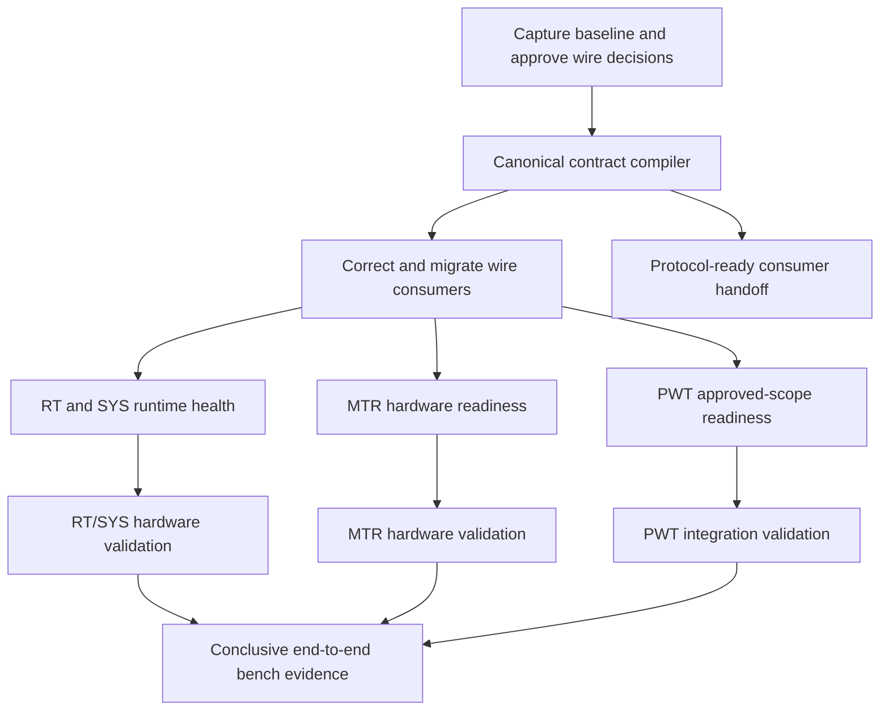

# Codebase Remediation Plan

- **Status:** Ready for execution; remediation work is not yet complete
- **Created:** 2026-07-13
- **Scope:** CAN contract, generated artifacts, RT, SYS, MTR, PWT, host bridge, existing debug/simulation compatibility, firmware observability, and codebase tests
- **Input audit:** [`architecture-yaml-code-gaps.md`](architecture-yaml-code-gaps.md)

**Out of scope:** implementation of the new Control UI frontend, its backend/API, adapter service, LLM access, and UI-specific logging. Those consume the verified codebase handoff defined here and remain specified in [`control-ui/control-ui-achitecture.md`](control-ui/control-ui-achitecture.md).

## 1. Outcome

The remediation is complete when one versioned YAML model is the enforced CAN source of truth, every existing codebase consumer uses generated contract artifacts, runtime behaviour matches the declared contract, and native, virtual-CAN, capture, and hardware tests provide traceable evidence for every supported component.

The output of this plan is a stable, generated protocol package plus truthful component capability manifests. It is the input to the separate Control UI project; this plan does not implement that application.

This plan uses named outcome gates instead of numbered phases. Work may proceed in parallel only after its declared dependency is satisfied.

## 2. Delivery principles

1. **Evidence before decisions.** Preserve representative raw captures from the current firmware before changing layouts or timing.
2. **One contract, many generated targets.** Protocol facts must not be copied into firmware, host, debug/simulation tools, tests, or documentation.
3. **No silent compatibility.** Wrong DLC, unknown enum, unexpected bus, checksum failure, and protocol-hash mismatch remain visible errors.
4. **Atomic wire changes.** YAML, generated artifacts, firmware, host/tool decoders, golden vectors, and architecture are changed together for a wire-contract decision.
5. **Current and target capability stay separate.** Incomplete MTR/PWT functionality is marked unavailable rather than simulated into a passing result.
6. **Raw data is immutable evidence.** Derived state may be recalculated; the captured envelope and payload are never rewritten.
7. **Consumer-neutral artifacts.** Generated C++, TypeScript, Python, JSON, documentation, and vectors expose the same semantics without assuming a particular future UI/backend implementation.
8. **Small outcome-based changes.** Commit and pull-request titles describe the completed result, for example `Generate production CAN codecs from YAML`, not `Complete phase 2`.

## 3. Dependency map



MTR and PWT have independent readiness gates. They do not block the RT/SYS codebase from reaching its own gate, but the complete RT/SYS/MTR/PWT scope remains open until each supported component passes or is explicitly removed from the supported capability manifest.

## 4. Workstream: approve the wire contract

### Objective

Remove ambiguity before generating production code. The result is an approved contract decision record and a raw-capture baseline.

### Tasks

- Capture High and Low CAN from the currently flashed RT/SYS hardware at idle and during representative steering, brake, motor, HMI, heartbeat, and fault tests.
- Record firmware versions, build profile, hardware revision, adapter identity, channel mapping, bitrates, capture drops, and current YAML hash with each capture.
- Create golden raw examples for every frame affected by the audit.
- Decide and record the canonical meaning of:

| Frame/topic | Decision required | Recommended starting point |
|---|---|---|
| `0x011 SYS_SAFETY_STS` | Byte 2 packing | Keep YAML 1-bit boolean signals (best for DBC) and update `rt-esp32` tests and dictionary to match. |
| `0x210 RT_STATE_RPT` | Valid buses and whether copies are independent | One message definition, RT transmits on High and Low, route declared on both. |
| `0x600 SYS_DIAG_RPT` | Byte 1 and 2 packing | Byte 1: bit 1 is `brake_fault`. Byte 2: bit 0 heartbeat OK, bits 1–6 saturating RX overflow, bit 7 reserved, matching current firmware. |
| `0x7FE SYS_HEARTBEAT` | Health bits | Declare heartbeat, ESTOP, AUTO mode, and CAN state bits already transmitted by SYS; correct CAN-state meaning separately. |
| `0x7FC HOST_HEARTBEAT` | DLC | Keep YAML/shared DLC 2 and fix the host sender. |
| `0x111 HMI_ReqMode` | Value 2 | Prefer removing `PURE_SIM` from the physical wire unless SYS intentionally implements it; keep simulation profile selection in test-tool configuration. |
| Generated forwarding and copied forwarding tests | Missing HMI routes | Generate high-to-low `0x111` and `0x112` routes from the approved canonical routing model so firmware, generated metadata, docs, and tests agree. |
| `0x206 MTR_MOTOR_FBK` | Readiness and faults | Use one layout on both routes; separate readiness status from fault meaning where possible. |
| SES version | Vendor byte layout | Confirm from vendor data or a known hardware response before choosing YAML or RT parsing. |
| DC-DC powertrain command | Ownership | Standalone PWT owns generated extended `0x10262B27`; the nonexistent low-bus `0x012` route is retired. |
| `0x169` | Rate | Use 50 Hz unless a measured control requirement justifies changing firmware and YAML together. |

- Define an explicit compatibility policy. Because this is an internal bench network, prefer one coordinated contract cutover over indefinite dual decoding. Replays of old captures may select their recorded protocol hash.
- Freeze unrelated CAN layout changes until the compiler and golden-vector gate exist.

### Deliverables

- `shared/can/contract-decisions.md` containing the approved choices and rationale.
- Versioned raw baseline captures plus a machine-readable capture manifest under `test-results/` or the repository's chosen artifact store.
- Golden input/output vectors covering the affected frames.

### Completion gate

- Every disputed field in audit rows `FRM-001` through `FRM-008` has one approved definition.
- Both bus routes and the source ECU for every affected frame are known.
- Unknown vendor facts are explicitly marked blocked and are not guessed.

## 5. Workstream: build the canonical contract compiler

### Objective

Make YAML—not DBC, generator source code, or `can_protocol.h`—the executable protocol authority.

### Canonical model

Replace duplicated per-bus message bodies with two concepts:

```yaml
messages:
  RT_STATE_RPT:
    id: 0x210
    dlc: 6
    sender: RT
    timing: {kind: periodic, period_ms: 10, tolerance_pct: 20}
    signals: [...]

routes:
  - {message: RT_STATE_RPT, bus: high, origin: RT, instance: independent_tx}
  - {message: RT_STATE_RPT, bus: low,  origin: RT, instance: independent_tx}
```

The schema must represent:

- standard/extended ID and DLC, sender, physical origin, bus routes, gateway route, and same-frame versus independent-instance semantics;
- byte order, signedness, bit placement, scaling, range, units, enums, reserved bits, and overlapping/multiplexed fields;
- periodic, on-change, burst, and refresh timing separately;
- checksum algorithm/coverage, rolling-counter modulus and expected progression;
- counter type (`wrapping`, `saturating`, or `monotonic-truncated`), reset scope, and saturation value;
- injectable/test-only status and profiles where a frame is permitted;
- diagnostic/event fields without pretending UART-only evidence is available on CAN.

### Compiler structure

- Parse and validate YAML into one normalized intermediate representation.
- Reject duplicate names/IDs/routes, overlapping fields, out-of-DLC fields, invalid enum/range combinations, incomplete routes, semantic conflicts, and unsupported constructs.
- Keep all protocol data out of generator Python logic. Forwarding tables must come from the normalized model.
- Produce deterministic output. No wall-clock timestamp in generated content.
- Keep `--check`/`--verify` read-only, compare deterministic output byte-for-byte, and make ordinary firmware builds check committed artifacts instead of rewriting timestamp-only content.
- Compute the protocol hash from canonical normalized semantics, not raw YAML formatting or comments.
- Generate:

| Target | Output purpose |
|---|---|
| C++ | IDs, DLCs, typed payloads, encode/decode, validation, checksum/counter helpers, forwarding routes, protocol hash. |
| TypeScript | Backend/UI metadata and codecs with the same names and semantics. |
| Python | Test scripting and transport/tool helpers where Python owns tests. |
| JSON/schema data | Consumer-neutral runtime catalogs and generated client schemas. |
| Golden vectors | Raw payload examples shared by every language implementation. |
| Markdown | CAN dictionary and architecture tables. |
| DBC | Optional export for CANalyzer/SavvyCAN compatibility only; never an application dependency. |

### Migration mechanism

- Initially generate a compatibility interface with the names currently used from [`shared/can/can_protocol.h`](shared/can/can_protocol.h).
- Replace the implementation behind those names with generated codecs so RT/SYS/MTR changes remain reviewable.
- Move handwritten state/control helpers into a separate non-generated header.
- Migrate direct field packing and hard-coded host IDs.
- Delete the old protocol tables only after repository-wide search and build checks find no production consumer.
- Add the generation hook to MTR and PWT, but make CI generation the authority; local builds should check/regenerate deterministically without changing unrelated files.

### Tests

- Schema success/failure fixtures, including deliberate semantic conflicts across routes.
- Determinism test: two generations produce byte-identical output.
- Read-only verification test: hash/status of the working tree is unchanged.
- Cross-language golden-vector test for every encode/decode pair.
- Forwarding-route test generated from route data rather than copied lists.
- Protocol-hash stability test: formatting/comments do not change it; semantic changes do.

### Completion gate

- RT, SYS, MTR, PWT, host, existing debug tools, and simulators contain no hand-copied wire constants or layouts.
- CI proves generated output is current and the verification command leaves the tree clean.
- Audit gaps `CAN-001` through `CAN-008` are closed.

## 6. Workstream: correct and migrate live wire behaviour

### Objective

Make every producer and consumer use the approved generated contract without creating an interval where captures are silently misdecoded.

### Change grouping

Apply wire corrections as outcome-based changes. Each change includes YAML, generated artifacts, all producers/consumers, golden vectors, decoder tests, architecture tables, and a replay fixture.

Recommended groups:

- `Align RT state routing on both buses` — closes `FRM-001` and forwarding metadata gaps.
- `Align SYS_SAFETY_STS lighting bits` — closes testing and YAML dictionary discrepancies.
- `Align SYS diagnostic and heartbeat bitfields` — closes `FRM-002`, `FRM-003`, and CAN-state semantic drift.
- `Send the complete host heartbeat contract` — closes `FRM-004`.
- `Separate HMI requested mode from system state` — closes `FRM-005`.
- `Unify MTR readiness and fault reporting` — closes `FRM-006`.
- `Align SES version decoding with vendor evidence` — closes `FRM-007`.
- `Resolve PWT topology and DCDC ownership` — closes `FRM-008`.
- `Align declared and observed transmission schedules` — closes `TIM-001` through `TIM-003`.

### Cutover rule

- Bump the semantic protocol version/hash for any wire change.
- Flash all affected physical participants before formal bench tests.
- Formal codebase/hardware tests refuse conformance verdicts when reported firmware protocol hashes disagree. Raw capture remains available.
- Old recorded sessions retain their original catalog/hash for replay.

### Completion gate

- Golden vectors pass in C++, TypeScript, and Python.
- A hardware capture shows correct buses, DLCs, fields, counters, and periods for each changed frame.
- Contract validation reports no unexplained wrong-bus, DLC, enum, or checksum events during the acceptance capture.

## 7. Workstream: make build profiles truthful

### Objective

Ensure the selected build profile describes what the binary actually reads, bypasses, drives, and reports.

### Profiles

| Profile | Physical input | Physical output | Synthetic peers | Intended evidence |
|---|---|---|---|---|
| `vehicle` | Enabled | Enabled where component is ready | Disabled | Complete hardware behaviour. |
| `hardware_bench` | Enabled | Explicitly enabled per target | Missing peers only | Physical wiring/I/O and CAN integration. |
| `can_bench` | Replaced where declared | Bounded test output | Enabled as declared | ECU CAN/state-machine tests, not physical-input proof. |
| `simulation` | Disabled | Disabled/virtual | Enabled | Backend/UI and logic tests only. |

### Tasks

- Remove the global hard-coded `SYSTEM_RUN_MODE` decision from [`shared/system_mode.h`](shared/system_mode.h).
- Generate a compile-time build manifest containing firmware version, protocol hash, profile, feature flags, hardware revision, and declared capabilities.
- Expose that manifest through a version/diagnostic frame or a documented startup diagnostic source.
- Remove retired `SYS_OWNS_MOTOR` claims and flags from architecture/CI.
- Make bypass audits evaluate resolved compiler definitions and generated manifests, not only text in `platformio.ini`.
- Build every supported profile explicitly in CI. A profile that cannot yet build must be marked unsupported rather than silently omitted.

### Completion gate

- A `vehicle` artifact cannot compile with simulation/bypass capabilities.
- A hardware-bench report identifies which physical paths were actually exercised.
- SYS audit gap `SYS-001` and the build-profile portion of `SYS-004` are closed.

## 8. Workstream: make RT and SYS health observable

### RT tasks

- Replace the unsupported safety-queue overwrite fallback with a defined bounded policy. Count accepted, coalesced, and dropped events.
- Expose gateway queue depth, high-water mark, and drops by direction.
- Decide and document task affinity based on measured timing; either pin explicitly or correct the architecture.
- Aggregate repeated stale, CAN-health, and SES conditions by stable error ID; emit raise, material change, summary, and recovery.
- Keep both RT heartbeat instances separate and expose task health independently from bus traffic freshness.

### SYS tasks

- Implement the documented task watchdog using monotonic deadlines, wrap-safe counters, startup grace, and recovery hysteresis; expose task-health bits/counters.
- Replace single-sample SEB rolling validation with a window/deadline model that permits expected duplicate samples.
- Define brake-fault behaviour as latched or recoverable. If latched, add an explicit reset condition and preserve cause/time.
- Report CAN controller state as `error_active`, `error_passive`, `bus_off`, `recovering`, or `unknown` using supported driver evidence.
- Aggregate high-rate MTR/SEB/checksum logs and provide a documented structured diagnostic output for external tools.

### Completion gate

- Fault-injection tests prove task stall, queue overflow, stale counter, error-passive, bus-off, and recovery detection.
- One persistent 1-ms/10-ms fault produces bounded event output with exact occurrence and suppression counts.
- Traffic presence can no longer be mistaken for task health.
- Audit gaps `RT-001` through `RT-004`, `SYS-002`, `SYS-003`, `SYS-005`, and `TIM-004` through `TIM-005` are closed.

## 9. Workstream: complete MTR readiness

### Objective

Turn the MTR scaffold into a hardware-testable ECU without letting its incompleteness invalidate RT/SYS work.

### Tasks

- Generate or import the approved STM32F103 clock, GPIO, ADC, I2C, CAN, watchdog, and interrupt initialization.
- Document and verify the pin map against the actual board/harness.
- Implement the direct ESTOP input path and test its electrical active level.
- Use bounded ADC/I2C operations; distinguish current failure streak from cumulative totals.
- Check every CAN TX result and expose controller state, TX failures, RX overflow, and recovery.
- Allocate unambiguous ADC versus DAC/I2C fault reporting.
- Consume generated CAN codecs and publish the build/protocol manifest.
- Add tests in increasing evidence order: native math, HAL boundary, loopback CAN, bench DAC/ADC/gear, ESTOP, and integrated RT→MTR command/feedback.

### Completion gate

- MTR passes startup, heartbeat, drive command, feedback, gear, stale-command, ESTOP, CAN-loss/recovery, and peripheral-fault hardware tests.
- No stubbed hardware function remains in a supported build.
- Audit gaps `MTR-001` through `MTR-005` are closed.

## 10. Workstream: resolve and implement PWT scope

### Objective

Choose one physically possible PWT topology, remove conflicting requirements, and implement only the approved standalone or gateway capability set.

### Tasks

- Record the hardware decision: external CAN controller, dual-CAN MCU, or standalone powertrain node.
- Reconcile [`architecture.md`](architecture.md), [`pwt-architecture.md`](pwt-esp32/pwt-architecture.md), wiring, low-bus membership, YAML bridge comments, `0x012`, `0x001`, `0x7FB`, and source headers with that decision.
- Add the extended manufacturer `0x10262B27` frame to the canonical contract and remove standalone wire constants.
- For a standalone node, define the DCDC enable/configuration owner, remove nonexistent low-bus routes, and define any powertrain-bus heartbeat/version requirement.
- For a gateway, first confirm two independently usable CAN interfaces/transceivers; then receive SYS `0x012`, validate freshness, default disabled when absent/invalid, translate to the manufacturer frame, and implement only approved forwarding/telemetry routes.
- In either topology, expose build/protocol identity, TX failures, controller state, queue/drop counters where applicable, and bus recovery.
- Test the selected topology in virtual/loopback form and then with physical capture on every implemented bus. Do not require a two-channel test for the approved standalone option.

### Completion gate

- Architecture, YAML, wiring, and source agree on the selected PWT topology and ownership model.
- PWT no longer advertises obsolete gateway/five-task behaviour in a supported standalone build, or no longer identifies itself as a stub after an approved gateway is implemented.
- For a gateway, loss of SYS command disables regenerated DCDC commands within the declared timeout and both buses pass capture tests. For standalone PWT, the declared local enable/configuration and loss behaviour passes its powertrain-bus test.
- Every implemented PWT bus passes capture-based rate, ID, DLC, TX-failure, and recovery tests without unexplained drops.
- Audit gaps `PWT-001` through `PWT-003` are closed.

## 11. Workstream: publish the codebase handoff

### Objective

Publish everything a downstream diagnostic or test application needs without implementing or constraining the new Control UI.

### Required handoff artifacts

- Canonical schema and normalized protocol model with a semantic version and hash.
- Generated C++, TypeScript, Python, and JSON/schema packages from the same normalized model.
- Stable message/signal names, routes, origins, timing, counter/checksum rules, units, and enums.
- Cross-language golden vectors and recorded replay fixtures labelled with their protocol hash.
- A machine-readable build/capability manifest for RT, SYS, MTR, PWT, and host artifacts.
- Firmware diagnostic definitions for controller state, RX/TX/drop counters, task health, command freshness, feedback freshness, and protocol version where the hardware can expose them.
- Structured firmware log/event definitions with stable IDs, readable names, bounded repetition, raise/recovery semantics, and documented transport availability.
- A compatibility policy for recorded sessions using older protocol hashes.

### Boundary with the Control UI project

The codebase owns the meaning and correctness of bytes, timing, routes, counters, checksums, component capabilities, and firmware diagnostics. The Control UI project owns adapter lifecycle, sessions, APIs, visualization, recording storage, user/LLM access, stimulus leases, and presentation-level verdicts.

The codebase must not require a Control UI implementation to prove codec or firmware correctness. Conversely, the Control UI must not patch or override an incorrect firmware contract. It consumes the generated handoff and reports mismatches.

### Completion gate

- C++, TypeScript, Python, and JSON representations agree on every golden vector.
- Each firmware artifact exposes or packages its protocol hash, build profile, version, and supported capability set.
- Firmware diagnostics needed for component validation are either implemented and documented or explicitly marked unavailable.
- A downstream consumer can decode captures and determine component/profile compatibility using only published artifacts, without importing firmware source.

## 12. Workstream: rebuild the test architecture around evidence

### Test levels

| Level | Proves | Does not prove |
|---|---|---|
| Schema/compiler | Contract validity and deterministic generation | Firmware runtime or hardware. |
| Codec/golden vector | Cross-language byte compatibility | Scheduling, transport, or hardware. |
| Native component | State machines, deadlines, wraparound, aggregation | ESP32/STM32 peripherals or real-time timing. |
| Simulator | Existing tool workflows and synthetic scenarios | Firmware equivalence unless using compiled production logic. |
| Replay | Deterministic decoding, reports, historical regressions | Transmission or live connection behaviour. |
| Virtual dual CAN | Routing, loss/corruption injection, and ECU interaction | USB adapter and physical bus behaviour. |
| Adapter characterization | USB identity, channel mapping, timestamps, queue limits, disconnect evidence | ECU hardware behaviour. |
| Hardware-in-loop | Flashed ECU, bus timing, physical I/O, command/feedback | Behaviour not exercised by the test. |
| Soak/fault injection | Backpressure, recovery, log bounding, long-run stability | Untested electrical extremes. |

### Required suites

- Replace [`native-test/test/test_dlc_consistency.cpp`](native-test/test/test_dlc_consistency.cpp) copied tables with generated-production-code tests.
- Rewrite [`native-test/test/test_dlc_generator.py`](native-test/test/test_dlc_generator.py) to use temporary output and deliberate invalid fixtures.
- Generate simulator schedules from contract timing; label intentional behavioural approximations.
- Add wrong-DLC, invalid-enum, checksum, stale, missing, burst, duplicate counter, discontinuity, wrap, saturation, route, queue-overflow, and protocol-hash tests.
- Add codebase command/feedback tests for steering, braking, throttle/motor, gear, HMI mode, ESTOP frames, and DCDC translation as their hardware capabilities become available.
- Run high-rate firmware and virtual-CAN tests long enough to prove bounded queues and logs, recording exact input, drop, and suppressed-event counts.

### CI gates

Update [`.github/workflows/ci.yml`](.github/workflows/ci.yml) to enforce:

- deterministic, read-only contract verification;
- schema/compiler and cross-language golden vectors;
- clean working tree after all generation/build jobs;
- explicit RT/SYS/MTR/PWT profile build matrix;
- native tests through `ctest --output-on-failure`;
- existing debug-tool shared/backend/UI compatibility checks through its workspace verification scripts;
- replay and virtual-CAN integration suites;
- no production references to retired hand-written wire definitions;
- no undocumented bypass capability in vehicle artifacts.

Hardware tests run in a labelled bench workflow because ordinary hosted CI has no adapter or ECU. Their report and capture manifest must still be attached to the tested commit/protocol hash.

### Completion gate

- Each supported requirement maps to at least one test and evidence level.
- Reports never promote a simulator result to hardware proof.
- Audit gaps `TST-001` through `TST-007` are closed.

## 13. Work packages and recommended order

The following are reviewable outcomes, not calendar estimates:

| Order | Work package | Depends on | Primary gaps closed |
|---:|---|---|---|
| 1 | Preserve current captures and approve disputed wire definitions | None | Decision prerequisite |
| 2 | Add canonical schema and normalized protocol model | Approved definitions | CAN-003, CAN-005, CAN-006 |
| 3 | Make generation deterministic and verification read-only | Canonical model | CAN-007, CAN-008 |
| 4 | Generate production C++/TS/Python codecs, routes, hash, docs, and vectors | Canonical model | CAN-001, CAN-002, CAN-004 |
| 5 | Migrate RT/SYS and correct their live layouts/timing | Generated contract | FRM-001–003, TIM-001–003 |
| 6 | Migrate host and existing debug/simulation consumers; correct heartbeat/diagnostic decoding | Generated contract | FRM-004–005, TST-001–003 |
| 7 | Make firmware profiles and capability manifests truthful | Generated hash/manifest | SYS-001, SYS-004 |
| 8 | Implement RT/SYS task, queue, counter, CAN-state, and log observability | Stable layouts/profiles | RT gaps, SYS-002/003/005, TIM-004/005 |
| 9 | Replace copied tests and add replay/virtual fault suites | Generated contract artifacts | TST-004–007 |
| 10 | Complete and validate MTR hardware | Generated contract and pin decisions | FRM-006, MTR gaps |
| 11 | Resolve PWT topology and validate the approved standalone or gateway scope | Hardware/DCDC/route decisions | FRM-008, PWT gaps |
| 12 | Run full hardware acceptance and update architecture readiness | All applicable gates | Remaining audit items |

Work packages 5–9 may be split by component and run concurrently after generated interfaces stabilize. MTR, PWT, and existing-tool compatibility work may proceed concurrently, but their formal acceptance remains independent.

## 14. Change acceptance checklist

Every remediation change must answer:

- Which audit IDs does it close?
- Which artifact is authoritative for each changed fact?
- Does it change bytes, buses, timing, build capabilities, or only documentation?
- Are producers, consumers, generated artifacts, tests, and docs updated together?
- Is the protocol hash expected to change?
- Which golden vectors and replay captures prove it?
- Which evidence level passed: native, simulator, replay, virtual CAN, adapter, or hardware?
- Can an older firmware/capture be identified rather than silently decoded as current?
- Are failures and repeated errors bounded and queryable?
- Is an absent capability explicitly represented instead of being treated as a passing result?

## 15. Audit coverage matrix

| Audit IDs | Owning workstream | Required closing evidence |
|---|---|---|
| `CAN-001`–`CAN-008` | Canonical contract compiler | Deterministic generation, read-only verification, production consumers, route validation, semantic hash, and counter metadata tests. |
| `FRM-001`–`FRM-008` | Wire contract approval and live migration | Approved decision, cross-language golden vector, updated producer/consumer, and matching hardware capture for each frame. |
| `TIM-001`–`TIM-003` | Live wire migration | Generated timing contract plus measured period/refresh capture. |
| `TIM-004`–`TIM-005` | RT/SYS health | Task-watchdog and rolling-freshness fault/recovery tests. |
| `TIM-006` | Evidence-based tests | Generated simulator schedules and explicit approximation labels. |
| `RT-001`–`RT-004` | RT health and observability | Affinity decision, supported queue overflow policy, exposed gateway drops, and bounded log tests. |
| `SYS-001`–`SYS-005` | Build profiles and SYS health | Artifact manifest, task/profile tests, brake-fault reset semantics, correct CAN state, and bounded diagnostic output. |
| `MTR-001`–`MTR-005` | MTR readiness | Completed board support, direct ESTOP, CAN/peripheral fault evidence, generated contract use, and hardware acceptance. |
| `PWT-001`–`PWT-003` | PWT scope/readiness | Approved topology, consistent routes/ownership, generated contract use, topology-specific deadline/behaviour tests, and physical capture. |
| `TST-001`–`TST-007` | Test architecture and existing consumers | Generated host/tool codecs and fixtures, corrected diagnostic rules, non-mutating generator tests, replay/virtual-CAN suites, and evidence labels. |

No audit row is assigned to the Control UI implementation. That project consumes the closing artifacts after the relevant codebase gate passes.

## 16. Final definition of done

The repository-wide audit is resolved when:

- the canonical YAML model and generated artifacts are the only production wire authority;
- protocol verification is deterministic, read-only, and enforced in CI;
- all supported firmware and host artifacts publish matching protocol/build manifests;
- known frame, route, DLC, bitfield, enum, counter, checksum, and timing discrepancies are closed;
- RT and SYS expose enough evidence to distinguish connection, CAN state, task health, freshness, corruption, queue loss, and recovery;
- MTR and PWT either pass their hardware gates or are explicitly excluded from the supported capability manifest;
- generated C++, TypeScript, Python, JSON/schema, documentation, and vectors share the same protocol semantics;
- high-rate faults cannot flood logs or conceal unrelated events;
- codebase and hardware test reports are traceable to raw captures, firmware versions, profiles, hardware, and protocol hash;
- [`architecture.md`](architecture.md), component architecture documents, generated CAN documentation, and actual code contain no unresolved contradictory claims;
- [`architecture-yaml-code-gaps.md`](architecture-yaml-code-gaps.md) is updated so every row is marked closed, intentionally deferred with owner/reason, or removed because the unsupported scope was explicitly changed.
