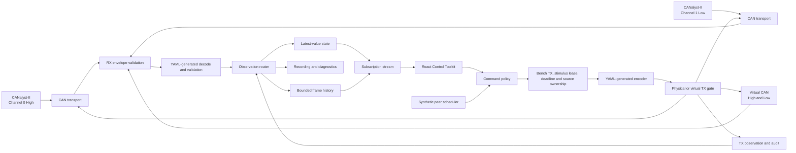

<!-- Source: scope.md -->

# CAN Controller — Scope & Requirements

This document defines the strict, non-negotiable requirements for the CAN Controller software. 

## 1. Primary Objectives
- **Monitor:** Real-time visibility into all CAN traffic on the vehicle.
- **Control & Mimic:** Ability to inject specific frames to spoof ECUs or control actuators.
- **Simplicity:** Minimize duplicated protocol logic, independent state owners, runtime processes, and unnecessary abstractions. Do not introduce a hidden full-vehicle simulator, complex recording pipeline, or routing "spaghetti."

## 2. Supported Work Modes
- **Mode 1: Full Vehicle (Monitor & Inject):** When connected to the fully assembled E-Trike, the tool passively monitors all traffic for the dashboard and only transmits when an operator explicitly injects a command (e.g., an ESTOP override).
- **Mode 2: Bench Test (Synthetic Peer):** When connected to an isolated physical ECU (e.g., testing just the RT module on a desk), the tool actively acts as a "Virtual Vehicle" by automatically broadcasting all missing heartbeats and synthetic statuses to prevent the physical ECU from entering a fault state.
- **Mode 3: Hardware-Free (Pure Software):** The operator explicitly selects an internal RAM-based CAN bus interface for basic UI development without physical hardware. *Note: Complete ECU simulation (e.g., full vehicle physics and complex state machine emulation) is deferred to Future Work.*

## 3. Hardware Requirements
- **Primary Interface:** Must interface directly with the **CANalyst-II Dual-Channel USB Analyzer**.
- **Dual-Bus Support:** Must connect simultaneously to:
  - **Channel 0:** High-Level CAN Bus (500 kbit/s).
  - **Channel 1:** Low-Level CAN Bus (500 kbit/s).
- **Channel Mapping Verification:** The default mapping must be verified on the physical bench before transmission is enabled. The active mapping must remain explicit, be shown in the UI, and be stored in recording metadata. A custom mapping is permitted only through an explicit bench configuration.
- **Hardware-Free Virtual Mode:** Pure Software uses a purely software-based `virtual` CAN interface. It is selected explicitly for development and simulation; physical adapter loss disables physical TX and reports the disconnected state.

## 3. Data Processing Requirements
- **Single Source of Truth:** Must use the existing YAML files (`can_high.yaml`, `can_low.yaml`) through generated runtime codecs, validators, constants, and UI metadata. DBC may be generated for third-party tools but is not an application runtime dependency.
- **Real-Time Decoding:** Must translate raw hexadecimal payloads into human-readable engineering values (e.g., `mm/s`, `kPa`, boolean flags) immediately upon reception.
- **Mixed-Endianness Support:** Must seamlessly handle both `motorola` (Big-Endian, for custom protocols) and `intel` (Little-Endian, for `sbw_unit` and `bbw_unit` actuators) concurrently.
- **Dynamic Checksums & Counters:** When spoofing actuator commands (e.g., `VCU_SES_REQ`, `VCU_SEB_REQ`), the controller must automatically compute and append rolling counters (0-15) and XOR checksums (e.g., `Checksum = XOR(bytes 0-6) ^ 0xFF`) dynamically, as required by the actuator specifications.
- **Mandatory Enable Flags:** When injecting spoofed actuator frames, the tool must enforce mandatory safety bits (e.g., ensuring `SES_RollCntEnable` and `SES_ChecksumEnable` are locked to `1`).
- **Complex Bit Overlaps:** The decoding/encoding logic must correctly handle the overlapping byte structures defined in the Intel sub-protocols (e.g., shared nibbles between speed, torque, and security counters in Byte 5 of `VCU_SES_REQ`).
- **Empty Payloads (DLC=0):** Must fully support sending and receiving zero-byte event frames (e.g., `0x001 SAFETY_ESTOP`).
- **Safety Limits Enforcement:** Must restrict user-injected commands to the maximum bounds defined in the YAML `constants` block (e.g., limiting forward speed requests to `max_speed_fwd_mmps`).

## 4. User Interface Requirements
- **Hardware Connection Status:** Must display unambiguous connection indicators showing:
  - CANalyst-II USB adapter status (Connected/Disconnected).
  - High-Level Bus status (Active/Offline).
  - Low-Level Bus status (Active/Offline).
- **Network Topology Map (Connected Items):** The UI must include a visual map showing which hardware items are currently connected and talking to the network, updating in real-time as components are plugged in or unplugged.
- **Node Heartbeat Indicators:** Must visually indicate the liveness of all key ECUs by monitoring their specific heartbeat frames:
  - **Host (Orin NX):** High Bus `0x7FC`
  - **RT (Real-Time Gateway):** High & Low Bus `0x7FD`
  - **SYS (Safety/Body):** Low Bus `0x7FE`
  - **MTR (Motor):** Low Bus `0x206`
- **Live Status Dashboards:** Must provide a visual dashboard displaying live status of components, vehicle speeds, and sensor readings.
- **Injection Controls:** Must provide a clean interface allowing the operator to select a message, input human-readable values, and inject it onto the physical bus.
- **Zero-Latency Feel:** The UI must update fast enough to be useful for real-time actuator debugging.

## 5. Control & Interaction Requirements
- **Game-Pad/Keyboard Control:** Must support real-time teleoperation using standard keyboard controls (e.g., WASD for drive/steer) for intuitive, game-like vehicle control.
- **Dedicated Hotkeys:** Must support immediate hotkey bindings for critical actions like Hard Brake and ESTOP.
- **Isolated Unit Testing:** Must provide the ability to target and control specific individual ECUs (e.g., commanding just the steer-by-wire unit, or just the DC-DC converter) without interfering with the rest of the network.
- **Message Verification:** Must include a mechanism to trigger and verify the behavior of individual CAN messages sequentially to confirm each frame functions as defined in the YAML.

## 6. System Emulation & Behaviors
*(Note: Complete ECU simulation detailing how units dynamically behave internally is deferred to Future Work. The current implementation only connects real controllers and mimics basic signals to prevent fault states).*
- **Heartbeat Emulation:** When spoofing a node, the tool must automatically transmit that node's required heartbeat at the correct frequency (e.g., sending `0x7FC` at 2 Hz when spoofing the Host) to prevent the RT/SYS watchdogs from triggering an immediate ESTOP.
- **Synthetic Peer Injection:** To support 'PROTOTYPE' bench testing mode (Mode 1), the controller must be able to act as a basic synthetic peer for absent hardware by broadcasting mandatory static status frames at precise rates to the correct bus:
  - `0x201 SES_STATUS` @ 10 ms → **Low Bus** (Fakes EPS-C). *Startup Constraint: Must boot with `angle=0` and `angle_status=1` (Aligned), otherwise the Gateway will trigger an implausibility fault.*
  - `0x721 SEB_STATUS` @ 10 ms → **Low Bus** (Fakes SEB)
  - `0x206 MTR_MOTOR_FBK` @ 20 ms → **Low Bus** (Fakes MTR)
  - `0x7FE SYS_HEARTBEAT` @ 100 ms → **Low Bus** (Fakes SYS)
  - `0x7FD RT_HEARTBEAT` @ 500 ms → **Both Buses** (Fakes RT Gateway)
  - `0x300 HOST_DRIVE_CMD` @ 10 ms → **High Bus** (Fakes Host)
  - `0x7FC HOST_HEARTBEAT` @ 500 ms → **High Bus** (Fakes Host)

- **HMI Overrides:** To eliminate reliance on physical GPIO buttons (which are often disconnected on test benches), the controller UI requires a mechanism to command the vehicle's state machine.
  - **Mode & Power:** Since the vehicle strictly uses GPIOs for mode and power, bench control must be achieved either by a physical HMI simulator board (e.g., relays) or by updating the RT/SYS firmware to accept virtual CAN HMI messages when placed into `PROTOTYPE` mode.
  - **Emergencies:** Software ESTOPs are injected directly via `0x001 SAFETY_ESTOP`.

## 7. Diagnostic & Logging Requirements
- **Diagnostic Message Identification:** The tool must automatically identify diagnostic and telemetry frames (e.g., `SYS_DIAG_RPT`, `STEER_DIAG`, `BRAKE_DIAG`) as distinct from critical command frames.
- **Persistent Logging:** Must provide a mechanism to log these identified diagnostic messages to a file for post-test analysis and fault tracing, without bogging down the live UI.

## 8. Architectural Requirements
- **Minimum Implementation Complexity:** The architecture must prioritize clear ownership, minimal duplicated logic, and few runtime processes over raw line count.
- **Strict Separation:** The hardware bridging logic must be entirely separate from the UI visualization layer.
- **Thin Transport and Explicit State Ownership:** The transport adapter must remain protocol-agnostic and behaviorally transparent: it opens CAN interfaces, preserves raw frame evidence, submits authorized frames, and reports transport status. Stateful behavior needed for observation freshness, scheduled test traffic, counters/checksums, command expiry, source ownership, and verification belongs to small backend services with one owner for each mutable state. The backend must not maintain an independent authoritative vehicle model or duplicate RT/SYS control logic.

## 9. Shared API and Automation Requirements

- **One Client-Neutral API:** React, LLM tools, CI, and an optional thin CLI must use the same versioned FastAPI REST/WebSocket contract and backend services.
- **No Client-Specific Domain Logic:** Validation and behavior depend on capabilities, session/profile state, protocol hash, adapter epoch, and ownership—not whether the caller is UI, LLM, or CLI.
- **One Generated Contract:** Pydantic models generate FastAPI validation, OpenAPI, the React TypeScript client, and LLM tool schemas. Separate UI and LLM schemas are not maintained.
- **Complete Supported Access:** Every important supported observation, session, injection, synthetic-peer, test, recording, replay, projection, evidence, and Stop All operation must be available through the shared API.
- **Structured State:** Commands and queries return versioned JSON with stable errors. Streams use sequenced WebSocket batches with explicit epochs and gaps.
- **Backend Real-Time Ownership:** Clients request work; the backend owns CAN timing, waits, assertions, leases, evidence, and cleanup. LLM or browser connection lifetime must not control periodic timing.
- **Safe Retries and Concurrency:** Mutations use request IDs, idempotency where applicable, session revisions, finite leases, and backend-owned cleanup.
- **Capability-Based Access:** A trusted LLM may receive the same full supported API capabilities as React. Full access never means access to internal Python objects, USB handles, queues, arbitrary code execution, or validation bypasses.
- **Virtual-First Automation:** Pure Software is the default unattended profile. Physical TX requires explicit session capability and finite Bench TX enablement.
- **Headless Testability:** The same backend must operate without React and support deterministic virtual fixtures, predicate waits, test execution, evidence, and Playwright UI testing.

Detailed behavior is defined in `control-toolkit-api.md`.


<!-- Source: stack.md -->

# Controller Tech Stack

This document defines the technology stack for the CAN Controller. It prioritizes maintainability, responsive live updates, and a clear engineering UI without treating latency, line count, or visual quality as guarantees from a framework.

## 1. Frontend
- **React + Vite + TypeScript:** Industry-standard tooling for maintainable, fast interfaces.
- **Zustand:** Ultra-fast state management for the latest state, session projection, and view preferences only.
- **TanStack Table:** Headless table composition for the latest-by-message view.
- **TanStack Virtual:** (Or purpose-built virtual list) Essential for the chronological raw frame monitor to prevent DOM overload.
- **Tailwind CSS + shadcn/ui:** Utility styling and accessible component primitives.

## 2. Backend
- **Python + FastAPI:** Provides the asynchronous HTTP and WebSocket foundation.
- **Exactly one Uvicorn process:** Multi-processing is forbidden to ensure a single in-memory hardware owner and safe USB lease management.
- **`python-can`, version-pinned:** Standard transport, with a locked dependency version to prevent behavioral drift.
- **Project-owned CANalyst-II wrapper:** A custom wrapper around the adapter to manage exact timestamping, polling, and health.
- **Generated YAML codecs and validators:** Used for runtime encoding/decoding, bypassing cantools/DBC in production.
- **Compact internal frame records:** Memory-efficient structure for high-frequency traffic.
- **Pydantic:** Used strictly at the API and configuration boundaries for schema validation.

## 3. Streaming
- **REST:** Used for commands, configuration, and mutations.
- **WebSocket:** Used for versioned batches of live traffic.
- **Bounded per-client queues:** Prevents memory exhaustion from slow consumers.
- **Latest-state coalescing:** The backend projection coalesces state to prevent WebSocket flooding.
- **Sequence/gap reporting:** Ensures dropped frames are explicitly tracked and reported.
- **Slow-client isolation:** Ensures one hanging UI tab does not crash the backend.

## 4. Storage
- **SQLite WAL:** Used for metadata, tests, diagnostic episodes, and indexing. WAL mode ensures concurrent read/write stability.
- **Pluggable raw recording sink:** Separates metadata from high-throughput binary frame data.
- **BLF + sidecar:** Binary Logging Format (BLF) is the first interoperability candidate for lossless raw recordings, ensuring compatibility with industry tools like Vector CANalyzer. Custom canonical formats are only considered if benchmarks justify them.

## 5. Packaging
- **Browser during development:** Standard Vite dev server workflow.
- **Tauri later:** The planned packaging option for a desktop executable.
- **Retain FastAPI REST/WebSocket data path:** The frontend must continue communicating over HTTP/WS even when packaged inside Tauri.

## 6. Communication Flow
1. **Physical CAN Bus** <--(USB)--> **python-can** (Background Thread)
2. **Python Backend** <--(FastAPI REST/WebSockets)--> **React, LLM tools, CI, optional CLI**
3. **React UI** <--(generated TypeScript API client + Zustand)--> **shadcn/ui Dials & TanStack Tables**

## 7. Shared API Clients

- **Pydantic + OpenAPI:** Pydantic models are the single request/response definition. FastAPI publishes OpenAPI for generated React clients and as the source contract for optional LLM/CLI translations. OpenAPI describes the API; it does not execute calls.
- **Direct Claude Code/Python:** Claude Code and tests may use a small HTTPX client or permitted terminal HTTP calls directly against FastAPI; no MCP layer is required.
- **Optional LLM tool adapter:** Anthropic API applications can expose selected API operations as client tools. Claude Desktop/Claude.ai may use a small MCP adapter. Either adapter only translates to REST/WebSocket and contains no domain or CAN logic.
- **Optional thin CLI:** Typer + HTTPX may provide terminal convenience over the same API. It is not a separate backend or service owner.
- **Headless browser:** Playwright exercises React against the same backend with deterministic virtual fixtures and captures traces/screenshots on failure.
- **Shared streaming:** React, LLM, and CLI clients use the same versioned WebSocket subscription protocol and independent bounded client queues.

The detailed contract is in `control-toolkit-api.md`.


<!-- Source: control-toolkit-achitecture.md -->

# E-Trike Control Toolkit Architecture

**Status:** Product and system design concept (no runnable implementation yet; legacy empty `vtc` scaffold removed). Delivery tiers (core / backlog / later / future work) are defined in [`workplan.md`](workplan.md).

**Detailed behavior:** See the Logic Specification sections below for state machines, decisions, timers, failure handling, test execution, and evidence rules.

**Analyzer comparison:** See `can-analyzer-research.md` for the local `python-can`, SavvyCAN, CANgaroo, and CANviz source audit and the connection-loss conclusions.

**Purpose:** Define how the E-Trike CAN bench controller should observe, emulate, stimulate, and verify RT, SYS, MTR, and related hardware while fulfilling the complete requirements in `scope.md`.

**Protocol source of truth:** Distributed ECU-specific YAML contracts (`protocol/contracts/rt.yaml`, `sys.yaml`, `host.yaml`, `network.yaml`, etc.), consumed through generated runtime catalogs, codecs, validators, documentation, and firmware definitions. DBC is an optional export for third-party tools, not an application dependency.

**Implementation dependency:** Control Toolkit synthetic peers, controller/HIL
sessions, and physical Bench TX are late integration stages. They are blocked
until RT/SYS unit enable/disable policy, output permissions, encoder/PID
configuration, production-core host tests, configuration matrices, manifests,
and pure-software safety scenarios pass as defined in
`../docs/rt-sys-feature-configuration-and-test-plan.md` and its dependency-ordered
[`implementation work plan`](../docs/rt-sys-configuration-implementation-work-plan.md).
The Control Toolkit must not be used to compensate for missing firmware configuration
or software tests.

**Learning from Existing Implementations:** 
The architecture draws heavily from lessons learned in the `debug-tool`. We will actively translate and reuse complex logic already solved there, including the USB CANalyst-II integration (`debug-tool/backend/canalystii_bridge.py`), UI bitwise overlap visualizations (`debug-tool/ui/src/`), and state coalescing. Furthermore, we will rely entirely on the new federated Python protocol package in `protocol/` (driven by `protocol/contracts/*.yaml`) rather than reinventing YAML parsers, ensuring the backend stays perfectly in sync with the RT and SYS firmware generation.

## 1. Product role

The Control Toolkit is a bench-engineering application for the E-Trike. It combines five jobs in one coherent interface:

1. Observe both vehicle CAN buses in real time.
2. Understand the vehicle state without reading raw frames.
3. Generate HMI, keyboard/gamepad, kinematics, direct-actuator, ESTOP, and individual-message stimuli required to exercise ECU code paths.
4. Replace missing ECUs with controlled synthetic peers during bench testing.
5. Diagnose, verify, and record CAN behavior.

All features exist for testing. The application is not an in-vehicle controller, driver interface, autonomous-driving component, or production safety system, and it is not used to drive the E-Trike. “Teleoperation,” “control,” “mode,” “power,” “brake,” and “ESTOP” in this document describe CAN stimuli used on a controlled bench or stationary integration setup to verify that RT, SYS, MTR, and connected units behave as implemented.

This boundary does not remove any requirement from `scope.md`. Full Vehicle, Bench Test, Pure Software, HMI, keyboard/gamepad input, direct actuator commands, synthetic peers, ESTOP injection, logging, and sequential message verification all remain required as test capabilities.

## 2. Design priorities

- **State before traffic:** The default screen answers “Is the vehicle safe, connected, and behaving correctly?” before showing a wall of frames.
- **Human values before bytes:** Show `1.4 m/s`, `32°`, `AUTO`, or `Aligned`; raw bytes remain one click away.
- **One CAN definition:** IDs, names, buses, senders, receivers, DLCs, rates, endianness, scaling, enums, and bounds come from generated protocol metadata.
- **Clear provenance:** Every displayed frame identifies its bus, direction, and source: physical, HMI, operator injection, synthetic peer, or virtual bus.
- **Freshness is visible:** A value without age is unsafe and misleading. Every live value has a live, stale, missing, or fault state.
- **Control is deliberate:** Monitoring is always easy; transmission is visually distinct, validated, and acknowledged.
- **Progressive detail:** Dashboard → component → message → signal → raw bytes. Operators see only the detail needed for the current task.
- **Bounded live views:** High-rate data updates the latest visible state without creating an ever-growing browser history.

## 3. Operating profiles

The selected profile is permanently visible in the application header.

| Profile | Physical buses | Synthetic traffic | Operator transmission | Primary use |
|---|---|---|---|---|
| Full Vehicle | High and Low | Off by default | Explicit test stimuli only | Stationary integration test with the complete network/harness |
| Bench Test | Selected bus/ECU | Missing peers only | Enabled for the selected target | Test one or a few physical ECUs in isolation |
| Pure Software | Virtual High and Low | Full virtual vehicle | Virtual bus only | UI development and hardware-free testing |

Changing profile is a controlled transition. Periodic transmissions stop, active controls return to neutral, and the destination is shown for confirmation before the new profile becomes active. Loss of the adapter never silently changes a physical session into a virtual one; the UI reports the loss and offers an explicit move to Pure Software.

## 4. High-level system architecture



The hardware bridge, protocol interpretation, periodic transmission, and presentation are separate responsibilities:

- **Transport layer:** Opens CANalyst-II channels or virtual buses and moves raw frames. It does not decide vehicle behavior.
- **Protocol layer:** Uses YAML-generated codecs and validators to decode and encode messages, including endianness, checksums, counters, overlaps, DLC=0 events, and limits. It does not parse DBC at runtime.
- **Observation router:** Gives physical RX, virtual frames, synthetic peers, HMI commands, and manual injections one observable audit path without feeding observed TX frames back into transmission.
- **Latest-value state:** Keeps the newest value and timing health for every bus/message/signal combination.
- **Bounded history:** Keeps a recent, limited frame window for the monitor. Recording is a separate opt-in durable stream.
- **Synthetic peer scheduler:** Owns periodic bench traffic and rolling counters. It is separate from the transparent transport bridge.
- **Command policy and TX gate:** Validates destination, test session, Bench TX state, stimulus ownership, deadline, source conflicts, and signal values before encoding and transmission.
- **Frontend:** Visualizes state and expresses engineer test intent. It does not independently construct protocol frames.

This separation resolves the apparent conflict between a stateless CAN bridge and stateful emulation: the bridge remains a pipe, while the scheduler and protocol services own the state required for periodic peers, counters, and checksums.

## 4.1 Test-session and transmission state

Operating profile, test transmission state, and stimulus ownership are separate so results remain reproducible:

- **Profile:** Full Vehicle, Bench Test, or Pure Software.
- **Bench TX:** Disabled or Enabled for an explicitly started test session. Connecting hardware never starts transmission.
- **Stimulus lease:** Exclusive, expiring ownership of a resource such as steering, motor, brake, HMI, or a periodic CAN ID.
- **Source ownership:** One permitted producer for each `bus + CAN ID` during a session.

Physical transmission is possible only when the selected profile permits it, the adapter/channel is healthy, Bench TX is Enabled, the test source owns the required lease and CAN ID, the stimulus is current, and YAML-generated protocol validation passes. Explicit negative tests may override selected validation rules only when the test definition names the intended violation.

Bench TX and stimulus leases belong to one test session and adapter epoch. Adapter loss, backend restart, profile change, session stop, or browser control-heartbeat expiry disables active stimulus jobs. Reconnection returns with Bench TX Disabled. These rules protect test integrity and prevent stale traffic; they are not a vehicle safety authorization system.

ESTOP injection is a named test action that bypasses ordinary stimulus ownership so its RT/SYS behavior can be verified. It is labeled **Inject ESTOP Frame** and is not presented as the physical emergency stop for the bench.

## 4.2 Backend-owned stimulus scheduler

The browser expresses test intent; it does not own CAN timing. A dedicated backend worker owns periodic transmission, rolling counters, checksum calculation, deadlines, and jitter measurements.

Interactive keyboard/gamepad tests have a short validity deadline and renew an exclusive stimulus lease. If focus, controller, WebSocket, or lease renewal is lost, the backend stops that stimulus or applies the test definition’s declared end sequence. This avoids an uncontrolled stale test input and makes timeout behavior measurable. The desktop stack is soft real-time; RT and SYS behavior under missed or late stimuli is part of the result being tested.

## 4.3 Local control security

The control API binds to loopback by default. Desktop packaging uses a per-session capability token delivered directly to the local UI, validates WebSocket origin, rejects cross-site requests, and keeps test-session/TX ownership server-side. Remote multi-user operation is not required for this bench tool.

## 4.4 CANalyst-II communication architecture

The existing debug-tool CANalyst-II implementation is a characterization and setup baseline, not the new low-level driver. The preferred transport is the maintained `python-can` CANalyst-II interface (`CANalystIIBus`) configured for both channels. It already wraps the same unofficial reverse-engineered `canalystii`/PyUSB backend, exposes the standard `python-can` message model, provides device receive timestamps, and allows the virtual interface to use the same application-facing API.

Do not accept all `python-can` defaults unchanged. The current backend uses a 20 ms receive poll delay and stores its optional bounded RX queue in `deque(maxlen=...)` where old entries can disappear without an exposed counter. The Control Toolkit adapter wrapper must configure or patch these behaviors and lock the validated dependency version.

Reuse the debug tool’s proven Windows driver procedure, USB identification, wiring/setup guidance, failure examples, and hardware tests. Reuse its low-level frame behavior only as characterization vectors against `python-can`; do not fork or copy the reverse-engineered USB protocol unless a measured blocker in `python-can` cannot be fixed upstream.

Because the new backend is already Python, it should not preserve the debug tool’s Node → child Python → JSON-lines path. The primary path is:

```text
CANalyst-II
  → WinUSB/libusbK
  → PyUSB + unofficial canalystii backend
  → python-can CANalystIIBus for channels 0 and 1
  → dedicated receive worker / python-can Notifier
  → bounded typed frame queue
  → canonical RX validation/router
  → state, recording, and subscribed WebSocket clients
```

This removes per-frame JSON serialization, stdout parsing, child-process lifecycle ambiguity, and an extra timestamp boundary while retaining a standard adapter abstraction. Adapter isolation may later use a supervised process if soak tests show that the unofficial USB backend can stall or destabilize the FastAPI process, but the IPC must then be a versioned bounded batch protocol with sequence numbers—not unstructured one-line JSON.

### 4.4.1 Transport interface

All physical and virtual adapters implement the same backend contract:

- discover and describe devices;
- open with explicit device identity and channel configuration;
- start RX in listen-only mode where supported;
- return bounded batches of immutable raw frames;
- submit one-shot or scheduled TX requests through the central TX gate;
- report capabilities and unsupported evidence explicitly;
- emit adapter/channel/error/overflow/timestamp-reset events;
- stop, cancel pending TX, drain/cancel queues, and close idempotently.

The CANalyst-II adapter and the Python virtual CAN adapter share this interface, but a failed physical open never silently selects virtual CAN. The profile transition must be explicit.

### 4.4.2 Device discovery and channel mapping

Discovery reports USB VID/PID, device index, serial number when available, driver/backend, firmware/library version, and whether the device is already in use. If stable serial identity is unavailable, the UI makes the selected device index visible and requires review when multiple adapters exist.

The E-Trike default mapping is fixed and generated/configured as:

- CANalyst-II Channel 0 → High Bus, 500 kbit/s;
- CANalyst-II Channel 1 → Low Bus, 500 kbit/s.

The debug-tool script currently defaults these channels in the opposite direction in code, despite its setup documentation describing the required mapping. The new adapter must correct this and test it. A custom mapping is permitted only as an explicit bench configuration, displayed persistently in the header and recording metadata.

Bus identity is taken from the configured physical channel, never guessed from observed CAN IDs. ID-based bus detection may be shown as a wiring consistency check; disagreement creates `CHANNEL MAPPING SUSPECT`, not an automatic remap.

### 4.4.3 Receive handling

Create one `python-can` bus for both CANalyst-II channels and consume it through a dedicated blocking receive worker or `can.Notifier`; do not add a second application polling loop around it. `python-can` may use a receive thread for interfaces without an event-loop file descriptor, so the callback must remain constant-time and immediately enqueue into the bounded router queue.

Use an unbounded `python-can` internal deque only as the short-lived device-batch buffer, then immediately drain into the application’s bounded and instrumented RX queue. Do not set `rx_queue_size` until the backend exposes an observable drop counter. Hardware soak tests must prove that the internal deque remains small; if not, patch/subclass the backend to expose loss rather than accepting silent eviction.

The CANalyst-II USB protocol returns frames grouped by channel. Official `python-can` documentation states that order is preserved within a channel but frames from Channel 0 and Channel 1 may be delivered out of order relative to one another. Cross-channel monotonic synchronization is not required; standard receive times are sufficient for UI observation.

Required behavior:

- preserve standard/extended, data/remote, channel, DLC, and exactly `data[0:DLC]` rather than padded trailing bytes;
- bound RX queues and emit an overflow event with lost-count evidence;
- keep High and Low statistics independent;
- perform YAML decoding, integrity validation, recording, and UI publication downstream—not in the USB poll loop.

Application code must not adapt to a 50 ms sleep while 20 ms messages or control deadlines exist. The wrapper makes the CANalyst-II backend poll delay configurable and starts with a measured 1–2 ms candidate rather than its 20 ms default; CPU usage, USB errors, batch size, and receive latency decide the final value. Receive timeout and observed batch delay are measured. A custom asynchronous libusb path is considered only after profiling proves the tuned standard backend misses the declared workload; libusb supports asynchronous bulk I/O, but bypassing `python-can` would add substantial driver and recovery complexity.

### 4.4.4 Transmit handling

Only the central backend TX gate can submit to the adapter. The adapter receives already-authorized encoded frames with command ID, lease ID, destination channel, deadline, requested send time, and source owner.

The adapter distinguishes these results:

- accepted by command policy;
- queued for adapter;
- submitted to USB library;
- library reported failure;
- expired before submission;
- canceled by Bench TX disable, test stop, or profile change;
- optionally observed through loopback/feedback if the hardware exposes reliable confirmation.

A normal CANalyst-II `send()` return or lack of exception is not proof that another ECU received the frame. UI acknowledgments use the precise state `submitted`, not `delivered`.

Periodic tasks are owned by the backend scheduler, not by arbitrary raw adapter commands. Each period re-encodes from current semantic values so rolling counters and checksums advance correctly. Missed deadlines are not caught up by bursting multiple stale frames in a loop; the scheduler records missed periods, skips stale instances, and schedules the next future deadline.

### 4.4.5 Adapter health and capability honesty

The adapter publishes a capability record stating whether it can provide hardware timestamps, TX echo, listen-only mode, CAN error frames, TEC/REC, bus load, bus-off, hardware overflow, and channel reset. Unsupported values are `Unknown`, never synthetic zeroes. In particular, the debug bridge’s placeholder `load_pct = 0`, `tec = 0`, and `rec = 0` must not be interpreted as healthy evidence.

Health states are based on available evidence:

- `Absent`: USB device not present;
- `Opening`: driver/device initialization in progress;
- `Open`: USB and both configured channels initialized;
- `Active`: valid frames recently observed on that channel;
- `Quiet`: channel open but no recent frames;
- `Degraded`: overflow, repeated USB error, excessive batch delay, or supported controller warning;
- `BusOff`: only when the adapter can positively report it;
- `Recovering`: reopened but awaiting stable valid traffic;
- `Closed`: intentionally stopped.

Silence is not adapter disconnection. Channel traffic freshness, expected message freshness, and USB health remain separate.

### 4.4.6 Failure and reconnection sequence

On adapter exception, device removal, worker death, or supported bus-off evidence, the backend first disables Bench TX, ends stimulus leases, cancels periodic physical jobs, and marks affected values stale. It then closes the transport and begins bounded exponential reconnect attempts with jitter.

Reconnect never restores Bench TX, leases, periodic TX, or prior command state. After reopening, the adapter clears/drains stale hardware buffers as a best effort, starts in receive-only behavior, creates a new adapter epoch, resets timestamp mapping, and observes a stability window. Only then does it become `Recovered`; the operator must explicitly enable Bench TX and restart transmission.

After fast retries are exhausted, slow discovery continues indefinitely while the application is open. Retry count, next attempt time, and last error remain visible. A user can cancel retries or select another adapter.

### 4.4.7 Internal communication messages

Even inside one Python process, transport boundaries use explicit typed records rather than loose dictionaries:

- `RawFrameBatch` with adapter epoch, channel, timestamp quality, first/last sequence, and frames;
- `TransportEvent` with severity, channel, evidence, and monotonic timestamp;
- `TxRequest` with correlation, ownership, deadline, and encoded frame;
- `TxDisposition` with the precise submission state and timing;
- `AdapterStatus` with identity, configuration, capabilities, queue metrics, and per-channel state.

These records are versioned at any process or WebSocket boundary. Unknown message versions are rejected clearly rather than partially interpreted.

## 4.5 Runtime and concurrency model

Run exactly one backend hardware-owner process. Do not start FastAPI/Uvicorn with multiple worker processes: each process would have separate in-memory Bench TX, leases, subscriptions, and adapter state and could contend for the same USB device. FastAPI’s own WebSocket guidance notes that an in-memory connection manager is single-process state.

Within that process:

- the `python-can` receive thread owns blocking adapter receive;
- its callback copies/enqueues only and never decodes, logs, or broadcasts;
- one router task drains RX batches and performs generated decode/validation/state updates;
- the recording worker receives its own bounded queue and never performs disk I/O on the router or ASGI event loop;
- one scheduler worker owns all periodic deadlines, counters, checksums, leases, and TX submission;
- the ASGI event loop owns HTTP/WebSocket work and reads immutable snapshots/events from backend services;
- per-client sender tasks isolate slow WebSocket clients.

Mutable operational state has one owner service and is changed through serialized commands. Threads never directly mutate React-facing dictionaries. Shutdown order is: disable Bench TX → end stimulus leases → stop scheduler → stop RX notifier → drain/close recording → close CAN bus → close clients.

This is a local single-machine tool, so Redis, Kafka, and a distributed event bus add failure modes without benefit. If hardware isolation later requires a second process, only the adapter boundary moves; one supervisor remains the authority for Bench TX, leases, and routing.

## 5. Canonical data presented to the UI

Every live frame should arrive with enough context to explain what it means:

- session-relative timestamp and receive age;
- High or Low bus;
- CAN ID and message name;
- DLC and raw payload;
- RX or TX direction;
- source: physical, HMI, manual injection, synthetic peer, or virtual;
- sender and receivers from the CAN dictionary;
- decoded signal values with units and enum labels;
- expected cycle time and observed frequency;
- validation warnings such as wrong DLC, decode failure, stale counter, or checksum failure.

The UI should keep raw observation separate from decoded interpretation. A raw frame remains viewable even if decoding fails, and the failure is shown rather than replacing the payload with guessed values.

## 5.1 Real-time data contract

Real-time behavior is an end-to-end contract, not simply a fast WebSocket. Each stage must preserve timing evidence so the UI can distinguish a quiet vehicle from a stalled application.

Every streamed update carries:

- backend session ID and sequence number;
- standard frame receive timestamp;
- bus, direction, and source;
- protocol hash used for decoding;
- validation result and warnings;
- stream batch sequence.

The frontend simply trusts the standard timestamps provided by the backend to determine message freshness.

The final measurement is the important operator truth. A WebSocket can be connected while the screen is seconds behind, so “connected” must never be inferred from the socket state alone.

The backend provides two complementary subscription types:

- **Raw monitor subscription:** bounded batches of accepted frames only while a client explicitly opens the chronological monitor or a diagnostic capture view.
- **Latest-state subscription:** coalesced by `bus + CAN ID`, optionally filtered to visible systems/messages, carrying the newest frame plus skipped-update counts.

Recording is an internal router-to-storage path and never depends on delivering raw frames to a browser. Critical safety, connection, and corruption transitions use a small always-on event subscription.

Coalescing may discard intermediate visual states but must never conceal that it happened. Each update reports the number of frames seen, coalesced, dropped, or invalid since the previous update. Commands, recordings, and corruption checks operate before UI coalescing.

## 5.2 Visual update strategy

The browser should receive live data continuously but repaint at a controlled cadence suitable for human perception and device performance. Critical state changes such as ESTOP, connection loss, bus-off, or a new fault bypass ordinary visual batching and render immediately.

Different visuals use different policies:

| Visual | Data policy | Presentation policy |
|---|---|---|
| Safety/mode state | Every state transition | Immediate render |
| ECU and bus health | Latest state plus deadlines | Immediate on degradation; periodic age refresh |
| Numeric dashboard values | Newest valid sample | Frame-aligned/coalesced repaint |
| Gauges | Newest valid sample | No long easing animation; animation must not add visible lag |
| Sparklines | Time-window downsample | Preserve peaks/min/max, not only averages |
| Latest CAN table | One row per bus/ID | Update in place and briefly mark changed cells |
| Chronological monitor | Bounded raw batches | Virtualized rows; pause rendering independently of capture |

The UI runs an independent freshness clock. Even if no new messages arrive, ages continue increasing and values transition from Live to Late to Missing. Loss detection must therefore not depend on receiving a final “disconnected” event.

## 5.3 Backpressure and overload visibility

Every queue between adapter, decoder, router, WebSocket, and browser has a fixed bound and exposes depth, high-water mark, dropped count, and oldest-item age. The system may shed presentation work to remain responsive, but it must announce degraded fidelity.

The header displays a `LIVE`, `DELAYED`, or `DROPPING` stream-quality badge derived from end-to-end visual age and queue metrics. A delayed UI must never continue displaying a green connection indicator as though its values were current.

Recording has a stricter contract than visual presentation. If lossless recording cannot keep up, it stops or marks the recording incomplete; it does not silently omit frames.

## 5.4 Backend-to-UI communication protocol

REST handles configuration, snapshots, recordings, dictionary queries, Bench TX/stimulus-lease operations, and deliberate commands. WebSocket carries subscribed live state and events. Command success is returned by REST/WebSocket correlation acknowledgment and is never inferred from seeing a similar CAN frame later.

WebSocket startup follows a defined sequence:

1. authenticate the local session capability;
2. exchange protocol semantic hash and stream protocol version;
3. subscribe to state broadcasts;
4. request subscriptions and receive their accepted limits;
5. receive an atomic initial snapshot with snapshot sequence;
6. apply deltas strictly after that sequence;
7. detect gaps from batch sequence numbers.

Without an atomic snapshot boundary, frames arriving during initial page load can be lost or applied out of order. If a gap occurs, the UI marks affected subscriptions degraded and requests a fresh snapshot; it does not pretend that later deltas repaired missing state.

The always-on event subscription carries stream heartbeat, adapter/channel transition, ECU liveness transition, corruption transition, Bench TX/lease change, source conflict, recording failure, and ESTOP-stimulus disposition. Latest-state and raw-monitor subscriptions can be added or removed without reconnecting the socket.

Each client has independent bounded queues. A slow diagnostic browser cannot delay adapter RX, command scheduling, recording, or other clients. The server first coalesces latest state, then drops old raw-monitor batches with explicit gap counts, and finally disconnects persistently slow clients with a reason.

Use batched JSON for control, status, events, snapshots, and latest-state updates initially. It is inspectable and sufficient after coalescing. Raw chronological frames are batched rather than sent as one WebSocket message per CAN frame. A binary batch format such as MessagePack/CBOR is adopted only if benchmarks show JSON parsing or bandwidth violates the workload budget; the versioned message envelope and golden stream fixtures make that change possible without redesign. Compression is off by default for tiny high-frequency batches because CPU cost and added buffering can exceed the byte savings on localhost.

## 5.5 Data handling and state ownership

The backend is authoritative for adapter state, timestamps, frame validation, latest-good values, liveness, integrity counters, Bench TX state, stimulus leases, source ownership, periodic jobs, and recording integrity. The frontend may cache and format these values but cannot create a competing operational state machine.

Data is separated into four stores:

- **Raw observation:** immutable received/transmitted frame envelope and transport evidence.
- **Validation projection:** decoded values, rule results, and protocol semantic hash; reproducible from raw data.
- **Latest operational state:** bounded newest valid/invalid observations and freshness deadlines keyed by bus/message/signal.
- **Recording:** opt-in durable raw observations, transport events, configuration, adapter epoch, and protocol/source hashes.

On protocol metadata change, raw recordings remain valid evidence and can be re-decoded. Derived projections are treated as disposable. On reconnect or adapter epoch change, old latest values are retained only as historical last-known values; they never become fresh in the new epoch.

## 5.6 Configuration handling

Configuration has typed schema, defaults, validation, and provenance. Safety-relevant runtime configuration—channel mapping, bitrate, physical profile, interlock requirement, rate bounds, command-loss behavior, and adapter selection—is shown in the session review and stored with recordings.

Environment variables may provide development defaults, but the application does not silently accept contradictory channel mappings or invalid rates. YAML protocol values remain authoritative unless the YAML explicitly marks a setting bench-configurable. Configuration changes that affect transport or transmission require Bench TX Disabled, a controlled restart, and an audit event.

## 6. Application shell and navigation

The desktop layout has a persistent status header, a compact left navigation rail, and one main workspace.

### 6.1 Persistent status header

The header remains visible on every screen and shows:

- active profile: Full Vehicle, Bench Test, or Pure Software;
- USB adapter state;
- High Bus and Low Bus activity independently;
- physical/virtual destination indicator;
- vehicle power request and confirmed vehicle state;
- requested and confirmed vehicle mode;
- ESTOP state;
- recording state;
- prominent ESTOP action.

Requested state and observed state must not be collapsed into one label. For example, after selecting AUTO, the header can show `Requested: AUTO` and `Vehicle: MANUAL` until feedback confirms the transition.

### 6.2 Primary workspaces

1. **Overview** — vehicle state and immediate health.
2. **Network** — ECU topology, buses, and node liveness.
3. **Live CAN** — real-time traffic and decoded signals.
4. **Control** — HMI, teleoperation, and direct actuator control.
5. **Bench** — synthetic peers and isolated ECU setup.
6. **CAN Dictionary** — protocol reference derived from YAML.
7. **Diagnostics** — faults, verification sequences, and recordings.
8. **Settings** — operational configuration and profiles.

The CAN Dictionary is a reference workspace; Live CAN is an observation workspace. They may share visual components, but their purpose and default density are different.

**Workspace memory and state persistence:** 
Moving between workspaces does not reset user view preferences. This is implemented by separating view routing from global state:
- Route changes via React Router unmount the active workspace component to release DOM resources and stop local `requestAnimationFrame` rendering loops.
- State that must survive navigation (e.g., active filters, selected search terms, expanded diagnostic episodes) is hoisted into a global Zustand store rather than kept in component-local `useState`.
- **Safety invariant:** Navigating away from the **Control** workspace intentionally clears active control intent (like keyboard input) and revokes stimulus leases. This is enforced technically by tying the lease-renewal heartbeat to a React `useEffect` cleanup function in the Control workspace component, guaranteeing that unmounting the view explicitly drops the physical control lease.

## 7. Overview workspace

The Overview should be understandable from several feet away and should not resemble a raw debug terminal.

### 7.1 Safety and mode strip

The top row communicates, in order of importance:

- ESTOP clear/active;
- vehicle OFF/ON request and confirmed power state;
- MANUAL/AUTO/PURE SIM request and confirmed mode;
- selected control path: none, kinematics, or direct actuator;
- overall CAN health.

Red is reserved for active hazards and failures. Amber means stale, degraded, or awaiting confirmation. Green means observed healthy state, not merely a button that was clicked.

### 7.2 Vehicle status cards

Show a small set of operational values rather than every signal:

- requested speed versus measured speed;
- requested steering/yaw versus measured steering angle;
- brake request versus brake status/pressure;
- gear and direction;
- obstacle distance or relevant safety input;
- motor and actuator readiness;
- current fault count.

Each value includes its unit and freshness. Clicking a card opens its contributing CAN messages and signals.

### 7.3 Command/feedback pairs

Use paired rows to make control-loop behavior obvious:

| System | Command | Feedback | Difference | Health |
|---|---|---|---|---|
| Drive | `HOST_DRIVE_CMD` or motor request | `MTR_MOTOR_FBK` | speed error | Live/Stale/Fault |
| Steering | yaw/steer request | `SES_STATUS` | angle error | Live/Stale/Fault |
| Brake | brake request | `SEB_STATUS` | pressure/stroke error | Live/Stale/Fault |

This retains a useful pattern from the debug tool while presenting engineering values rather than JSON.

## 8. Network workspace

The Network view explains what is physically or virtually participating.

### 8.1 Topology map

Display two horizontal bus lines, High and Low, with the RT gateway bridging their domains. Attach nodes to their actual bus:

- High: Host, RT, HMI/Control Toolkit;
- Low: RT, SYS, MTR, steering unit, brake unit, and other defined nodes.

Each node has a state:

- **Live:** expected heartbeat or defining status frame is arriving on time;
- **Late:** one or more expected periods missed;
- **Offline:** no qualifying traffic within the offline threshold;
- **Simulated:** supplied by the synthetic-peer engine;
- **Unknown traffic:** frames attributed to the node are present but its heartbeat is absent;
- **Fault:** heartbeat/status is present with health faults.

The node tooltip or detail drawer shows last seen time, observed rate, expected rate, source, relevant IDs, bus, and active fault flags.

### 8.2 Heartbeat rules

Liveness is message-aware rather than based on any traffic:

- Host: High `0x7FC`;
- RT: High and Low `0x7FD`, evaluated independently;
- SYS: Low `0x7FE`;
- MTR: Low `0x206`;
- other nodes: their defined heartbeat or primary periodic status message.

Freshness thresholds should derive from expected message periods. A practical display policy is Live up to roughly two expected cycles, Late after missed cycles, and Offline after a larger bounded timeout. The exact thresholds remain configurable per message.

### 8.3 Bus health

For each bus show adapter/channel, configured bitrate, active/offline state, RX/TX frame rate, unknown IDs, decode errors, dropped frames, and last transport error. High and Low must never be combined into a single “CAN connected” lamp.

### 8.4 Layered connection-loss detection

Connection state is evaluated independently at five layers:

| Layer | Evidence | Failure meaning |
|---|---|---|
| USB adapter | Device/driver open state and adapter errors | CANalyst-II is unavailable or failed |
| CAN channel | Channel open/configuration state and adapter-supported error evidence | High or Low controller is unavailable or degraded |
| Backend stream | Server heartbeat and WebSocket batch sequence | Browser has lost or stalled its backend connection |
| ECU/node | YAML-defined heartbeat/status deadline and advancing alive counter | A specific node is absent or frozen |
| Signal/message | YAML-defined cycle time, last valid frame, and validation state | A displayed value is stale, missing, or corrupt |

These states must not be collapsed. For example, the USB adapter can be connected while Low Bus is silent, or RT can be alive on High Bus but missing on Low Bus.

Channel-open, electrical activity, expected protocol traffic, and ECU liveness are separate. A correctly opened but intentionally quiet bus is not called disconnected. If CANalyst-II cannot expose bus-off, error-passive, or hardware-overflow evidence, that health field is shown as `Unknown`; it is never inferred as healthy from an open USB handle.

The backend sends a lightweight stream heartbeat even when there is no CAN traffic. The browser declares the backend stream lost after a bounded missed-heartbeat interval, immediately marks all physical live values stale, disables motion controls, and preserves last values with their ages for diagnosis.

Reconnect behavior is explicit:

- reconnect uses exponential backoff with a visible attempt count;
- the UI never restores physical transmission or active teleoperation automatically;
- a new backend session ID resets sequence expectations and is shown as a session change;
- message freshness is rebuilt from new traffic rather than inherited from before the outage;
- gaps in stream or frame sequence are counted and shown;
- a recovered node passes through `Recovering` until valid, advancing frames have been observed for a small stability window.

Node liveness uses advancing alive counters when they exist, not frame arrival alone. Receiving the same heartbeat payload repeatedly may indicate a frozen producer or replayed/corrupted traffic and must be reported separately from healthy liveness. For physical traffic, the displayed sender is the **YAML-defined expected sender**, not proof of which physical ECU transmitted it; ordinary CAN frames contain no sender identity.

## 9. Live CAN workspace

The Live CAN view answers “What is happening now?” It should support two complementary presentations.

### 9.1 Latest-by-message view

This is the default and most readable mode. Each bus/ID appears once and updates in place. Rows show:

- activity/freshness indicator;
- bus;
- CAN ID and message name;
- sender;
- direction and source;
- observed rate versus expected rate;
- raw bytes;
- compact decoded values;
- age since last frame.

Updating in place prevents high-frequency messages from pushing useful information off screen. A changed value briefly highlights without flashing the entire row.

### 9.2 Chronological stream view

This view shows individual frames for timing and sequence diagnosis. It has pause, resume, clear-visible-history, and bounded-history behavior. Pausing freezes rendering, not capture or recording.

### 9.3 Filters

Provide fast filters for:

- High, Low, or both buses;
- CAN ID/name;
- sender/receiver ECU;
- signal name;
- RX/TX direction;
- physical/synthetic/HMI/manual/virtual source;
- command, status, heartbeat, diagnostic, or event category;
- known, unknown, warning, or fault frames;
- changed-only values.

Search should match CAN ID, message name, ECU, signal label/key, comment, and decoded enum text, following the useful behavior of the existing debug tool.

### 9.4 Message detail drawer

Selecting a live message opens one detail drawer with:

1. identity: ID, name, bus, sender → receivers;
2. contract: DLC, expected period, byte order, source authority;
3. live health: last seen, observed frequency, direction, and freshness;
4. decoded signal table: current value, enum label, unit, raw value, min/max, and state;
5. raw frame: timestamp and hexadecimal bytes;
6. byte/bit map: the same color-linked concept used by the debug tool;
7. recent mini-history for selected numeric signals;
8. warnings: wrong DLC, bounds, checksum, counter, multiplexing, or unknown bits.

The raw decoded JSON used by the debug tool may remain available under an “Advanced” disclosure, but it is not the primary presentation.

## 10. CAN Dictionary workspace

The dictionary explains what messages *mean*, independent of whether the vehicle is connected.

### 10.1 Catalog browsing

Use searchable message cards grouped or filtered by High/Low bus. Each card header contains:

- CAN ID and message name;
- bus;
- sender → receiver route;
- DLC;
- cycle/event rate;
- Motorola/Intel byte order;
- signal count;
- generated transmission-policy classification;
- generated-from-YAML provenance.

Do not silently merge undocumented fallback definitions into the authoritative catalog. If a fallback is ever needed, label it visibly as non-authoritative.

### 10.2 Byte and bit layout

Reuse the debug tool’s byte-grid idea because it makes overlapping and mixed-endian layouts understandable:

- render B0 through B7 as bit cells;
- give each signal a consistent color in both the grid and table;
- hover/focus a bit to show byte.bit address, owning signal, width, type, scale, unit, enum meaning, and multiplexing condition;
- distinguish unused, reserved, checksum, rolling-counter, and overlapping/multiplexed bits;
- explain DLC=0 messages as event frames where the ID itself is the event;
- label bit numbering and endianness explicitly to avoid a misleading linear map.

The new view must correct a limitation in simplistic bit grids: Intel and Motorola fields cannot always be visualized by merely coloring consecutive linear bits. The display must use the generated canonical bit mapping.

### 10.3 Signal table

The table should include:

| Column | Meaning |
|---|---|
| Signal | Protocol signal name and friendly label |
| Start | Canonical start bit and byte.bit form |
| Length | Width in bits |
| Type | Signed, unsigned, boolean, or enum |
| Byte order | Intel or Motorola |
| Scale/offset | Raw-to-physical conversion |
| Min/Max | Defined and safety-constrained bounds |
| Unit | Engineering unit |
| Values | Enum/flag meanings |
| Multiplexing | When the signal is active or overlaps another field |
| Automation | Auto checksum/counter/read-only/forced-enable behavior |
| Description | Protocol comment and operational meaning |

Selecting a signal highlights its bits; selecting bits highlights the matching table row. A “Show live values” toggle can overlay the newest value and age without turning the dictionary into the traffic monitor.

## 11. Control workspace

Control is divided into HMI, kinematics control, and direct actuator control. Only one driving control modality may own active motion commands at a time.

### 11.1 HMI panel

The UI acts as the HMI node and broadcasts:

- `0x111 HMI_MODE_REQ` at 1 Hz with requested MANUAL, AUTO, or PURE SIM mode and its rolling alive counter;
- `0x112 HMI_PWR_REQ` at 1 Hz with requested OFF/ON state and its rolling alive counter.

The panel shows request, transmission status, last transmitted counter, and independently observed SYS/RT state. A request is never displayed as confirmed merely because the frame was sent.

ESTOP testing is separate from routine HMI controls and transmits the DLC=0 `0x001 SAFETY_ESTOP` event. **Inject ESTOP Frame** remains reachable from every test workspace when Bench TX is enabled. The UI records submission, RT/SYS observations, propagation, latch, and recovery behavior. It is a protocol test action, not the bench’s physical emergency control.

### 11.2 Kinematics control

Kinematics mode targets the High bus and mimics Host intent through `0x300 HOST_DRIVE_CMD`. The RT remains responsible for kinematics and downstream safety behavior.

The interface shows speed, yaw/steering intent, gear, input source, keyboard/gamepad connection, command age, transmit rate, and RT-derived actuator feedback. Releasing input or losing focus stops browser lease renewal. Losing the controller, WebSocket, or renewal deadline causes the backend watchdog to apply the YAML-defined command-loss behavior; it does not rely on the disconnected browser to send a final command.

### 11.3 Direct actuator control

Direct mode targets selected Low-bus actuator messages for isolated testing. Steering, brake, and motor controls are separate cards with:

- target ECU and bus;
- enable/readiness prerequisites;
- engineering-value input;
- allowed range and current value;
- generated raw preview;
- checksum/counter status;
- explicit start/stop command stream;
- matching feedback and error;
- last command acknowledgment or rejection reason.

Mandatory enable flags are locked to their required values and explained, not exposed as casual toggles. Counters and checksums are visibly marked “automatic.” Safety bounds come from the YAML constants and cannot be bypassed by ordinary UI input.

### 11.4 Keyboard and gamepad behavior

Controls are inactive until the workspace has focus and the operator explicitly enables control. Show a small always-visible input legend and live input positions. Dedicated Hard Brake and ESTOP bindings are visually distinct. ESTOP must not depend on ownership of a steering, motor, or brake control session.

## 12. Bench workspace

The Bench workspace configures which physical ECU is under test and which absent peers are synthesized.

### 12.1 Bench setup

The setup flow asks for:

1. physical target ECU(s);
2. connected bus/channel;
3. peers known to be present;
4. missing peers to emulate;
5. control path: kinematics or direct actuator;
6. review of every periodic frame that will be transmitted.

A topology preview distinguishes physical nodes from synthetic nodes before activation.

### 12.2 Synthetic peer matrix

Show each scheduled message as a row:

| Enabled | Synthetic node | Message | Bus | Period | Key startup values | TX health |
|---|---|---|---|---|---|---|
| Yes | EPS-C | `0x201 SES_STATUS` | Low | 100 ms | angle 0, aligned | On time |
| Yes | SEB | `0x721 SEB_STATUS` | Low | 100 ms | safe/default | On time |
| Yes | MTR | `0x206 MTR_MOTOR_FBK` | Low | 50 ms | speed 0 | On time |
| Yes | SYS | `0x7FE SYS_HEARTBEAT` | Low | 100 ms | healthy/default | On time |
| Yes | RT | `0x7FD RT_HEARTBEAT` | Both | 500 ms | per-bus counters | On time |
| Yes | Host | `0x300 HOST_DRIVE_CMD` | High | 100 ms | neutral | On time |
| Yes | Host | `0x7FC HOST_HEARTBEAT` | High | 500 ms | healthy/default | On time |

The system prevents duplicate ownership with an initial listen-before-speak window and a `bus + CAN ID` source-ownership table. Synthetic output starts only after required physical IDs remain absent for their YAML-defined detection window. If conflicting physical traffic appears, synthetic transmission for that ID stops immediately, the affected test becomes Inconclusive or Failed according to its rule, and a source-conflict event requires engineer review. RT heartbeat instances on High and Low remain distinct and use independent counters.

### 12.3 Virtual encoders

Virtual wheel/motor feedback is presented as a named bench function, not an unexplained raw injection. Show simulated speed, source model/manual input, output rate, and the safety monitor it is intended to satisfy.

## 13. CAN injection workflow

Generic injection is an engineering tool, not the main driving interface.

1. Choose High or Low bus.
2. Select a message whose generated transmission policy permits the current profile and purpose.
3. Enter signal values using controls appropriate to type: toggle, enum selection, or bounded numeric input with units.
4. Review sender, receivers, DLC, destination, encoded bytes, forced fields, automatic counter/checksum, and warnings.
5. Choose one-shot or bounded periodic transmission.
6. Confirm hazardous actions such as ESTOP separately.
7. Show an acknowledgment with accepted/rejected state and the actual transmission result.

The injector should preserve the useful debug-tool concepts of templates, raw preview, periodic interval/count, stop controls, and command acknowledgments. It should add clearer physical/virtual destination labeling and prevent arbitrary rates from violating message-specific minimum periods.

Transmission permission is not a single `injectable` boolean and is never inferred from sender name. YAML policy classifies messages as monitor-only, HMI-periodic, synthetic-peer, manual-bench, kinematics-control, direct-actuator, or safety-event, with allowed profiles, buses, rate bounds, Bench TX requirements, lease resource, and automatic fields.

## 14. Diagnostics, message verification, and logging

### 14.1 Diagnostics timeline

Diagnostic and transport events appear in a focused timeline separate from the high-volume frame stream:

- ECU diagnostic reports and fault flags;
- ESTOP and safety-state transitions;
- heartbeat late/offline/recovered events;
- bus-off, adapter disconnect, overflow, or decode errors;
- rejected command reasons;
- recording start/stop/incomplete events.

Each entry links to its raw frame and decoded signals.

High-frequency faults are represented as condition episodes, not one timeline row per failed frame. The first failure is emitted immediately; repeated observations update exact counters and bounded samples; periodic summary records report count/rate; recovery emits the final duration and count. Aggregation is keyed per code and bounded scope, so one noisy CAN message cannot suppress unrelated errors. Recovery hysteresis prevents valid/invalid alternation from flooding the timeline. Raw recordings retain frame-level evidence independently from operational logging.

### 14.1.1 Alignment with RT, SYS, MTR, and connected components

The backend must distinguish what it observes directly from what firmware knows internally. Existing `ESP_LOG*` output from RT/SYS is normally UART/console text; it is not transported in ordinary CAN frames. A CAN-only Control Toolkit therefore cannot claim that RT or SYS emitted an internal log entry. It can report the corresponding externally visible CAN evidence, or `Unknown` when firmware does not expose the internal state.

| Component | Directly observable by the Control Toolkit | Episode/aggregation rule | Important limitation |
|---|---|---|---|
| Control Toolkit backend and CANalyst-II | adapter calls, worker health, backend queues, raw RX/TX, decoder results | Backend owns exact counters and condition transitions | CANalyst-II may not expose TEC/REC, bus-off, or hardware overflow; unsupported remains `Unknown` |
| RT | per-bus `0x7FD` heartbeat/counter/health, `0x210 RT_STATE_RPT`, `0x310/0x311` diagnostics, RT-originated and forwarded traffic | Heartbeat health and task/fault fields are level states; raise on state/bit transition, summarize repeats, recover after valid advancing reports | Internal `ESP_LOG`, low-level retry counts, and reset reason are not available over CAN unless separately exported |
| SYS | `0x7FE SYS_HEARTBEAT`, `0x600 SYS_DIAG_RPT`, `0x011 SYS_SAFETY_STS`, outputs and actuator requests | Treat heartbeat, brake fault, ESTOP, TEC/REC thresholds, and overflow as separate episodes | SYS task-watchdog failures and NVS boot count/reset reason are serial-only in the current design |
| MTR | `0x206 MTR_MOTOR_FBK` at 50 Hz, including gear/speed and reported flag bits | Maintain one episode per defined bit; never create 50 identical log records per second | The byte named `fault_flags` also carries `STARTUP_READY`, which is status, not a fault; firmware currently also reuses the ADC-fault bit for a DAC-write failure, so the UI must not assert the physical cause |
| EPS-C/SES and SEB | vendor status/error frames, checksum/counter fields, measured feedback | Validate each frame, but create episodes per reported fault/status field and canonical source bus | Reported vendor error bits are ECU reports, not proof of wiring or physical root cause |
| MTR | `0x206` motor telemetry only when the planned implementation actually transmits them | Apply the generated YAML policy after implementation is characterized | Current MTR architecture contains TBD/unimplemented functions; do not show them as supported |

`first_occurrence_time` for an ECU-reported flag means first observed by the adapter, not the time the ECU internally detected it. The event carries `evidence_basis=reported` and both adapter arrival/device time where available.

#### Forwarded frames versus independent instances

RT forwards several Low-bus messages to High, including MTR `0x206` and SYS `0x600`. Those two observations must not become two logical ECU-fault occurrences. YAML must declare an `origin_bus` and route/forwarding metadata. The diagnostic service evaluates ECU-reported flags on the canonical origin observation; the forwarded copy remains visible as transport evidence.

RT `0x7FD` is the opposite case: High- and Low-bus heartbeats are independently generated with separate counters and are never bridged. Their liveness and counter episodes must therefore be keyed by bus and never deduplicated together. Transport counts always remain per physical bus even when a logical diagnostic is deduplicated.

#### Counter semantics

Do not assume every ECU counter is an unbounded exact total:

- RT `RT_RxOverflow` is currently a wider internal counter cast to 8 bits and can wrap.
- SYS packs `rx_overflow` into six bits and saturates it at 63; the current CAN YAML omits this packed field.
- Heartbeat counters wrap modulo 256 and only prove liveness when they advance.
- A discontinuity may be wrap, reboot, missed frames, replay, or corruption; without a boot/session identifier it is not definitive reset evidence.

Generated metadata must declare `counter_kind` (`modulo`, `saturating`, or `monotonic`), width/modulus, reset evidence, and whether a value is an exact total or a lower bound. The UI shows `63+` for the saturated SYS overflow value and never derives an exact loss total after saturation. Adapter/backend drop counters remain separate and exact within their own process epoch.

#### Firmware logging compatibility findings

The root architecture already defines the correct first-failure/count/recovery pattern for ordinary RT/SYS CAN TX paths, and the Control Toolkit episode model matches it. The implementation is not uniform, however:

- RT command-stale and task-stall checks can emit on every 10 Hz watchdog poll while active.
- RT CAN-health warning/bus-off checks can emit on every 10 Hz health poll, and several SES fault/limit handlers log on every matching frame.
- Some RT diagnostic/heartbeat TX paths use first failure plus every 100th failure, then recovery.
- SYS ordinary TX uses first failure and recovery, but critical TX failure can log on every failed retry.
- SYS CAN-health output can repeat at 1 Hz; RX overflow logs only its first occurrence and has no firmware recovery record.
- SYS gear mismatch emits approximately every 500 ms while the mismatch persists.

These firmware logs can flood a serial collector, but they do not directly flood the CAN-only backend. If UART logs are later ingested, do not parse English strings into Control Toolkit errors. Add a versioned structured firmware-event envelope or a small debug telemetry protocol, preserve ECU/component identity, and apply per-ECU episode aggregation before merging with backend events.

#### Protocol-source corrections required before generation

The YAML/compiler work must resolve these observed contract gaps before the generated Control Toolkit treats the fields as authoritative:

1. Add the packed SYS `rx_overflow` field in `SYS_DIAG_RPT` byte 2 bits 1–6 with saturating semantics.
2. Define all MTR flag bits identically in High and Low catalogs; High currently documents `STARTUP_READY` while Low does not.
3. Separate MTR status bits from fault bits, and assign distinct diagnostic meaning for DAC-write versus ADC-input failure instead of sharing one bit.
4. Declare canonical `origin_bus`, forwarded routes, and independent-per-bus instances so `0x206`/`0x600` are deduplicated logically while RT `0x7FD` is not.
5. Declare health-bit semantics precisely. SYS code currently sets heartbeat `can_ok` for `TEC < 255`, although its comment says error-passive should not be OK; code, YAML, tests, and generated display must agree.
6. Declare counter wrap/saturation/reset semantics and recovery thresholds in machine-readable fields rather than comments.

Until those items are resolved, the backend exposes the raw value and a `contract_uncertain`/`capability_unknown` diagnostic rather than assigning a stronger interpretation.

### 14.2 Sequential message verification

Provide a guided verification workspace where an engineer selects a CAN message and defines or selects an expected response. Each step displays:

- message and signal values to transmit;
- required prerequisites;
- target bus/ECU;
- expected feedback message and condition;
- timeout;
- observed result;
- Pass, Fail, or Inconclusive with evidence.

Only one verification step is active at a time. Results can be exported as a test report.

### 14.3 Recording

Recording is opt-in and visibly active. A recording stores raw frames with timestamps, bus, direction, and source so it can be decoded again against a known protocol version. The UI shows duration, frame count, dropped-frame status, filename/session label, and storage health. Diagnostic-only logging may run with a lower data volume, but must never pretend to be a lossless full-bus recording.

### 14.4 Settings workspace

The Settings workspace exposes operational configuration that is expected to change during testing. It does not expose configuration that is fixed by the bench design.

**Fixed defaults (not exposed for editing):**
- Hardware channel mapping (Channel 0 → High, Channel 1 → Low) and nominal bitrates (500kbit/s) are fixed by the project definition.
- Fundamental architectural constraints (like counter behaviors and checksum types) are defined in YAML and cannot be overridden by the UI.

**Configurable operational settings:**
- **Operating Profile Selection:** Explicit transitions between Full Vehicle, Bench Test, and Pure Software.
- **Hardware & Adapter Config:** Selecting a specific USB device (if multiple exist) and initiating an adapter characterization run.
- **Workload Limits:** Tuning the backend poll delay (e.g., 1ms) and setting performance degradation thresholds for rendering vs. logging under heavy load.
- **Appearance & Presentation:** Global dark/light theme (if supported) and preferences for the vehicle visual preview (Overlay, Actuation-only, Sensors-only modes).

**Technical state persistence for settings:**
- **Local/UI Preferences:** Settings like theme or visual preview mode are persisted locally in the browser (e.g., via Zustand persist middleware wrapping `localStorage`). They do not sync to the backend.
- **Backend/Operational Settings:** Settings like operating profile, adapter selection, and workload limits are persisted via FastAPI REST endpoints (`PUT /api/v1/sessions/current/config`). The backend is the single source of truth for these values. The UI acts as a stateless viewer reading these values from the backend session state.
- **Safety invariant:** Changing settings that impact physical transport (e.g., adapter selection) requires Bench TX to be disabled, triggers a controlled connection restart via the backend lifecycle manager, and produces an immutable audit event in the recording stream.

## 15. Live data presentation rules

### 15.1 Freshness

Every live message and derived value carries one of four states:

- **Live:** arriving within its expected timing window;
- **Late:** expected periodic data has missed cycles;
- **Missing:** no valid frame has been observed or it exceeded the offline threshold;
- **Invalid:** a frame arrived but failed DLC, decode, checksum, counter, or semantic validation.

Display the numeric age (`42 ms ago`) alongside color. Color alone is insufficient.

### 15.2 Values

- Primary value: physical engineering value plus unit.
- Enum: friendly label first, raw value second when expanded.
- Boolean: semantic state such as `Enabled`, `Aligned`, or `Fault`, not just `1/0`.
- Unknown/reserved enum: show `Unknown (raw N)`.
- Unavailable: show `—`, never zero.
- Stale: retain the last value but dim it and show its age; do not silently reset it.
- Invalid: retain raw bytes and show the validation reason.

### 15.3 Update behavior

High-rate frames update the latest state at a display-friendly cadence while capture and control retain their required timing. Numeric values should not animate in ways that hide fast changes. Sparklines are useful for a few selected signals, not every field. The chronological table uses virtualization and a bounded visible window.

### 15.4 Categories

Messages may be categorized for navigation and filtering as Safety, HMI, Drive Command, Actuator Command, Status/Feedback, Heartbeat, Diagnostic, or Event. Categories are presentation metadata; CAN ID and bus remain the unique technical identity.

### 15.5 Corruption and plausibility detection

The Control Toolkit validates every frame against the same normalized wire facts used by RT and SYS. Each message definition selects exactly one codec strategy: generated, named profile, or custom. Ordinary messages use generated codecs; exceptional vendor messages use their selected profile/custom implementation and shared conformance vectors. Validation produces structured flags rather than a single generic decode error. The current `manual-mappings.yaml` mechanism is transitional and must not become the backend plugin architecture.

CAN-layer corruption and application-layer corruption are different. The CAN controller normally rejects frames that fail the wire CRC, so their corrupted payload may never reach the backend. Adapter-reported error frames, error counters, overflow, bus-off, and controller state are transport evidence. Payload checksum/XOR, rolling counter, DLC, range, and plausibility checks are application-protocol evidence. The UI reports them separately and never claims to show wire corruption that the adapter did not expose.

| Check | Detects | UI result |
|---|---|---|
| CAN ID/bus membership | Unknown or wrong-bus message | Unknown/wrong-route warning; raw frame retained |
| DLC | Truncated or oversized payload | Invalid frame; decoded values withheld |
| Bit layout and decode | Malformed or unsupported signal representation | Decode error with affected signal |
| Enum membership | Undefined state value | `Unknown (raw N)` warning |
| Physical bounds | Out-of-range engineering value | Invalid or implausible value with expected range |
| Checksum/CRC/XOR | Payload bit corruption | Corrupt frame; expected/received checksum shown |
| Rolling counter | Duplicate, frozen, skipped, or reordered frames | Sequence discontinuity with expected/received value and likely loss layer |
| Cycle time | Missing, late, burst, or unexpected-rate traffic | Timing warning with expected/observed period |
| Alive counter | Producer frozen despite continuing traffic | Node frozen warning |
| Cross-signal rules | Mutually inconsistent fields or missing enable bits | Semantic validation warning |
| Command/feedback plausibility | Command and response diverge beyond a configured window | System-level plausibility fault |

Invalid frames remain in the chronological monitor and recording with their raw bytes. They do not overwrite the last known-good engineering value. The value card instead shows the last good value, its timestamp and increasing age, and a visible `CORRUPT INPUT` state. Invalid or stale values are tainted and cannot silently participate in derived dashboard calculations; a derived value becomes unavailable or degraded and identifies the bad input.

Counters are tracked independently by bus, CAN ID, expected source definition, and session. This is essential for `0x7FD`, whose High- and Low-bus heartbeat instances have separate counters. Counter validation allows correct modulo wraparound and runs before UI coalescing. A gap is initially classified as a sequence discontinuity because adapter overflow, backend loss, arbitration, sender failure, or actual corruption may produce similar evidence; queue and adapter metrics help determine the likely cause.

Checks that cannot be proven from one frame, such as counter continuity, rate, and command/feedback agreement, run in the backend. The browser receives their structured results and may independently enforce freshness for display, but it does not invent a second protocol validator.

### 15.6 Corruption presentation

Corruption must be visible without overwhelming normal operation:

- the global header shows the number of active corrupt streams;
- affected ECU nodes and message rows receive a red corruption marker;
- the diagnostics timeline records first occurrence, recovery, and accumulated count;
- expanding the frame shows the raw payload, failed rules, expected values, received values, and protocol hash;
- a “valid only” monitor filter helps normal observation, but invalid frames are never discarded by default;
- recovery requires subsequent valid frames, not merely elapsed time.

Warnings are severity-ranked: informational timing variation, degraded/missed cycles, corrupt frame, and safety-relevant plausibility fault. The source YAML should carry severity where the protocol knows it; UI styling must not infer safety criticality from CAN ID alone.

## 16. Test-integrity and interaction boundaries

- Physical transmission is unmistakably labeled and requires Bench TX Enabled for the current test session; connecting the adapter alone never transmits.
- Simulation and physical traffic use different visual source badges.
- A control action always shows its target bus and message.
- HMI mode/power requests transmit only at their defined 1 Hz rate.
- Periodic jobs stop on profile change, disconnect, application shutdown, or explicit Stop.
- Motion commands have backend-enforced freshness timeouts and YAML-defined loss behavior.
- Direct actuator and kinematics control cannot simultaneously own the same control path.
- ESTOP test injection bypasses ordinary stimulus ownership so the event can be tested from any active test workspace.
- Every physical `bus + CAN ID` has at most one active backend source owner.
- Simulation and replay can never reach physical TX unless a separately reviewed hardware-in-the-loop policy explicitly permits a bounded case.
- The UI enforces YAML limits for ordinary positive tests; explicit negative tests can name and record an intentional violation.
- Failed transmission never falls back silently to a different bus or virtual destination.

## 17. Visual language

The application should feel like an automotive engineering instrument rather than a generic administration dashboard.

- Dark, high-contrast base suitable for workshop use.
- High and Low bus have stable, distinct accent colors.
- Physical, synthetic, HMI, manual, and virtual sources use consistent badges.
- Monospace typography is reserved for CAN IDs, timestamps, raw bytes, and bit addresses.
- Engineering values use legible proportional numerals and visible units.
- Dense tables are available in CAN and dictionary workspaces; control screens use larger targets.
- Red is reserved for faults, ESTOP, rejected safety conditions, and destructive implications.
- Responsive behavior prioritizes desktop/laptop use; narrow layouts turn wide tables into detail drawers or stacked signal cards.

## 18. Performance expectations

“Zero-latency feel” means:

- operator controls react immediately in the interface;
- WebSocket updates are batched/coalesced enough to keep the browser responsive;
- latest-by-message state is preferred over rendering every frame;
- hidden workspaces do not perform expensive rendering;
- frame history, logs, and queues have explicit bounds;
- dropped/coalesced UI updates are measured and disclosed;
- control and logging timing are not tied to the browser render loop.

The UI may skip intermediate visual updates, but the backend must not skip required command periods or hide capture loss.

## 18.1 Measurable real-time service levels

The implementation should declare and test service levels under a defined worst-case dual-bus workload. Initial targets should include:

- maximum and percentile CAN-receive-to-browser-arrival latency;
- maximum and percentile CAN-receive-to-visible-render latency;
- time to show adapter, channel, WebSocket, and ECU loss;
- maximum latest-state age while the UI reports `LIVE`;
- zero silent drops, with all coalescing and loss counted;
- command scheduling jitter and missed-period count;
- corruption detection latency;
- UI responsiveness while the chronological monitor and recording are active.

Provisional acceptance thresholds prevent “real-time” from remaining undefined:

- backend stream heartbeat: 250 ms;
- browser stream degraded after 750 ms without a heartbeat and lost after 1500 ms;
- dashboard repaint cadence: up to 60 Hz, normally 20–30 Hz under load;
- maximum visual age while labeled `LIVE`: the greater of 150 ms or two YAML-defined message periods;
- critical state events queued ahead of ordinary telemetry and rendered on the next browser frame;
- control-intent lease: message/profile-defined and always shorter than the receiving ECU watchdog;
- raw monitor queue and WebSocket batches: bounded, with oldest age and loss counters visible;
- recording: zero silent loss; any overflow marks the session incomplete immediately.

These are initial engineering budgets, not hard-real-time guarantees. CANalyst-II measurements under the declared worst-case dual-bus load may tighten or relax them through a reviewed change, with the chosen values stored in configuration and exercised by automated soak tests.

## 18.2 YAML protocol compiler

**Authority:** Root vehicle architecture [`architecture.md`](../architecture.md) ("CAN contract ownership", "Static dictionary, codecs and policy"). Contracts live under `protocol/contracts/` (`network`, `host`, `rt`, `sys`, `mtr`, `ses`, `seb`, `pwt`, `hmi` — not the obsolete dual `can_high.yaml` / `can_low.yaml` layout as the long-term model).

The application does not use DBC as its internal model. YAML is a **DBC-like static wire dictionary**, divided by message origin/protocol family with bus instances represented explicitly. A message layout appears once; sender and receivers consume the same normalized definition. The compiler generates metadata for every message and complete codecs only for messages whose selected strategy supports generation. Unsupported vendor algorithms remain explicit named profiles or custom codecs rather than being hidden in application code. DBC may still be exported for CANalyzer, cantools interoperability, or other external tools, but no Control Toolkit behavior depends on it.

### 18.2.1 What YAML gives you (and what it does not)

YAML and the compiler **do not** grant magical powers. They remove duplicated *wire layout* knowledge. They do **not** implement the vehicle, the bench tool, or RT/SYS policy.

| Owned by YAML / generated artifacts | Still hand-written application code |
|---|---|
| Bus instance, CAN ID, DLC, byte order, signal packing | FreeRTOS tasks, drivers, queues (RT/SYS) |
| Scale/offset, enums, nominal cycle times | Gateway routing decisions (`rt-esp32` `can_rx_router`) |
| Ordinary encode/decode (`generated` strategy) | Safety / mode / ESTOP policy (`sys-esp32` monitors) |
| Field locations for checksums/counters | PID, kinematics, brake arbitration (RT) |
| Named constants (e.g. cycle ms) for policy *inputs* | Freshness state machines, Bench TX, leases (Control Toolkit) |
| Semantic / source hashes for drift detection | Injection scheduler, UI, evidence, sessions |

**Firmware already follows this split:** RT and SYS decode with `can::gen::*` and `can::custom::ses` / `seb`, then apply component policy in C++. Control Toolkit must do the same in Python: import generated codecs, then write transport, observation services, command policy, and UI.

Payload strategy (from vehicle architecture):

- `generated` — ordinary codec from static layout;
- `profile` — small named integrity implementation (e.g. XOR/E2E profile);
- `custom` — one explicit handwritten codec (SES/SEB/PWT exceptional layouts).

Conformance authority for complex messages:

```text
static wire definition + codec/profile implementation ID + language-neutral vectors
```

The same vectors should run against C++ and Python. Changing a stored hash is not proof the algorithm is correct.

### 18.2.2 Compiler outputs

The unified compiler (`protocol/tools/protocol.py`) uses shared schema validation to produce deterministic targets for the entire CAN ecosystem:

- Python runtime catalog, encoder, decoder, and validator metadata for FastAPI;
- TypeScript runtime catalog and presentation metadata for React;
- C/C++ constants and codec/validation definitions for firmware (already used by RT/SYS);
- golden encode/decode/integrity vectors consumed by all languages;
- Markdown/CSV/optional DBC documentation exports.

The generated Control Toolkit **import** should include at least:

- protocol version, normalized semantic hash, and exact-source artifact hash;
- bus, ID, name, DLC, sender, receivers, cycle/event timing, and byte order;
- complete canonical bit mapping for Intel and Motorola signals;
- signal key/name, type, scale, offset, unit, enum values, min/max;
- constants and safety bounds from YAML `constants` where present;
- checksum/counter algorithm metadata and protected byte ranges where strategy requires it;
- lookup indexes for `bus + ID`.

**Backlog / presentation-only metadata** (categories, transmission_policy tags, full Dictionary polish) may lag the first working decode path; they must not block Phase 0–1 of the work plan.

Frontend and backend expose their normalized semantic hash during connection setup. A semantic hash is calculated from canonical parsed content, so whitespace and comment-only edits do not break compatibility; the exact-source hash remains available for traceability. If semantic hashes differ, the UI enters `PROTOCOL MISMATCH`: raw monitoring may continue, but decoded control and physical injection are disabled until artifacts match.

YAML records the strategy and implementation ID but does **not** express arbitrary algorithms or component state machines. ESTOP, takeover, retries, logging severity, and UI presentation remain component-local policy. The current mapping registry is migration-only. Generator output is reproducible and never hand-edited. CI runs generation in check mode and fails when generated artifacts drift from YAML.

**Delivery prioritization** for toolkit features (core vs backlog vs later vs future work) is owned by [`workplan.md`](workplan.md). Architecture sections for vehicle preview, replay, predicates, LLM adapters, and full simulation remain design references; they are not required for the first shippable observe/inject console.

## 18.3 Debug-tool bridge migration

Reuse is selective and test-driven:

| Debug-tool asset | Reuse | Required improvement |
|---|---|---|
| `CANALYST-II-SETUP.md` | Driver binding, VID/PID, dependency and troubleshooting guidance | Correct channel mapping, pin supported versions, add capability verification |
| `backend/canalystii_bridge.py` | Characterization vectors for DLC, IDs, channels, RX/TX, buffer cleanup, and observed failures | Replace runtime path with `python-can` CANalyst-II; retain tests and measured behavior; no JSON stdout |
| `backend/src/canalyst/bridge.ts` | Reconnect concepts and command correlation | Replace Node child-process wrapper with Python supervisor/adapter service |
| `backend/src/bridge/manager.ts` | Single active transport concept | Explicit profile transitions; no silent physical-to-virtual or CANalyst-to-serial fallback |
| Bridge/unit tests | Fake process/device cases and reconnect scenarios | Add dual-channel order, overflow, epoch, disable-TX-before-reconnect, scheduler jitter, and disconnect-under-TX tests |

The existing implementation should first be preserved behind characterization tests. Migration occurs only after tests capture current device-open, RX conversion, DLC=0, extended-ID, dual-channel, and shutdown behavior and prove equivalent or better behavior through `python-can`. Hardware-in-the-loop tests remain separately marked and never run against a vehicle with Bench TX enabled by default.

Known debug-tool behaviors that must not carry forward:

- Channel 0/1 defaults opposite to the project scope.
- One JSON object and stdout flush for every frame.
- `time.time()` assigned once to an entire receive batch without timestamp-quality metadata.
- Adaptive idle polling that can stretch to 50 ms despite 20 ms protocol periods.
- Placeholder bus load, TEC, and REC values reported as zero.
- Static periodic payloads that do not regenerate counters/checksums.
- Catch-up loops that may burst stale periodic frames after a delay.
- `send()` acknowledgment presented without distinguishing submission from delivery.
- Traffic silence treated as channel inactivity without separating open/quiet/disconnected.
- Automatic fallback between materially different transports without operator confirmation.

## 19. Delivery sequence

Delivery is **software first, hardware later**. Detail and exit gates live in [`workplan.md`](workplan.md).

**Software track (no CANalyst / no ECU required):**

1. **Protocol foundation:** Audit YAML/compiler/codecs, golden vectors, hashes — then write toolkit services that import codecs.
2. **Virtual transport + API:** dual virtual High/Low, decode, latest state, REST/WebSocket; headless pytest and Python scripts.
3. **Pure Software sessions:** Bench TX model, leases, Stop All on virtual buses only.
4. **Read-only UI** against virtual backend (optional for script-only teams, still in plan).
5. **Virtual control:** injection, synthetic peers, HMI, keyboard/actuator *stimuli* on virtual buses; diagnostics/evidence basics.

**Hardware track (after software track exit):**

6. **CANalyst-II transport**, physical Full Vehicle / Bench Test profiles, reconnect/epoch rules.
7. **Physical isolation benches:** firmware bypass/run modes + 1–2 real messages against RT/SYS; Bench TX explicit only.

**Not software-track** (Backlog / Later / Future Work): vehicle visual preview depth, full error-event product, conformance wizard/soak budgets, LLM/MCP adapters, replay/baseline/predicates/triggered capture, Tauri packaging, and full ECU simulation beyond static synthetic peers.

Each software stage has a usable acceptance test on virtual buses and does not require physical hazards of the hardware track.

## 20. Acceptance questions

The architecture is successful when an engineer can answer these questions without opening source code:

- Is the adapter connected, and which bus is active?
- Is the display genuinely live, delayed, or dropping data, and what is its measured visual age?
- Which ECUs are physical, simulated, late, offline, or faulted?
- What mode and power state did the UI request, and what did the vehicle confirm?
- What are the current command and feedback values for drive, steering, and brake?
- Where did a frame come from, when did it arrive, and is it valid?
- How is a signal packed into the CAN payload?
- Which frames will the tool transmit before a bench session starts?
- Is Bench TX enabled, which test source owns each stimulus lease and CAN ID, and when do those jobs expire?
- Are counters, checksums, enable bits, and safety limits being handled?
- Did an injection actually transmit, and what response followed?
- Is the diagnostic or full-bus recording complete and trustworthy?

If these answers are immediately visible, the Control Toolkit provides a trustworthy bench-testing overview and the depth required for CAN engineering.

## 21. Research basis and decisions

The transport decisions above were checked against primary project documentation and source rather than inferred from the debug tool alone:

- [python-can CANalyst-II documentation](https://python-can.readthedocs.io/en/stable/interfaces/canalystii.html): both channels are supported; per-channel order is preserved; cross-channel delivery may be out of order; device timestamps must be used for comparison; the backend is unofficial and reverse-engineered.
- [python-can CANalyst-II source](https://github.com/hardbyte/python-can/blob/main/can/interfaces/canalystii.py): current default polling delay is 20 ms; device timestamps use 100 μs units; bounded `rx_queue_size` uses an evicting deque; TX timeout cannot prove successful bus arbitration or receiver delivery.
- [python-can Notifier documentation](https://python-can.readthedocs.io/en/stable/notifier.html): interfaces without an event-loop file descriptor are received on threads and distributed to listeners; shutdown must stop/flush listeners.
- [python-can asyncio documentation](https://python-can.readthedocs.io/en/stable/asyncio.html): the application can integrate notifier delivery with an asyncio loop, but thread-backed adapters still use receive threads.
- [FastAPI WebSocket documentation](https://fastapi.tiangolo.com/advanced/websockets/): disconnects are explicit exceptions and the example in-memory connection manager is single-process, supporting the one hardware-owner process decision.
- [libusb API documentation](https://libusb.sourceforge.io/api-1.0/): asynchronous USB transfers are available but add a lower-level event and recovery implementation; they remain a measured fallback, not the initial path.

Dependency versions used for hardware validation are pinned. Upgrades rerun protocol golden vectors, transport characterization, disconnect/reconnect tests, and the full-load dual-channel soak benchmark before release.

## 22. Scope-fulfillment matrix for bench testing

This matrix is authoritative for interpreting `scope.md`: every capability remains, but its purpose is hardware/code verification rather than vehicle operation.

| Scope capability | Bench implementation | What it verifies |
|---|---|---|
| Full Vehicle mode | Connect both CANalyst-II channels to the complete stationary network; monitor by default and permit explicit test injections | End-to-end RT/SYS/MTR routing, coexistence, timing, heartbeats, and integration behavior |
| Bench Test mode | Connect selected physical ECUs and synthesize only their absent peers | Isolated ECU startup, watchdog, state-machine, routing, command, and fault behavior |
| Pure Software mode | Use two named `python-can` virtual buses with the same router, codec, scheduler, and UI | UI/test development, protocol regression, and dry-run test definitions without hardware |
| Dual-channel CANalyst-II | Channel 0 High and Channel 1 Low at 500 kbit/s, captured simultaneously | Gateway forwarding, per-bus RT heartbeat, bus-specific IDs, and cross-bus timing |
| Real-time decoding | YAML-generated Python codec produces engineering values immediately after RX | Firmware wire representation and live physical outputs |
| Motorola + Intel layouts | Generated codec and golden vectors cover both orders and canonical bit mapping | Custom ECU messages plus SES/SEB external actuator protocols |
| Checksums and rolling counters | Scheduler regenerates automatic fields for every transmitted instance; validator checks received instances | RT/SYS/MTR and external-unit integrity handling, duplicate/gap/frozen behavior |
| Mandatory enable flags | Generated test templates lock required bits for positive tests; negative tests can deliberately violate them | Firmware acceptance/rejection behavior and diagnostic reporting |
| Overlapping/multiplexed bits | YAML compiler generates explicit active conditions and golden payload vectors | Correct encoding/decoding of shared Intel byte/nibble layouts |
| DLC=0 events | Raw envelope and codec permit empty data with DLC 0 | `0x001 SAFETY_ESTOP` reception, propagation, latch, and recovery code paths |
| YAML constants/limits | Inputs show generated bounds; positive tests remain within them; named boundary/negative cases are explicit | Limit enforcement at UI encoding and ECU behavior at/beyond boundaries |
| Hardware/bus status | Separate USB, channel-open, traffic, protocol, ECU, and message freshness indicators | Cable/device loss, silent channel, missing ECU, frozen heartbeat, and UI-stream failure |
| Topology map | Physical and synthetic nodes use distinct provenance and YAML-derived expected routes | Which bench components are actually present and which are emulated |
| Live dashboard | Latest valid command/status/feedback values with timestamp, age, source, and validity | Whether RT/SYS/MTR reacts correctly in real time |
| CAN dictionary | Searchable YAML-generated message cards, byte grid, signal table, comments, and optional live overlay | Exact protocol meaning without depending on DBC or source-code reading |
| Generic injection | Select message and signals, preview bytes, send once or for bounded/continuous test duration | Individual message handling and rapid exploratory diagnosis |
| Keyboard/gamepad | Browser captures test intent; backend shapes and schedules `0x300` or selected test commands with a visible Stop | Continuous RT response, command timeout, ramps, reversals, and limits on the bench |
| Hard Brake hotkey | Sends the defined brake test stimulus and correlates expected SYS/RT/SEB response | Brake arbitration and urgent-command code paths |
| ESTOP hotkey/action | Injects `0x001`, records exact submission, propagation, ECU state, and recovery sequence | Distributed ESTOP code paths; it is not the application’s own safety mechanism |
| Kinematics mode | Generate High-bus `0x300 HOST_DRIVE_CMD`; observe RT Low-bus actuator requests | RT inverse kinematics, limits, routing, counter/checksum generation, and timing |
| Direct actuator mode | Generate selected Low-bus motor/steer/brake commands in isolated tests | Unit protocol and feedback independent of RT kinematics |
| Target individual ECU | Test manifest selects physical targets and synthetic missing peers | One ECU’s behavior without unrelated network traffic |
| Sequential verification | Execute one defined stimulus/assertion step at a time with timeout and evidence | Every YAML message’s implemented behavior and regression status |
| Heartbeat emulation | Scheduler emits selected node heartbeat at the YAML-defined period and counter behavior | Watchdog satisfaction, heartbeat-loss transitions, and recovery |
| Synthetic peer status | Named templates emit required SES, SEB, MTR, SYS, RT, and Host frames with defined startup values | RT/SYS/MTR boot and operation when real peer hardware is absent |
| HMI mode/power | Emit `0x111`/`0x112` at 1 Hz and compare requested versus observed state | SYS mode/power state machine and RT-observed state |
| Virtual encoder | Emit controlled `0x206 MTR_MOTOR_FBK` trajectories | RT/SYS speed plausibility and EGAS-related code with no rotating hardware |
| Diagnostics | Classify diagnostic IDs/signals, preserve fault transitions, and link them to stimuli | Whether tested code reports the expected fault and diagnostic evidence |
| Persistent logging | Record immutable raw RX/TX observations and transport events in the backend; export decoded views | Reproducible post-test analysis without tying evidence to UI refresh rate |
| Stateless bridge separation | CANalyst transport only moves frames; router/codec/scheduler/test runner are separate | Simple hardware I/O plus stateful testing without routing spaghetti |

### 22.1 Test case model

Every repeatable test declares:

- test ID, purpose, and target ECU/code path;
- required hardware, bus wiring, and protocol semantic hash;
- physical nodes present and synthetic roles enabled;
- preconditions and startup grace period;
- exact TX manifest with bus, ID, values, period/count, and source role;
- automatic counters/checksums/enable fields;
- expected observations with timing tolerances;
- validity, sequence, checksum, and plausibility assertions;
- stop conditions and cleanup jobs;
- Pass, Fail, or Inconclusive rules;
- captured raw evidence and software/firmware versions.

Exploratory controls and keyboard/gamepad inputs use the same observation and recording pipeline, but only defined test cases produce a formal Pass/Fail result.

### 22.2 Meaning of “safety is not needed”

The application does not need production driving authorization, road-safe fail-operational behavior, driver authentication, redundant emergency control, or responsibility for keeping an occupied vehicle safe. It still needs deterministic test handling: stale jobs, duplicate CAN producers, wrong-bus frames, hidden drops, and false acknowledgments would invalidate RT/SYS/MTR results. Bench TX enable, stimulus ownership, deadlines, provenance, and Stop All exist for repeatability and equipment protection, not as a vehicle safety case.

## 23. Analyzer-derived improvements

The reviewed analyzers are strongest when they help an engineer move from “traffic exists” to “this exact behavior changed.” The following capabilities close that workflow gap without turning the product into a general-purpose DBC editor.

### 23.1 Triggered evidence capture

Maintain a bounded backend pre-trigger ring containing raw frames and transport events. A trigger may be a message/signal predicate, checksum or counter failure, freshness transition, adapter event, test-step boundary, or manual bookmark. When it fires, freeze the configured pre-trigger interval and continue for a configured post-trigger interval. Trigger evaluation occurs on decoded backend events, never on visually coalesced browser data.

The capture identifies its trigger, protocol hash, adapter epoch, capture gaps, and evidence-quality result. This makes intermittent RT/SYS/MTR failures diagnosable without recording every bench session indefinitely.

### 23.2 Baseline and session comparison

Allow a completed recording or approved test run to become a named baseline. Compare runs using semantic identities (`bus + message + signal`) rather than table row position. Report new/missing messages, period and jitter changes, value/range changes, diagnostic transitions, response-latency changes, integrity failures, and protocol-hash differences.

A comparison does not claim a firmware regression when either side has incomplete evidence, incompatible protocol semantics, different required topology, or different test inputs. Those cases are `Not comparable` or `Inconclusive`.

### 23.3 Deterministic offline replay

Replay feeds recorded envelopes into the same router, decoder, validator, freshness engine, dashboard projection, and assertion engine using a virtual clock. It supports pause, step, speed control, and seek from indexed checkpoints. Replay is observation-only by default and cannot enter the physical TX path. Its purpose is reproducing UI/verdict behavior and investigating evidence, not pretending that replayed traffic is live hardware.

### 23.4 Server-side filter and trigger language

Use one small, versioned predicate model for monitor filters, triggers, and test assertions. It addresses YAML semantic names and typed engineering values, with explicit operators, units, validity, bus, direction, provenance, and time windows. The backend validates and compiles predicates; the frontend only builds them. Arbitrary Python/JavaScript expressions are not accepted.

The UI shows the evaluated predicate, match count, last match, and compile errors. Saved predicates include the protocol semantic hash so renamed or changed signals fail visibly instead of silently matching the wrong data.

### 23.5 Evidence-quality gate

Every formal test and capture receives an evidence-quality state independent of the ECU verdict:

- `Complete`: no relevant capture, timestamp, adapter-epoch, storage, or assertion-evaluation gap;
- `Degraded`: presentation loss only, or an explicitly tolerated limitation that does not affect assertions;
- `Incomplete`: relevant raw loss, recording failure, clock discontinuity, adapter change, or unknown interval;
- `Not comparable`: baseline/replay semantics or topology are incompatible.

Formal `Pass` is permitted only with `Complete` evidence. Presentation coalescing does not degrade evidence because assertions and recording run before WebSocket delivery.

### 23.6 Adapter conformance and calibration wizard

Before trusting a new adapter, driver, dependency version, USB port, or poll configuration, run a guided characterization suite: channel mapping, bitrate, standard/extended IDs, DLC 0–8, timestamp resolution/wrap/reset, RX ordering, echo behavior, queue overflow visibility, unplug/replug, shutdown/reopen, sustained dual-channel load, and TX submission jitter. Store the resulting capability record and measured limits against the hardware/software fingerprint.

Runtime status uses measured capabilities. A dependency or adapter fingerprint change marks characterization `Outdated`; it never silently assumes earlier results still apply.

### 23.7 Workload budgets and graceful degradation

Define a tested workload envelope: frames/second per channel, number of decoded signals, active plots, raw subscribers, recording throughput, and scheduled TX jobs. Report current utilization against that envelope.

Under pressure, shed work in this order: hidden visual projections, plot history density, latest-state visual intermediates, then raw-monitor delivery. Never shed adapter supervision, RX integrity accounting, active assertions, scheduled test stimuli, critical events, or lossless recording without declaring evidence `Incomplete`. This ordering is deterministic and testable.

### 23.8 Engineer workflow additions

Add bookmarks/annotations tied to mapped time, bus sequences, and active test step; saved workspace layouts and filters; copy/export of a selected time window; and deep links from a failed assertion or diagnostic transition to the surrounding raw and decoded evidence. These are session metadata and never modify the immutable raw capture.

### 23.9 Priorities

| Priority | Improvement | Reason |
|---|---|---|
| P0 | Evidence-quality gate, adapter conformance, workload metrics | Prevent false confidence in every other feature |
| P0 | Triggered pre/post capture and unified predicates | Makes intermittent failures observable and repeatable |
| P1 | Deterministic replay through the production analysis path | Enables hardware-free debugging and regression of the tool itself |
| P1 | Baseline/session comparison | Turns recordings into actionable RT/SYS/MTR regression evidence |
| P2 | Bookmarks, saved workspaces, time-window export, evidence deep links | Improves bench investigation speed without changing core correctness |

## 24. Vehicle visual preview

The debug tool’s `TrikeViz` and the Leadmate robot-control dashboard confirm that a top-down visual model is valuable: engineers notice reversed steering, wrong gear, implausible turn radius, actuator disagreement, and stale feedback faster in a vehicle picture than in separate numeric cards. The preview belongs in Overview and Control, with a larger synchronized investigation view available from a failed test.

It is a diagnostic schematic, not a driving display, physics authority, or proof that the bench vehicle physically moved.

### 24.1 What the preview shows

Use a responsive SVG or Canvas top-down tricycle with two independent layers drawn on the same vehicle:

1. **Actuation layer:** what RT, SYS, Host, or another active producer is commanding the hardware to do—motor request, steering target, brake request, gear request, lamps, and other actuator outputs.
2. **Sensor layer:** what the hardware reports it is doing—motor speed/encoder feedback, steering-angle feedback, brake pressure/status, reported gear, lamp/status feedback, and faults.

Neither layer is tied to keyboard controls. Keyboard, gamepad, HMI, scripted tests, synthetic peers, physical Host, RT, SYS, and replay are merely possible producers of CAN messages. The preview consumes the resulting normalized CAN projections and therefore works in receive-only Full Vehicle mode with no Control workspace open.

The picture includes:

- rear wheel/motor state and front steering wheel angle;
- actuation command and sensor feedback as distinct simultaneous layers;
- speed/gear direction arrow;
- brake request and measured brake feedback;
- headlight, brake light, left/right indicator, ESTOP, and relevant fault state;
- predicted instantaneous center of rotation, turn radius, and curvature when inputs are valid;
- short optional predicted path, clearly labelled `Model projection`;
- a compact HUD with value, unit, source, age, and validity;
- optional per-component CAN activity/fault highlighting for RT, SYS, MTR, SES, and SEB.

Actuation uses a dashed/outlined ghost layer; valid sensor feedback uses a solid layer. For example, commanded front-wheel angle appears as a translucent outline while measured wheel angle is solid, and requested versus measured speed use aligned arrows. A visible disagreement band and numeric delta replace ambiguous animation. Synthetic and replay data retain their normal provenance styling.

The default is `Overlay`, showing both on one vehicle. Engineers may temporarily choose `Actuation only` or `Sensors only` to remove clutter, but both data pipelines continue independently. If one side is unavailable, the other still renders and the missing side is labelled rather than inferred.

### 24.2 Source selection and honesty

The Leadmate dashboard explicitly selects `EKF`, `ODOM`, or `SIM`. Adopt that principle, but generate the E-Trike selectors from named YAML/dashboard projections. Each visual property has one visible source policy, for example:

| Property | Requested layer | Observed layer | Derived layer |
|---|---|---|---|
| Speed | Host/RT command | MTR feedback | acceleration and predicted path |
| Steering | RT/SES command | SES status/diagnostic | curvature, ICR, turn radius |
| Brake | Host/RT request | SEB status/diagnostic | request-feedback error |
| Gear | requested gear | reported MTR/RT gear | signed display direction |
| Lamps/ESTOP | requested test stimulus | SYS/RT status | none |

Fallback is never silent. If the primary observed source is missing and a declared fallback is used, show `Fallback: <source>` and its provenance. The operator may pin a source for comparison. Values from different adapter epochs are never combined. Actuation and sensor source selection are independent: a command frame cannot be used as sensor feedback, and feedback cannot be presented as the commanded target.

### 24.3 Projection versus observation

The existing debug preview integrates speed and steering in the browser to invent `x`, `y`, and heading, uses pixel-scale wheelbase, and labels the result as actual vehicle state. That animation is useful aesthetically but is not observed pose. The new preview separates:

- `Observed`: directly decoded CAN feedback;
- `Requested`: tool/ECU command;
- `Derived`: deterministic calculation from valid inputs;
- `Projected`: virtual pose/path integrated from a model;
- `Synthetic`, `Replay`, or `Unavailable` provenance.

### 24.3.1 Center-locked ego view

The vehicle reference point is permanently anchored at the center of the preview. Projected travel never moves the tricycle toward an edge of the Canvas. Instead, the background grid, origin, path marks, and other world-relative references translate in the opposite direction, matching the debug tool’s useful ego-view behavior. Projected heading may rotate the tricycle around its fixed center; an optional heading-locked presentation rotates the background instead. In both cases, the center anchor never moves.

The sensor layer drives the default background projection from measured speed/encoder and measured steering. The actuation layer can simultaneously draw a dashed predicted path from commanded speed and steering. This gives one picture containing actual-response projection and commanded projection without connecting the visual to keyboard state. If sensor inputs are unavailable, the measured background projection freezes while the command path may remain visible; it does not silently switch to command data.

Background movement is a visual integration from a declared reset boundary, not measured global position. A fixed `Projection origin` marker, elapsed projected distance, source badge, and Reset Projection action make this clear. Adapter epoch changes, replay seek, projection-source changes, or timestamp discontinuities start a new projection segment rather than joining unrelated motion.

Without an actual pose source, the vehicle remains center-locked and the moving background/path appears only in explicitly labelled `Model projection` mode. Heading starts at zero or a user reset boundary and is labelled relative/projected. Wheelbase, track width, steering convention, limits, and unit conversions come from generated YAML/configuration in physical units—not Canvas pixels or magic scale factors.

`Requested` means a command observed on CAN or owned by an active backend test job. It does not mean the current keyboard key position. Browser input intent may appear in a separate input widget, but it reaches the vehicle picture only after the backend has shaped and encoded it into the actuation projection. The picture therefore works identically for scripts, physical controllers, Host commands, RT outputs, replay, and passive monitoring.

### 24.4 Freshness and corrupt-data behavior

The preview consumes the backend’s atomic vehicle projection; it does not reconstruct telemetry by independently selecting latest frames in the browser. Actuation and sensor halves update independently inside that atomic projection. Every contributing signal carries source, sample time, age, validity, and adapter epoch.

- stale input freezes its affected geometry and fades/hatches it with the age shown;
- missing input removes the affected derived geometry and displays `No data`, never zero;
- corrupt input keeps the last valid geometry but adds `Corrupt input` and the failed rule;
- source disagreement displays both layers and the delta;
- actuation staleness never makes fresh sensor feedback disappear, and sensor staleness never hides a fresh actuation command;
- an incomplete WebSocket snapshot marks the entire preview `Degraded` until resynchronized;
- replay, synthetic, requested, and physical observations remain visually distinguishable.

Clamping is presentation-only and is always disclosed. An out-of-range observation remains invalid evidence; it must not be silently turned into an apparently valid maximum-angle wheel.

### 24.5 Rendering model

Borrow the useful scheduling separation from both dashboards:

- backend capture/model/assertions remain event-driven and independent of rendering;
- the browser stores one immutable atomic projection snapshot;
- numeric/status changes render with the latest-state batch;
- geometry interpolates only between two valid samples and never extrapolates beyond a small declared visual horizon;
- `requestAnimationFrame` runs only while the preview is visible;
- `ResizeObserver` handles responsive high-DPI sizing;
- background tabs and hidden workspaces stop animation without stopping capture, tests, or recording.

The preview must remain understandable with animation disabled and support a reduced-motion mode.

### 24.6 Useful lessons from Leadmate robot-control

Adopt these concepts:

- separate communication callbacks from UI repainting;
- copy an internally consistent telemetry snapshot before drawing;
- make the pose/data source explicit rather than merging it invisibly;
- render fast-changing pose, slow-changing maps, and controls at different rates;
- isolate reusable painters/visual primitives;
- show multiple estimates together when disagreement itself is diagnostic;
- preserve pan/zoom/reset and source switching for investigation views.

Do not copy these implementation weaknesses:

- shared mutable public fields as the UI data contract;
- wall-clock `time.time()` for freshness;
- one heartbeat timestamp standing in for all topics/messages;
- global fixed signal-loss timeouts unrelated to expected message period;
- GUI code publishing directly from many widgets;
- simulation updating the same fields as physical telemetry without provenance;
- duplicate subscriptions/publishers and broad monolithic UI modules;
- rendering while holding communication locks.

The Control Toolkit’s backend projection service, generated source rules, monotonic timing, immutable snapshots, scheduler/TX gate, and provenance model already provide the safer equivalents.

## 25. Shared API for React, LLMs, and automation

The Control Toolkit exposes one client-neutral FastAPI contract described in `control-toolkit-api.md`.

```text
React UI ─────────┐
LLM tool adapter ─┼→ same REST/WebSocket API → same application services → CAN
Thin CLI / CI ────┘
```

Pydantic models generate FastAPI validation and OpenAPI. OpenAPI generates the React TypeScript client and provides source schemas for any optional LLM/MCP adapter or thin CLI. OpenAPI describes the normal API; it does not itself execute requests or automatically grant Claude network access. Claude Code may use the shared Python/HTTP client through terminal permissions; an Anthropic API host executes client tools; Claude Desktop/Claude.ai can use a thin MCP translation when required. There is no separately maintained UI API, LLM API, or terminal domain contract.

Caller type is audit metadata only. Domain logic must never contain behavior such as `if client is LLM`. All behavior depends on capabilities, session/profile state, protocol semantic hash, adapter epoch, source ownership, current revision, and the requested operation. Equivalent requests from React and an LLM produce the same validation, job, state transition, evidence, and result.

REST handles snapshots, queries, deliberate commands, and jobs. The shared WebSocket carries critical events, coalesced state, test progress, projection, and optional raw batches using per-client bounded queues and sequence/gap recovery. LLMs normally use snapshot/query/wait/test operations rather than consuming every frame, but authorized clients have the same supported subscriptions.

Full LLM access means all supported application capabilities, including physical bench operations when explicitly granted. It does not expose internal Python objects, USB handles, queues, arbitrary code execution, or domain-validation bypasses. Backend jobs own timing, assertions, leases, recording, and cleanup even when the requesting client disconnects.

Pure Software remains the default unattended profile. Physical mutation requires the same explicit session capability and finite Bench TX state used by React; it is not governed by a separate AI approval path.

The API exposes the data clients need to diagnose behavior: compatibility/capabilities, adapter and per-channel status, queue/storage metrics, atomic raw/decoded state with age/validity/provenance, session/lease/job state, resolved TX manifests, scheduler timing/jitter, test verdict/evidence quality, causal error events, and bounded raw evidence. REST snapshot/query/wait/job/event endpoints cover LLM environments without WebSocket support.

## 26. Error coding and structured logging

The backend, React, LLM tools, and optional CLI use the single stable catalog in `error-codes.md`. Errors are structured events with code, severity, raised/updated/recovered state, monotonic and wall timestamps, request/session/job/test correlation, adapter epoch, CAN identity, expected/actual context, and evidence references.

Operational logs do not duplicate the raw high-rate CAN recording. They record lifecycle, degradation, integrity, ownership, test, storage, stream, and recovery transitions and link to bounded raw evidence. Repeated failures emit an immediate first event, bounded summaries, and one recovery event rather than console spam.

Control Toolkit infrastructure errors remain distinct from ECU-reported RT/SYS/MTR/EPS-C/SEB diagnostic flags. ECU faults are logged as observed diagnostic events with their original YAML-defined code/name/raw value; they are not relabelled as backend failures.

Codes originate in backend ownership boundaries: API middleware, adapter supervisor/wrapper, instrumented queues, protocol validator, freshness/topology service, scheduler, test runner, recorder/replay, subscription hub, and projection service. A central event factory adds common fields and persists them but does not guess the domain result. Clients never derive backend error codes from display text. Every condition has a mandatory fixed catalog ID such as `CUI-ADP-007`, a mandatory readable code such as `adapter.device_removed`, a contextual message, and a unique `event_id` for the occurrence. HTTP failures use RFC 9457 Problem Details, logs use the same code as OpenTelemetry `error.type`, and native CAN/UDS/J1939 identifiers are preserved only when the relevant layer actually reports them.

The backend event store is part of the shared API. React, LLMs, Python tests, and CI use identical code-registry, event query/detail/wait/summary/export, and WebSocket event-subscription resources. An LLM therefore has direct structured access to backend failures and causal/evidence context without filesystem or shell access. Capability-based redaction controls internal diagnostics; client type does not.


<!-- Source: control-toolkit-api.md -->

# Control Toolkit Shared API and Client Contract

**Purpose:** Define one backend contract that serves the React UI, LLM tool clients, engineers, CI, and an optional thin terminal client without duplicating behavior.

## 1. Core rule

There is no separate UI backend, LLM backend, terminal backend, or automation API.

```text
React UI ─────────┐
LLM tool adapter ─┼→ FastAPI REST/WebSocket API → application services → CAN
Thin CLI / CI ────┘
```

All clients use the same:

- Pydantic request and response models;
- session and capability rules;
- YAML-generated protocol catalog/codecs;
- adapter manager and connection state;
- source ownership and Bench TX state;
- scheduler, counters, checksums, and leases;
- predicates, test runner, and verdicts;
- recording, replay, projection, audit, and evidence services.

The backend never branches domain behavior based on `ui`, `llm`, or `cli`. Caller identity is recorded for audit, while authorization depends only on granted capabilities, session profile/state, adapter epoch, protocol hash, source ownership, and the requested operation.

## 2. Shared contract generation

Pydantic models define the API once:

```text
Pydantic models
  ├→ FastAPI validation
  ├→ OpenAPI document
  ├→ generated TypeScript client for React
  ├→ source schemas for an optional LLM tool adapter
  └→ optional thin CLI client
```

OpenAPI is the machine-readable description of the normal API. It does not execute requests and does not automatically give an LLM network access. Do not maintain a second domain contract for LLMs or the CLI; when a client platform requires tool schemas, derive the thin translation from OpenAPI and test it against the same API. API and generated-client compatibility is checked in CI.

### 2.1 What OpenAPI compatibility means

FastAPI serves the working REST endpoints and also publishes their description, normally at `/openapi.json` (this project may version it as `/api/v1/openapi.json`). The description contains paths, methods, parameters, JSON schemas, responses, errors, and authentication requirements.

```text
FastAPI routes       = operations clients actually call
OpenAPI JSON         = machine-readable description of those operations
Swagger/ReDoc        = human interfaces generated from that description
```

There is no behavior difference between a request from React, Python, or Claude integration software. The only difference is which client transports the same HTTP request.

Every operation must provide OpenAPI with:

- stable unique `operationId`;
- concise summary and precise behavioral description;
- side effects and whether the operation creates a job;
- required capability and valid session/profile states;
- complete request/response/error schemas;
- units, enums, bounds, defaults, and examples;
- idempotency and expected-revision requirements;
- timeout/deadline behavior;
- evidence and cleanup behavior;
- all relevant HTTP status responses.

Descriptions must state that `accepted`, `scheduled`, `submitted`, and `observed/accepted by ECU` are different dispositions.

## 3. API responsibilities

REST handles atomic snapshots, queries, deliberate commands, and job lifecycle. WebSocket carries subscribed live deltas and events. High-rate work remains in the backend.

Initial resource groups:

```text
/api/v1/capabilities
/api/v1/status
/api/v1/protocol
/api/v1/adapters
/api/v1/sessions
/api/v1/state
/api/v1/query
/api/v1/wait
/api/v1/injections
/api/v1/synthetic-peers
/api/v1/tests
/api/v1/recordings
/api/v1/replays
/api/v1/projection
/api/v1/evidence
/api/v1/error-codes
/api/v1/events
/api/v1/stream
```

Resource names describe the domain rather than a particular client screen. React may compose several resources into one workspace. An LLM may call the same resources as tools.

## 4. Response and error model

Successful REST responses use the versioned envelope:

```json
{
  "schema_version": 1,
  "request_id": "req_123",
  "ok": true,
  "data": {},
  "warnings": [],
  "errors": [],
  "evidence": []
}
```

Accepted mutations additionally return session ID/revision and, when asynchronous, a job ID.

HTTP request failures use RFC 9457 `application/problem+json`, the appropriate HTTP status, and extensions from the shared event contract. Every error includes a fixed catalog ID such as `CUI-ADP-007`, a readable symbolic code such as `adapter.device_removed`, a contextual message/detail, and a unique event ID. Clients can display the ID and message, filter reliably by either stable identifier, and never need to parse English strings.

Test verdicts and other expected domain outcomes are resource data, not HTTP failures. A successfully executed test that returns `Fail` or `Inconclusive` normally returns `200`; an accepted asynchronous test returns `202` and a job resource. A bounded wait that simply reaches its requested duration returns `200` with `disposition: timeout`.

Mutations accept a request ID and idempotency key where retry could duplicate work. Commands that modify a session accept an expected revision when concurrent changes matter.

All errors and significant recoveries use the shared catalog in `error-codes.md`. The same symbolic `code`/OpenTelemetry `error.type` and structured context appear in operational logs, API responses, WebSocket events, recordings, React, LLM access, and test evidence. HTTP failures additionally expose a stable problem `type` URI. Native driver, SocketCAN, UDS, or J1939 identifiers are preserved only when those layers actually report them.

### 4.1 Minimum data clients need

The API must expose enough structured data for a client to reason without reading source code or parsing display text.

**Capabilities and compatibility:**

```text
api_version
backend_version / process_instance_id
protocol_semantic_hash / exact_source_hash
error_registry_version
supported profiles and operations
granted capabilities
adapter-supported/unknown metrics
stream schema version
```

**Backend and adapter status:**

```text
readiness and startup blockers
USB presence and selected adapter identity
adapter worker state, epoch and last error
High/Low channel configured state and bitrate
channel Active/Quiet state and last RX age
per-channel RX/TX/error/loss counters where supported
queue depth, high-water, dropped count and oldest age
storage/recording health
active session, Bench TX, leases and jobs
```

**Atomic CAN/state snapshot:**

```text
snapshot sequence and mapped timestamp
adapter/replay epoch
bus, CAN ID, message and expected source
raw payload and DLC
decoded engineering signals with units
latest observation and latest valid value separately
sample/arrival timestamps and age/deadline
validity and failed rules
counter/checksum state
count, observed period/rate and changed-byte mask
physical/synthetic/replay/requested provenance
ECU liveness/topology state
actuation and sensor vehicle projections
```

**Mutation and asynchronous job result:**

```text
request/session IDs and new session revision
disposition: rejected/accepted/queued/submitted/canceled/failed
job ID, owner, adapter epoch and expiry
resolved semantic values and TX manifest hash
bus/ID/rate/count/duration and automatic fields
requested deadline and actual submission/jitter metrics
progress, test step and cleanup state
Pass/Fail/Inconclusive verdict and evidence quality
error events and evidence references
```

Large raw histories are returned by bounded query/export resources, not embedded in ordinary snapshots.

## 5. Live stream

Clients connect to the same versioned WebSocket and request subscriptions:

- critical transport/test/integrity events;
- coalesced latest state;
- test/job progress;
- vehicle projection;
- raw CAN batches only when explicitly requested.

Every batch carries adapter/replay epoch and sequence boundaries. Each client has an independent bounded queue. A gap makes that client view degraded and causes a fresh atomic snapshot. UI rendering loss or an LLM disconnect cannot delay CAN capture, tests, scheduler work, or recording.

An LLM normally uses snapshot, query, wait, and test endpoints instead of consuming every CAN frame. The option to subscribe to raw batches remains the same for all authorized clients.

Backend operational/error events are also first-class shared resources. React, LLMs, Python tests, and CI can query, wait for, summarize, export, or subscribe to the same structured events. They do not read server console text or duplicate error-detection logic. Event access and redaction follow capabilities, not client type; see `error-codes.md`.

## 6. LLM integration

OpenAPI alone does not make Claude call the backend. The Claude host must have a way to execute HTTP requests. Supported integration choices are:

| Claude environment | Simplest connection |
|---|---|
| Claude Code | Run the shared Python HTTP client or `curl` through its permitted terminal tools |
| Application using Anthropic Messages API | Application defines client-side tool schemas, executes the corresponding FastAPI request, and returns the result to Claude |
| Claude Desktop/Claude.ai or another MCP client | Optional thin MCP server translates MCP operations to FastAPI requests |
| Custom agent runtime with OpenAPI import | Runtime imports selected OpenAPI operations and performs HTTP calls |

Claude itself does not directly execute arbitrary network calls in the Messages API; the hosting application executes requested client tools. Claude Code may call the local API through terminal commands when permissions allow. Claude products also support MCP as an external-tool integration mechanism.

When an LLM tool adapter is needed, its schemas are generated or translated from selected OpenAPI operations. It may improve operation names and descriptions, but it only translates calls:

```text
LLM tool call → API request → shared backend service → API result
```

The adapter contains no CAN transport, codec, scheduler, liveness, test, or permission logic.

Useful task-level tools map directly to shared API operations:

```text
get_capabilities
get_status
get_state_snapshot
query_can_state
wait_for_condition
preview_injection
apply_injection
run_test
get_test_result
stop_all
get_evidence
list_error_codes
query_events
wait_for_event
summarize_session_events
```

These are not privileged alternatives to the UI. React can issue the equivalent requests and receives identical results.

### 6.1 Direct HTTP requirements

A direct client needs only:

```text
base URL, normally loopback
API version
session capability token
client/request identity
JSON request body
bounded timeout
```

For local direct access:

```http
Authorization: Bearer <session-capability>
X-Request-ID: req_123
X-Client-Instance: claude-code-run-123
Idempotency-Key: idem_456
```

`X-Client-Instance` is audit/correlation data and never changes domain behavior. Tokens are not placed in prompts, logs, URLs, or error context.

### 6.2 LLM-friendly operations without WebSocket

Some Claude hosts can call HTTP but cannot maintain WebSockets. Therefore every important diagnostic/test workflow must be possible using bounded REST operations:

```text
atomic state snapshot
structured query
wait for typed condition with deadline
start job/test
poll or long-wait for job disposition
query/wait/summarize error events
fetch bounded evidence window
Stop All
```

WebSocket remains the efficient live path for React and capable clients; it is not mandatory for an LLM to test the backend correctly.

## 7. Optional thin terminal client

A large independent CLI is unnecessary. If terminal convenience is required, provide a small client over HTTP/WebSocket:

```bash
control-toolkit status --json
control-toolkit watch --message RT_STATE_RPT --ndjson
control-toolkit test run rt-startup --wait --json
control-toolkit inject preview --message HOST_DRIVE_CMD --set speed_mmps=500 --json
control-toolkit stop-all --session ses_123 --json
```

It may use Typer and HTTPX, but it contains no domain behavior. JSON is the normal automation output; NDJSON is used for terminal streaming. OpenAPI remains its discovery/source contract.

## 8. Capabilities and full access

Full access means access to every supported application API operation, not direct access to Python objects, USB handles, queues, arbitrary SQL, shell execution, or internal service methods.

Capabilities may include:

```text
observe
record
virtual_tx
physical_tx
raw_negative_test
adapter_admin
```

A trusted local LLM session may be granted the same full capability set as React. The backend still validates every operation. Capabilities do not bypass YAML bounds, adapter epochs, source conflicts, test ownership, evidence rules, or cleanup.

## 9. Physical bench behavior

Pure Software is the default unattended test profile. For a physical bench session:

1. Select and verify the adapter/channel mapping.
2. Create the session with `physical_tx` capability.
3. Explicitly enable Bench TX for a finite TTL.
4. Preview or plan traffic through the same endpoint used by React.
5. Apply the validated request or test manifest.
6. Let backend jobs own timing and cleanup.
7. Disable TX on Stop All, expiry, disconnect/reconnect, protocol mismatch, or session close.

The LLM does not have to remain connected for periodic timing, assertions, or cleanup. API acceptance means accepted by the backend; adapter submission and ECU response remain separately reported evidence.

## 10. UI and automation testing

The API supports deterministic virtual fixtures and a controllable test clock where required. Standard project commands run backend tests and Playwright directly; they do not need to be hidden behind a large Control Toolkit CLI.

Headless tests:

- start the same FastAPI application in virtual mode;
- load fixture state through supported test setup APIs;
- wait on readiness rather than fixed sleeps;
- exercise React through accessible roles;
- inspect API/WebSocket results using the shared schemas;
- collect screenshots, traces, browser console errors, failed requests, and backend exceptions;
- run Stop All and verify no jobs/processes remain.

## 11. Acceptance criteria

The shared-client design is correct when:

1. The same operation made by React and an LLM produces the same validated request, state transition, job, evidence, and result.
2. The generated React client and any optional LLM/MCP schemas reference the same OpenAPI version and pass parity fixtures.
3. No domain service checks the client type to choose behavior.
4. A client disconnect does not orphan scheduled traffic.
5. A slow live-stream client cannot affect other clients or backend real-time work.
6. Pure Software tests run without the React UI.
7. Full authorized API access still cannot bypass application invariants by reaching internal implementation objects.
8. Claude Code can complete a virtual test using the shared Python/HTTP client without MCP.
9. An optional MCP/client-tool call produces the same backend request/result as direct HTTP.

## 12. Integration references

- [FastAPI OpenAPI metadata and schema URL](https://fastapi.tiangolo.com/tutorial/metadata/)
- [FastAPI automatic OpenAPI and client-generation features](https://fastapi.tiangolo.com/features/)
- [Anthropic Model Context Protocol overview](https://docs.anthropic.com/en/docs/mcp)
- [Anthropic Claude Code CLI and MCP entry point](https://docs.anthropic.com/en/docs/claude-code/cli-usage)


<!-- Source: control-toolkit-logic.md -->

# E-Trike Control Toolkit Logic Specification

**Status:** Behavioral design for implementation

**Purpose:** Define how every major part of the bench controller behaves: what it receives, what state it owns, what decisions it makes, what it outputs, and how its result is verified.

**Related documents:** `scope.md`, `control-toolkit-achitecture.md`, `hmi.md`, and the protocol CAN YAML files.

## 1. System boundary

The Control Toolkit is a CAN bench-testing system for RT, SYS, MTR, and supporting units. Driving-like inputs exist to exercise firmware code paths on a controlled bench or stationary integration setup. The application is not used to drive the E-Trike.

The backend is authoritative for CAN communication, protocol interpretation, timing, test state, scheduled transmission, validation, and recording. The browser displays backend state and sends test intent.

## 2. Core identities

Every operation uses stable identities so data from different buses, sessions, and sources cannot be mixed accidentally.

| Identity | Meaning |
|---|---|
| Backend session | One backend process lifetime |
| Adapter epoch | One successful opening of a physical or virtual adapter |
| Test session | One explicitly started bench or software test configuration |
| Frame sequence | Monotonic order assigned to every accepted RX/TX observation |
| Channel sequence | Per-channel receive order |
| Test step | One stimulus-and-assertion operation within a test case |
| Command correlation | One requested one-shot or periodic stimulus operation |
| Source owner | The UI, test runner, HMI scheduler, synthetic ECU, or other producer that owns a bus/ID |

An adapter reconnect creates a new adapter epoch. Old scheduled jobs and ownership never cross into the new epoch.

## 3. Shared operating state

### 3.1 Work profile

The profile is one of:

- **Full Vehicle:** both physical buses, complete stationary network, passive by default, explicit test stimuli permitted.
- **Bench Test:** selected physical ECUs and buses, missing peers may be synthesized.
- **Pure Software:** two virtual buses and software peers; no physical transmission.

### 3.2 Bench TX state

Bench TX is either Disabled or Enabled.

- Connecting an adapter leaves it Disabled.
- Starting a test that needs physical transmission requests Enabled.
- Stopping the test, changing profile, disconnecting, or shutting down returns Disabled.
- Reconnection never restores Enabled.
- Passive monitoring and recording work while Disabled.

### 3.3 Test-session state

```text
Stopped
  → Preparing
  → Listening
  → Running
  → Stopping
  → Completed | Failed | Inconclusive
```

- **Preparing:** validate protocol hash, hardware, configuration, test definition, and TX manifest.
- **Listening:** observe the bus before transmitting and detect already-present producers.
- **Running:** execute stimuli and assertions.
- **Stopping:** cancel jobs, perform defined cleanup, and finalize evidence.
- **Completed:** all required assertions passed.
- **Failed:** an assertion proved incorrect ECU behavior.
- **Inconclusive:** infrastructure loss, conflicting producer, hidden data loss, or insufficient evidence prevents a valid conclusion.

## 4. Startup logic

1. Load and validate application configuration.
2. Load generated Python protocol artifacts and semantic hash.
3. Start storage, router, scheduler, and WebSocket services with no active adapter.
4. Discover CANalyst-II devices.
5. If the selected profile is physical, show discovered devices and open only the configured selection.
6. If the profile is Pure Software, create named virtual High and Low buses.
7. Create a new adapter epoch and timestamp mapping.
8. Start receive processing with Bench TX Disabled.
9. Observe traffic and build initial latest-state/topology data.
10. Accept UI connections and compare frontend/backend protocol semantic hashes.

If the YAML-generated frontend and backend hashes differ, the UI enters Protocol Mismatch. Raw monitoring remains available, but decoded stimulus is disabled.

Physical adapter failure does not silently switch to Pure Software. The engineer explicitly changes profile.

## 5. CAN receive logic

For every frame returned by `python-can`:

1. Capture adapter epoch, device channel, and backend software arrival time.
2. Ignore device-relative timestamps (unwrapping and mapping are prone to undocumented rollover behavior).
2. Convert Channel 0 to High and Channel 1 to Low using the explicit configuration.
3. Preserve CAN ID, standard/extended flag, remote/data flag, DLC, and exactly the DLC payload bytes.
4. Assign per-channel sequence.
5. Enqueue the raw envelope immediately; do not decode in the receive callback.
6. If the queue is full, emit an observable overflow event and increment a lost-frame counter.

The router then:

1. Validates the raw CAN envelope.
2. Maps the device-relative timestamp into the backend session timebase.
3. Detects device timestamp reset or wrap and starts a new mapping segment.
4. Assigns the global frame sequence.
5. Looks up the definition by `bus + CAN ID`.
6. Decodes known messages using YAML-generated logic.
7. Runs integrity, sequence, timing, and semantic validation.
8. Updates message/node timing state.
9. Updates the latest observation and latest valid value stores.
10. Enqueues recording data if recording is active.
11. Publishes critical transitions immediately and ordinary latest-state changes through coalescing.

Unknown frames remain visible and recordable. They do not cause guessed decoding.

## 6. Timestamp and ordering logic

The CANalyst-II device timestamp is ignored due to rollover unpredictability. Backend arrival uses a monotonic host clock. Mapped session time is monotonic.

Within each channel, receive order is authoritative. Across High and Low, ingestion order is used as a best-effort proxy, understanding it is subject to USB polling jitter.

Every displayed value includes:

- sample timestamp;
- arrival timestamp;
- age;
- timestamp source and resolution;
- adapter epoch;
- validity.

## 7. Decode logic

The generated decoder receives bus, ID, DLC, and payload.

1. Confirm the message exists on that bus.
2. Confirm DLC matches the YAML definition.
3. Extract signals using the generated canonical Intel or Motorola bit mapping.
4. Apply signed interpretation.
5. Apply `physical = raw × factor + offset`.
6. Resolve boolean and enum labels.
7. Apply multiplexing/overlap conditions.
8. Return raw signal values, engineering values, labels, and warnings separately.

A decode failure preserves the raw frame and produces no fabricated engineering values.

## 8. Integrity and corruption logic

Validation results are structured per rule:

- known ID on expected bus;
- correct DLC;
- valid signal representation;
- enum membership;
- declared range;
- checksum/XOR/CRC where defined;
- rolling-counter continuity;
- alive-counter advancement;
- cycle-time behavior;
- mandatory enable bits;
- cross-signal rules;
- test-specific command/feedback plausibility.

Application checksum failure marks the frame Corrupt. Counter gaps are initially Sequence Discontinuity because adapter loss, queue loss, sender loss, or reordering may produce the same evidence.

Invalid frames:

- remain in raw history and recordings;
- do not overwrite the latest valid engineering value;
- update latest observation with the invalid reason;
- make dependent derived values Invalid or Degraded;
- produce a diagnostic transition on first failure and recovery.

CAN wire-CRC failures are generally rejected by CAN hardware. The UI reports wire errors only when the adapter exposes evidence; it does not claim to display payloads that hardware discarded.

## 9. Freshness logic

Each periodic YAML message defines an expected period or explicit timeout rule.

For every `bus + ID`:

- **Unseen:** no frame has arrived in the current adapter epoch.
- **Live:** latest valid frame is inside the live deadline.
- **Late:** expected cycles have been missed.
- **Missing:** offline deadline exceeded.
- **Invalid:** frames arrive, but recent observations fail validation.
- **Frozen:** frames arrive, but the alive counter does not advance.
- **Recovering:** valid advancing frames resumed but stability count is not yet satisfied.

The backend owns these transitions. A deadline scheduler updates freshness even when no CAN frames arrive.

The UI receives absolute deadlines and current state. Its local timer updates displayed ages, but it does not invent node liveness.

## 10. Adapter and connection logic

Connection evidence is separated:

1. USB device present.
2. Adapter opened.
3. High channel configured.
4. Low channel configured.
5. Channel traffic observed.
6. Expected protocol messages observed.
7. Specific ECU heartbeat valid and advancing.
8. Backend WebSocket connected and current.

A quiet channel is not called disconnected. Unsupported CANalyst-II evidence such as TEC/REC or bus-off is displayed Unknown rather than zero/healthy.

The CANalyst-II wrapper does not use `python-can Bus.state` as health evidence because the backend inherits the generic `ACTIVE` default. It monitors `Notifier.exception`, listener `on_error()`, receive-worker liveness, adapter-worker heartbeat, USB/device I/O errors, and selected-device presence instead.

While a physical adapter is selected, a low-rate device-presence check may supplement I/O errors. It must be benchmarked to prove that enumeration does not disturb the open libusb handle. If it is unreliable, adapter isolation moves to a supervised worker process and worker heartbeat plus I/O failure remain the primary loss evidence.

Initial detection targets are:

- receive/USB exception: immediate failure transition;
- adapter-worker heartbeat: Degraded after 500 ms, Failed after 1.5 s;
- USB presence probe: every 500 ms when supported safely;
- browser stream heartbeat: Degraded after 750 ms, Lost after 1.5 s;
- ECU/message loss: YAML-defined deadlines only.

### 10.1 Disconnect

When physical communication fails:

1. Disable Bench TX.
2. Cancel scheduled physical jobs.
3. End active stimulus leases.
4. Mark the running test Inconclusive unless its definition expected the disconnect.
5. Mark physical values stale while preserving last values and ages.
6. Close the adapter.
7. Begin visible reconnect attempts.

Fast reconnect attempts transition to indefinite slow discovery rather than stopping permanently. Reconnect never enables Bench TX or resumes a prior job.

### 10.2 Reconnect

1. Discover and reopen the configured device.
2. Create a new adapter epoch.
3. Clear/drain stale hardware buffers as a best effort.
4. Reset timestamp mapping and per-epoch validation state.
5. Start receive-only observation.
6. Wait for stable valid traffic.
7. Report Recovered.
8. Require the engineer to restart the test and re-enable Bench TX.

## 11. ECU topology logic

The YAML compiler generates expected sender roles, receivers, buses, and heartbeat/status messages.

For each ECU role:

1. Evaluate its defining messages independently per bus.
2. Combine liveness, integrity, fault signals, and provenance.
3. Mark it Physical, Synthetic, Virtual, Conflicted, or Unseen.
4. Show Live, Late, Missing, Invalid, Frozen, Recovering, or Fault.

Physical sender identity is an expectation from the YAML ID assignment, not proof of which electrical device transmitted the frame.

If physical traffic appears for an ID currently owned by a synthetic source, stop the synthetic job for that ID and mark the test conflict according to its rule.

## 12. WebSocket and visual update logic

On connection:

1. Authenticate local session/origin.
2. Exchange stream version and protocol semantic hash.
3. Estimate browser/backend clock offset and uncertainty.
4. Accept subscription filters.
5. Send one atomic initial snapshot with a sequence boundary.
6. Send only deltas after that sequence.

Streams are separated:

- critical events: always subscribed;
- latest state: coalesced by bus/ID and filtered to visible needs;
- raw chronological frames: subscribed only while requested;
- recording: internal backend path, never dependent on browser delivery.

The UI repaints latest values at a controlled cadence. ESTOP state, adapter loss, source conflict, test failure, and new corruption render immediately.

Every batch has a sequence. A detected gap makes the view Degraded and triggers a fresh snapshot. Slow clients have independent bounded queues and cannot block CAN RX, tests, or recording.

The default live CAN table uses latest-ID overwrite keyed by `bus + ID`, following the proven analyzer pattern. Every row retains total count, previous and latest timestamps, observed delta/rate, changed-byte mask, source, validity, and age. Chronological mode is separate and opt-in.

Each WebSocket client has its own outbound queue. Latest-state data may coalesce by key; raw-monitor batches may drop oldest data only with a visible gap counter. One slow browser cannot delay other browsers or backend processing.

## 13. CAN dictionary logic

The dictionary reads generated TypeScript metadata from YAML.

1. Search by ID, message, ECU, signal, enum text, or comment.
2. Filter High, Low, category, and transmission policy.
3. Show message identity, route, DLC, period, byte order, and provenance.
4. Render the generated canonical byte/bit map.
5. Link bit colors to signal table rows.
6. Optionally overlay latest value, validity, and age.

The dictionary never merges undocumented API fallback definitions into authoritative YAML data without an explicit warning.

## 14. Encode logic

The encoder receives a message definition and human-readable signal values.

1. Confirm the current profile/test permits that message and bus.
2. Resolve defaults and enum selections.
3. Validate required fields and ranges.
4. Apply inverse scaling to raw values.
5. Pack signals using generated Intel/Motorola mapping.
6. Apply multiplexing rules.
7. Force mandatory enable fields for positive tests.
8. Insert the current rolling counter.
9. Calculate checksum after all protected bytes are final.
10. Verify the resulting DLC and self-decode it as a round-trip check.
11. Return semantic values, raw payload preview, and automatic-field explanation.

Negative tests explicitly declare which normal validation rule is intentionally violated. All other rules remain enforced.

## 15. Generic injection logic

1. Select bus and YAML-defined message.
2. Load defaults and allowed test policy.
3. Edit engineering values.
4. Continuously show validation and encoded preview.
5. Select one-shot, finite count, or deliberately continuous mode.
6. Show the exact transmit manifest.
7. On Start, acquire source ownership for `bus + ID`.
8. Encode and submit through the backend scheduler/TX gate.
9. Display Accepted, Queued, Submitted, Rejected, Expired, Canceled, or Failed.
10. Stop/release ownership when complete.

Submitted means handed to the adapter library. It does not mean an ECU received or accepted the frame. ECU acceptance is inferred only from an expected observed response.

## 16. Periodic transmission logic

For each periodic job:

1. Bind the job to test session, adapter epoch, source owner, bus, and ID.
2. Use an absolute monotonic next deadline.
3. At each deadline, obtain current semantic values.
4. Increment the correct per-job/per-bus counter.
5. Encode and calculate checksum.
6. Reject if ownership, session, epoch, Bench TX, or deadline is invalid.
7. Submit once.
8. Measure requested-versus-actual submission jitter.
9. Schedule the next future deadline.

If execution is late by more than the allowed window, record a missed period and skip stale instances. Never burst multiple old frames to catch up.

## 17. Synthetic-peer logic

Before starting:

1. Determine physical targets and declared present peers.
2. Build required synthetic message set.
3. Listen for each claimed ID for its detection window.
4. Refuse or flag any ID already present physically.
5. Show all initial values, periods, and buses.

While running:

- generate each frame at its YAML/test-defined rate;
- keep independent counters per bus/ID;
- expose lateness and missed-period metrics;
- stop an ID immediately if conflicting physical traffic appears;
- never synthesize an undeclared node automatically.

Required startup behavior such as aligned steering status and zero virtual speed is part of the synthetic template, not hidden code.

## 18. HMI test logic

### 18.1 Mode

1. Engineer selects MANUAL, AUTO, or PURE SIM.
2. Backend stores requested mode for the current HMI job.
3. Scheduler sends `0x111` at 1 Hz and advances its alive counter.
4. Backend observes SYS/RT mode/status messages.
5. UI shows requested versus observed mode and transition latency.
6. A formal test passes only when the expected state appears within its defined window and remains stable for the required duration.

### 18.2 Power

The same process applies to `0x112`: requested OFF/ON, periodic alive counter, observed SYS state, transition timing, and result.

### 18.3 ESTOP

1. Inject the DLC=0 `0x001` event once.
2. Record submission time and bus.
3. Observe RT/SYS ESTOP state, propagation, command suppression, and diagnostic effects.
4. Apply the test’s defined recovery inputs.
5. Verify the latch and recovery sequence.

This is a protocol test, not the physical bench emergency control.

## 19. Keyboard/gamepad test logic

Keyboard/gamepad remains required to provide continuous test input conveniently.

1. The browser converts key/axis state into a target speed, yaw/steering, gear, brake, or selected direct-test value.
2. It sends target intent plus monotonic client sequence at a bounded rate.
3. The backend rejects stale/out-of-order intent.
4. The backend renews the stimulus lease while intent remains current.
5. Backend shaping applies YAML/test-defined deadband, acceleration, deceleration, steering-rate, and direction-change rules using measured `dt`.
6. The scheduler produces the selected CAN command at its required period.
7. The UI shows raw input, target, shaped command, encoded command, and ECU feedback separately.

Key/controller state clears on key release, blur, tab hiding, controller disconnect, workspace change, WebSocket degradation, or Stop.

On intent loss, the backend follows the selected test’s end behavior and ends the lease. A formal test records the resulting RT/SYS/MTR timeout response.

## 20. Kinematics-mode logic

1. Select RT as the physical target and Host as the mimicked role.
2. Ensure `0x300` is not produced by a physical Host.
3. Acquire High-bus `0x300` source ownership.
4. Generate Host speed/yaw/gear command from preset, sequence, keyboard, or gamepad input.
5. Observe RT state and Low-bus motor/steer/brake requests.
6. Compare outputs with expected kinematics, limits, route, period, checksum, and counter rules.
7. Correlate actuator feedback when physical or synthetic units are present.

## 21. Direct-actuator test logic

1. Select the target unit and Low-bus command definition.
2. Confirm RT or another physical producer is not sending the same ID.
3. Acquire source ownership.
4. Set engineering input or run a defined step/ramp/boundary sequence.
5. Force required enable bits for positive tests.
6. Generate counters/checksums per frame.
7. Observe matching feedback/status/diagnostic frames.
8. Compare requested and measured values with timing and tolerance.
9. Stop the command job and release ownership.

## 22. Virtual-encoder logic

1. Select a constant, ramp, recorded trace, or model-derived speed.
2. Convert it to YAML-defined `0x206 MTR_MOTOR_FBK` values.
3. Generate at the required period with source marked Synthetic MTR.
4. Observe RT/SYS plausibility, state, and fault outputs.
5. Record commanded virtual speed versus ECU interpretation.

The topology must never display the synthetic MTR as physical.

## 23. Test-runner logic

Each test definition contains preconditions, stimuli, assertions, timeouts, cleanup, and evidence requirements.

### 23.1 Preparation

1. Validate schema and protocol hash.
2. Check target hardware and bus mapping.
3. Check expected physical/synthetic roles.
4. Build the TX manifest.
5. Listen for source conflicts.
6. Start recording before the first stimulus.

### 23.2 Step execution

For each step:

1. Capture the pre-step state boundary.
2. Apply one stimulus or change one scheduled job.
3. Start assertion timing from actual submission or defined observation.
4. Evaluate all required messages/signals continuously.
5. Pass when the required condition is valid and stable.
6. Fail when contradictory valid evidence proves incorrect behavior.
7. Mark Inconclusive when evidence is missing because of infrastructure loss or capture gaps.
8. Store the exact frames and events supporting the result.

### 23.3 Completion

1. Execute cleanup.
2. Stop all test-owned periodic jobs.
3. Release source ownership.
4. Disable Bench TX when no other test owns it.
5. Finalize recording integrity.
6. Produce result summary with firmware/protocol versions and evidence links.

## 24. Assertion logic

Supported assertion types include:

- message observed/not observed;
- signal equals enum/boolean;
- numeric value inside tolerance;
- transition occurs within time window;
- frame period/frequency within tolerance;
- counter advances correctly;
- checksum valid/invalid as expected;
- message routed to correct bus;
- message suppressed after timeout/ESTOP;
- diagnostic fault appears/clears;
- command and feedback difference within tolerance;
- no unexpected source conflict, overflow, or capture gap.

Assertions evaluate only valid frames unless the test explicitly targets invalid-frame handling.

## 25. Recording logic

Recording starts before stimuli and stores:

- raw RX and observed TX frames;
- device and mapped timestamps;
- bus, channel, direction, and provenance;
- adapter and test epochs;
- transport events and queue loss;
- protocol semantic/source hashes;
- test step boundaries and dispositions;
- configuration and software/firmware version metadata.

Decoded projections may be stored for query speed but are disposable. Raw observations remain authoritative.

If storage cannot keep up, mark the recording Incomplete immediately and make affected formal tests Inconclusive. Never silently drop evidence.

## 26. Diagnostic logic

1. Classify diagnostic messages from generated metadata.
2. Decode flags and severity.
3. Track first occurrence, count, last occurrence, and recovery.
4. Link each transition to the active test step and nearby stimuli.
5. Keep diagnostic timeline separate from ordinary high-rate frames.
6. Allow export with raw evidence.

## 27. Dashboard logic

Dashboard values come from explicit source selectors, not arbitrary first-match IDs.

For every tile:

- define contributing bus/message/signal;
- show requested stimulus separately from observed ECU state;
- show unit, validity, age, and provenance;
- show Unavailable instead of zero when unseen;
- retain stale last value only with clear stale age;
- taint derived values if any dependency is stale or invalid.

Command/feedback pairs use a common mapped timebase and never compare samples from different adapter epochs.

## 28. Stop All logic

Stop All is available in every active test view.

1. Disable creation of new TX jobs.
2. Cancel all active stimulus and synthetic jobs for the session.
3. Apply any declared finite cleanup frames.
4. Release all source ownership.
5. Set Bench TX Disabled.
6. Keep RX, diagnostics, and recording active long enough to observe ECU timeout/recovery behavior.
7. Mark the reason and timestamp in evidence.

Stop All is a deterministic test-control function, not a physical emergency disconnect.

## 29. Shutdown logic

1. Stop accepting new tests and stimuli.
2. Run Stop All.
3. Stop scheduler after jobs are canceled.
4. Stop receive notifier/worker.
5. Drain or mark recording incomplete.
6. Close the CAN bus and adapter.
7. Close WebSocket clients.
8. Stop backend services.

Shutdown is idempotent and reports incomplete cleanup rather than hanging indefinitely.

## 30. Logic verification strategy

Every logic unit has three test levels:

1. **Pure unit:** generated vectors, fake clock, fake queue, and no hardware.
2. **Virtual integration:** two virtual buses, router, scheduler, WebSocket, and software ECU peers.
3. **Hardware characterization:** CANalyst-II plus loopback or selected bench ECU.

Critical scenarios include:

- dual-channel ordering and timestamp wrap;
- silent bus versus disconnected USB;
- WebSocket loss during continuous keyboard stimulus;
- source conflict appearing after synthetic start;
- checksum/counter positive and negative cases;
- queue/storage overload with visible Inconclusive result;
- reconnect creating a new epoch without resuming TX;
- DLC=0 ESTOP event;
- HMI mode/power transition;
- Host command to RT output correlation;
- MTR feedback and virtual encoder behavior;
- Stop All during every active workflow.

## 31. Implementation rule

No UI component should contain vehicle protocol algorithms, periodic CAN scheduling, checksum logic, liveness decisions, or formal test verdicts. Those belong to generated protocol/runtime services in the backend. The UI owns presentation, filtering, local input capture, and test intent only.

## 32. Trigger and pre/post capture logic

1. Continuously append raw envelopes and transport events to a time-and-size-bounded backend ring.
2. Evaluate compiled predicates after decode/validation while retaining the raw sequence reference.
3. On the first match, atomically record the trigger boundary and protect the configured pre-trigger window from eviction.
4. Continue raw capture until the post-trigger deadline or explicit stop.
5. Coalesce repeated matches into the same capture unless the trigger definition requests retriggering.
6. Finalize with trigger details, sequence bounds, adapter epoch, protocol hash, loss counters, and evidence quality.

If the protected data cannot be retained or written, the capture becomes `Incomplete` immediately. Browser disconnection does not stop it.

## 33. Predicate logic

Filters, triggers, and assertions share a typed predicate schema. Resolution binds semantic paths to an exact generated protocol hash before execution. Predicates may inspect bus, ID/name, signal value, enum, raw bytes, validity reason, direction, provenance, freshness, count/rate, and bounded temporal relationships.

Unknown signals, unit mismatches, invalid operators, or a changed protocol hash are compile errors. Missing data evaluates `Unknown`, not `False`; each consumer explicitly decides whether Unknown means wait, no visual match, or Inconclusive test evidence.

## 34. Replay logic

1. Open and integrity-check the immutable capture and its protocol metadata.
2. Create a replay epoch distinct from adapter epochs.
3. Drive the normal router/decoder/validator/freshness/assertion pipeline from a virtual monotonic clock.
4. Preserve recorded device/arrival timestamps as evidence while deriving replay presentation time separately.
5. On seek, restore the nearest indexed checkpoint, clear transient projections, and replay forward to the target time.
6. Mark every resulting value `Replay`; keep physical Bench TX disabled.

Pause freezes virtual time, so freshness deadlines do not expire while paused. Speed changes presentation time only and cannot change recorded timing assertions.

## 35. Baseline comparison logic

1. Verify protocol semantic compatibility, required topology, test identity/input manifest, and evidence quality.
2. Align runs by declared test-step boundaries; use mapped time only within each epoch.
3. Compare message presence, period distribution, response latency, signal distribution/range, validity transitions, and diagnostics.
4. Apply per-test tolerances rather than global guessed thresholds.
5. Link every reported difference to evidence in both runs.

Incompatible semantics/topology yields `Not comparable`. Capture gaps or incomplete recording yields `Inconclusive`; neither is reported as an ECU regression.

## 36. Evidence-quality logic

Evidence quality is maintained separately from Pass/Fail:

- any relevant adapter epoch change, RX/router/recording loss, unknown timestamp interval, or assertion-worker failure makes it `Incomplete`;
- browser-only coalescing/drop may mark presentation `Degraded` but does not affect backend evidence;
- an unsupported adapter metric remains `Unknown` and affects quality only when a test explicitly requires it;
- a formal test may Fail with complete evidence, but may Pass only with complete evidence;
- infrastructure-caused missing proof yields Inconclusive.

The result report states the first degrading event, all affected intervals, and which assertions depended on them.

## 37. Adapter conformance logic

Characterization binds results to adapter identity, driver/library versions, OS/USB fingerprint, channel mapping, bitrate, and poll configuration. Each test produces measured evidence and a supported/unsupported/unreliable capability outcome. Required cases cover frame formats/DLCs, timestamps, ordering, echo, overflow, sustained load, unplug/replug, reopen, and submission jitter.

A fingerprint change invalidates the approval. Physical formal tests show a blocking `Characterization outdated` state until required P0 cases pass; raw exploratory monitoring may continue with a visible uncharacterized badge.

## 38. Overload degradation logic

Every stage publishes rate, capacity, depth, high-water mark, oldest age, processing latency, and loss/coalescing counters. Threshold transitions are events in the recording.

When a budget is exceeded, disable hidden computations first, reduce plot retention/resolution second, coalesce display state third, and shed opt-in raw browser delivery last. Backend validation, active assertions, adapter supervision, scheduler deadlines, and critical events remain active. If raw recording or assertion input cannot remain complete, stop claiming valid formal results and mark active tests Inconclusive.

## 39. Session annotation logic

Manual bookmarks and notes bind to session/replay epoch, mapped timestamp, per-channel sequence boundary, active test step, and author/session identity. Editing annotations never edits raw evidence. Selecting an annotation, failed assertion, corruption event, or diagnostic transition opens the same synchronized time window across raw frames, decoded signals, topology events, and test steps.

## 40. Vehicle projection logic

The backend creates one atomic `VehicleProjection` from the latest valid source records. It contains two parallel state trees:

- `actuation`: commands actually observed on CAN or emitted by an active backend job toward motor, steering, brake, gear, lamps, and other hardware;
- `sensors`: feedback/status actually observed from motor, encoder, steering, brake, SYS/RT state, and other sensors/actuators.

Each field contains value, unit, semantic source, bus/ID/signal, provenance, sample time, age/deadline, validity, adapter/replay epoch, and whether it is actuation, sensor, derived, or projected. No field is populated directly from a keyboard or gamepad event.

1. Resolve the configured primary actuation source and primary sensor source for every visual property independently.
2. Use a declared fallback only if its compatibility rule permits it; report fallback use explicitly.
3. Refuse to combine epochs or incompatible timestamps.
4. Calculate actuation-sensor deltas from time-aligned valid samples within the declared alignment window.
5. Calculate curvature and turn radius from physical wheelbase and observed steering convention.
6. Calculate a path only when speed, steering, dimensions, and direction are valid.
7. Publish the projection as one versioned snapshot/delta so the browser cannot draw a half-old, half-new vehicle state.

Derived fields retain dependency references. If a dependency becomes stale, invalid, missing, or changes epoch, the dependent result transitions immediately and is not recomputed from a fabricated zero. Loss of one state tree does not invalidate independent fields in the other tree.

Browser input follows a separate path: input intent → backend shaping/scheduler → encoded or observed CAN command → actuation projection. A raw key press is never vehicle state and is never painted as actuator motion.

## 41. Vehicle preview rendering logic

The browser renders actuation and sensor layers independently on the same vehicle. The default overlay uses outlined/translucent actuation geometry and solid sensor geometry, with selectable `Overlay`, `Actuation only`, and `Sensors only` presentation modes. These modes affect drawing only, not subscription, capture, or projection state.

It may interpolate geometry between consecutive valid projection samples for smoothness, but interpolation cannot alter numeric values or test evidence. It must not extrapolate past the declared visual horizon.

The render transform obeys a center-lock invariant:

1. Define a fixed vehicle anchor at the Canvas center.
2. Integrate the selected valid sensor speed and steering over mapped monotonic time into a relative projected pose.
3. Draw the grid, projection origin, sensor trail, and world-relative marks using the inverse projected translation.
4. Rotate the vehicle around the fixed anchor for projected heading; in heading-locked mode, apply the inverse rotation to the background instead.
5. Draw the actuation-derived predicted path as a dashed layer from the same center without using it to move the measured background.
6. Never modify the vehicle anchor during resize, zoom, source changes, or motion.

Only a declared sensor projection source moves the default background. Command/keyboard intent cannot substitute for missing sensor feedback. A separate explicitly selected `Actuation projection` diagnostic mode may animate from commands, but it is visibly labelled and never described as measured response.

When data ages out:

1. Stop interpolation for the affected property.
2. Freeze the last valid geometry.
3. Fade/hatch it and show its age and state.
4. Remove dependent ICR/path geometry.
5. Preserve actuation-versus-sensor distinction and continue rendering whichever side remains valid.

Model projection has its own epoch and reset boundary. Browser tab suspension, a large animation `dt`, source change, adapter epoch change, replay seek, or stream resnapshot starts or restores a deterministic projection segment rather than jumping the vehicle. The UI provides Reset Projection without resetting CAN state. Projected distance/heading are never labelled observed unless a future CAN pose source supplies them directly.

## 42. Visual preview verification

Golden snapshot and behavior tests cover straight, left, right, reverse, neutral, braking, indicators, ESTOP, command-feedback disagreement, source fallback, stale/missing/corrupt inputs, replay/synthetic provenance, adapter epoch change, resize/high-DPI behavior, hidden-tab resume, and reduced motion. They also prove that the vehicle anchor remains fixed while the background translates, that heading rotates about that anchor, and that command-only data cannot move a sensor-driven background.

Numeric checks prove steering sign, unit conversion, curvature, ICR side, turn radius, and projected path against the shared E-Trike kinematics vectors. A visual test must also prove that invalid/out-of-range data is disclosed rather than silently clamped into a healthy-looking vehicle.

## 43. Shared API request logic

1. React, LLM tools, or a thin CLI creates the same versioned Pydantic request.
2. FastAPI authenticates the client capability and records caller identity for audit.
3. The shared application service validates profile, protocol hash, adapter epoch, session revision, ownership, values, and state.
4. A query returns an atomic snapshot; a mutation returns disposition and new session revision, plus job ID when asynchronous.
5. Backend-owned jobs execute timing, waits, assertions, recording, and cleanup independently of client connection lifetime.
6. Every client receives the same structured warnings, errors, evidence references, and final disposition.

No domain decision examines whether the caller is UI, LLM, or CLI. A client timeout does not imply job cancellation; explicit cancel and Stop All remain idempotent.

## 44. Shared session and physical TX logic

A session records caller/run audit identity, capabilities, profile, protocol hash, adapter epoch, revision, leases, jobs, evidence, and expiry. Pure Software sessions may be created unattended. A physical session uses the same flow for all clients:

1. Verify adapter and channel mapping.
2. Grant the session the required supported capabilities.
3. Explicitly enable Bench TX for a finite TTL.
4. Resolve and preview semantic traffic through the normal encoder/validator.
5. Revalidate protocol, adapter epoch, topology, ownership, revision, and TTL immediately before starting.
6. Bind created jobs to session, adapter epoch, source ownership, and finite leases.
7. Disable/cancel on mismatch, reconnect, expiry, Stop All, or session close.

Full LLM API access does not bypass these invariants, just as full React access does not. Client termination cannot own cleanup; backend leases and the test runner do.

## 45. Headless test logic

1. Allocate isolated loopback ports and artifact directory.
2. Start backend in virtual mode and wait on structured readiness.
3. Start frontend and verify protocol hash/stream handshake.
4. Load the declared deterministic fixture and reset the test clock/session state.
5. Run API/WebSocket tests or Playwright interactions.
6. Continuously collect browser console errors, failed requests, backend exceptions, stream gaps, and evidence quality.
7. On failure, capture screenshot, trace, DOM/accessibility snapshot, backend state, and relevant CAN window.
8. Run Stop All, close sessions, stop child processes, and detect leaked jobs/ports.
9. Return structured Pass, Fail, or Inconclusive with artifact paths.

Headless tests never depend on fixed startup sleeps, pixel coordinates, or keyboard state as vehicle feedback. They wait on readiness/predicates and verify the same actuation/sensor projections and test verdicts used by the UI.

## 46. Error event generation logic

1. The service owning a fact produces a typed outcome or state transition with a catalog code and bounded domain context.
2. The event factory validates that the code/context are registered.
3. It adds event ID, monotonic/wall timestamps, process/protocol versions, request/session/job/test correlation, adapter epoch, and provenance.
4. It attaches cause/root event IDs when the condition follows another failure.
5. It redacts secrets and stores the structured event before client publication.
6. Deduplication records the first raised event immediately, bounded updates/counts, severity escalation, and one recovery transition.
7. The subscription hub publishes the same persisted event schema to authorized clients.

Unknown exceptions at a service boundary emit `CUI-GEN-001`; expected domain failures never collapse into that generic code. Error codes are never parsed from human log strings.

## 47. Event query and LLM access logic

The backend owns indexed event queries by time/sequence, code/domain/severity/state, correlation IDs, adapter epoch, bus/message/signal, ECU/source, root cause, and evidence impact.

React, LLM tools, Python scripts, and CI call the same operations:

1. List the machine-readable code registry.
2. Query or subscribe to events.
3. Fetch one event with cause chain and evidence references.
4. Wait for a typed event predicate with a deadline.
5. Request deterministic counts/active-duration/root-cause summaries.
6. Export a bounded event/evidence window.

The API returns structured fields, not console text. Client-side summaries cannot change backend severity, causal links, evidence quality, or test verdicts. A client that lacks internal-diagnostic capability receives the same event identity and disposition with sensitive diagnostic fields redacted.


<!-- Source: hmi.md -->

# HMI (Human-Machine Interface) Specification

This document defines the new `HMI` node architecture that will be integrated into the E-Trike CAN standard. This allows physical displays and our CAN Controller UI to natively command the vehicle without resorting to spoofing ECU heartbeats or hacking GPIO pins.

## 1. The HMI Node
- **Name:** `HMI`
- **Location:** Resides virtually in the CAN Controller UI (and eventually in a physical dashboard touchscreen).
- **Bus Target:** High Bus (forwarded to Low Bus by RT), or Both Buses. 

## 2. New CAN Messages: `0x111` and `0x112`
Because these commands dictate the state of the vehicle, they *do* require high priority to ensure they aren't delayed during heavy bus loads. However, to prevent them from causing Priority Inversion (spamming and blocking steering/braking), they must be **separated** and sent at a very slow **periodic rate (1 Hz / 1000ms)**. This guarantees reliable state synchronization without impacting high-frequency 50Hz control loops.

### 2.1 Mode Command (`0x111 HMI_MODE_REQ`)
| ID | Name | DLC | Rate | Sender | Receiver |
|---|---|---|---|---|---|
| `0x111` | `HMI_MODE_REQ` | 2 | 1000ms | `HMI` | `SYS`, `Host` |

**Signals:**
1. **`HMI_ReqMode` (Byte 0):** `0x00` (MANUAL), `0x01` (AUTO), `0x02` (PURE SIM)
2. **`HMI_ModeAlive` (Byte 1):** 0-255 Rolling counter incremented only when transmitting.

### 2.2 Power/Ignition Command (`0x112 HMI_PWR_REQ`)
| ID | Name | DLC | Rate | Sender | Receiver |
|---|---|---|---|---|---|
| `0x112` | `HMI_PWR_REQ` | 2 | 1000ms | `HMI` | `SYS` |

**Signals:**
1. **`HMI_ReqStart` (Byte 0):** `0x00` (Vehicle OFF), `0x01` (Vehicle ON)
2. **`HMI_PwrAlive` (Byte 1):** 0-255 Rolling counter incremented only when transmitting.

## 3. Safety & Architectural Constraints
- **Anti-Spam (Transmission Rate):** These frames must NOT be blasted at high frequencies. The UI will transmit them continuously at **1 Hz (every 1000ms)**. This periodic heartbeat auto-syncs the SYS ECU in case of a reboot and eliminates the need for complex acknowledgment (ACK) logic in the UI, while using negligible bus bandwidth (<0.02%).
- **ESTOP Separation:** Emergency stops are separated entirely from these routine HMI requests. The HMI will directly blast the universal `0x001 SAFETY_ESTOP` frame for emergencies.
- **Physical Override:** Hardwired physical safety switches always override HMI software requests in the SYS state machine.
- **Software Kill-Switch (`ETRIKE_SYS_ENABLE_CAN_HMI`):** The HMI control must be toggleable via software within the SYS ECU (e.g., via `#define ETRIKE_SYS_ENABLE_CAN_HMI` or a runtime variable). When disabled, the SYS ECU completely ignores `0x111` and `0x112` frames and relies only on physical buttons, ensuring safe local bench testing.

## 4. Interaction with SYS ECU
Currently, the SYS ECU reads physical buttons and broadcasts `0x110 Mode Command`. By introducing `0x111` and `0x112`:
- The CAN Controller UI provides a clean "Mode/Power" panel.
- When the user clicks "AUTO", the UI transmits `0x111 HMI_MODE_REQ` with `HMI_ReqMode = 0x01`.
- The SYS ECU (once updated) reads `0x111` and updates its internal state machine exactly as if the physical Mode button was pressed.

## 5. Implementation
This `HMI` node and the `0x111`/`0x112` messages are formally defined in `protocol/contracts/hmi.yaml` (and network routing as applicable). 
The entire CAN ecosystem is generated using the unified CLI tool in `protocol/tools/protocol.py`:
- `protocol.py generate dbc` (optional DBC export for third-party tooling)
- `protocol.py generate headers` (C/C++ headers for SYS and RT firmware)
- `protocol.py generate ts` (TypeScript typings for the frontend UI)
- `protocol.py generate docs` (and related doc generators for documentation)

## Future Work, backlog, and later

Product prioritization for the Control Toolkit is owned by [`workplan.md`](workplan.md). Architecture sections remain valid design references. They are **not** a mandate to build every described feature before a usable observe/inject bench console exists.

### Delivery tiers (summary)

| Tier | Intent |
|---|---|
| **Core** | Dual-bus observe, decode/validate, CANalyst + virtual transport, profiles/sessions/Bench TX, read-only UI, injection, synthetic peers, basic diagnostics/recording, keyboard/actuator stimuli (work plan Phases 0–7) |
| **Backlog** | Vehicle visual preview depth; full error catalog / event store; conformance wizard + workload budgets; LLM/MCP adapters; presentation metadata polish |
| **Later** | Triggered capture; offline replay; baseline/session comparison; server-side predicate language; Tauri packaging |
| **Future Work** | Thin `simulation/` ECU adapter; full-vehicle physics / deep ECU emulation (prefer `simulation/`, not toolkit core) |

### Core non-negotiables (do not demote)

Thin transport + stateful services; explicit profiles with no silent physical→virtual fallback; Bench TX off by default and not restored on reconnect; capability honesty (`Unknown` never fake hardware counters); YAML-generated wire codecs; one client-neutral FastAPI API; Stop All and source ownership; Pass vs Fail vs Inconclusive with evidence quality; physical actuator TX only after observation and virtual TX foundations work.

### YAML is not enough by itself

See §18.2.1. Generated codecs remove duplicated wire layouts. RT, SYS, and the Control Toolkit still require substantial hand-written policy, transport, and UI code. Protocol work is Phase 0 of the work plan, not a substitute for implementation.

---

## Future Work: Complete ECU Simulation

The current architecture focuses on connecting physical controllers and mimicking basic signals (such as heartbeats and static status frames) to satisfy bench testing constraints.

**Complete ECU Simulation** is deferred to future work (and preferably lives in `simulation/`, integrated via a thin adapter — see work plan FW-A / FW-B). This includes, but is not limited to:

- A full-vehicle physics simulator that dynamically responds to motor and steering inputs.
- Complex ECU state machine emulation in software.
- Realistic sensor feedback loops based on simulated environmental conditions.
- **Mode-Aware Injection (Kinematics Mode):** Emulating Jetson Host inputs (e.g. `0x300` Drive Cmd) to compute inverse bicycle kinematics and safety limits — as a productized simulation feature, not a prerequisite for basic injection.
- **Virtual Encoders:** Spoofing `0x206 MTR_MOTOR_FBK` to simulate rolling wheels, satisfying the EGAS L2 safety monitor even if physical encoders are absent — beyond simple static synthetic peer frames.

### Future Work: thin simulation adapter (preferred path)

Do **not** re-implement RT/SYS/MTR behavior inside the Control Toolkit backend. Wire existing `simulation/src/ecus/` onto virtual buses with explicit `Simulated <ECU>` provenance, listen-before-speak, and source-conflict → Inconclusive. Details and checklists: work plan FW-A.

### Backlog (design exists; not core)

- **Vehicle visual preview** (§24, logic §40–42): dual actuation/sensor projection, center-locked ego view.
- **Error catalog polish** (§26): full registry, event factory, query/wait APIs.
- **Adapter conformance wizard and workload budgets** (§18.1, §23.6–23.7).
- **LLM/MCP adapters** (API §6): optional translations of the same REST/WebSocket contract — no second domain backend.
- **Presentation metadata** on protocol artifacts (categories, transmission_policy tags).

### Later (explicitly deferred)

- Triggered pre/post capture (§23.1)
- Deterministic offline replay (§23.3)
- Baseline/session comparison (§23.2)
- Server-side predicate language (§23.4)
- Tauri desktop packaging (stack §5)

