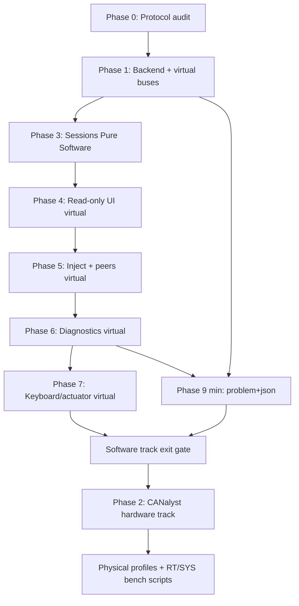

# Control Toolkit — Work Plan

**Source:** [`architecture-control-toolkit.md`](architecture-control-toolkit.md)  
**Vehicle architecture:** [`../architecture.md`](../architecture.md) (protocol model, RT/SYS roles)  
**Status:** Software track complete (Phases 0–1, 3–7 + 9 min). Headless `scripts/pure_software_smoke.py` green. Physical CANalyst (Phase 2 / hardware track) deferred.
**Last updated:** 2026-07-16

---

## Software first, hardware later (delivery policy)

**Default path is Pure Software + internal tests.** No CANalyst, no RT/SYS board, and no physical Bench TX are required to complete the software spine.

| Track | Goal | Phases | Hardware |
|---|---|---|---|
| **Software track (do first)** | Protocol → backend → virtual dual bus → sessions (Pure Software) → UI → inject/peers → diagnostics → keyboard/actuator *stimuli on virtual buses* → pytest / Python scripts / API | **0 → 1 → 3 → 4 → 5 → 6 → 7** (+ Phase 9 min) | **None** |
| **Hardware track (do after software track exit)** | CANalyst-II transport, physical Full Vehicle / Bench Test, real ECU isolation (bypass modes, 1–2 msgs) | **Phase 2**, then physical profile completion + opt-in HW tests | CANalyst + optional RT/SYS |
| **Backlog / Later / Future Work** | Preview, replay, full sim, LLM, Tauri, … | B / L / FW sections | As needed |

**Rules:**

1. Do **not** block Phases 3–7 on Phase 2 (CANalyst). Phase 3+ implement and gate against **virtual buses** and **Pure Software**.
2. Phase 2 may be stubbed early (empty `canalyst.py` / “not implemented”) so imports stay clean; **real adapter work waits** until the software track exit gate passes.
3. All software-track tests run on host: `pytest`, FastAPI TestClient, optional headless Playwright against virtual fixtures. Mark physical tests `@pytest.mark.hardware` and keep them out of the default CI job.
4. “Software complete” means the **tool + protocol + policies** work end-to-end on virtual buses. It does **not** claim RT/SYS firmware proven on a real CAN bus — that is the hardware track.
5. Physical Bench TX remains off by default forever; reconnect never restores TX.

---

## Non-negotiable phase rule

**Within the software track**, phases are sequential: do not start the next software phase until the previous phase’s code, tests, and exit gate pass. If a later phase exposes a regression, return to the phase that owns the broken contract, fix it, and rerun gates from there forward on the software track.

**Hardware track** starts only after the **software track exit gate** (below). It does not interleave as a hard dependency of Phase 3–7.

**Backlog / Later / Future Work** are not software-track phases. They must not block observe → decode → inject → synthetic peers → basic evidence on virtual buses.

---

## Delivery tiers

| Tier | What | Phases / sections |
|---|---|---|
| **Software track (ship first)** | Dual-bus **virtual** observe, generated decode/validate, Pure Software sessions, API + scripts, read-only UI, injection, synthetic peers, basic diagnostics/recording, keyboard/actuator stimuli **on virtual buses** | **0, 1, 3–7** (+ 9 min) |
| **Hardware track (after software)** | CANalyst-II, physical profiles, real ECU bench (bypass/isolation), opt-in HW characterization | **Phase 2** + physical integration notes |
| **Backlog** | After both tracks or when software is solid | Vehicle preview, error-catalog polish, conformance wizard, workload budgets, LLM/MCP |
| **Later** | Explicitly deferred product surface | Replay, baseline compare, predicates, triggered capture, Tauri |
| **Future Work** | Outside toolkit ownership / full sim | `simulation/` adapter, full physics, deep ECU emulation |

### Software track exit gate (before any hardware track work)

- [x] Backend runs Pure Software with no USB adapter
- [x] Virtual High + Low inject → decode → `GET /state` + WebSocket
- [x] Sessions, Bench TX model, leases, Stop All work on virtual buses
- [x] Injection + synthetic peers + evidence basics covered by pytest
- [x] Optional: React read-only + control against virtual backend
- [x] Headless Python scripts can drive the same API without UI (`scripts/pure_software_smoke.py`)
- [x] Default CI is green **without** `@pytest.mark.hardware` (local pytest 156+)

### Core non-negotiables (do not demote)

- Thin transport + stateful services (not a second vehicle brain)
- Profiles + explicit transitions; **no silent physical→virtual fallback**
- Bench TX off by default; reconnect never restores TX
- Capability honesty (`Unknown`, never fake TEC/REC/load zeros)
- YAML-generated wire codecs + one client-neutral FastAPI contract
- Stop All; source ownership for TX; Pass vs Inconclusive vs Fail (evidence quality)
- **Physical** actuator TX only after software-track virtual TX gates pass **and** hardware track enables it deliberately

### Explicitly not software-track (deferred)

| Item | Was | Now |
|---|---|---|
| CANalyst-II real transport + physical soak | Phase 2 in middle of spine | **Hardware track** (after software 0–7) |
| Vehicle visual preview | Phase 8 | **Backlog** |
| Full error catalog / event query polish | Phase 9 full | **Backlog** (min structured errors in software track) |
| Adapter conformance wizard + soak budgets | Phase 10 | **Backlog** (after hardware track basics) |
| Triggered capture, replay, baseline, predicates, Tauri | Phase 11 | **Later** |
| LLM/MCP as first-class product | API §6 | **Backlog** |
| Full `simulation/` ECU plug-in | Future Work | **Future Work** |

---

## YAML / protocol architecture — what it does and does not do

Aligned with root [`architecture.md`](../architecture.md) (“Static dictionary, codecs and policy”) and how **RT** / **SYS** already use the protocol package.

### Authority (wire facts only)

Contracts live under `protocol/contracts/` (not the obsolete dual `can_high.yaml` / `can_low.yaml` story):

```text
network.yaml, host.yaml, rt.yaml, sys.yaml, mtr.yaml,
ses.yaml, seb.yaml, pwt.yaml, hmi.yaml
```

YAML is a **DBC-like static wire dictionary**. It owns ID, bus instance, DLC, byte order, signal layout, scale/offset, enums, nominal cycle, and *where* checksum/counter fields sit. Every message picks one codec strategy: `generated` | `profile` | `custom`.

The compiler (`protocol/tools/protocol.py`) produces metadata and ordinary codecs under `protocol/generated/`. SES/SEB/PWT exceptional layouts stay as **handwritten** codecs under `protocol/codecs/` / `protocol/profiles/`. Language-neutral vectors under `protocol/vectors/` are the multi-language proof.

### What YAML and generation already give you

- One definition per message layout; RT and Control Toolkit must not invent a second layout
- Encode/decode helpers for ordinary messages (`can::gen::*` in C++, Python/TS catalogs)
- Named constants such as cycle times consumed by firmware policy code
- Optional DBC/docs for humans and third-party tools

### What they do **not** give (no magical powers)

YAML is **not** an algorithm language, RTOS design, or vehicle state machine. You still write real code for:

| Still hand-written | Where it lives today (examples) |
|---|---|
| FreeRTOS tasks, queues, drivers | `rt-esp32/src/main.cpp`, `sys-esp32/src/main.cpp` |
| Gateway / RX routing policy | `rt-esp32/src/can_rx_router.h`, `can_dispatch.h` |
| Safety / mode / ESTOP policy | `sys-esp32/src/safety_monitor.*`, `mode_manager.*`; RT `safety_monitor.h`, watchdogs |
| PID, kinematics, steering, brake arbitration | `rt-esp32` physics / speed / steering modules |
| Freshness, Bench TX, leases, UI, injection scheduler | **Control Toolkit backend** (to implement) |
| Vendor integrity algorithms | `protocol/codecs/` SES/SEB custom path (already) |
| “Is this frame allowed to TX right now?” | Toolkit command policy — not generated from YAML alone |

Firmware already shows the pattern: decode with `can::gen` / `can::custom::*`, then **component policy** decides what to do. Control Toolkit must do the same: import generated Python codecs, then write transport, state, policy, and UI.

### Phase 0 in that light

Phase 0 is **audit, fill gaps that block the toolkit, and prove golden vectors** — not invent a new protocol stack, and not wait for every architecture wish-list metadata field before a virtual RX loop can decode existing messages.

**Do:** use existing `protocol/` packages; extend YAML only when a missing wire fact or strategy breaks encode/decode/validation.  
**Do not:** re-parse YAML in the toolkit; reimplement SES/SEB algorithms; embed RT/SYS state machines in the backend.

---

## Current state assessment

| Area | Status |
|---|---|
| Architecture / design docs | ✅ Complete (consolidated in `architecture-control-toolkit.md`) |
| Protocol YAML contracts | ✅ Exist (`protocol/contracts/*.yaml`, including `hmi.yaml`) |
| Protocol compiler (`protocol.py`) | ✅ Exists — generates C++, DBC, docs, CSV, tables |
| Protocol Python runtime codecs | ✅ Exist — consume from `protocol/`; audit for toolkit needs in Phase 0 |
| Protocol TypeScript catalog | ✅ Exist — audit for frontend presentation metadata in Phase 0/4 |
| Protocol golden vectors | ⚠️ Present; coverage must be verified (Phase 0) |
| RT / SYS firmware | ✅ Use generated + custom codecs; policy remains hand-written (pattern to follow) |
| Python backend (FastAPI) | ✅ Pure Software — sessions, inject, peers, HMI, stream |
| React frontend | ✅ Vite/React shell — Overview / Live CAN / Control |
| Backend tests | ✅ pytest suite under `backend/tests/` (virtual only) |
| Frontend tests | ✅ Playwright e2e (`frontend/e2e`) + production build |
| Debug-tool / control-ui | ✅ Predecessors with reusable characterization — not the target product |

### Key gaps (updated)

1. **No toolkit runtime** — architecture resolved thin transport + stateful services; code not written
2. **Protocol gaps (fill as needed)** — e.g. counter semantics metadata, transmission-policy presentation fields, any missing wire fields used by diag/UI; do not block Phase 1 on non-wire wish-list
3. **Golden vector / drift-check coverage** — unknown completeness vs RT/SYS language pair
4. **Debug-tool channel mapping** — Ch0/Ch1 reversed vs project scope; fix in **hardware track** Phase 2
5. **No pytest / Playwright / virtual-bus fixtures** for control-toolkit
6. **control-ui parallel path** — stop growing as the long-term tool; port only proven pieces

### Experience-driven improvements over debug-tool

| Debug-tool weakness | Work plan improvement |
|---|---|
| Per-frame JSON+stdout parsing | **Hardware track / Phase 2:** native `python-can`, no child process |
| 20ms poll delay with 10ms messages | **Hardware track:** configurable 1–2ms poll, measured soak |
| `time.time()` batch timestamps | Phase 1 virtual + hardware track: monotonic arrival time |
| Channel 0/1 reversed | **Hardware track:** correct mapping, characterization |
| Silent physical→virtual fallback | Phase 3: explicit profile transitions (virtual-first) |
| Static periodic payloads (no counter/checksum regen) | Phase 5: per-frame regeneration in scheduler (virtual first) |
| No source ownership / duplicate producers | Phase 5: ownership table on virtual TX first |
| Placeholder bus load/TEC/REC = 0 | Phase 1+ / hardware: `Unknown`, never fake-zero |
| Mutable frame types + decoded payload embedded | Phase 1: immutable `RawFrameEnvelope` + separate decode |
| No evidence quality tracking | Phase 6: evidence-quality gate (virtual first) |

---

## Architecture reading map (exact lines)

**Primary file:** [`architecture-control-toolkit.md`](architecture-control-toolkit.md)  
**Line numbers as of 2026-07-16** (file length ~2809 lines). If the architecture file is edited, re-scan headings or search by section title — numbers drift.

Also read vehicle protocol model: [`../architecture.md`](../architecture.md) **L9–100** (CAN contract ownership, static dictionary, codecs/policy).

| Phase / track | Read these lines in `architecture-control-toolkit.md` | Why |
|---|---|---|
| **Always (orientation)** | **L3–94** scope; **L99–151** stack; **L156–216** product + profiles; **L1228–1247** delivery sequence | What we are building and software-first order |
| **Phase 0** | **L1138–1199** §18.2 YAML (incl. 18.2.1 no magic); **L25–33** data processing; **L905–961** §14.1.1 RT/SYS/MTR alignment + protocol gaps; **L2710–2758** HMI `0x111`/`0x112`; root **architecture.md L9–100** | Wire dictionary, codecs, what not to invent |
| **Phase 1** | **L218–258** system architecture diagram; **L409–425** concurrency; **L427–516** canonical data + real-time contract + WS; **L2019–2122** receive/decode/freshness logic; **L1560–1759** API core + stream; **L1946–1961** core identities | Virtual backend, envelopes, state, API |
| **Phase 3** | **L206–216** operating profiles; **L260–273** session/TX; **L1963–2000** work profile / Bench TX / session states; **L2467–2479** Stop All; **L2652–2664** shared session TX; **L1880–1892** physical bench API notes | Pure Software first; physical stubs |
| **Phase 4** | **L537–738** shell, Overview, Network, Live CAN, Dictionary; **L1000–1068** presentation/freshness/corruption UI; **L1085–1096** visual language; **L2191–2215** WS visual update logic; plus full [`ui-design-control-toolkit.md`](ui-design-control-toolkit.md) | Read-only UI |
| **Phase 5** | **L794–886** Control + injection; **L852–866** synthetic peer matrix; **L1070–1083** test-integrity boundaries; **L2230–2297** encode/inject/periodic/synthetic logic; **L2299–2322** HMI logic; **L2710–2758** HMI spec | Inject + peers + HMI on virtual |
| **Phase 6** | **L888–998** diagnostics/recording/settings; **L1031–1068** corruption; **L1366–1375** evidence-quality gate; **L2407–2465** recording/diagnostic/dashboard logic; **L2559–2569** evidence-quality logic | Evidence + dictionary |
| **Phase 7** | **L809–833** kinematics/direct/keyboard; **L2324–2370** keyboard/kinematics/actuator/virtual-encoder logic | Virtual stimuli only |
| **Phase 9 min** | **L1545–1557** error coding intro; **L1658–1682** response/error model; **L2680–2690** error event generation (minimum: problem+json + codes) | Stable API errors |
| **Phase 2 (hardware)** | **L285–407** CANalyst §4.4 full; **L656–683** layered connection-loss; **L2124–2174** adapter disconnect/reconnect logic; **L1201–1226** debug-tool migration “do not carry forward”; [`can-analyzer-research.md`](can-analyzer-research.md) full | Physical adapter |
| **Hardware track H4–H5** | **L12–23** work modes; **L56–70** synthetic peers; vehicle **architecture.md §9** bench bypass (~L485–528); commissioning isolation → [`../docs/commissioning-test-profiles.md`](../docs/commissioning-test-profiles.md) | Real RT isolation / bypass |
| **Backlog B1 preview** | **L1403–1521** §24; **L2587–2639** projection/preview logic | Later UI depth |
| **Backlog B3 / L*** | **L1340–1401** §23 analyzer improvements; **L1112–1136** service levels; **L2521–2581** trigger/replay/predicate/conformance logic | Later product |
| **API / scripts anytime** | **L81–94** shared API requirements; **L1523–1543** §25; **L1560–1920** full API contract; **L2641–2708** API/session/headless/event logic | One contract for UI + Python |

**How to use:** Before coding a phase, open the architecture file at the listed lines (or jump to the section heading). Prefer **logic** sections for behavior; **product** sections for UX; **API** sections for endpoints. Do not implement backlog line ranges during the software track.

---

## Phase 0 — Protocol Foundation

**Goal:** Confirm the existing YAML contracts, compiler, generated codecs, golden vectors, and semantic hashes are **good enough to import** into the Control Toolkit. Fix only gaps that block correct encode/decode/validate. This does not replace toolkit, RT, or SYS application code.

**Depends on:** `protocol/contracts/`, `protocol/tools/protocol.py`, existing generated artifacts (same stack RT/SYS already consume)

**Read first:** Architecture map row **Phase 0** — especially `architecture-control-toolkit.md` **L1138–1199**, **L905–961**; root `architecture.md` **L9–100**.

**Out of scope for Phase 0:** vehicle preview metadata, LLM schemas, full transmission-policy product UI, perfect comment-to-machine migration of every YAML comment.

### 0.1 Audit YAML contracts (wire facts)

- [x] Verify toolkit-critical messages exist in `protocol/contracts/` (not legacy dual-file names):
  - `0x001 SAFETY_ESTOP`, `0x111 HMI_MODE_REQ`, `0x112 HMI_PWR_REQ`, `0x201 SES_STATUS`, `0x206 MTR_MOTOR_FBK`, `0x300 HOST_DRIVE_CMD`, `0x310`/`0x311` diag, `0x600 SYS_DIAG_RPT`, heartbeats `0x7FC`/`0x7FD`/`0x7FE`, `0x721 SEB_STATUS`, `0x7B9 VCU_SEB_REQ`, `VCU_SES_REQ`
- [x] Confirm `network.yaml` forwarding matches RT gateway behavior (`can_rx_router` / architecture)
- [x] Wire fields present for toolkit decode (incl. SYS `rx_overflow` bits 1–6 saturating to 63)
- [x] Heartbeat `counter.kind` recorded on alive counters; SES/SEB checksum strategies via custom codecs
- [ ] Optional later (backlog): rich `transmission_policy` presentation tags per message

### 0.2 Audit and use Python runtime codecs

*(Import the existing Python package from `protocol/`. Do not re-parse contracts in the toolkit. Do not salvage the obsolete monolithic YAML parser from `debug-tool`.)*

- [x] Audit `protocol/generated/python/` and `protocol/codecs/` as **consumers**, same idea as RT/SYS:
  - Catalog: bus, ID, name, DLC, sender, receivers, period, byte order, signals
  - Encode/decode for ordinary + custom (SES/SEB/PWT) messages
  - Validators: DLC, range, enum, checksum/counter via existing profiles
  - Constants / safety bounds used for injection limits
- [x] Confirm toolkit can import and round-trip without forking generated sources (`protocol_bridge` + audit tests)
- [x] Semantic hash: `SEMANTIC_HASH` / `WIRE_HASH` / `NETWORK_HASH` in Python, TS, C++

### 0.3 Audit TypeScript runtime catalog (for later Phase 4)

- [x] Audit `protocol/generated/typescript/` for catalog + SEMANTIC_HASH matching Python
- [x] Semantic hash must match Python
- [ ] Presentation niceties (categories, bit-grid polish) may wait for Phase 4 / backlog if decode works

### 0.4 Golden encode/decode vectors

- [x] Cross-language golden vectors in `protocol/vectors/`:
  - Every message success vector in `payload-v1.json`
  - Motorola and Intel cases; checksum/counter cases; DLC=0 ESTOP
  - SES/SEB overlapping layouts + value round-trips in `custom-codec-values-v1.json`
  - Edge cases: min/max yaw/speed, enum/gear, rx_overflow max
- [x] Python test runner: `pytest protocol/tests/python/test_golden_vectors.py`
- [x] C++ vectors still covered by existing `protocol/tests/cpp` + header hash export (payload vectors shared)

### 0.5 Semantic hash and drift checking

- [x] Deterministic `SEMANTIC_HASH` (= content wire hash) + `NETWORK_HASH` in compiler
- [x] CI check: `python -m protocol.tools.protocol generate --check` (+ `python` / `typescript` targets)
- [x] Hash printed at generation / validation time
- [x] Audit write-up: [`protocol/PHASE0.md`](../protocol/PHASE0.md)

**Tests:**
```bash
# All golden + audit + generation tests
pytest protocol/tests/python/test_golden_vectors.py protocol/tests/python/test_phase0_audit.py -v
pytest protocol/tests/python -v

# Check mode succeeds (no drift)
python -m protocol.tools.protocol generate --check
python -m protocol.tools.protocol generate python --check
python -m protocol.tools.protocol generate typescript --check

# Semantic hash is deterministic
python -c "from protocol.generated.python.etrike_protocol import SEMANTIC_HASH, NETWORK_HASH; print(SEMANTIC_HASH); print(NETWORK_HASH)"
```

**Exit gate:**
- [x] All YAML messages from architecture §22 exist and parse
- [x] Python codec round-trips all golden vectors
- [x] TypeScript metadata generates without errors
- [x] CI drift check passes
- [x] Semantic hashes match between Python and TypeScript (and C++)

---

## Phase 1 — Backend Skeleton and Virtual Transport

**Goal:** Create the FastAPI backend skeleton with virtual CAN transport, immutable frame types, the receive pipeline, and latest-value state — all testable without hardware.

**Depends on:** Phase 0

**Read first:** Architecture map **Phase 1** — `architecture-control-toolkit.md` **L218–258**, **L409–425**, **L427–516**, **L2019–2122**, **L1560–1759**.

### 1.1 Project scaffolding

- [x] Create `control-toolkit/backend/` with `pyproject.toml` + `control_toolkit/` package tree
- [x] Single-process, single-worker Uvicorn configuration (architecture §4.5)
- [x] Health endpoint: `GET /api/v1/status`

### 1.2 Immutable frame types

- [x] `RawFrameEnvelope` (epoch, channel, timestamps, id, dlc/data exact, sequences, direction, source)
- [x] `TransportEvent` with severity, channel, evidence, monotonic timestamp
- [x] `AdapterStatus` with identity, capabilities, per-channel state, queue metrics

### 1.3 Virtual transport adapter

- [x] `VirtualTransportAdapter` dual High/Low virtual buses + Notifier
- [x] Constant-time callback → bounded queue (no decode in callback) — tested
- [x] Overflow detection with lost-count evidence
- [x] Clean shutdown; capability record all Unknown/False (no fake TEC/REC)

### 1.4 Receive pipeline

- [x] Router: sequence → history → decode → validate → latest → topology
- [x] Unknown frames visible without guessed decode
- [x] Decode failure preserves raw frame; no fabricated values
- [x] WebSocket / event bus state broadcasts

### 1.5 Latest-value state

- [x] Keyed by `(bus, can_id)` with observed/expected rate, freshness, validation
- [x] Per-signal raw_value, engineering_value, unit, enum_label, validity
- [x] Freshness: Unseen/Live/Late/Missing/Invalid (Frozen/Recovering reserved for later)
- [x] Bounded `FrameHistory` + `TopologyTracker` (RT high/low independent)

### 1.6 Basic API endpoints

- [x] `GET /api/v1/status` — readiness, adapter, semantic/network hashes
- [x] `GET /api/v1/state` — atomic latest-state snapshot
- [x] `GET /api/v1/history` — bounded chronological frames
- [x] `GET /api/v1/topology` — ECU liveness nodes
- [x] `GET /api/v1/protocol/messages` (+ detail by bus/id)
- [x] WebSocket `/api/v1/stream` — hello + initial + coalesced state

**Tests:**
```bash
pytest control-toolkit/backend/tests -v
# Includes: frame_types, decoder, freshness, validator, virtual_pipeline,
# api_status/state/protocol, websocket_stream, transport_callback, history, topology
```

**Exit gate:**
- [x] Backend starts in Pure Software mode without hardware
- [x] Injected virtual frames appear decoded in `GET /api/v1/state`
- [x] WebSocket delivers full latest-state broadcasts
- [x] Freshness transitions work (Live → Late → Missing on timeout)
- [x] Unknown frames preserved with raw data (+ history)
- [x] Generated codec path used via protocol bridge (Phase 0 golden suite separate)
- [x] Zero decode in receive callback (tested)

---

## Phase 2 — CANalyst-II Transport (**hardware track — deferred**)

**Status:** **After software track** (complete Phases 0 → 1 → 3 → 4 → 5 → 6 → 7 exit gates first).  
Not a dependency of Phases 3–7. During the software track, leave a stub adapter module or “unsupported profile” so physical open is refused cleanly.

**Goal:** Add physical CAN transport via `python-can` CANalyst-II, with correct channel mapping, arrival timestamps, adapter health, and connection lifecycle.

**Depends on:** Phase 1 **and** software track exit gate (Phases 3–7 Pure Software path green)

**Read first:** Architecture map **Phase 2 (hardware)** — `architecture-control-toolkit.md` **L285–407**, **L656–683**, **L2124–2174**, **L1201–1226**; [`can-analyzer-research.md`](can-analyzer-research.md).

**During software track only:**
- [ ] `transport/canalyst.py` stub: discover/open raise clear `not available until hardware track` (or omit registration)
- [ ] Selecting Full Vehicle / Bench Test without adapter reports explicit error — never silent virtual fallback

### 2.1 CANalyst-II adapter wrapper

*(Note: Port logic from `control-ui/backend/canalyst_manager.py` (specifically DLC payload slicing, observable drops, and SocketCAN error frame decoding) to build the new adapter. Ignore its hardware timestamp wrapping and heavy threading, as we are using a single-worker asyncio model and software timestamps.)*

- [x] Implement `CanalystTransportAdapter`:
  - `python-can` `CANalystIIBus` for both channels
  - Channel 0 → High Bus, Channel 1 → Low Bus (**corrected** from debug-tool defaults)
  - Configurable poll delay: start at 1–2ms (not 20ms default)
  - Dedicated blocking receive worker or `can.Notifier`
  - Bounded typed RX queue with overflow counter
- [x] Device discovery: USB VID/PID, device index, driver/backend info
- [x] Lock validated dependency version in `pyproject.toml`

### 2.2 Timestamp architecture

- [x] Use `time.monotonic_ns()` for backend arrival time
- [x] Ignore CANalyst-II hardware device timestamps (undocumented rollover behavior, unneeded for UI observation)
- [x] Per-channel sequence counter
- [x] Cross-channel analysis uses backend arrival time, subject to USB polling jitter

### 2.3 Adapter health and capabilities

- [x] Capability record: HW timestamps (ignored), TX echo (unknown), listen-only (unknown), bus-off (unknown), TEC/REC (unknown → never fake zero)
- [x] Health states: Absent → Opening → Open → Active → Quiet → Degraded → Recovering → Closed
- [x] Adapter-worker heartbeat monitoring (Degraded after 500ms, Failed after 1.5s)
- [x] Receive-worker and send exception monitoring

### 2.4 Disconnect and reconnect

- [x] On failure: disable Bench TX → cancel jobs → end leases → mark recording degraded → close → begin reconnect
- [x] Bounded exponential backoff with jitter, visible retry count
- [x] Reconnect: new adapter epoch → clear stale buffers → receive-only → stability window → Recovered
- [x] Never restore Bench TX or resume prior jobs on reconnect
- [x] Fast retries → indefinite slow discovery

### 2.5 Dual-channel integration

- [x] Simultaneous High + Low bus operation (software fake-device proof; hardware gate remains below)
- [x] Independent per-channel statistics
- [x] Cross-channel analysis uses backend arrival time (ingestion order)

**Tests:**
```bash
# Unit tests — adapter wrapper, timestamp mapping, health FSM
pytest control-toolkit/backend/tests/test_canalyst_adapter.py -v
pytest control-toolkit/backend/tests/test_adapter_health.py -v

# Disconnect/reconnect state machine
pytest control-toolkit/backend/tests/test_adapter_reconnect.py -v

# Virtual integration (same pipeline, virtual adapter)
pytest control-toolkit/backend/tests/test_dual_channel_virtual.py -v

# Hardware characterization (opt-in, requires physical adapter)
pytest control-toolkit/backend/tests/test_hw_characterization.py -v -m hardware
# → channel mapping, DLC=0, poll delay measurement
```

**Exit gate (hardware track only — not required for software 3–7):**
- [ ] Software track still green (virtual path regression-free)
- [ ] Channel mapping: Ch0=High, Ch1=Low (opposite of debug-tool — tested on hardware)
- [ ] Arrival timestamps applied correctly at transport layer
- [x] Overflow counter exposed (never silent eviction)
- [x] Adapter health FSM transitions verified in simulation (hardware still pending)
- [x] Reconnect creates new epoch, never restores TX state
- [ ] `pytest -m hardware` characterization passes when adapter present
- [ ] Full Vehicle / Bench Test profiles can open physical adapter without silent virtual fallback

---

## Phase 3 — Operating Profiles and Session Management (**software track**)

**Goal:** Implement session state and profiles with **Pure Software fully working**. Physical profiles (Full Vehicle, Bench Test) may be present as **declared but not executable** until Phase 2 (hardware track).

**Depends on:** Phase 1 only (not Phase 2)

**Read first:** Architecture map **Phase 3** — **L206–216**, **L260–273**, **L1963–2000**, **L2467–2479**, **L2652–2664**.

### 3.1 Profile state machine

- [x] **Pure Software (required for this phase exit):** two virtual High/Low buses, full session lifecycle, TX allowed only on virtual, no physical adapter
- [x] **Full Vehicle / Bench Test (stub until hardware track):**
  - Names and transition rules exist in API/models
  - Activating them without a physical adapter → clear error / blocked state
  - Never silently fall back to virtual
- [x] Controlled transition: stop periodic TX → neutral controls → confirm → activate
- [x] Profile visible in API status and WebSocket events
- [ ] After Phase 2: flesh out Full Vehicle (passive physical) and Bench Test (selected ECU + synthetic peers) for real hardware

### 3.2 Test-session state machine

- [x] States: Stopped → Preparing → Listening → Running → Stopping → Completed/Failed/Inconclusive
- [x] Session identity: backend session ID, adapter epoch, test session ID, protocol hash
- [x] Session revision for concurrent mutation control

### 3.3 Bench TX state

- [x] Disabled/Enabled binary state
- [x] Connecting adapter leaves Disabled
- [x] Explicit enable required for physical TX
- [x] Auto-disable on: profile change, disconnect, shutdown, session stop, reconnect
- [x] Passive monitoring and recording work while Disabled

### 3.4 Stimulus leases and source ownership

- [x] Exclusive, expiring ownership of resources (steering, motor, brake, HMI, periodic CAN ID)
- [x] One permitted producer per `bus + CAN ID` during a session
- [x] Lease renewal mechanism for interactive controls
- [x] Backend-owned cleanup on expiry, disconnect, or Stop All

### 3.5 Session API

- [x] `GET /api/v1/sessions` — current session state
- [x] `POST /api/v1/sessions` — create session with profile and capabilities
- [x] `POST /api/v1/sessions/{id}/bench-tx` — enable/disable Bench TX
- [x] `POST /api/v1/sessions/{id}/stop-all` — Stop All
- [x] `DELETE /api/v1/sessions/{id}` — close session
- [x] `GET /api/v1/sessions/profiles` — declared profiles + availability
- [x] `POST /api/v1/sessions/{id}/profile` — controlled profile change (`confirm=true`)
- [x] `POST /api/v1/sessions/{id}/leases` · renew · release
- [x] `POST /api/v1/sessions/{id}/vehicle-view` — requested/confirmed mode/power/ESTOP/recording

**Tests (software track — virtual only):**
```bash
pytest control-toolkit/backend/tests/test_profiles.py -v
# → Pure Software create/activate/stop
# → Full Vehicle / Bench Test refused without physical adapter (no silent virtual)
# → profile transitions that stay on Pure Software

pytest control-toolkit/backend/tests/test_session_state.py -v
pytest control-toolkit/backend/tests/test_bench_tx.py -v
# → enable on Pure Software virtual session
# → auto-disable on session stop / shutdown
pytest control-toolkit/backend/tests/test_source_ownership.py -v
pytest control-toolkit/backend/tests/test_api_sessions.py -v
```

**Exit gate (software track):**
- [x] Pure Software sessions fully work on virtual buses
- [x] Physical profiles cannot silently become virtual
- [x] Bench TX / leases / Stop All correct for virtual TX
- [x] Session revision prevents concurrent conflicts
- [x] Architecture shell UI: full status header, 8 workspaces, Overview/Network/Live/Control/Settings wired to session API
- [ ] **Deferred to hardware track:** adapter-loss → disable TX, physical profile smoke tests

---

## Phase 4 — Read-Only Frontend Foundation (**software track**)

**Goal:** Create the React + TypeScript frontend with Overview, Network, and Live CAN workspaces in read-only mode against **Pure Software / virtual** backend. No physical adapter required.

**Depends on:** Phase 3

**Read first:** Architecture map **Phase 4** — **L537–738**, **L1000–1068**, **L1085–1096**, **L2191–2215**; full [`ui-design-control-toolkit.md`](ui-design-control-toolkit.md).

### 4.1 Frontend scaffolding

- [x] Create `control-toolkit/frontend/` with Vite + React + TypeScript
- [x] Tailwind CSS setup + path aliases + `cn()` util *(phased: LiveCan extracted to `src/components/LiveCan.tsx` with layout utilities; App.css remains for complex interactive styles; full shadcn/ui deferred — hand CSS still implements ui-design rules; add shadcn primitives incrementally)*
- [x] Zustand for live state management
- [ ] Generated TypeScript API client from OpenAPI *(hand client covers current API)*
- [x] Dark, high-contrast automotive theme (architecture §17 + ui-design baseline)

### 4.2 Application shell

- [x] Persistent status header:
  - Active profile badge
  - USB adapter state indicator
  - High Bus / Low Bus activity (independent)
  - Vehicle power state (requested vs confirmed)
  - Vehicle mode (requested vs confirmed)
  - ESTOP state
  - Recording state
  - Stream quality badge (LIVE / DELAYED / DROPPING)
- [x] Left navigation rail with workspace icons
- [x] Protocol hash match/mismatch indicator
- [x] **Vehicle preview** workspace (2D kinematics port of `tricycle_kinematics_simulator.html`)

### 4.3 WebSocket client

- [x] Connection sequence: protocol hash exchange via hello/status → full state broadcasts
- [x] Parse full state directly (no delta merging or sequence gap detection required)
- [x] Independent freshness clock (ages continue increasing without new messages, using browser time)
- [x] Reconnect with exponential backoff and visible attempt count

### 4.4 Overview workspace

- [x] Safety and mode strip: ESTOP, power, mode, control path, CAN health
- [x] Vehicle status cards: speed, steering, brake, gear, faults (with freshness)
- [x] Command/feedback pairs table: Drive, Steering, Brake (requested vs measured + error + health)
- [ ] Click card → open contributing CAN messages *(deferred polish)*

### 4.5 Network workspace

- [x] Topology map: High and Low bus lines, RT bridging, attached nodes
- [x] Node states: Live, Late, Offline, Simulated, Unknown traffic, Fault
- [x] Heartbeat rules from generated metadata
- [x] Bus health cards: adapter, bitrate, RX/TX rate, errors, unknown IDs
- [x] Five-layer connection-loss display (USB, channel, stream, ECU, signal)

### 4.6 Live CAN workspace

- [x] Latest-by-message view (default): one row per bus/ID, updates in place
  - Activity indicator, bus, CAN ID, name, rate, decoded values, age
- [x] Chronological stream view (opt-in): history API poll, pause/resume
- [x] Filters: bus, ID/name/signal search
- [x] Message detail drawer: identity, live health, decoded signals *(full bit-grid → Phase 6)*
- [ ] TanStack Table for latest-message view *(native table; virtualization later)*

**Tests:**
```bash
cd control-toolkit/frontend
npm run test:e2e
```

**Exit gate:**
- [x] Frontend connects to backend via WebSocket
- [x] Protocol hash match/mismatch shown
- [x] Overview shows live vehicle state with freshness indicators
- [x] Network topology correctly shows node liveness
- [x] Live CAN table displays decoded values with proper units
- [x] Freshness visually transitions: Live → Late → Missing
- [x] Stream quality badge reflects actual state
- [x] All Playwright tests pass against virtual backend

---

## Phase 5 — Command Pipeline and Injection (**software track**)

**Goal:** Implement the TX pipeline: command policy, encoder, TX gate, periodic scheduler, source ownership, injection API, and HMI controls.

**Depends on:** Phase 4 (software track; virtual TX only until hardware track)

**Read first:** Architecture map **Phase 5** — **L794–886**, **L852–866**, **L1070–1083**, **L2230–2322**, **L2710–2758**.

**Hardware note:** All inject/scheduler tests in this phase use **virtual buses**. Physical TX validation is Phase 2 + post–software-track bench scripts.

### 5.1 Encode pipeline

- [ ] Encoder receives message definition + engineering values:
  1. Validate profile/test permits message
  2. Resolve defaults, enum selections
  3. Validate ranges against YAML bounds
  4. Inverse scale to raw values
  5. Pack via generated Intel/Motorola mapping
  6. Force mandatory enable fields (positive tests)
  7. Insert rolling counter
  8. Calculate checksum (after all protected bytes final)
  9. Verify DLC + self-decode round-trip
- [ ] Negative tests explicitly name violated rule, all others enforced

### 5.2 TX gate and command policy

- [x] Central TX gate validates before submission:
  - Profile permits transmission
  - Adapter/channel healthy
  - Bench TX enabled
  - Source owns lease + CAN ID
  - Protocol validation passes
- [x] TX disposition tracking: rejected | submitted | failed *(full Accepted→Queued chain deferred)*
- [x] `Submitted` ≠ `Delivered` (no delivery proof from CANalyst-II)

### 5.3 Periodic scheduler

- [x] Backend-owned worker for periodic transmission (analysis host-drive + synthetic jobs)
  - Per-frame re-encode
  - Job cancel on Stop All
  - Missed-period skip without burst catch-up
- [x] Counter field advances per period (verified in tests)
- [ ] Jitter measurement metrics export (polish)

### 5.4 Generic injection API

- [x] `POST /api/v1/injections/preview` — preview encoded frame without sending
- [x] `POST /api/v1/injections` — inject one-shot or periodic
- [x] `DELETE /api/v1/injections/{id}` — stop periodic injection
- [x] `POST /api/v1/analysis/host-drive` — targeted kinematics inject

### 5.5 HMI control

- [x] Mode/power vehicle-view + HMI API (`api/hmi.py`)
- [x] ESTOP injection: DLC=0 `0x001 SAFETY_ESTOP` event
- [x] Show requested vs observed state (never confirm from send alone)
- [x] 1 Hz HMI_MODE_REQ / HMI_PWR_REQ with rolling counters on virtual bus

### 5.6 Control workspace (frontend)

- [x] HMI request buttons (mode/power) → wire TX + header req vs conf
- [x] Analysis inject workflow: values → Bench TX → inject host drive → log disposition
- [x] Stop All + lease cleanup on Control unmount
- [ ] Full generic injection form (any message) + encode preview panel *(deferred polish)*

**Tests:**
```bash
pytest control-toolkit/backend/tests/test_encoder.py tests/test_tx_gate.py \
  tests/test_scheduler.py tests/test_hmi.py tests/test_injections.py \
  tests/test_analysis.py tests/test_api_surface.py -v
```

**Exit gate:**
- [x] Encoder passes golden vector / encode tests
- [x] TX gate enforces Bench TX + ownership guards
- [x] Scheduler advances counters and cancels on Stop All
- [x] HMI mode/power requests transmit at 1 Hz with counters
- [x] ESTOP injection works (DLC=0 frame)
- [x] Injection preview shows encoded bytes before sending
- [x] Exhaustive API surface tests green

---

## Phase 6 — Diagnostics, Recording, and Evidence (**software track**)

**Goal:** Implement the diagnostic timeline, recording pipeline, evidence quality tracking, sequential message verification, and CAN Dictionary workspace — all on **virtual** traffic and fixtures first.

**Depends on:** Phase 5

**Read first:** Architecture map **Phase 6** — **L888–998**, **L1031–1068**, **L1366–1375**, **L2407–2465**, **L2559–2569**.

### 6.1 Diagnostic service

- [x] Backend event log with severity/code/title
- [x] Episode aggregation: first occurrence → count updates → recovery (not one entry per failed frame)
- [x] Separate episodes per code/scope
- [x] Recovery hysteresis timing polish
- [x] Link to active test step and nearby stimuli (test result evidence + diagnostic emit)
- [ ] Classify ECU diagnostic messages from generated metadata *(backlog polish)*

### 6.2 Recording pipeline

- [x] Opt-in recording with visible active state (session + UI)
- [x] Store: raw RX/TX frames, bus, direction, source, adapter epoch, protocol hash
- [x] Bounded capacity; dropped frames → Incomplete evidence quality (no silent loss)
- [x] Recording integrity finalization on stop
- [x] JSON export (`GET /recordings/{id}/export`) + evidence windows
- [ ] Dedicated recording worker under overload stress *(backlog)*

### 6.3 Evidence quality gate

- [x] Per-capture evidence quality: Complete / Incomplete (Degraded/Not comparable stubs)
- [x] Formal Pass requires Complete evidence only (test runner)
- [x] Degraded marker API (`mark_degraded`); incomplete on drops

### 6.4 Sequential message verification

- [x] Test definition: stimulus → expected response → timeout → evidence
- [x] Step execution: pre-step state → stimulus → assertion timing → evaluate → Pass/Fail/Inconclusive
- [x] One active step at a time
- [x] Result with evidence links

### 6.5 CAN Dictionary workspace (frontend)

- [x] Searchable message cards from protocol catalog
- [x] Byte/bit layout grid (Intel/Motorola)
- [x] Full signal table + live overlay

### 6.6 Diagnostics workspace (frontend)

- [x] Event timeline + episode table
- [x] Recording controls: start/stop, frame count, evidence quality
- [x] Open evidence window for each recording

### 6.7 Diagnostics and recording API

- [x] `GET /api/v1/events` — query events by code/severity
- [x] `GET /api/v1/events/{id}` — single event
- [x] `GET /api/v1/episodes` — aggregated episodes
- [x] `POST /api/v1/recordings` — start recording
- [x] `DELETE /api/v1/recordings/{id}` — stop recording
- [x] `GET /api/v1/recordings` — list recordings
- [x] `GET /api/v1/recordings/{id}` — recording detail + frames
- [x] `POST /api/v1/tests` — run test case
- [x] `GET /api/v1/tests/{id}` — test result with evidence
- [x] `GET /api/v1/evidence/{id}` — fetch evidence window

**Tests:**
```bash
# Diagnostic episode aggregation
pytest control-toolkit/backend/tests/test_diagnostics.py -v
# → first failure immediate, repeated updates, recovery
# → per-code isolation (noisy msg doesn't suppress)

# Recording integrity
pytest control-toolkit/backend/tests/test_recording.py -v
# → start/stop, frame count, no silent drops
# → mark Incomplete on overload

# Evidence quality
pytest control-toolkit/backend/tests/test_evidence_quality.py -v
# → Complete, Degraded, Incomplete states
# → Pass only with Complete evidence

# Sequential verification
pytest control-toolkit/backend/tests/test_verification.py -v
# → stimulus → response → Pass/Fail/Inconclusive

# Playwright — Dictionary, Diagnostics
npx playwright test tests/e2e/dictionary.spec.ts
npx playwright test tests/e2e/diagnostics.spec.ts
```

**Exit gate:**
- [x] Diagnostic episodes aggregate correctly (not per-frame flood)
- [x] Recording captures all frames losslessly or marks Incomplete
- [x] Evidence quality gate prevents false Pass
- [x] CAN Dictionary displays all messages with correct bit layouts
- [x] Sequential verification produces correct Pass/Fail/Inconclusive
- [x] Event API returns structured data (not console text)

---

## Phase 7 — Interactive Control: Keyboard/Gamepad and Actuator Commands (**software track**)

**Goal:** Add keyboard/gamepad teleoperation, kinematics mode, and direct actuator control as **test stimuli on virtual buses**. Lease/watchdog/Stop All behavior is proven without physical actuators. Real RT/SYS isolation benches come in the **hardware track**.

**Depends on:** Phase 6

**Read first:** Architecture map **Phase 7** — **L809–833**, **L2324–2370**.

**Hardware note:** Do not require a real vehicle or CANalyst for this phase exit. Optional later: same controls against physical Bench Test after Phase 2.

### 7.1 Keyboard/gamepad input

- [x] Browser captures key state → target intent + monotonic sequence
- [x] Backend rejects stale/out-of-order intent
- [x] Stimulus lease via TX gate ownership while kinematics job active
- [x] Backend shaping: deadband, speed/yaw scale to YAML/firmware limits
- [x] Loss behavior: blur, tab hidden, 500 ms stale watchdog → release + zero command
- [x] ESTOP and Hard Brake bindings independent of motion lease
- [ ] Gamepad HID axis mapping

### 7.2 Kinematics mode

- [x] Target High-bus `0x300 HOST_DRIVE_CMD` at 10 ms (protocol cycle)
- [x] Acquire source ownership for `0x300`
- [x] Generate speed/yaw/gear from input (gear N/D/S/R firmware enum)
- [x] Show shaped speed/yaw/gear + loss reason in Control UI
- [ ] Observe RT feedback correlation strip (optional polish)

### 7.3 Direct actuator mode

- [x] Target selected Low-bus actuator messages
- [x] Separate cards: steering (`VCU_SES_REQ`), brake (`VCU_SEB_REQ`), motor (`RT_DRIVE_CMD`)
- [x] Enable prerequisites (Bench TX session)
- [x] Engineering-value input with codec bounds
- [x] Checksum/counter automatic via codec + scheduler
- [x] Start/stop command stream
- [ ] Matching feedback and error display polish

### 7.4 Mutual exclusion

- [x] Stop All / release clears kinematics job (ownership free for inject)
- [x] Kinematics intent clears direct jobs; direct start clears kinematics

### 7.5 Control workspace updates (frontend)

- [x] Input legend for keyboard teleop
- [x] Shaped command readout (speed/yaw/gear)
- [x] Hard Brake (Shift) and ESTOP (Space) bindings
- [x] Focus/blur/tab-hide detection

**Tests:**
```bash
pytest control-toolkit/backend/tests/test_firmware_alignment.py -v
pytest control-toolkit/backend/tests/test_keyboard_input.py -v
pytest control-toolkit/backend/tests/test_kinematics.py -v
```

**Exit gate:**
- [x] Keyboard intent → shaped command → CAN frame pipeline works end-to-end
- [x] Loss of focus / stale intent stops stimulus (500 ms firmware-aligned)
- [x] Kinematics and direct-actuator modes are mutually exclusive
- [x] ESTOP dual-bus, bypasses normal ownership
- [x] YAML safety bounds enforced on shaped speed/yaw
- [x] Backend owns 10 ms TX timing (browser only sends intent)
- [x] Drive console e2e: arm + key → HOST_DRIVE_CMD on Live CAN

---

## Phase 8 — (moved) Vehicle Visual Preview → Backlog

**Status:** **Backlog** — not on the core 0–7 critical path.  
Architecture detail remains in `architecture-control-toolkit.md` §24 and logic §40–42 for when this is pulled in.

A minimal numeric command/feedback strip on Overview (Phase 4/7) is enough for first bench use. Full center-locked dual-layer projection is optional product depth.

See [Backlog B1](#backlog-b1--vehicle-visual-preview).

---

## Phase 9 — Error Coding (core minimum vs backlog polish)

**Goal (core):** Stable error codes and problem details on the shared API so clients are not string-scraping.  
**Goal (backlog):** Full machine-readable catalog, event store, wait-by-predicate, LLM-oriented event queries.

**Depends on:** Phase 1+ incrementally; finish a **minimum** by Phase 6.

**Read first:** Architecture map **Phase 9 min** — **L1545–1557**, **L1658–1682**, **L2680–2690**.

### 9.1 Core (in spine)

- [x] Stable symbolic codes + catalog IDs on API failures (`code`, `catalog_id`)
- [x] RFC 9457 `application/problem+json` for HTTP failures (SessionError, validation, HTTP, unhandled)
- [x] Log structured fields (code, path, detail) without a full event database

### 9.2 Backlog polish

Full registry, event factory, cause chains, event query API, wait predicates — see [Backlog B2](#backlog-b2--error-catalog-and-event-system-polish).

### 9.3 (historical detail kept for backlog)

When implementing B2:

- [ ] Machine-readable catalog from error-codes section
- [ ] Event factory: event_id, timestamps, correlation, dedup, redaction
- [ ] `GET /api/v1/error-codes`, `/events`, `/events/{id}`, wait helpers
- [ ] WebSocket event subscription

**Tests (core):**
```bash
pytest control-toolkit/backend/tests/test_problem_details.py -v
```

**Exit gate (core):**
- [ ] API failures use stable codes + problem+json (not ad-hoc English-only errors)
- [ ] Logs carry the same codes as API responses

**Exit gate (backlog B2 only):** full catalog, queryable events, shared event schema everywhere

---

## Phase 10 — (moved) Conformance wizard & performance budgets → Backlog

**Status:** **Backlog** — after hardware track Phase 2 basics (channel map, DLC=0, poll delay). Full fingerprint suite and soak budgets are not software-track.

See [Backlog B3](#backlog-b3--adapter-conformance-wizard-and-workload-budgets).

---

## Phase 11 — (moved) Advanced analyzer capabilities → Later

**Status:** **Later** — after core 0–7 is stable. Includes triggered capture, offline replay, baseline compare, predicate language, Tauri.

See [Later L1–L5](#later--deferred-product-surface).

---

## Verification strategy summary

| Level | What | Where | When |
|---|---|---|---|
| **Unit** | Generated vectors, fake clock/queue | `pytest backend/tests/test_*.py` | Every software-track phase |
| **Virtual integration** | Two virtual buses, full pipeline | `pytest backend/tests/test_*_integration.py` | Every software-track phase |
| **API / WebSocket** | FastAPI TestClient + stream fixtures | `pytest backend/tests/test_api_*.py` etc. | Phase 1+ |
| **Headless scripts** | Python httpx against running Pure Software backend | `scripts/` or tests | Phase 3+ |
| **Playwright E2E** | React against virtual backend | `npx playwright test` | Phase 4+ |
| **Default CI** | All of the above **except** hardware | CI job without `-m hardware` | Continuous |
| **Hardware characterization** | CANalyst loopback / real RT-SYS | `pytest -m hardware` | **Hardware track only**, opt-in |
| **Soak / conformance wizard** | Full budgets + fingerprint suite | Backlog B3 | After hardware track basics |

### Critical scenario coverage

| Scenario | Track / phase | Test type |
|---|---|---|
| Virtual inject → decode → state | Software 1+5 | Integration |
| WebSocket loss during keyboard stimulus | Software 7 | Integration |
| Source conflict on synthetic peer IDs | Software 5 | Integration |
| Checksum/counter positive + negative | Software 0+5 | Unit |
| Queue/storage overload → Inconclusive | Software 6 | Integration |
| DLC=0 ESTOP event (virtual) | Software 0+5 | Unit + Integration |
| HMI mode/power on virtual bus | Software 5 | Integration |
| Stop All during active workflows | Software 3+5+7 | Integration |
| Silent bus vs disconnected USB | **Hardware** Phase 2 | Unit / HW |
| Reconnect new epoch without resuming TX | **Hardware** Phase 2 | Integration / HW |
| Real RT 1–2 msg isolation (bypass firmware) | **Hardware** after Phase 2 | Manual + scripts |

---

## Dependency graph



**Order of work:** 0 → 1 → 3 → 4 → 5 → 6 → 7 (software). **Then** Phase 2 and physical bench. Backlog / Later attach after software exit (or after hardware as needed) and never block the software track.

---

## Hardware track — after software exit

Complete when software track exit gate is green. Builds on Phase 2 content above.

**Read first:** Architecture map **Phase 2 (hardware)** + **Hardware track H4–H5** — toolkit **L285–407**, **L656–683**, **L12–23**, **L56–70**; vehicle `architecture.md` §9 bench bypass; [`../docs/commissioning-test-profiles.md`](../docs/commissioning-test-profiles.md) for isolation sessions.

| Step | Work |
|---|---|
| **H1** | Implement real `CanalystTransportAdapter` (Phase 2.1–2.5) |
| **H2** | Enable Full Vehicle + Bench Test profiles for real adapter; still no silent virtual fallback |
| **H3** | Opt-in `@pytest.mark.hardware` characterization (channel map Ch0=High/Ch1=Low, DLC=0, reconnect epoch) |
| **H4** | Headless scripts: session + inject against physical RT (firmware mode 2 / bypass as needed; 1–2 msgs) |
| **H5** | Optional UI against physical buses; Bench TX explicit only |

Firmware run modes / isolation sessions remain RT/SYS ownership (`system_mode.h`, commissioning docs). Toolkit only provides profile, TX policy, inject, and observe.

---

## Architecture document cross-reference

Section titles alone are not enough for implementers. **Use the [Architecture reading map](#architecture-reading-map-exact-lines)** for exact line ranges in `architecture-control-toolkit.md` (and root `architecture.md` where noted). Summary:

| Work plan | Lines (primary file) | Section anchors |
|---|---|---|
| Phase 0 | L1138–1199, L905–961; + `architecture.md` L9–100 | §18.2, §14.1.1 |
| Phase 1 | L218–258, L409–516, L2019–2122, L1560–1759 | §4–5, logic §5–9, API |
| Phase 3 | L206–216, L260–273, L1963–2000, L2467–2479 | §3, §4.1, logic §3, §28 |
| Phase 4 | L537–738, L1000–1068, L2191–2215 | §6–10, §15, logic §12 |
| Phase 5 | L794–886, L2230–2322, L2710–2758 | §11–13, logic §14–18, HMI |
| Phase 6 | L888–998, L1366–1375, L2407–2465 | §14, §23.5, logic §25–27 |
| Phase 7 | L809–833, L2324–2370 | §11.2–11.4, logic §19–22 |
| Phase 9 min | L1545–1557, L1658–1682, L2680–2690 | §26, API §4, logic §46 |
| Phase 2 hardware | L285–407, L656–683, L2124–2174 | §4.4, §8.4, logic §10 |
| Backlog B1 | L1403–1521, L2587–2639 | §24, logic §40–42 |
| Later / B3 | L1340–1401, L1112–1136, L2521–2581 | §23, §18.1, logic §32–38 |

---

## Backlog

Pull these only when the **software track** is solid (prefer after software exit gate; hardware track optional depending on item). Design text in the architecture doc remains reference — not a v1 mandate.

**Read first (when pulling an item):** map rows **Backlog B1**, **Backlog B3 / L***, or **API / scripts** as applicable.

### Backlog B1 — Vehicle visual preview

Formerly Phase 8. Dual actuation/sensor `VehicleProjection`, center-locked ego canvas, path/ICR, Playwright visual goldens.

- [ ] Backend projection service (`GET /api/v1/projection`, stream subscription)
- [ ] Frontend SVG/Canvas dual-layer preview with honesty rules (no fabricated zeros)
- [ ] Kinematics vectors shared with E-Trike physics notes

### Backlog B2 — Error catalog and event system polish

Formerly full Phase 9.

- [ ] Machine-readable catalog for all domains
- [ ] Event factory, cause chains, dedup, persistence
- [ ] Query/wait APIs and WebSocket event feed
- [ ] Same schema in logs, recordings, and UI

### Backlog B3 — Adapter conformance wizard and workload budgets

Formerly Phase 10.

- [ ] Guided characterization suite bound to adapter fingerprint
- [ ] Workload envelope + utilization reporting
- [ ] Graceful degradation order under overload
- [ ] Soak vs §18.1 service levels

### Backlog B4 — LLM / MCP client adapters

The **core product** is one FastAPI contract for React, CI, and scripts. LLM tool schemas and MCP adapters are optional translations of that contract — no second domain backend.

- [ ] Optional OpenAPI → tool schema generator
- [ ] Optional MCP adapter that only maps tools → REST/WS
- [ ] Docs for headless automation via HTTPX (preferred over MCP for CI)

### Backlog B5 — Presentation metadata on protocol artifacts

Nice-to-have after decode works:

- [ ] Message categories for filters
- [ ] Richer Dictionary bit-grid metadata
- [ ] `transmission_policy` tags for Control/Bench UX

---

## Later — deferred product surface

Formerly Phase 11. Do not schedule against first bench bring-up.

### Later L1 — Triggered pre/post capture

- [ ] Backend ring buffer + predicate triggers + pre/post windows + evidence quality

### Later L2 — Deterministic offline replay

- [ ] Replay epoch, virtual clock through router/freshness, pause/step/seek, observation-only

### Later L3 — Baseline / session comparison

- [ ] Semantic alignment, period/jitter/value diffs, Not comparable / Inconclusive rules

### Later L4 — Server-side predicate language

- [ ] Shared typed predicates for filters, triggers, assertions; protocol-hash bound

### Later L5 — Tauri desktop packaging

- [ ] Python sidecar, USB access, per-session capability token; still HTTP/WS to backend

---

## Future Work

### FW-A — ECU simulation integration (`simulation/`)

**Prerequisite:** Core Phases 1–5 complete and stable.

ECU simulation already exists in `simulation/src/ecus/` (RT, SYS, SEB, EPS-C, MTR, Host). Integrate as a **thin transport plug-in** for Bench Test / Pure Software.

**Do not re-implement ECU logic inside control-toolkit.** Behavior, timing, counters, and checksums stay in `simulation/`. The adapter only wires buses and provenance.

#### FW-A.1 Simulation adapter

- [ ] Bridge `simulation/` ECUs onto toolkit virtual buses
- [ ] Bench config selects which ECUs to start
- [ ] Provenance `Simulated <ECU>` on envelopes
- [ ] Clean shutdown on profile change / session end / Stop All

#### FW-A.2 Source conflict and listen-before-speak

- [ ] Refuse simulated TX if physical ID already present
- [ ] Stop simulated job + Inconclusive if physical traffic appears later
- [ ] Log conflicting physical frame as evidence

#### FW-A.3 API + Bench UI

- [ ] `POST/DELETE/GET /api/v1/simulation...`
- [ ] Bench workspace panel for running ECUs and conflicts

#### FW-A.4 Tests

```bash
pytest control-toolkit/backend/tests/test_simulation_adapter.py -v
npx playwright test tests/e2e/bench.spec.ts
```

### FW-B — Complete ECU / vehicle simulation (product scope)

Same spirit as architecture Future Work: full physics, complex state machines, environmental sensors — **not** required for control-toolkit core. Prefer extending `simulation/` rather than growing toolkit backend logic.

- [ ] Full-vehicle physics response to motor/steering
- [ ] Deep ECU state-machine emulation
- [ ] Sensor feedback loops from simulated environment
- [ ] Advanced kinematics-mode host emulation as a product feature
- [ ] Virtual encoder richness beyond simple synthetic peer frames

### FW-C — Firmware / protocol work outside toolkit (context)

Control Toolkit assumes RT/SYS continue to own vehicle policy. Related work stays in those trees:

- [ ] RT/SYS configuration and pure-software safety gates per `docs/rt-sys-feature-configuration-and-test-plan.md`
- [ ] Any remaining wire-field gaps in `protocol/contracts/` discovered while aligning firmware diag
- [ ] HMI CAN acceptance already partially present on SYS (`HMI_MODE_REQ`); keep firmware flag/policy explicit

These are **not** control-toolkit phases; they are dependencies when testing physical ECUs.
