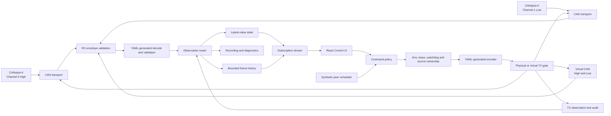

# E-Trike Control UI Architecture

**Status:** Product and system design concept (no implementation code)

**Purpose:** Define how the E-Trike CAN control application should be structured, what each screen must communicate, and how live CAN data should move from the vehicle to the operator.

**Protocol source of truth:** `shared/can/can_high.yaml` and `shared/can/can_low.yaml`, consumed through generated runtime catalogs, codecs, validators, documentation, and firmware definitions. DBC is an optional export for third-party tools, not an application dependency.

## 1. Product role

The Control UI is a focused operator and bench-engineering application for the E-Trike. It combines five jobs in one coherent interface:

1. Observe both vehicle CAN buses in real time.
2. Understand the vehicle state without reading raw frames.
3. Command HMI state, teleoperate the vehicle, or inject individual messages when explicitly requested.
4. Replace missing ECUs with controlled synthetic peers during bench testing.
5. Diagnose, verify, and record CAN behavior.

The application is not a replacement for the safety logic in SYS or RT. Physical switches, ECU limits, watchdogs, and hardwired safety systems remain authoritative. The UI is an operator tool and CAN participant, not the final safety controller.

## 2. Design priorities

- **State before traffic:** The default screen answers “Is the vehicle safe, connected, and behaving correctly?” before showing a wall of frames.
- **Human values before bytes:** Show `1.4 m/s`, `32°`, `AUTO`, or `Aligned`; raw bytes remain one click away.
- **One CAN definition:** IDs, names, buses, senders, receivers, DLCs, rates, endianness, scaling, enums, and bounds come from generated protocol metadata.
- **Clear provenance:** Every displayed frame identifies its bus, direction, and source: physical, HMI, operator injection, synthetic peer, or virtual bus.
- **Freshness is visible:** A value without age is unsafe and misleading. Every live value has a live, stale, missing, or fault state.
- **Control is deliberate:** Monitoring is always easy; transmission is visually distinct, validated, and acknowledged.
- **Progressive detail:** Dashboard → component → message → signal → raw bytes. Operators see only the detail needed for the current task.
- **Bounded live views:** High-rate data updates the latest visible state without creating an ever-growing browser history.

## 3. Operating profiles

The selected profile is permanently visible in the application header.

| Profile | Physical buses | Synthetic traffic | Operator transmission | Primary use |
|---|---|---|---|---|
| Full Vehicle | High and Low | Off by default | Explicit commands only | Monitor and control an assembled vehicle |
| Bench Test | Selected bus/ECU | Missing peers only | Enabled for the selected target | Test one or a few physical ECUs |
| Pure Software | Virtual High and Low | Full virtual vehicle | Virtual bus only | UI development and hardware-free testing |

Changing profile is a controlled transition. Periodic transmissions stop, active controls return to neutral, and the destination is shown for confirmation before the new profile becomes active. Loss of the adapter never silently changes a physical session into a virtual one; the UI reports the loss and offers an explicit move to Pure Software.

## 4. High-level system architecture



The hardware bridge, protocol interpretation, periodic transmission, and presentation are separate responsibilities:

- **Transport layer:** Opens CANalyst-II channels or virtual buses and moves raw frames. It does not decide vehicle behavior.
- **Protocol layer:** Uses YAML-generated codecs and validators to decode and encode messages, including endianness, checksums, counters, overlaps, DLC=0 events, and limits. It does not parse DBC at runtime.
- **Observation router:** Gives physical RX, virtual frames, synthetic peers, HMI commands, and manual injections one observable audit path without feeding observed TX frames back into transmission.
- **Latest-value state:** Keeps the newest value and timing health for every bus/message/signal combination.
- **Bounded history:** Keeps a recent, limited frame window for the monitor. Recording is a separate opt-in durable stream.
- **Synthetic peer scheduler:** Owns periodic bench traffic and rolling counters. It is separate from the transparent transport bridge.
- **Command policy and TX gate:** Validates destination, operating state, arm, ownership, freshness, source conflicts, and signal values before encoding and transmission.
- **Frontend:** Visualizes state and expresses operator intent. It does not independently construct unsafe raw frames.

This separation resolves the apparent conflict between a stateless CAN bridge and stateful emulation: the bridge remains a pipe, while the scheduler and protocol services own the state required for periodic peers, counters, and checksums.

## 4.1 Operational safety state

Operating profile, physical transmission authority, and control ownership are separate states:

- **Profile:** Full Vehicle, Bench Test, or Pure Software.
- **Physical arm:** Disarmed, Arming, or Armed. Connecting hardware never arms transmission.
- **Control lease:** Exclusive, expiring ownership of a resource such as steering, motor, brake, HMI, or a periodic CAN ID.
- **Source ownership:** One permitted producer for each `bus + CAN ID` during a session.

Physical transmission is possible only when the selected profile permits it, the adapter/channel is healthy, the system is Armed, the caller owns the required lease, the command is fresh, the source owns the target ID, and all YAML-generated protocol validation passes.

Arming is a short-lived backend lease. It expires and synchronously disarms on adapter loss, bus-off, backend restart, profile change, hardware-interlock loss, or operator heartbeat expiry. Reconnection always returns Disarmed. Steering, motor, brake, and periodic transmitters use backend-assigned session identities so two tabs or automation clients cannot silently overwrite one another.

The ESTOP command bypasses ordinary actuator ownership, but not the physical limits of the communication path. The UI labels it **CAN ESTOP** and never presents it as a replacement for the hardwired emergency stop.

## 4.2 Backend-owned command watchdog

The browser expresses control intent; it does not own command timing. A dedicated backend worker owns periodic transmission, rolling counters, checksum calculation, deadlines, and jitter measurements.

Interactive control commands have a short validity deadline and renew an exclusive backend lease. If focus, gamepad, WebSocket, or lease renewal is lost, the backend applies the message-specific YAML-defined loss behavior: stop transmitting, transmit a bounded neutral sequence, or request braking. There is no universal guessed “neutral” behavior. RT and SYS remain responsible for hard real-time deadlines and vehicle safety; the desktop stack is explicitly soft real-time.

## 4.3 Local control security

The control API is not an unauthenticated LAN endpoint. By default it binds to loopback only. Desktop packaging uses a per-session capability token delivered directly to the local UI, validates WebSocket origin, rejects cross-site requests, and keeps arm/lease ownership server-side. Any future remote access requires a separately reviewed authenticated and encrypted design; changing the bind address alone is not sufficient.

## 4.4 CANalyst-II communication architecture

The existing debug-tool CANalyst-II implementation is a characterization and setup baseline, not the new low-level driver. The preferred transport is the maintained `python-can` CANalyst-II interface (`CANalystIIBus`) configured for both channels. It already wraps the same unofficial reverse-engineered `canalystii`/PyUSB backend, exposes the standard `python-can` message model, provides device receive timestamps, and allows the virtual interface to use the same application-facing API.

Do not accept all `python-can` defaults unchanged. The current backend uses a 20 ms receive poll delay, stores its optional bounded RX queue in `deque(maxlen=...)` where old entries can disappear without an exposed counter, and converts a device-relative 100 μs timestamp into seconds. The Control UI adapter wrapper must configure or patch these behaviors and lock the validated dependency version.

Reuse the debug tool’s proven Windows driver procedure, USB identification, wiring/setup guidance, failure examples, and hardware tests. Reuse its low-level frame behavior only as characterization vectors against `python-can`; do not fork or copy the reverse-engineered USB protocol unless a measured blocker in `python-can` cannot be fixed upstream.

Because the new backend is already Python, it should not preserve the debug tool’s Node → child Python → JSON-lines path. The primary path is:

```text
CANalyst-II
  → WinUSB/libusbK
  → PyUSB + unofficial canalystii backend
  → python-can CANalystIIBus for channels 0 and 1
  → dedicated receive worker / python-can Notifier
  → bounded typed frame queue
  → canonical RX validation/router
  → state, recording, and subscribed WebSocket clients
```

This removes per-frame JSON serialization, stdout parsing, child-process lifecycle ambiguity, and an extra timestamp boundary while retaining a standard adapter abstraction. Adapter isolation may later use a supervised process if soak tests show that the unofficial USB backend can stall or destabilize the FastAPI process, but the IPC must then be a versioned bounded batch protocol with sequence numbers—not unstructured one-line JSON.

### 4.4.1 Transport interface

All physical and virtual adapters implement the same backend contract:

- discover and describe devices;
- open with explicit device identity and channel configuration;
- start RX in listen-only mode where supported;
- return bounded batches of immutable raw frames;
- submit one-shot or scheduled TX requests through the central TX gate;
- report capabilities and unsupported evidence explicitly;
- emit adapter/channel/error/overflow/timestamp-reset events;
- stop, cancel pending TX, drain/cancel queues, and close idempotently.

The CANalyst-II adapter and the Python virtual CAN adapter share this interface, but a failed physical open never silently selects virtual CAN. The profile transition must be explicit.

### 4.4.2 Device discovery and channel mapping

Discovery reports USB VID/PID, device index, serial number when available, driver/backend, firmware/library version, and whether the device is already in use. If stable serial identity is unavailable, the UI makes the selected device index visible and requires review when multiple adapters exist.

The E-Trike default mapping is fixed and generated/configured as:

- CANalyst-II Channel 0 → High Bus, 500 kbit/s;
- CANalyst-II Channel 1 → Low Bus, 500 kbit/s.

The debug-tool script currently defaults these channels in the opposite direction in code, despite its setup documentation describing the required mapping. The new adapter must correct this and test it. A custom mapping is permitted only as an explicit bench configuration, displayed persistently in the header and recording metadata.

Bus identity is taken from the configured physical channel, never guessed from observed CAN IDs. ID-based bus detection may be shown as a wiring consistency check; disagreement creates `CHANNEL MAPPING SUSPECT`, not an automatic remap.

### 4.4.3 Receive handling

Create one `python-can` bus for both CANalyst-II channels and consume it through a dedicated blocking receive worker or `can.Notifier`; do not add a second application polling loop around it. `python-can` may use a receive thread for interfaces without an event-loop file descriptor, so the callback must remain constant-time and immediately enqueue into the bounded router queue.

Use an unbounded `python-can` internal deque only as the short-lived device-batch buffer, then immediately drain into the application’s bounded and instrumented RX queue. Do not set `rx_queue_size` until the backend exposes an observable drop counter. Hardware soak tests must prove that the internal deque remains small; if not, patch/subclass the backend to expose loss rather than accepting silent eviction.

The CANalyst-II USB protocol returns frames grouped by channel. Official `python-can` documentation states that order is preserved within a channel but frames from Channel 0 and Channel 1 may be delivered out of order relative to one another; the hardware timestamp is the correct cross-channel timing evidence. Therefore the application maintains per-channel sequence plus hardware timestamp. It does not treat backend ingestion order as vehicle-wide CAN order.

Required behavior:

- preserve standard/extended, data/remote, channel, DLC, and exactly `data[0:DLC]` rather than padded trailing bytes;
- preserve the CANalyst-II device receive timestamp at its 100 μs resolution, unwrap/reset-detect it, and map it into the session timebase while retaining the raw device value;
- retain per-channel order and assign a backend sequence for deterministic merging;
- order each channel by its preserved order and use hardware timestamp for cross-channel analysis;
- bound RX queues and emit an overflow event with lost-count evidence;
- keep High and Low statistics independent;
- perform YAML decoding, integrity validation, recording, and UI publication downstream—not in the USB poll loop.

Application code must not adapt to a 50 ms sleep while 20 ms messages or control deadlines exist. The wrapper makes the CANalyst-II backend poll delay configurable and starts with a measured 1–2 ms candidate rather than its 20 ms default; CPU usage, USB errors, batch size, and receive latency decide the final value. Receive timeout and observed batch delay are measured. A custom asynchronous libusb path is considered only after profiling proves the tuned standard backend misses the declared workload; libusb supports asynchronous bulk I/O, but bypassing `python-can` would add substantial driver and recovery complexity.

### 4.4.4 Transmit handling

Only the central backend TX gate can submit to the adapter. The adapter receives already-authorized encoded frames with command ID, lease ID, destination channel, deadline, requested send time, and source owner.

The adapter distinguishes these results:

- accepted by command policy;
- queued for adapter;
- submitted to USB library;
- library reported failure;
- expired before submission;
- canceled by disarm/profile change;
- optionally observed through loopback/feedback if the hardware exposes reliable confirmation.

A normal CANalyst-II `send()` return or lack of exception is not proof that another ECU received the frame. UI acknowledgments use the precise state `submitted`, not `delivered`.

Periodic tasks are owned by the backend scheduler, not by arbitrary raw adapter commands. Each period re-encodes from current semantic values so rolling counters and checksums advance correctly. Missed deadlines are not caught up by bursting multiple stale frames in a loop; the scheduler records missed periods, skips stale instances, and schedules the next future deadline.

### 4.4.5 Adapter health and capability honesty

The adapter publishes a capability record stating whether it can provide hardware timestamps, TX echo, listen-only mode, CAN error frames, TEC/REC, bus load, bus-off, hardware overflow, and channel reset. Unsupported values are `Unknown`, never synthetic zeroes. In particular, the debug bridge’s placeholder `load_pct = 0`, `tec = 0`, and `rec = 0` must not be interpreted as healthy evidence.

Health states are based on available evidence:

- `Absent`: USB device not present;
- `Opening`: driver/device initialization in progress;
- `Open`: USB and both configured channels initialized;
- `Active`: valid frames recently observed on that channel;
- `Quiet`: channel open but no recent frames;
- `Degraded`: overflow, repeated USB error, excessive batch delay, or supported controller warning;
- `BusOff`: only when the adapter can positively report it;
- `Recovering`: reopened but awaiting stable valid traffic;
- `Closed`: intentionally stopped.

Silence is not adapter disconnection. Channel traffic freshness, expected message freshness, and USB health remain separate.

### 4.4.6 Failure and reconnection sequence

On adapter exception, device removal, worker death, or supported bus-off evidence, the backend first disarms physical TX, revokes physical control leases, cancels periodic physical jobs, and marks affected values stale. It then closes the transport and begins bounded exponential reconnect attempts with jitter.

Reconnect never restores arm, leases, periodic TX, or prior command state. After reopening, the adapter clears/drains stale hardware buffers as a best effort, starts in receive-only behavior, creates a new adapter epoch, resets timestamp mapping, and observes a stability window. Only then does it become `Recovered`; the operator must explicitly arm and restart transmission.

After fast retries are exhausted, slow discovery continues indefinitely while the application is open. Retry count, next attempt time, and last error remain visible. A user can cancel retries or select another adapter.

### 4.4.7 Internal communication messages

Even inside one Python process, transport boundaries use explicit typed records rather than loose dictionaries:

- `RawFrameBatch` with adapter epoch, channel, timestamp quality, first/last sequence, and frames;
- `TransportEvent` with severity, channel, evidence, and monotonic timestamp;
- `TxRequest` with correlation, ownership, deadline, and encoded frame;
- `TxDisposition` with the precise submission state and timing;
- `AdapterStatus` with identity, configuration, capabilities, queue metrics, and per-channel state.

These records are versioned at any process or WebSocket boundary. Unknown message versions are rejected clearly rather than partially interpreted.

## 4.5 Runtime and concurrency model

Run exactly one backend hardware-owner process. Do not start FastAPI/Uvicorn with multiple worker processes: each process would have separate in-memory arm, leases, subscriptions, and adapter state and could contend for the same USB device. FastAPI’s own WebSocket guidance notes that an in-memory connection manager is single-process state.

Within that process:

- the `python-can` receive thread owns blocking adapter receive;
- its callback copies/enqueues only and never decodes, logs, or broadcasts;
- one router task drains RX batches and performs generated decode/validation/state updates;
- the recording worker receives its own bounded queue and never performs disk I/O on the router or ASGI event loop;
- one scheduler worker owns all periodic deadlines, counters, checksums, leases, and TX submission;
- the ASGI event loop owns HTTP/WebSocket work and reads immutable snapshots/events from backend services;
- per-client sender tasks isolate slow WebSocket clients.

Mutable operational state has one owner service and is changed through serialized commands. Threads never directly mutate React-facing dictionaries. Shutdown order is: disarm → revoke leases → stop scheduler → stop RX notifier → drain/close recording → close CAN bus → close clients.

This is a local single-machine tool, so Redis, Kafka, and a distributed event bus add failure modes without benefit. If hardware isolation later requires a second process, only the adapter boundary moves; one supervisor remains the authority for arm, leases, and routing.

## 5. Canonical data presented to the UI

Every live frame should arrive with enough context to explain what it means:

- session-relative timestamp and receive age;
- High or Low bus;
- CAN ID and message name;
- DLC and raw payload;
- RX or TX direction;
- source: physical, HMI, manual injection, synthetic peer, or virtual;
- sender and receivers from the CAN dictionary;
- decoded signal values with units and enum labels;
- expected cycle time and observed frequency;
- validation warnings such as wrong DLC, decode failure, stale counter, or checksum failure.

The UI should keep raw observation separate from decoded interpretation. A raw frame remains viewable even if decoding fails, and the failure is shown rather than replacing the payload with guessed values.

## 5.1 Real-time data contract

Real-time behavior is an end-to-end contract, not simply a fast WebSocket. Each stage must preserve timing evidence so the UI can distinguish a quiet vehicle from a stalled application.

Every streamed update carries:

- backend session ID and monotonically increasing sequence number;
- frame receive timestamp from the best available monotonic clock;
- backend publish timestamp on the same mapped backend timebase;
- bus, direction, and source;
- protocol hash used for decoding;
- validation result and warnings;
- stream batch sequence and server heartbeat timestamp.

Backend and browser monotonic clocks have different origins. A ping/pong exchange estimates browser/backend clock offset, round-trip time, and uncertainty; timestamps are never directly subtracted across clocks without that mapping. The frontend records its own arrival and render times. This provides four separately visible measurements:

1. **Frame age:** now minus CAN receive time.
2. **Transport delay estimate:** mapped browser arrival minus backend publish time, reported with uncertainty.
3. **Render delay:** visual commit minus browser arrival time.
4. **End-to-end visual age:** now minus CAN receive time for the value currently on screen.

The final measurement is the important operator truth. A WebSocket can be connected while the screen is seconds behind, so “connected” must never be inferred from the socket state alone.

The backend provides two complementary subscription types:

- **Raw monitor subscription:** bounded batches of accepted frames only while a client explicitly opens the chronological monitor or a diagnostic capture view.
- **Latest-state subscription:** coalesced by `bus + CAN ID`, optionally filtered to visible systems/messages, carrying the newest frame plus skipped-update counts.

Recording is an internal router-to-storage path and never depends on delivering raw frames to a browser. Critical safety, connection, and corruption transitions use a small always-on event subscription.

Coalescing may discard intermediate visual states but must never conceal that it happened. Each update reports the number of frames seen, coalesced, dropped, or invalid since the previous update. Commands, recordings, and corruption checks operate before UI coalescing.

## 5.2 Visual update strategy

The browser should receive live data continuously but repaint at a controlled cadence suitable for human perception and device performance. Critical state changes such as ESTOP, connection loss, bus-off, or a new fault bypass ordinary visual batching and render immediately.

Different visuals use different policies:

| Visual | Data policy | Presentation policy |
|---|---|---|
| Safety/mode state | Every state transition | Immediate render |
| ECU and bus health | Latest state plus deadlines | Immediate on degradation; periodic age refresh |
| Numeric dashboard values | Newest valid sample | Frame-aligned/coalesced repaint |
| Gauges | Newest valid sample | No long easing animation; animation must not add visible lag |
| Sparklines | Time-window downsample | Preserve peaks/min/max, not only averages |
| Latest CAN table | One row per bus/ID | Update in place and briefly mark changed cells |
| Chronological monitor | Bounded raw batches | Virtualized rows; pause rendering independently of capture |

The UI runs an independent freshness clock. Even if no new messages arrive, ages continue increasing and values transition from Live to Late to Missing. Loss detection must therefore not depend on receiving a final “disconnected” event.

## 5.3 Backpressure and overload visibility

Every queue between adapter, decoder, router, WebSocket, and browser has a fixed bound and exposes depth, high-water mark, dropped count, and oldest-item age. The system may shed presentation work to remain responsive, but it must announce degraded fidelity.

The header displays a `LIVE`, `DELAYED`, or `DROPPING` stream-quality badge derived from end-to-end visual age and queue metrics. A delayed UI must never continue displaying a green connection indicator as though its values were current.

Recording has a stricter contract than visual presentation. If lossless recording cannot keep up, it stops or marks the recording incomplete; it does not silently omit frames.

## 5.4 Backend-to-UI communication protocol

REST handles configuration, snapshots, recordings, dictionary queries, arm/lease operations, and deliberate commands. WebSocket carries subscribed live state and events. Command success is returned by REST/WebSocket correlation acknowledgment and is never inferred from seeing a similar CAN frame later.

WebSocket startup follows a defined sequence:

1. authenticate the local session capability;
2. exchange protocol semantic hash and stream protocol version;
3. establish clock-offset/RTT estimate;
4. request subscriptions and receive their accepted limits;
5. receive an atomic initial snapshot with snapshot sequence;
6. apply deltas strictly after that sequence;
7. detect gaps from batch sequence numbers.

Without an atomic snapshot boundary, frames arriving during initial page load can be lost or applied out of order. If a gap occurs, the UI marks affected subscriptions degraded and requests a fresh snapshot; it does not pretend that later deltas repaired missing state.

The always-on event subscription carries stream heartbeat, adapter/channel transition, ECU liveness transition, corruption transition, arm/lease change, source conflict, recording failure, and CAN ESTOP disposition. Latest-state and raw-monitor subscriptions can be added or removed without reconnecting the socket.

Each client has independent bounded queues. A slow diagnostic browser cannot delay adapter RX, command scheduling, recording, or other clients. The server first coalesces latest state, then drops old raw-monitor batches with explicit gap counts, and finally disconnects persistently slow clients with a reason.

Use batched JSON for control, status, events, snapshots, and latest-state updates initially. It is inspectable and sufficient after coalescing. Raw chronological frames are batched rather than sent as one WebSocket message per CAN frame. A binary batch format such as MessagePack/CBOR is adopted only if benchmarks show JSON parsing or bandwidth violates the workload budget; the versioned message envelope and golden stream fixtures make that change possible without redesign. Compression is off by default for tiny high-frequency batches because CPU cost and added buffering can exceed the byte savings on localhost.

## 5.5 Data handling and state ownership

The backend is authoritative for adapter state, timestamps, frame validation, latest-good values, liveness, integrity counters, arm state, leases, source ownership, periodic jobs, and recording integrity. The frontend may cache and format these values but cannot create a competing operational state machine.

Data is separated into four stores:

- **Raw observation:** immutable received/transmitted frame envelope and transport evidence.
- **Validation projection:** decoded values, rule results, and protocol semantic hash; reproducible from raw data.
- **Latest operational state:** bounded newest valid/invalid observations and freshness deadlines keyed by bus/message/signal.
- **Recording:** opt-in durable raw observations, transport events, configuration, adapter epoch, and protocol/source hashes.

On protocol metadata change, raw recordings remain valid evidence and can be re-decoded. Derived projections are treated as disposable. On reconnect or adapter epoch change, old latest values are retained only as historical last-known values; they never become fresh in the new epoch.

## 5.6 Configuration handling

Configuration has typed schema, defaults, validation, and provenance. Safety-relevant runtime configuration—channel mapping, bitrate, physical profile, interlock requirement, rate bounds, command-loss behavior, and adapter selection—is shown in the session review and stored with recordings.

Environment variables may provide development defaults, but the application does not silently accept contradictory channel mappings or arbitrary unsafe rates. YAML protocol values remain authoritative unless the YAML explicitly marks a setting bench-configurable. Configuration changes that affect transport or transmission require a disarmed controlled restart and create an audit event.

## 6. Application shell and navigation

The desktop layout has a persistent status header, a compact left navigation rail, and one main workspace.

### 6.1 Persistent status header

The header remains visible on every screen and shows:

- active profile: Full Vehicle, Bench Test, or Pure Software;
- USB adapter state;
- High Bus and Low Bus activity independently;
- physical/virtual destination indicator;
- vehicle power request and confirmed vehicle state;
- requested and confirmed vehicle mode;
- ESTOP state;
- recording state;
- prominent ESTOP action.

Requested state and observed state must not be collapsed into one label. For example, after selecting AUTO, the header can show `Requested: AUTO` and `Vehicle: MANUAL` until feedback confirms the transition.

### 6.2 Primary workspaces

1. **Overview** — vehicle state and immediate health.
2. **Network** — ECU topology, buses, and node liveness.
3. **Live CAN** — real-time traffic and decoded signals.
4. **Control** — HMI, teleoperation, and direct actuator control.
5. **Bench** — synthetic peers and isolated ECU setup.
6. **CAN Dictionary** — protocol reference derived from YAML.
7. **Diagnostics** — faults, verification sequences, and recordings.

The CAN Dictionary is a reference workspace; Live CAN is an observation workspace. They may share visual components, but their purpose and default density are different.

## 7. Overview workspace

The Overview should be understandable from several feet away and should not resemble a raw debug terminal.

### 7.1 Safety and mode strip

The top row communicates, in order of importance:

- ESTOP clear/active;
- vehicle OFF/ON request and confirmed power state;
- MANUAL/AUTO/PURE SIM request and confirmed mode;
- selected control path: none, kinematics, or direct actuator;
- overall CAN health.

Red is reserved for active hazards and failures. Amber means stale, degraded, or awaiting confirmation. Green means observed healthy state, not merely a button that was clicked.

### 7.2 Vehicle status cards

Show a small set of operational values rather than every signal:

- requested speed versus measured speed;
- requested steering/yaw versus measured steering angle;
- brake request versus brake status/pressure;
- gear and direction;
- obstacle distance or relevant safety input;
- motor and actuator readiness;
- current fault count.

Each value includes its unit and freshness. Clicking a card opens its contributing CAN messages and signals.

### 7.3 Command/feedback pairs

Use paired rows to make control-loop behavior obvious:

| System | Command | Feedback | Difference | Health |
|---|---|---|---|---|
| Drive | `HOST_DRIVE_CMD` or motor request | `MTR_MOTOR_FBK` | speed error | Live/Stale/Fault |
| Steering | yaw/steer request | `SES_STATUS` | angle error | Live/Stale/Fault |
| Brake | brake request | `SEB_STATUS` | pressure/stroke error | Live/Stale/Fault |

This retains a useful pattern from the debug tool while presenting engineering values rather than JSON.

## 8. Network workspace

The Network view explains what is physically or virtually participating.

### 8.1 Topology map

Display two horizontal bus lines, High and Low, with the RT gateway bridging their domains. Attach nodes to their actual bus:

- High: Host, RT, HMI/Control UI;
- Low: RT, SYS, PWT/MTR, steering unit, brake unit, and other defined nodes.

Each node has a state:

- **Live:** expected heartbeat or defining status frame is arriving on time;
- **Late:** one or more expected periods missed;
- **Offline:** no qualifying traffic within the offline threshold;
- **Simulated:** supplied by the synthetic-peer engine;
- **Unknown traffic:** frames attributed to the node are present but its heartbeat is absent;
- **Fault:** heartbeat/status is present with health faults.

The node tooltip or detail drawer shows last seen time, observed rate, expected rate, source, relevant IDs, bus, and active fault flags.

### 8.2 Heartbeat rules

Liveness is message-aware rather than based on any traffic:

- Host: High `0x7FC`;
- RT: High and Low `0x7FD`, evaluated independently;
- SYS: Low `0x7FE`;
- PWT: Low `0x7FB`;
- other nodes: their defined heartbeat or primary periodic status message.

Freshness thresholds should derive from expected message periods. A practical display policy is Live up to roughly two expected cycles, Late after missed cycles, and Offline after a larger bounded timeout. The exact thresholds remain configurable per message.

### 8.3 Bus health

For each bus show adapter/channel, configured bitrate, active/offline state, RX/TX frame rate, unknown IDs, decode errors, dropped frames, and last transport error. High and Low must never be combined into a single “CAN connected” lamp.

### 8.4 Layered connection-loss detection

Connection state is evaluated independently at five layers:

| Layer | Evidence | Failure meaning |
|---|---|---|
| USB adapter | Device/driver open state and adapter errors | CANalyst-II is unavailable or failed |
| CAN channel | Channel open/configuration state and adapter-supported error evidence | High or Low controller is unavailable or degraded |
| Backend stream | Server heartbeat and WebSocket batch sequence | Browser has lost or stalled its backend connection |
| ECU/node | YAML-defined heartbeat/status deadline and advancing alive counter | A specific node is absent or frozen |
| Signal/message | YAML-defined cycle time, last valid frame, and validation state | A displayed value is stale, missing, or corrupt |

These states must not be collapsed. For example, the USB adapter can be connected while Low Bus is silent, or RT can be alive on High Bus but missing on Low Bus.

Channel-open, electrical activity, expected protocol traffic, and ECU liveness are separate. A correctly opened but intentionally quiet bus is not called disconnected. If CANalyst-II cannot expose bus-off, error-passive, or hardware-overflow evidence, that health field is shown as `Unknown`; it is never inferred as healthy from an open USB handle.

The backend sends a lightweight stream heartbeat even when there is no CAN traffic. The browser declares the backend stream lost after a bounded missed-heartbeat interval, immediately marks all physical live values stale, disables motion controls, and preserves last values with their ages for diagnosis.

Reconnect behavior is explicit:

- reconnect uses exponential backoff with a visible attempt count;
- the UI never restores physical transmission or active teleoperation automatically;
- a new backend session ID resets sequence expectations and is shown as a session change;
- message freshness is rebuilt from new traffic rather than inherited from before the outage;
- gaps in stream or frame sequence are counted and shown;
- a recovered node passes through `Recovering` until valid, advancing frames have been observed for a small stability window.

Node liveness uses advancing alive counters when they exist, not frame arrival alone. Receiving the same heartbeat payload repeatedly may indicate a frozen producer or replayed/corrupted traffic and must be reported separately from healthy liveness. For physical traffic, the displayed sender is the **YAML-defined expected sender**, not proof of which physical ECU transmitted it; ordinary CAN frames contain no sender identity.

## 9. Live CAN workspace

The Live CAN view answers “What is happening now?” It should support two complementary presentations.

### 9.1 Latest-by-message view

This is the default and most readable mode. Each bus/ID appears once and updates in place. Rows show:

- activity/freshness indicator;
- bus;
- CAN ID and message name;
- sender;
- direction and source;
- observed rate versus expected rate;
- raw bytes;
- compact decoded values;
- age since last frame.

Updating in place prevents high-frequency messages from pushing useful information off screen. A changed value briefly highlights without flashing the entire row.

### 9.2 Chronological stream view

This view shows individual frames for timing and sequence diagnosis. It has pause, resume, clear-visible-history, and bounded-history behavior. Pausing freezes rendering, not capture or recording.

### 9.3 Filters

Provide fast filters for:

- High, Low, or both buses;
- CAN ID/name;
- sender/receiver ECU;
- signal name;
- RX/TX direction;
- physical/synthetic/HMI/manual/virtual source;
- command, status, heartbeat, diagnostic, or event category;
- known, unknown, warning, or fault frames;
- changed-only values.

Search should match CAN ID, message name, ECU, signal label/key, comment, and decoded enum text, following the useful behavior of the existing debug tool.

### 9.4 Message detail drawer

Selecting a live message opens one detail drawer with:

1. identity: ID, name, bus, sender → receivers;
2. contract: DLC, expected period, byte order, source authority;
3. live health: last seen, observed frequency, direction, and freshness;
4. decoded signal table: current value, enum label, unit, raw value, min/max, and state;
5. raw frame: timestamp and hexadecimal bytes;
6. byte/bit map: the same color-linked concept used by the debug tool;
7. recent mini-history for selected numeric signals;
8. warnings: wrong DLC, bounds, checksum, counter, multiplexing, or unknown bits.

The raw decoded JSON used by the debug tool may remain available under an “Advanced” disclosure, but it is not the primary presentation.

## 10. CAN Dictionary workspace

The dictionary explains what messages *mean*, independent of whether the vehicle is connected.

### 10.1 Catalog browsing

Use searchable message cards grouped or filtered by High/Low bus. Each card header contains:

- CAN ID and message name;
- bus;
- sender → receiver route;
- DLC;
- cycle/event rate;
- Motorola/Intel byte order;
- signal count;
- generated transmission-policy classification;
- generated-from-YAML provenance.

Do not silently merge undocumented fallback definitions into the authoritative catalog. If a fallback is ever needed, label it visibly as non-authoritative.

### 10.2 Byte and bit layout

Reuse the debug tool’s byte-grid idea because it makes overlapping and mixed-endian layouts understandable:

- render B0 through B7 as bit cells;
- give each signal a consistent color in both the grid and table;
- hover/focus a bit to show byte.bit address, owning signal, width, type, scale, unit, enum meaning, and multiplexing condition;
- distinguish unused, reserved, checksum, rolling-counter, and overlapping/multiplexed bits;
- explain DLC=0 messages as event frames where the ID itself is the event;
- label bit numbering and endianness explicitly to avoid a misleading linear map.

The new view must correct a limitation in simplistic bit grids: Intel and Motorola fields cannot always be visualized by merely coloring consecutive linear bits. The display must use the generated canonical bit mapping.

### 10.3 Signal table

The table should include:

| Column | Meaning |
|---|---|
| Signal | Protocol signal name and friendly label |
| Start | Canonical start bit and byte.bit form |
| Length | Width in bits |
| Type | Signed, unsigned, boolean, or enum |
| Byte order | Intel or Motorola |
| Scale/offset | Raw-to-physical conversion |
| Min/Max | Defined and safety-constrained bounds |
| Unit | Engineering unit |
| Values | Enum/flag meanings |
| Multiplexing | When the signal is active or overlaps another field |
| Automation | Auto checksum/counter/read-only/forced-enable behavior |
| Description | Protocol comment and operational meaning |

Selecting a signal highlights its bits; selecting bits highlights the matching table row. A “Show live values” toggle can overlay the newest value and age without turning the dictionary into the traffic monitor.

## 11. Control workspace

Control is divided into HMI, kinematics control, and direct actuator control. Only one driving control modality may own active motion commands at a time.

### 11.1 HMI panel

The UI acts as the HMI node and broadcasts:

- `0x111 HMI_MODE_REQ` at 1 Hz with requested MANUAL, AUTO, or PURE SIM mode and its rolling alive counter;
- `0x112 HMI_PWR_REQ` at 1 Hz with requested OFF/ON state and its rolling alive counter.

The panel shows request, transmission status, last transmitted counter, and independently observed SYS/RT state. A request is never displayed as confirmed merely because the frame was sent.

ESTOP is separate from routine HMI controls and transmits the DLC=0 `0x001 SAFETY_ESTOP` event. The **CAN ESTOP** action remains immediately reachable from every workspace when its transmission path is healthy. If the adapter, backend, or bus is unavailable, it visibly reports that CAN ESTOP is unavailable; the hardwired physical ESTOP remains the authoritative emergency control. Clearing a latched stop follows the vehicle’s defined recovery process and cannot be implied by a normal mode request.

### 11.2 Kinematics control

Kinematics mode targets the High bus and mimics Host intent through `0x300 HOST_DRIVE_CMD`. The RT remains responsible for kinematics and downstream safety behavior.

The interface shows speed, yaw/steering intent, gear, input source, keyboard/gamepad connection, command age, transmit rate, and RT-derived actuator feedback. Releasing input or losing focus stops browser lease renewal. Losing the controller, WebSocket, or renewal deadline causes the backend watchdog to apply the YAML-defined command-loss behavior; it does not rely on the disconnected browser to send a final command.

### 11.3 Direct actuator control

Direct mode targets selected Low-bus actuator messages for isolated testing. Steering, brake, and motor controls are separate cards with:

- target ECU and bus;
- enable/readiness prerequisites;
- engineering-value input;
- allowed range and current value;
- generated raw preview;
- checksum/counter status;
- explicit start/stop command stream;
- matching feedback and error;
- last command acknowledgment or rejection reason.

Mandatory enable flags are locked to their required values and explained, not exposed as casual toggles. Counters and checksums are visibly marked “automatic.” Safety bounds come from the YAML constants and cannot be bypassed by ordinary UI input.

### 11.4 Keyboard and gamepad behavior

Controls are inactive until the workspace has focus and the operator explicitly enables control. Show a small always-visible input legend and live input positions. Dedicated Hard Brake and ESTOP bindings are visually distinct. ESTOP must not depend on ownership of a steering, motor, or brake control session.

## 12. Bench workspace

The Bench workspace configures which physical ECU is under test and which absent peers are synthesized.

### 12.1 Bench setup

The setup flow asks for:

1. physical target ECU(s);
2. connected bus/channel;
3. peers known to be present;
4. missing peers to emulate;
5. control path: kinematics or direct actuator;
6. review of every periodic frame that will be transmitted.

A topology preview distinguishes physical nodes from synthetic nodes before activation.

### 12.2 Synthetic peer matrix

Show each scheduled message as a row:

| Enabled | Synthetic node | Message | Bus | Period | Key startup values | TX health |
|---|---|---|---|---|---|---|
| Yes | EPS-C | `0x201 SES_STATUS` | Low | 100 ms | angle 0, aligned | On time |
| Yes | SEB | `0x721 SEB_STATUS` | Low | 100 ms | safe/default | On time |
| Yes | MTR | `0x206 MTR_MOTOR_FBK` | Low | 50 ms | speed 0 | On time |
| Yes | SYS | `0x7FE SYS_HEARTBEAT` | Low | 100 ms | healthy/default | On time |
| Yes | RT | `0x7FD RT_HEARTBEAT` | Both | 500 ms | per-bus counters | On time |
| Yes | Host | `0x300 HOST_DRIVE_CMD` | High | 100 ms | neutral | On time |
| Yes | Host | `0x7FC HOST_HEARTBEAT` | High | 500 ms | healthy/default | On time |

The system prevents duplicate ownership with an initial listen-before-speak window and a `bus + CAN ID` source-ownership table. Synthetic output starts only after required physical IDs remain absent for their YAML-defined detection window. If conflicting physical traffic appears, synthetic transmission for that ID stops immediately, the control session disarms where appropriate, and a source-conflict event requires operator review. RT heartbeat instances on High and Low remain distinct and use independent counters.

### 12.3 Virtual encoders

Virtual wheel/motor feedback is presented as a named bench function, not an unexplained raw injection. Show simulated speed, source model/manual input, output rate, and the safety monitor it is intended to satisfy.

## 13. CAN injection workflow

Generic injection is an engineering tool, not the main driving interface.

1. Choose High or Low bus.
2. Select a message whose generated transmission policy permits the current profile and purpose.
3. Enter signal values using controls appropriate to type: toggle, enum selection, or bounded numeric input with units.
4. Review sender, receivers, DLC, destination, encoded bytes, forced fields, automatic counter/checksum, and warnings.
5. Choose one-shot or bounded periodic transmission.
6. Confirm hazardous actions such as ESTOP separately.
7. Show an acknowledgment with accepted/rejected state and the actual transmission result.

The injector should preserve the useful debug-tool concepts of templates, raw preview, periodic interval/count, stop controls, and command acknowledgments. It should add clearer physical/virtual destination labeling and prevent arbitrary rates from violating message-specific minimum periods.

Transmission permission is not a single `injectable` boolean and is never inferred from sender name. YAML policy classifies messages as monitor-only, HMI-periodic, synthetic-peer, manual-bench, kinematics-control, direct-actuator, or safety-event, with allowed profiles, buses, rate bounds, arm requirements, lease resource, and automatic fields.

## 14. Diagnostics, message verification, and logging

### 14.1 Diagnostics timeline

Diagnostic and transport events appear in a focused timeline separate from the high-volume frame stream:

- ECU diagnostic reports and fault flags;
- ESTOP and safety-state transitions;
- heartbeat late/offline/recovered events;
- bus-off, adapter disconnect, overflow, or decode errors;
- rejected command reasons;
- recording start/stop/incomplete events.

Each entry links to its raw frame and decoded signals.

### 14.2 Sequential message verification

Provide a guided verification workspace where an engineer selects a CAN message and defines or selects an expected response. Each step displays:

- message and signal values to transmit;
- required prerequisites;
- target bus/ECU;
- expected feedback message and condition;
- timeout;
- observed result;
- Pass, Fail, or Inconclusive with evidence.

Only one verification step is active at a time. Results can be exported as a test report.

### 14.3 Recording

Recording is opt-in and visibly active. A recording stores raw frames with timestamps, bus, direction, and source so it can be decoded again against a known protocol version. The UI shows duration, frame count, dropped-frame status, filename/session label, and storage health. Diagnostic-only logging may run with a lower data volume, but must never pretend to be a lossless full-bus recording.

## 15. Live data presentation rules

### 15.1 Freshness

Every live message and derived value carries one of four states:

- **Live:** arriving within its expected timing window;
- **Late:** expected periodic data has missed cycles;
- **Missing:** no valid frame has been observed or it exceeded the offline threshold;
- **Invalid:** a frame arrived but failed DLC, decode, checksum, counter, or semantic validation.

Display the numeric age (`42 ms ago`) alongside color. Color alone is insufficient.

### 15.2 Values

- Primary value: physical engineering value plus unit.
- Enum: friendly label first, raw value second when expanded.
- Boolean: semantic state such as `Enabled`, `Aligned`, or `Fault`, not just `1/0`.
- Unknown/reserved enum: show `Unknown (raw N)`.
- Unavailable: show `—`, never zero.
- Stale: retain the last value but dim it and show its age; do not silently reset it.
- Invalid: retain raw bytes and show the validation reason.

### 15.3 Update behavior

High-rate frames update the latest state at a display-friendly cadence while capture and control retain their required timing. Numeric values should not animate in ways that hide fast changes. Sparklines are useful for a few selected signals, not every field. The chronological table uses virtualization and a bounded visible window.

### 15.4 Categories

Messages may be categorized for navigation and filtering as Safety, HMI, Drive Command, Actuator Command, Status/Feedback, Heartbeat, Diagnostic, or Event. Categories are presentation metadata; CAN ID and bus remain the unique technical identity.

### 15.5 Corruption and plausibility detection

The Control UI validates every frame against the same generated protocol contract used by RT and SYS. Validation produces structured flags rather than a single generic decode error.

CAN-layer corruption and application-layer corruption are different. The CAN controller normally rejects frames that fail the wire CRC, so their corrupted payload may never reach the backend. Adapter-reported error frames, error counters, overflow, bus-off, and controller state are transport evidence. Payload checksum/XOR, rolling counter, DLC, range, and plausibility checks are application-protocol evidence. The UI reports them separately and never claims to show wire corruption that the adapter did not expose.

| Check | Detects | UI result |
|---|---|---|
| CAN ID/bus membership | Unknown or wrong-bus message | Unknown/wrong-route warning; raw frame retained |
| DLC | Truncated or oversized payload | Invalid frame; decoded values withheld |
| Bit layout and decode | Malformed or unsupported signal representation | Decode error with affected signal |
| Enum membership | Undefined state value | `Unknown (raw N)` warning |
| Physical bounds | Out-of-range engineering value | Invalid or implausible value with expected range |
| Checksum/CRC/XOR | Payload bit corruption | Corrupt frame; expected/received checksum shown |
| Rolling counter | Duplicate, frozen, skipped, or reordered frames | Sequence discontinuity with expected/received value and likely loss layer |
| Cycle time | Missing, late, burst, or unexpected-rate traffic | Timing warning with expected/observed period |
| Alive counter | Producer frozen despite continuing traffic | Node frozen warning |
| Cross-signal rules | Mutually inconsistent fields or missing enable bits | Semantic validation warning |
| Command/feedback plausibility | Command and response diverge beyond a configured window | System-level plausibility fault |

Invalid frames remain in the chronological monitor and recording with their raw bytes. They do not overwrite the last known-good engineering value. The value card instead shows the last good value, its timestamp and increasing age, and a visible `CORRUPT INPUT` state. Invalid or stale values are tainted and cannot silently participate in derived dashboard calculations; a derived value becomes unavailable or degraded and identifies the bad input.

Counters are tracked independently by bus, CAN ID, expected source definition, and session. This is essential for `0x7FD`, whose High- and Low-bus heartbeat instances have separate counters. Counter validation allows correct modulo wraparound and runs before UI coalescing. A gap is initially classified as a sequence discontinuity because adapter overflow, backend loss, arbitration, sender failure, or actual corruption may produce similar evidence; queue and adapter metrics help determine the likely cause.

Checks that cannot be proven from one frame, such as counter continuity, rate, and command/feedback agreement, run in the backend. The browser receives their structured results and may independently enforce freshness for display, but it does not invent a second protocol validator.

### 15.6 Corruption presentation

Corruption must be visible without overwhelming normal operation:

- the global header shows the number of active corrupt streams;
- affected ECU nodes and message rows receive a red corruption marker;
- the diagnostics timeline records first occurrence, recovery, and accumulated count;
- expanding the frame shows the raw payload, failed rules, expected values, received values, and protocol hash;
- a “valid only” monitor filter helps normal observation, but invalid frames are never discarded by default;
- recovery requires subsequent valid frames, not merely elapsed time.

Warnings are severity-ranked: informational timing variation, degraded/missed cycles, corrupt frame, and safety-relevant plausibility fault. The source YAML should carry severity where the protocol knows it; UI styling must not infer safety criticality from CAN ID alone.

## 16. Safety and interaction boundaries

- Physical transmission is unmistakably labeled and requires an unexpired backend arm lease; connecting the adapter alone never arms it.
- Simulation and physical traffic use different visual source badges.
- A control action always shows its target bus and message.
- HMI mode/power requests transmit only at their defined 1 Hz rate.
- Periodic jobs stop on profile change, disconnect, application shutdown, or explicit Stop.
- Motion commands have backend-enforced freshness timeouts and YAML-defined loss behavior.
- Direct actuator and kinematics control cannot simultaneously own the same control path.
- CAN ESTOP bypasses ordinary command ownership when the CAN transmission path is available; the hardwired ESTOP remains independent and authoritative.
- Every physical `bus + CAN ID` has at most one active backend source owner.
- Simulation and replay can never reach physical TX unless a separately reviewed hardware-in-the-loop policy explicitly permits a bounded case.
- The UI enforces YAML limits but clearly states that firmware and hardware safety remain authoritative.
- Failed transmission never falls back silently to a different bus or virtual destination.

## 17. Visual language

The application should feel like an automotive engineering instrument rather than a generic administration dashboard.

- Dark, high-contrast base suitable for workshop use.
- High and Low bus have stable, distinct accent colors.
- Physical, synthetic, HMI, manual, and virtual sources use consistent badges.
- Monospace typography is reserved for CAN IDs, timestamps, raw bytes, and bit addresses.
- Engineering values use legible proportional numerals and visible units.
- Dense tables are available in CAN and dictionary workspaces; control screens use larger targets.
- Red is reserved for faults, ESTOP, rejected safety conditions, and destructive implications.
- Responsive behavior prioritizes desktop/laptop use; narrow layouts turn wide tables into detail drawers or stacked signal cards.

## 18. Performance expectations

“Zero-latency feel” means:

- operator controls react immediately in the interface;
- WebSocket updates are batched/coalesced enough to keep the browser responsive;
- latest-by-message state is preferred over rendering every frame;
- hidden workspaces do not perform expensive rendering;
- frame history, logs, and queues have explicit bounds;
- dropped/coalesced UI updates are measured and disclosed;
- control and logging timing are not tied to the browser render loop.

The UI may skip intermediate visual updates, but the backend must not skip required command periods or hide capture loss.

## 18.1 Measurable real-time service levels

The implementation should declare and test service levels under a defined worst-case dual-bus workload. Initial targets should include:

- maximum and percentile CAN-receive-to-browser-arrival latency;
- maximum and percentile CAN-receive-to-visible-render latency;
- time to show adapter, channel, WebSocket, and ECU loss;
- maximum latest-state age while the UI reports `LIVE`;
- zero silent drops, with all coalescing and loss counted;
- command scheduling jitter and missed-period count;
- corruption detection latency;
- UI responsiveness while the chronological monitor and recording are active.

Provisional acceptance thresholds prevent “real-time” from remaining undefined:

- backend stream heartbeat: 250 ms;
- browser stream degraded after 750 ms without a heartbeat and lost after 1500 ms;
- dashboard repaint cadence: up to 60 Hz, normally 20–30 Hz under load;
- maximum visual age while labeled `LIVE`: the greater of 150 ms or two YAML-defined message periods;
- critical state events queued ahead of ordinary telemetry and rendered on the next browser frame;
- control-intent lease: message/profile-defined and always shorter than the receiving ECU watchdog;
- raw monitor queue and WebSocket batches: bounded, with oldest age and loss counters visible;
- recording: zero silent loss; any overflow marks the session incomplete immediately.

These are initial engineering budgets, not hard-real-time guarantees. CANalyst-II measurements under the declared worst-case dual-bus load may tighten or relax them through a reviewed change, with the chosen values stored in configuration and exercised by automated soak tests.

## 18.2 YAML protocol compiler

The application does not use DBC as its internal model. A single YAML protocol compiler parses and validates both source files into one normalized intermediate representation. From that representation it generates the artifacts used by RT, SYS, the Python backend, the React frontend, tests, and documentation. DBC may still be exported for CANalyzer, cantools interoperability, or other external tools, but no Control UI behavior depends on it.

The compiler should replace the current debug-tool-specific assumptions in `shared/can/generate_can_ts.py` with shared schema validation and deterministic targets:

- Python runtime catalog, encoder, decoder, and validator metadata for FastAPI;
- TypeScript runtime catalog and presentation metadata for React;
- C/C++ constants and codec/validation definitions for firmware;
- golden encode/decode/integrity vectors consumed by all languages;
- Markdown/CSV/optional DBC documentation exports.

The generated Control UI artifact should contain:

- protocol version, normalized semantic hash, and exact-source artifact hash;
- bus, ID, name, DLC, sender, receivers, cycle/event timing, and byte order;
- complete canonical bit mapping for Intel and Motorola signals;
- signal key/name, type, scale, offset, unit, enum values, min/max, and comments;
- constants and safety bounds from the YAML `constants` block;
- heartbeat/alive-counter signal identity and timeout rules;
- checksum/counter algorithm metadata and protected byte ranges;
- multiplexing/overlap conditions;
- mandatory enable values and automatically managed fields;
- message category, diagnostic severity, and structured transmission policy;
- generated lookup indexes for `bus + ID`, node, category, and signal search.

Frontend and backend expose their normalized semantic hash during connection setup. A semantic hash is calculated from canonical parsed content, so whitespace and comment-only edits do not break compatibility; the exact-source hash remains available for traceability. If semantic hashes differ, the UI enters `PROTOCOL MISMATCH`: raw monitoring may continue, but decoded control and physical injection are disabled until artifacts match.

The current YAML contains some checksum, counter, and safety meaning only in comments. Comments are useful to people but insufficient for deterministic validation. These rules must become machine-readable YAML fields—for example algorithm, checksum byte, covered bytes, seed/final XOR, counter signal, modulo, required enable bits, timeout, command-loss behavior, ownership class, and validation severity. RT, SYS, the Python backend, generated firmware code, tests, and the Control UI then consume the same rule without duplicating it.

Wire layout, integrity/liveness rules, and system plausibility rules are separate validated YAML sections. This keeps the CAN message format portable while allowing stateful rules such as command-feedback deadlines to share the same source-controlled compiler pipeline.

Generator output is reproducible and never hand-edited. CI runs generation in check mode and fails when generated artifacts drift from YAML.

## 18.3 Debug-tool bridge migration

Reuse is selective and test-driven:

| Debug-tool asset | Reuse | Required improvement |
|---|---|---|
| `CANALYST-II-SETUP.md` | Driver binding, VID/PID, dependency and troubleshooting guidance | Correct channel mapping, pin supported versions, add capability verification |
| `backend/canalystii_bridge.py` | Characterization vectors for DLC, IDs, channels, RX/TX, buffer cleanup, and observed failures | Replace runtime path with `python-can` CANalyst-II; retain tests and measured behavior; no JSON stdout |
| `backend/src/canalyst/bridge.ts` | Reconnect concepts and command correlation | Replace Node child-process wrapper with Python supervisor/adapter service |
| `backend/src/bridge/manager.ts` | Single active transport concept | Explicit profile transitions; no silent physical-to-virtual or CANalyst-to-serial fallback |
| Bridge/unit tests | Fake process/device cases and reconnect scenarios | Add dual-channel order, overflow, epoch, disarm-before-reconnect, scheduler jitter, and disconnect-under-TX tests |

The existing implementation should first be preserved behind characterization tests. Migration occurs only after tests capture current device-open, RX conversion, DLC=0, extended-ID, dual-channel, and shutdown behavior and prove equivalent or better behavior through `python-can`. Hardware-in-the-loop tests remain separately marked and never run against an armed vehicle by default.

Known debug-tool behaviors that must not carry forward:

- Channel 0/1 defaults opposite to the project scope.
- One JSON object and stdout flush for every frame.
- `time.time()` assigned once to an entire receive batch without timestamp-quality metadata.
- Adaptive idle polling that can stretch to 50 ms despite 20 ms protocol periods.
- Placeholder bus load, TEC, and REC values reported as zero.
- Static periodic payloads that do not regenerate counters/checksums.
- Catch-up loops that may burst stale periodic frames after a delay.
- `send()` acknowledgment presented without distinguishing submission from delivery.
- Traffic silence treated as channel inactivity without separating open/quiet/disconnected.
- Automatic fallback between materially different transports without operator confirmation.

## 19. Delivery sequence

Delivery is staged so physical control is added only after the observation and safety foundations are measurable:

1. **Protocol foundation:** YAML schema/compiler, cross-language golden vectors, semantic hashes, checksum/counter rules, and drift checks.
2. **Read-only transport:** dual-bus CANalyst-II/virtual transport, canonical timestamps, queue metrics, recording, and connection-loss evidence.
3. **Read-only UI:** Overview, topology, latest CAN, chronological monitor, dictionary, freshness, and corruption presentation.
4. **Virtual control:** command policy, arm/lease/watchdog model, injection, HMI, and synthetic peers restricted to virtual buses.
5. **Physical HMI and bench:** hardware interlock, source ownership, CAN ESTOP labeling, HMI requests, and bounded isolated-ECU workflows.
6. **Physical actuator control:** kinematics and direct-actuator modes only after latency, jitter, watchdog, conflict, disconnect, and corruption tests pass.
7. **Later capabilities:** replay, configurable verification suites, richer charts, and Tauri packaging.

Each stage has a usable acceptance test and does not require enabling the hazards of the next stage.

## 20. Acceptance questions

The architecture is successful when an engineer can answer these questions without opening source code:

- Is the adapter connected, and which bus is active?
- Is the display genuinely live, delayed, or dropping data, and what is its measured visual age?
- Which ECUs are physical, simulated, late, offline, or faulted?
- What mode and power state did the UI request, and what did the vehicle confirm?
- What are the current command and feedback values for drive, steering, and brake?
- Where did a frame come from, when did it arrive, and is it valid?
- How is a signal packed into the CAN payload?
- Which frames will the tool transmit before a bench session starts?
- Is physical TX armed, who owns each control lease and CAN ID, and when do those permissions expire?
- Are counters, checksums, enable bits, and safety limits being handled?
- Did an injection actually transmit, and what response followed?
- Is the diagnostic or full-bus recording complete and trustworthy?

If these answers are immediately visible, the Control UI provides both a safe operator overview and the depth required for CAN engineering.

## 21. Research basis and decisions

The transport decisions above were checked against primary project documentation and source rather than inferred from the debug tool alone:

- [python-can CANalyst-II documentation](https://python-can.readthedocs.io/en/stable/interfaces/canalystii.html): both channels are supported; per-channel order is preserved; cross-channel delivery may be out of order; device timestamps must be used for comparison; the backend is unofficial and reverse-engineered.
- [python-can CANalyst-II source](https://github.com/hardbyte/python-can/blob/main/can/interfaces/canalystii.py): current default polling delay is 20 ms; device timestamps use 100 μs units; bounded `rx_queue_size` uses an evicting deque; TX timeout cannot prove successful bus arbitration or receiver delivery.
- [python-can Notifier documentation](https://python-can.readthedocs.io/en/stable/notifier.html): interfaces without an event-loop file descriptor are received on threads and distributed to listeners; shutdown must stop/flush listeners.
- [python-can asyncio documentation](https://python-can.readthedocs.io/en/stable/asyncio.html): the application can integrate notifier delivery with an asyncio loop, but thread-backed adapters still use receive threads.
- [FastAPI WebSocket documentation](https://fastapi.tiangolo.com/advanced/websockets/): disconnects are explicit exceptions and the example in-memory connection manager is single-process, supporting the one hardware-owner process decision.
- [libusb API documentation](https://libusb.sourceforge.io/api-1.0/): asynchronous USB transfers are available but add a lower-level event and recovery implementation; they remain a measured fallback, not the initial path.

Dependency versions used for hardware validation are pinned. Upgrades rerun protocol golden vectors, transport characterization, disconnect/reconnect tests, and the full-load dual-channel soak benchmark before release.
