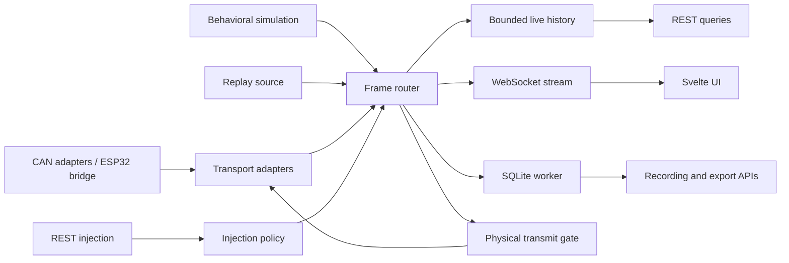

# E-Trike Debug Tool Architecture

**Status:** Target architecture grounded in the current implementation

**Scope:** CAN monitoring, controlled injection, recording/replay, behavioral simulation, and automated testing

**Protocol source of truth:** `../shared/can/can_high.yaml` and `../shared/can/can_low.yaml`

## 1. Goals and non-goals

The debug tool must help an engineer observe and test the E-Trike CAN system without becoming another implementation of the vehicle firmware. It must remain useful with no hardware attached, with one or more physical ECUs attached, and as a passive monitor.

The design optimizes for correctness, safety, diagnosability, and maintainability. Performance work is driven by measurements against declared workloads, not by a zero-allocation requirement.

The following are deliberately outside the core architecture until a separate, tested requirement justifies them:

- compiling embedded production firmware as a desktop-native process;
- reinforcement-learning or AI-training infrastructure;
- direct LLM control of physical CAN hardware;
- Vector CANalyzer automation;
- a second CLI implementation in Go or Rust;
- a high-fidelity vehicle dynamics model.

These may be added later behind stable interfaces. They must not complicate the core monitor and test tool now.

## 2. Design principles

1. **One protocol authority.** CAN IDs, buses, DLCs, signal layouts, scaling, limits, enums, and cycle times originate in the two YAML databases.
2. **Typed semantics where behavior is fixed.** Generic dictionary and injector views iterate runtime metadata. Vehicle-specific workflows use generated message and signal constants so protocol drift fails at build time.
3. **One frame path.** Physical, simulated, replayed, and user-injected frames enter the same router and leave through the same stream and recording interfaces.
4. **Explicit sources and modes.** Every frame carries its source. Mode controls which sources may transmit and whether a frame may reach physical hardware.
5. **Safety is layered.** Schema validation is necessary but is not a vehicle safety controller. Physical transmission requires independent policy and an operator-controlled interlock.
6. **Bounded resources.** Queues, history, recordings, reconnect buffers, and UI collections have declared limits and observable drop behavior.
7. **Measure before optimizing.** JSON WebSockets and SQLite remain acceptable until repeatable benchmarks show they miss an agreed service level.
8. **Current versus proposed is explicit.** This document marks components that exist today and components introduced by the work plan.

## 3. System context



The backend is the authority for routing, mode, injection policy, timestamps, simulation, and recording. The browser renders state and issues commands; it does not generate an independent CAN universe.

## 4. Protocol model and codec

### 4.1 Authoritative input

`can_high.yaml` and `can_low.yaml` define the protocol. A build-time generator validates them and emits:

- a normalized runtime catalog for dictionary-driven screens;
- typed TypeScript message names, buses, IDs, DLCs, and signal keys;
- encoder/decoder metadata or generated codec functions;
- firmware and DBC artifacts already required elsewhere in the repository.

Generated files are reproducible artifacts. Hand-edited copies of the catalog are forbidden. CI runs the generator in check mode and fails on stale output.

### 4.2 Codec contract

Encoding and decoding live in `@etrike/debug-shared` and have one public implementation. The codec must:

- support signed and unsigned fields up to the declared classic-CAN payload width without JavaScript 32-bit shift truncation;
- implement Motorola and Intel layouts according to documented, tested bit numbering;
- validate DLC, numeric range, enum membership, bit width, representable factor/offset values, and overlapping fields;
- keep raw numeric values and provide enum labels as presentation metadata;
- reject unknown message encoding rather than returning an empty frame;
- expose explicit checksum and rolling-counter hooks for messages whose rules cannot be represented as ordinary signals.

Golden vectors generated from the YAML/compiler toolchain verify TypeScript and firmware-compatible encoding in both directions.

### 4.3 Semantic consumers

Protocol-generic features use catalog iteration. Protocol-specific features such as ESTOP, mode selection, drive/brake correlation, ECU health, and unit-test presets use generated semantic constants. Raw ID strings are permitted only in protocol fixtures, adapter boundaries, and tests that intentionally verify an exact wire value.

## 5. Backend architecture

### 5.1 Application composition

Fastify is assembled around an explicit `AppContext` containing:

- protocol catalog and codec;
- current work mode;
- frame router;
- active transport manager;
- injection policy;
- bounded live-history service;
- stream hub;
- recording store client;
- optional simulation and replay controllers;
- clock interfaces needed by simulation and replay.

Routes receive these services through typed registration or Fastify decorators. Mutable module globals and route-local transport ownership are avoided.

### 5.2 Timestamp and ordering contract

Every run creates a session timebase. Canonical timestamps are elapsed microseconds from that session's monotonic origin, never Unix time and never an ambiguous mixture of seconds and milliseconds.

```ts
interface SessionTimebase {
  sessionId: string;
  startedAtUtc: string; // ISO 8601 metadata for display and correlation
  sourceClock: "adapter-hardware" | "host-monotonic" | "simulation" | "recording";
  sourceInstance: string;
}
```

The session origin is defined as canonical `timestampUs = 0`; an arbitrary host monotonic counter is not persisted as though it were portable. A `TimebaseMapper` maps adapter, host, simulation, or recording timestamps into session-relative microseconds. Adapter timestamp resets produce events and start a new mapping segment without moving canonical time backward.

Every accepted frame and transport event receives a monotonically increasing session `sequence`. Ordering is `(timestampUs, sequence)`, so equal timestamps are deterministic. `bigint` values are stored as SQLite integers where safe and serialized over JSON as decimal strings; APIs never rely on JSON encoding native `bigint`.

### 5.3 Canonical data-frame and decoded-message model

Raw observation and derived interpretation are separate and immutable:

```ts
type FrameSource = "physical" | "simulation" | "replay" | "user" | "test";

interface CanDataFrame {
  timestampUs: bigint;
  sequence: bigint;
  bus: "high" | "low";
  id: number;
  extended: boolean;
  remote: boolean;
  dlc: number;
  data: Uint8Array;
  source: FrameSource;
  sourceInstance: string;
  direction: "rx" | "tx";
}

interface DecodedMessage {
  definitionKey: string;
  values: Readonly<Record<string, number | boolean>>;
  enumLabels: Readonly<Record<string, string>>;
  warnings: readonly string[];
}

interface RoutedFrame {
  frame: Readonly<CanDataFrame>;
  message?: Readonly<DecodedMessage>;
}
```

For classic CAN, standard IDs are `0..0x7ff`, extended IDs are `0..0x1fffffff`, and DLC is `0..8`. A remote frame has no payload bytes; a data frame has `data.length === dlc`. CAN FD requires a future versioned extension rather than weakening these invariants.

`decoded` is not stored inside the raw frame. Recordings preserve wire observations even if the YAML interpretation later changes. A recording may store the protocol artifact hash and an optional decoded projection for query performance, but that projection is disposable and reproducible.

### 5.4 Transport and bus events

Bus failures are first-class observations, not fake CAN frames:

```ts
type TransportEvent =
  | { type: "error-frame"; bus: "high" | "low"; timestampUs: bigint; sequence: bigint; sourceInstance: string; details: string }
  | { type: "bus-off"; bus: "high" | "low"; timestampUs: bigint; sequence: bigint; sourceInstance: string }
  | { type: "bus-recovered"; bus: "high" | "low"; timestampUs: bigint; sequence: bigint; sourceInstance: string }
  | { type: "rx-overflow"; bus: "high" | "low"; timestampUs: bigint; sequence: bigint; sourceInstance: string; dropped: number }
  | { type: "adapter-disconnected"; timestampUs: bigint; sequence: bigint; adapterId: string; reason?: string }
  | { type: "timestamp-reset"; timestampUs: bigint; sequence: bigint; adapterId: string };
```

Events have their own routing and recording channel and appear in UI diagnostics. Adapter capability metadata states which events and timestamp quality it can actually provide.

### 5.5 Operational state machine and physical arm

Execution mode and permission to transmit physically are orthogonal. Treating `physical-armed` as an ordinary work mode would mix observation behavior with a short-lived safety capability.

```ts
type ExecutionMode = "offline" | "monitor" | "simulation" | "replay";
type PhysicalArmState = "disarmed" | "arming" | "armed";

interface OperationalState {
  mode: ExecutionMode;
  arm: PhysicalArmState;
  profile?: string; // named bench/model configuration, not a safety state
  revision: bigint;
}
```

Existing labels such as `full-sim`, `bench`, and `hybrid` become validated profiles or migration aliases. There is no profile flag equivalent to `injectEmulatedToPhysical`; simulation/replay-to-hardware forwarding is prohibited.

| Current mode | Requested mode | Allowed | Required action |
|---|---|---:|---|
| offline | monitor | yes | Start selected adapter; remain disarmed |
| offline | simulation | yes | Start simulation with isolated physical transmit gate |
| offline | replay | yes | Open recording; isolate physical transmit gate |
| monitor | simulation | yes | Disarm, stop periodic TX, revoke leases, disconnect or transmit-isolate adapter, clear source claims and queues |
| monitor | replay | yes | Disarm, stop periodic TX, revoke leases, isolate adapter, clear queues |
| simulation | monitor | yes | Stop simulation, clear simulated source claims/queues, then connect adapter |
| simulation | replay | yes | Stop simulation and clear queues before opening replay |
| replay | simulation | yes | Stop replay and clear queues before starting simulation |
| replay | monitor | yes | Stop replay and clear queues before connecting adapter |
| any | offline | yes | Disarm, revoke leases, stop all producers/transmitters, drain or cancel queues, close adapter |
| same mode | same mode | yes | Idempotent no-op unless a profile change requires a controlled restart |

Arming is permitted only while mode is `monitor`, a transmit-capable adapter is healthy, operator confirmation is fresh, and any configured hardware interlock is asserted. Arming is a lease with a short expiry and heartbeat renewal; reconnection never restores it.

State invariants:

- physical TX is impossible unless `mode === "monitor" && arm === "armed"`;
- adapter disconnect, bus-off, interlock loss, heartbeat expiry, backend shutdown, or mode change synchronously disarms before other cleanup;
- reconnect always returns disarmed;
- simulation and replay can never reach physical TX;
- every mode transition revokes control leases, stops periodic jobs, rejects stale commands, and clears source-specific queues;
- transitions are serialized, revisioned, and either complete or leave the system in safe `offline/disarmed` state.

### 5.6 Routing matrix

“One frame path” means one enforcement point, not indiscriminate fan-out. `yes` below means the router may deliver after validation; `policy` means an additional explicit rule applies.

| Source | UI/live history | Recording | Simulation input | Physical TX |
|---|---:|---:|---:|---:|
| physical RX | yes | active session | profile opt-in for sensor input only | never echo |
| simulation | yes | active session | internal model routing | never |
| replay | yes | off by default; explicit derived recording only | never | never |
| user | yes after acceptance | audit plus active session | simulation mode only | policy + arm + lease |
| test | test UI only | test opt-in | isolated test engine only | never in production process |

Additional invariants:

- a routed observation is assigned one sequence and processed once;
- internally produced simulation frames are not fed back to their producer unless the model graph explicitly declares that edge;
- replay preserves original provenance in metadata while its current routing source remains `replay`;
- physical RX never becomes physical TX through default routing;
- tests cannot select a production hardware transport through a source label.

### 5.7 Queue and overload contracts

Every asynchronous boundary exposes the same metric shape:

```ts
interface QueueMetrics {
  depth: number;
  capacity: number;
  highWaterMark: number;
  accepted: bigint;
  dropped: bigint;
  rejected: bigint;
  oldestItemAgeMs: number;
}
```

| Boundary | Capacity unit | Overload policy |
|---|---|---|
| router → UI latest state | unique bus/ID keys | Coalesce by key; intermediate values may be replaced and counted |
| router → UI monitor history | frames/bytes | Overwrite oldest; expose overwritten count |
| router → live history | time + bytes | Overwrite oldest atomically |
| router → recording | frames/bytes | Never silently drop; apply bounded backpressure, then stop and mark recording incomplete if deadline is exceeded |
| router → physical TX | commands | Reject when full or stale; actuator commands are latest-value with explicit expiry, never an indefinite FIFO |
| replay → router | frames | Pause replay until downstream recovers or user cancels |
| simulation → router | frames per step | The step completes only when outputs are accepted; otherwise fail/pause deterministically |
| stream hub → WebSocket client | batches/bytes | Coalesce latest state, discard old monitor batches with counters, then disconnect persistently slow clients |
| transport RX → router | frames | Adapter-specific bounded buffer; report overflow event and count, never hide loss |

Capacities and deadlines are configuration values with safe defaults and upper bounds. Queue metrics appear in status APIs and diagnostics. Tests use deliberately tiny capacities to prove each overload behavior.

### 5.8 Command ownership and leases

Last-write-wins is forbidden for actuator or periodic-command ownership.

```ts
type ControlResource =
  | "actuator:steering"
  | "actuator:motor"
  | "actuator:brake"
  | `periodic:${"high" | "low"}:${string}`;

interface ControlLease {
  leaseId: string;
  resource: ControlResource;
  ownerId: string;
  modeRevision: bigint;
  acquiredAtUs: bigint;
  expiresAtUs: bigint;
}
```

Owners are authenticated connection/session identities, not user-supplied display names. Acquisition is atomic. Renewal requires the lease token and same owner. A lease is revoked on owner disconnect, mode transition, disarm, adapter failure, interlock loss, or expiry. Physical actuator leases require a heartbeat; simulation leases may use longer bounded durations for deterministic tests.

Leases are visible in the status API and UI without exposing secret tokens. ESTOP is not blocked by another client's lease. Non-hazardous passive actions such as filtering or starting a recording do not require actuator leases.

### 5.9 Frame router

All producers submit data frames and transport events to one router. For a data frame, the router performs, in order:

1. immutable envelope validation;
2. source-instance and operational-state authorization;
3. timebase mapping and sequence assignment;
4. loop/source-claim checks against the routing matrix;
5. protocol lookup and separate decoding when known;
6. bounded live-history publication;
7. UI stream publication;
8. recording enqueue when active;
9. explicitly requested simulation delivery or physical TX through policy.

The router never performs synchronous disk I/O. It returns a structured disposition describing accepted destinations, coalescing, rejection, or failure. Transport events follow the relevant UI, recording, safety-state, and diagnostics routes without being decoded as CAN messages.

### 5.10 Transports

Transport adapters implement a small interface: start, stop, receive, transmit, status, capabilities, and events. Serial, CANalyst-II, and any future SocketCAN or TCP bridge remain independent adapters managed by one `ActiveTransportManager`.

The manager owns adapter identity and timestamp mapping. It disarms before publishing disconnect/bus-off state and prevents more than one adapter from claiming the same configured physical bus unless an explicit listen-only aggregation design is selected.

The embedded MQTT broker and standalone MQTT simulator are legacy paths. They are removed after equivalent backend simulation and hardware workflows pass acceptance tests. WebSocket remains a browser-facing stream, not a hardware transport requirement.

### 5.11 Injection policy

Injection follows a single backend path regardless of whether the request comes from the UI, REST, a test, or a future automation client.

Policy layers are:

1. authenticated owner and request origin;
2. execution mode and route permission;
3. control-lease ownership where required;
4. protocol/DLC/signal validation;
5. checksum and rolling-counter preparation;
6. per-message rate, freshness, and command expiry;
7. physical arm, adapter health, and interlock permission.

There is no implicit fallback from failed physical transmission to simulation. The caller selects a permitted destination and receives its actual disposition. Physical transmit defaults to disabled. Enabling it requires explicit operator action and, for hazardous commands, a hardware or independently implemented bench interlock. AI/MCP access, if ever added, remains disabled for physical transmission unless a separately reviewed safety design is implemented.

### 5.12 Storage and recordings

The existing SQLite worker-thread boundary is retained. SQLite provides metadata, indexed queries, and portable recording sessions without blocking Fastify.

Two retention concepts are separate:

- **Live history:** bounded in memory by time and bytes for dashboard, monitor, and recent correlation.
- **Recording session:** opt-in durable capture with start/stop state, integrity status, frame count, and source metadata.

Whether non-recorded frames also retain a small durable diagnostic window is a configuration decision verified by benchmarks. The system does not promise lossless capture unless a recording session is active and storage throughput has been validated.

ASC export is the first supported interchange format. BLF is added only through a maintained library with compatibility tests; implementing BLF from scratch is out of scope.

### 5.13 Streaming

The current JSON WebSocket protocol remains the compatibility baseline. The server sends bounded batches and supports server-side bus/ID filtering. UI state is updated at a controlled cadence rather than once per received frame.

A binary protocol is introduced only if benchmark gates fail. If required, it must be versioned and support batches, integer timestamps, standard and extended IDs, source, direction, flags, and future CAN FD extension. Binary transport is an optimization, not a redesign of the domain model.

## 6. Simulation and replay

### 6.1 Behavioral simulation

The backend owns one behavioral simulation engine. ECU models emulate externally observable protocol behavior needed for UI, integration, and bench tests. They use the shared codec and generated constants; manual payload packing is limited to a tested protocol-specialization helper when checksum or multiplexing rules require it.

The models are not claimed to be production firmware or a safety proof. Each model documents its fidelity and known omissions.

### 6.2 Plant boundary

The core tool does not require a high-fidelity physics plant. Simple deterministic sensor/actuator behavior may live behind a `Plant` interface so it can later be replaced. Display kinematics in `TrikeViz` are presentation only and never feed simulated sensors implicitly.

If future testing needs native firmware or MATLAB/Simulink, it integrates as another controller or plant adapter through the same frame and clock interfaces. That work requires its own design and acceptance criteria.

### 6.3 Clock and replay

The tool distinguishes two clocks:

- wall/monotonic clock for physical operation and visual replay;
- controllable simulation clock for deterministic backend tests.

Visual replay supports pause, seek, and speed control and may schedule against a monotonic timer. Deterministic tests step ordered frames without relying on host timer accuracy. Equal timestamps retain recorded sequence order.

## 7. Frontend architecture

The Svelte UI is organized around bounded stores:

- connection and backend status;
- work mode and transport capabilities;
- latest frame by bus/ID;
- bounded monitor history;
- decoded telemetry view models;
- recording and replay state;
- typed input actions and fault notifications.

Only the active heavy tab is mounted. Background data required across tabs lives in stores, not hidden component trees. Monitor rows are capped or virtualized. High-rate incoming batches are coalesced and committed at a configurable UI cadence, normally no faster than the display refresh rate.

The generic injector and dictionary are catalog-driven. Controller and top-bar workflows use generated semantic constants. Keyboard/gamepad behavior is centralized in an `InputController` with explicit focus, blur, repeat, ESTOP, and teardown rules.

Web Workers are optional optimization boundaries for parsing or aggregation after profiling. `SharedArrayBuffer`, Atomics, and Svelte runes are not architectural requirements.

## 8. Observability and failure behavior

The backend exposes structured status for:

- adapter connection and errors;
- frames received/transmitted by bus and source;
- decode and validation failures;
- queue depth, coalesced frames, and dropped frames;
- recording throughput and integrity;
- WebSocket clients and backpressure;
- simulation and replay state.

Application logs contain state transitions and errors, not every CAN frame. Raw frames belong in recording sessions. A bounded diagnostic event buffer may be dumped when a fatal fault occurs, but it is not a substitute for capture.

Failures are explicit: unknown encodings return errors, queue overflow increments visible counters, recording overload stops or marks the session incomplete, and a disconnected physical adapter cannot silently fall back to simulation.

## 9. Security and safety boundaries

- The backend binds to loopback by default.
- CORS and WebSocket origins are restricted in non-development use.
- Injection endpoints validate bodies and enforce size/rate limits.
- ESTOP and hazardous commands require explicit confirmation semantics.
- Physical forwarding is visibly armed, expires automatically, and is cleared on disconnect or mode change.
- Recording/export paths are server-selected; user input cannot choose arbitrary filesystem paths.
- Automation clients receive no stronger authority than the authenticated policy grants.

This tool assists bench testing. It is not a certified safety mechanism and must never be the sole protection against vehicle motion.

## 10. Verification strategy

The architecture is accepted through tests and measurements:

- codec golden vectors, round trips, invalid-input and property tests;
- router and injection-policy unit tests;
- fake-adapter integration tests;
- SQLite worker, retention, overload, and recording-integrity tests;
- deterministic simulation and replay tests;
- Svelte store/component tests;
- one maintained Playwright suite for primary user workflows;
- opt-in hardware tests for CANalyst-II and ESP32 bridges;
- reproducible performance scenarios reporting input FPS, CPU, heap, queue depth, UI cadence, drops, and recording integrity.

The detailed sequence and exit gates are defined in `work-plan.md`.
