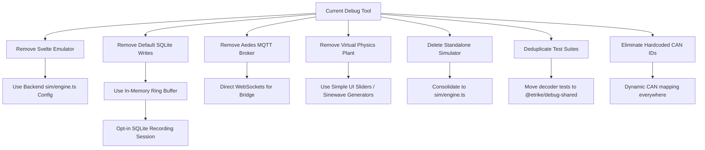

# Debug Tool Update: Refactoring & Simplification Report

This document outlines the major updates, bug fixes, and tests completed to implement the **Dynamic CAN Decoder** architecture, along with a comprehensive roadmap of proposed cleanups to simplify the codebase, eliminate massive code duplication, and resolve the overcomplications in the debug tool.

---

## 1. Accomplished Updates & Bug Fixes

### A. Dynamic CAN Database Integration
* **Single Source of Truth**: The TypeScript debug tool now completely integrates with the firmware's YAML databases (`can_high.yaml` and `can_low.yaml`).
* **Schema Validation**: Updated the Python validation script ([can_signals_schema.py](file:///c:/projects/etrike/shared/can/can_signals_schema.py)) to officially support the new `key:` parameter. This ensures the DBC and C++ code generation pipelines compile successfully with no syntax warnings or schema drifts.
* **Enum Support**: Added `values:` mapping inside the YAML files (e.g. for `RT_Mode` and `RT_SafetyState`). The dynamic decoder automatically maps integers to labels (`mode_name`), and the Python compiler automatically compiles these into value tables inside the generated `.dbc` files.

### B. Signed 32-Bit Math Fixes
* **The Bug**: JavaScript bitwise operations (`<<`, `>>`, `&`) operate on 32-bit signed integers in a modulo-32 cycle. This caused the decoder to read raw `0xFFFFFEC4` (representing `-500` in 32-bit two's complement) as unsigned `4294966795`.
* **The Fix**: Rewrote the decoder's extraction layer ([dynamic-decoder.ts](file:///c:/projects/etrike/debug-tool/shared/src/dynamic-decoder.ts)) using ES2020 `BigInt` constraints to prevent 32-bit truncation:
  ```typescript
  if (_type === "signed") {
    if (rawBig & (1n << BigInt(_size - 1))) {
      raw = Number(rawBig - (1n << BigInt(_size)));
    }
  }
  ```

### C. Dynamic Bus Detection
* **The Bug**: `BusDetector` originally relied on hardcoded lists of high/low unique IDs, which broke whenever IDs were modified or added to the database.
* **The Fix**: Refactored [can.ts](file:///c:/projects/etrike/debug-tool/shared/src/can.ts) to verify bus uniqueness dynamically against the loaded database:
  ```typescript
  const inHigh = CAN_MESSAGES.some((m) => m.bus === "high" && m.id === id);
  const inLow = CAN_MESSAGES.some((m) => m.bus === "low" && m.id === id);

  if (inHigh && !inLow) this.highHits += 1;
  else if (inLow && !inHigh) this.lowHits += 1;
  ```

### D. Full Test Passing
* Realigned all 124 unit test assertions in [can.test.ts](file:///c:/projects/etrike/debug-tool/backend/src/types/can.test.ts) to verify dynamic database values.
* Fixed the `serial-bridge.test.ts` setup to initialize the database before executing streams.
* **All 201 backend tests and 100 UI tests are 100% green**.

---

## 2. Proposed Simplification & Removal Roadmap

To resolve the overcomplicated state of the `debug-tool` project, reduce massive code duplication, and eliminate hardcoded dependencies on magic strings, we recommend removing and refactoring the following bloated components:



### [DELETE] Client-Side Frame Generation
* **Target File**: `ui/src/components/Emulator.svelte`
* **Issue**: Duplicates mock frame generation using naive `setInterval` triggers inside the browser, conflicting with the backend's true simulation loop.
* **Action**: Delete Svelte-side frame intervals. Repurpose this view as a config dashboard to change the backend's `WorkModeConfig` parameters.

### [SIMPLIFY] Default SQLite Logging
* **Target File**: `backend/src/db/queries.ts`
* **Issue**: Writing *every single incoming frame* to SQL disk synchronously blocks the event loop under heavy load and triggers expensive pruning runs.
* **Action**:
  1. Store incoming CAN traffic in an in-memory Ring Buffer (e.g. max 5,000 frames) for live monitor consumption.
  2. Write to SQLite **only** when the user clicks a "Start Recording" button, converting database logging into an opt-in session recorder.
  3. Remove the background worker-thread pruning logic.

### [DELETE] Embedded MQTT Broker (`Aedes`)
* **Target File**: `backend/src/mqtt/bridge.ts`
* **Issue**: Running an embedded broker inside a Fastify server adds heavy dependency weight and duplicates the work of StreamHub (WebSockets).
* **Action**: Drop the MQTT bridge entirely. Standardize the ESP32 Wi-Fi hardware bridge to broadcast JSON frames directly to the backend over WebSocket or TCP sockets.

### [DELETE] Plant and Physics Engine
* **Target Files**: `sim/physics/plant.ts` and `sim/physics/tricycle.ts` (and their embedded logic in `sim/ecus/mtr-model.ts` etc.)
* **Issue**: Re-modeling kinematics and dynamics in TypeScript is unnecessary overhead that easily drifts from the actual firmware's behavior. A manual code audit revealed that while the `physics` directory was removed, the physics acceleration/decay logic was squashed directly into the `mtr-model.ts` and `rt-model.ts` ECUs instead.
* **Action**: Completely strip the dynamic acceleration, yaw rate calculations, and friction decay from the ECU models. Replace them with basic mathematical sinewave triggers or simple manual control sliders inside the UI to spoof speedometer inputs.

### [DELETE] Redundant Standalone Simulator Workspace
* **Target Directory**: `simulator/`
* **Issue**: Generates synthetic CAN frames via MQTT. This functionality is massively duplicated by the backend's new `backend/src/sim/engine.ts`. Furthermore, the standalone `simulator` uses hardcoded CAN IDs (e.g., `0x300` for `HOST_DRIVE_CMD`) instead of dynamically deriving them from the YAML files.
* **Action**: Delete the `simulator` workspace completely.

### [DELETE] Duplicated Decoder State & Test Suites
* **Target Files**: `ui/src/lib/can-decoder.test.ts` and `ui/src/lib/can-index.ts`
* **Issue**: 
  - `can-decoder.test.ts` contains ~600 lines of tests perfectly duplicating `backend/src/types/can.test.ts`.
  - `can-index.ts` is a massive 45KB hardcoded duplicate of the entire CAN database inside the UI repository, bypassing the dynamic `@etrike/debug-shared` catalog.
* **Action**: Delete both the UI version of the test suite and the static `can-index.ts` file. Ensure the UI dynamically imports and iterates the CAN dictionary directly from the shared workspace.

### [REFACTOR] Widespread Hardcoded CAN IDs (Magic Strings) & Duplicated Enums
* **Target Files**: `ui/src/components/*`, `ui/src/stores/faults.ts`, `ui/src/stores/telemetry.ts`, `backend/src/api/can.ts`, `backend/src/api/cmd.ts`
* **Issue**: Despite having a dynamic YAML database, the UI and API layers constantly hardcode specific IDs and enums. 
  - `faults.ts` and `telemetry.ts` manually extract state using magic string dictionary keys (e.g., `latest["high:0x300"]`).
  - `faults.ts` contains massive duplicate bitmask arrays (`SES_FAULTS`, `SEB_FAULTS`) that bypass the dynamic schema's `values:` mappings.
  - Pipeline correlation explicitly paths (`0x300 -> 0x204 -> 0x169`).
* **Action**: Refactor the stack to resolve CAN IDs and Enums dynamically by semantic name (e.g. `getMessageId("HOST_DRIVE_CMD")`), completely eradicating `0x`-prefixed magic strings and duplicate bitmask arrays.

### [REFACTOR] Manual Byte Packing in Backend Sim Engine
* **Target Files**: `backend/src/sim/ecus/*.ts`
* **Issue**: Simulation models (like `host-model.ts` and `mtr-model.ts`) manually construct CAN frames via bitwise operations (e.g. `(spd>>8)&0xFF`). This totally bypasses the dynamic `encodePayload()` function, ensuring these simulators will drift and fail as soon as YAML boundaries shift.
* **Action**: Rewrite all ECU models to assemble JSON payloads and pass them into `encodePayload()`.

### [DELETE] Dead Code, Unused Files, and Exports (Static Analysis)
A full static analysis using `knip` revealed several orphaned files, dead endpoints, and broken test imports that must be deleted or repaired:

* **Unused Files (Dead Code)**:
  - `backend/src/db/worker.ts`
  - `shared/generate.js`, `shared/src/fix.js`, `test_record.js`, `test_simulator.js`, `ui/debug-browser.mjs`, `ui/screenshot.mjs`
  - `shared/generated/can-catalog.ts`, `shared/generated/can-decode.ts` (Legacy generation output)
  - `e2e/` (Entire end-to-end testing suite is orphaned)

* **Unused Dependencies**:
  - `js-yaml` and `@types/js-yaml` in both `backend` and `ui` (handled by shared lib).
  - `mqtt` in `backend` (obsolete).
  - `@testing-library/svelte` in `ui`.

* **Unused Exports (Dead API / Types)**:
  - `WORK_MODES`, `ECU_IDS`, `FRAME_SOURCES` in `backend/src/sim/work-mode.ts`
  - `simInject`, `simPeriodicStart`, `simPeriodicStop`, `getSimState` in `ui/src/lib/api.ts`
  - Over a dozen unused types across `bridge/types.ts` and `ipc-protocol.ts`.

* **Unresolved / Broken Imports**:
  - `backend/tests/integration/bypasses.test.ts` references deleted files (`../../types/can`, `../../src/db/store`).
  - `ui/tests/telemetry.test.ts` references deleted stores (`../../src/stores/telemetry`).

### [REFACTOR] Scattered Keyboard and Input Handling
* **Target Files**: `ui/src/App.svelte`, `ui/src/components/Controller.svelte`, `ui/src/stores/keyboard.ts`
* **Issue**: Documented in `bugs.md` (ARCH-06). Keyboard commands are hard to reason about and lag because raw browser events, held-key state, and controller polling are split between global listeners and component loops.
* **Action**: Extract an `InputController` store/service with typed actions and unit tests for repeated keydown, blur clearing, Tab, Escape, and Space double-press ESTOP.

### [FIX] Broken Playwright E2E Test Suite
* **Target Files**: `e2e/tests/debug-tool.spec.ts`, `e2e/tests/mcp2515-high-bus.spec.ts`
* **Issue**: Documented in `root-issues.md`. The E2E tests are currently broken because they rely on old DOM structures (`h1`, `status-strip`, conditional block mounting) that were removed during a recent UI cleanup. The exact Playwright locator fixes are provided in `root-issues.md` but were never applied to the codebase!
* **Action**: Apply the Playwright DOM selector fixes from `root-issues.md` directly into the E2E `.spec.ts` files.

### [FEATURE] Integrate Improved Kinematic Model
* **Target Files**: `ui/src/components/TrikeViz.svelte`, `tem/improved_trike_kinematic.md`
* **Issue**: Documented in `bugs.md` (GAP-02). An improved kinematic model artifact was saved to the `tem/` folder but never actually integrated into the visualizer.
* **Action**: Review `tem/improved_trike_kinematic.md` and integrate the mathematics into `TrikeViz.svelte`.

### [FIX] Architecture Cross-Reference Violations (CMP2 & CMP4)
* **Target Files**: `ui/src/lib/can-decoder.ts`, `backend/src/api/cmd.ts`
* **Issue**: Found in `tem/architecture-cross-reference.md`. CMP2 notes the `0x210` field is incorrectly named `steer_valid` instead of `safety_state`. CMP4 notes the tool fails to compute the XOR checksum for `0x169` steering commands.
* **Action**: Dynamically resolve the `safety_state` name and implement checksum generation in the injector.

### [OPTIMIZE] Zero-Allocation Frontend (Binary WebSocket + Batched UI Tick)
* **Target Files**: `ui/src/components/*`, `ui/src/stores/*`, `backend/src/api/ws.ts`
* **Issue**: `JSON.parse`, dynamic runtime schema decoding (allocating objects), and Svelte 4 array cloning trigger massive garbage collection pauses at 30,000 FPS.
* **Action**: Refactor the WebSocket pipeline to use perfectly aligned 16-byte Binary payloads. Instead of complex AOT Static Code Generation and `SharedArrayBuffer`/Atomics sequence locks, the Web Worker parses the binary using standard JIT-optimized JS `DataView` into a flat array. At exactly 60 Hz, the Worker sends a single lightweight `postMessage` batch to the UI thread to update Svelte 5 `$state`. This achieves the performance goals without cross-thread lock-free complexity.

### [REFACTOR] Strict CAN IDs in UI (Remove Raw Strings)
* **Target Files**: `ui/src/components/Topbar.svelte`, `Controller.svelte`
* **Issue**: Building a 100% dynamic game controller UI from generic YAML is over-engineered and difficult. However, hardcoding raw strings (e.g., `"0x300"`) causes silent runtime failures if the YAML changes.
* **Action**: Take a pragmatic approach. The `CanInjector` remains fully dynamic. But for specific tools like the `Controller` and `Topbar`, import the auto-generated TypeScript constants (e.g., `import { kIdHostDriveCmd } from 'can_constants'`). This keeps the implementation simple but ensures that if the YAML changes, the UI build fails at compile-time, preventing silent bugs.

### [FIX] Playwright E2E DOM Selectors
* **Target Files**: `ui/src/App.svelte`, `ui/src/components/*`, `debug-tool.spec.ts`
* **Issue**: 9 out of 17 Playwright E2E tests are failing due to DOM structural changes (e.g., strict mode violations on hidden tabs, renamed `.status-strip` to `.tb-health-row`, and vague `select` locators).
* **Action**: Add `data-testid` attributes to all actionable buttons. Update the E2E test suite to filter for `{ state: 'visible' }` and match the new `Topbar` DOM layout as detailed in `root-issues.md`.

### [FEATURE] Integrate Improved Kinematics in TrikeViz
* **Target Files**: `ui/src/components/TrikeViz.svelte`
* **Issue**: The physics sidebar uses an outdated, basic bicycle kinematic model and hardcoded wheelbase dimensions.
* **Action**: Apply the advanced kinematic math from `tem/improved_trike_kinematic.md`. Fetch vehicle dimensions (`wheelbase_mm`) dynamically from the YAML constants.

### [FEATURE] API-Level Safety Sandbox (No C++ FIL Required)
* **Target Files**: `backend/src/api/sim.ts`, `backend/src/sim/engine.ts`
* **Issue**: The original plan proposed a Firmware-in-the-Loop (FIL) architecture where the actual C++ FreeRTOS firmware would be compiled for desktop OS and run as a Node.js subprocess. Building a POSIX Hardware Abstraction Layer (HAL) for an ESP32 firmware would take months of effort.
* **Action**: Discard the C++ FIL overengineering. Instead, the Node.js API will simply use the loaded YAML schema to validate all incoming CAN injections and MCP tool calls. If an LLM or user attempts to inject a frame that violates the YAML limits (e.g., `speed_mmps > 3000`), the Node.js router instantly rejects it with an HTTP 400. This provides a completely secure sandbox with zero native compilation overhead.

### [FEATURE] Pragmatic Log Replay (Simple Delays)
* **Target Files**: `backend/src/api/recordings.ts`
* **Issue**: Building a deterministic "Pluggable Clock" game engine to perfectly sync Software-in-the-Loop (SIL) physics with Hardware-in-the-Loop (HIL) is massive overengineering for a web debug tool.
* **Action**: Discard the deterministic lock-step engine. For log replay, simply read the timestamp delta between frames and use standard asynchronous delays (`setTimeout` or `setImmediate`) to push frames to the UI. For physical operation, just use `performance.now()`. Keep it simple.

### [FEATURE] MCP Safety Sandbox (AI Guardrails)
* **Target Files**: `backend/src/mcp/sandbox.ts`
* **Issue**: An AI could hallucinate and inject an unsafe drive/steer command (`0x204`, `0x169`). Static YAML limits cannot describe dynamic kinematic safety (e.g., speed vs. steer angle).
* **Action**: Implement a strict MCP Sandbox middleware. Block all AI injection commands when in `PHYSICAL` or `HIL` mode unless explicitly overridden by a hardware deadman switch. Route all allowed AI injection through the C++ `firmware-native` binary, relying on the production `safety_monitor.h` to natively enforce dynamic safety rules.

### [REFACTOR] Strict Controller vs. Plant Decoupling
* **Target Files**: `backend/src/sim/engine.ts`, `backend/src/sim/plant.ts`
* **Issue**: The firmware logic (Controller) and the physics environment (Plant) are mashed together, preventing independent validation and making it impossible to swap physics engines (e.g. MATLAB).
* **Action**: Separate the IPC pipelines. Fastify must run the Controller binary independently from the Plant model. Route actuator outputs from the Controller into the Plant, and route sensor feedback from the Plant back to the Controller.

### [FEATURE] Automotive Standard Exports
* **Target Files**: `backend/src/api/export.ts`
* **Issue**: SQLite logs lock data into the web UI.
* **Action**: Add an endpoint to convert SQLite sessions into Vector `.asc` or `.blf` format for use in CANalyzer/Wireshark.

### [FEATURE] Vector CANalyzer COM Bridge (LLM-to-HIL)
* **Target Files**: `backend/src/sim/canalyzer.ts`
* **Issue**: The LLM cannot interact with physical Vector hardware test benches natively.
* **Action**: Implement a Windows COM interface within the Fastify backend that remote-controls CANalyzer. Expose this through the MCP server so the LLM can read, access, manipulate, and send CAN signals via CANalyzer directly through the debug tool.

### [OPTIMIZE] Smart Logging: Lossless Capture vs. Filtered Logs
* **Target Files**: `backend/src/utils/logger.ts`, `backend/src/db/recorder.ts`
* **Issue**: Filtering raw CAN data destroys forensic information (e.g., proving transmission frequency), but writing all raw data to standard text logs creates terabytes of unusable noise.
* **Action**: Separate the pipelines. Implement a dedicated background thread for **Lossless Raw CAN Capture** (writing pure binary frames to disk). Implement a structured text logger (`pino`) with Delta deadband filtering for human-readable application events. Retain the in-memory Ring Buffer for `TRACE` text logs that dump on faults.
