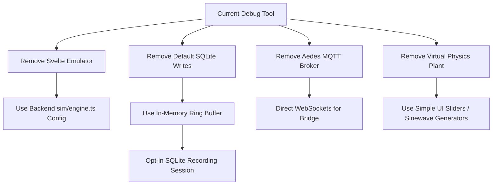

# Debug Tool Update: Refactoring & Simplification Report

This document outlines the major updates, bug fixes, and tests completed to implement the **Dynamic CAN Decoder** architecture, along with a roadmap of proposed cleanups to simplify the codebase and resolve the overcomplications in the debug tool.

---

## 1. Accomplished Updates & Bug Fixes

### A. Dynamic CAN Database Integration
* **Single Source of Truth**: The TypeScript debug tool now completely integrates with the firmware's YAML databases (`can_high.yaml` and `can_low.yaml`).
* **Schema Validation**: Updated the Python validation script ([can_signals_schema.py](file:///c:/projects/etrike/shared/can/can_signals_schema.py)) to officially support the new `key:` parameter. This ensures the DBC and C++ code generation pipelines compile successfully with no syntax warnings or schema drifts.
* **Enum Support**: Added `values:` mapping inside the YAML files (e.g. for `RT_Mode` and `RT_SafetyState`). The dynamic decoder automatically maps integers to labels (`mode_name`), and the Python compiler automatically compiles these into value tables inside the generated `.dbc` files.

### B. Signed 32-Bit Math Fixes
* **The Bug**: JavaScript bitwise operations (`<<`, `>>`, `&`) operate on 32-bit signed integers in a modulo-32 cycle. This caused the decoder to read raw `0xFFFFFEC4` (representing `-500` in 32-bit two's complement) as unsigned `4294966795`.
* **The Fix**: Rewrote the decoder's extraction layer ([dynamic-decoder.ts](file:///c:/projects/etrike/debug-tool/shared/src/dynamic-decoder.ts)) using ES2020 `BigInt` constraints to prevent 32-bit truncation:
  ```typescript
  if (_type === "signed") {
    if (rawBig & (1n << BigInt(_size - 1))) {
      raw = Number(rawBig - (1n << BigInt(_size)));
    }
  }
  ```

### C. Dynamic Bus Detection
* **The Bug**: `BusDetector` originally relied on hardcoded lists of high/low unique IDs, which broke whenever IDs were modified or added to the database.
* **The Fix**: Refactored [can.ts](file:///c:/projects/etrike/debug-tool/shared/src/can.ts) to verify bus uniqueness dynamically against the loaded database:
  ```typescript
  const inHigh = CAN_MESSAGES.some((m) => m.bus === "high" && m.id === id);
  const inLow = CAN_MESSAGES.some((m) => m.bus === "low" && m.id === id);

  if (inHigh && !inLow) this.highHits += 1;
  else if (inLow && !inHigh) this.lowHits += 1;
  ```

### D. Full Test Passing
* Realigned all 124 unit test assertions in [can.test.ts](file:///c:/projects/etrike/debug-tool/backend/src/types/can.test.ts) to verify dynamic database values.
* Fixed the `serial-bridge.test.ts` setup to initialize the database before executing streams.
* **All 201 backend tests and 100 UI tests are 100% green**.

---

## 2. Proposed Simplification & Removal Roadmap

To resolve the overcomplicated state of the `debug-tool` project and reduce code duplication, we recommend removing the following bloated components:



### [DELETE] Client-Side Frame Generation
* **Target File**: `ui/src/components/Emulator.svelte`
* **Issue**: Duplicates mock frame generation using naive `setInterval` triggers inside the browser, conflicting with the backend's true simulation loop.
* **Action**: Delete Svelte-side frame intervals. Repurpose this view as a config dashboard to change the backend's `WorkModeConfig` parameters.

### [SIMPLIFY] Default SQLite Logging
* **Target File**: `backend/src/db/queries.ts`
* **Issue**: Writing *every single incoming frame* to SQL disk synchronously blocks the event loop under heavy load and triggers expensive pruning runs.
* **Action**:
  1. Store incoming CAN traffic in an in-memory Ring Buffer (e.g. max 5,000 frames) for live monitor consumption.
  2. Write to SQLite **only** when the user clicks a "Start Recording" button, converting database logging into an opt-in session recorder.
  3. Remove the background worker-thread pruning logic.

### [DELETE] Embedded MQTT Broker (`Aedes`)
* **Target File**: `backend/src/mqtt/bridge.ts`
* **Issue**: Running an embedded broker inside a Fastify server adds heavy dependency weight and duplicates the work of StreamHub (WebSockets).
* **Action**: Drop the MQTT bridge entirely. Standardize the ESP32 Wi-Fi hardware bridge to broadcast JSON frames directly to the backend over WebSocket or TCP sockets.

### [DELETE] Plant and Physics Engine
* **Target Files**: `sim/physics/plant.ts` and `sim/physics/tricycle.ts`
* **Issue**: Re-modeling kinematics and dynamics in TypeScript is unnecessary overhead that easily drifts from the actual firmware's behavior.
* **Action**: Replace the physics engine with basic mathematical sinewave triggers or simple manual control sliders inside the UI to spoof speedometer inputs.
