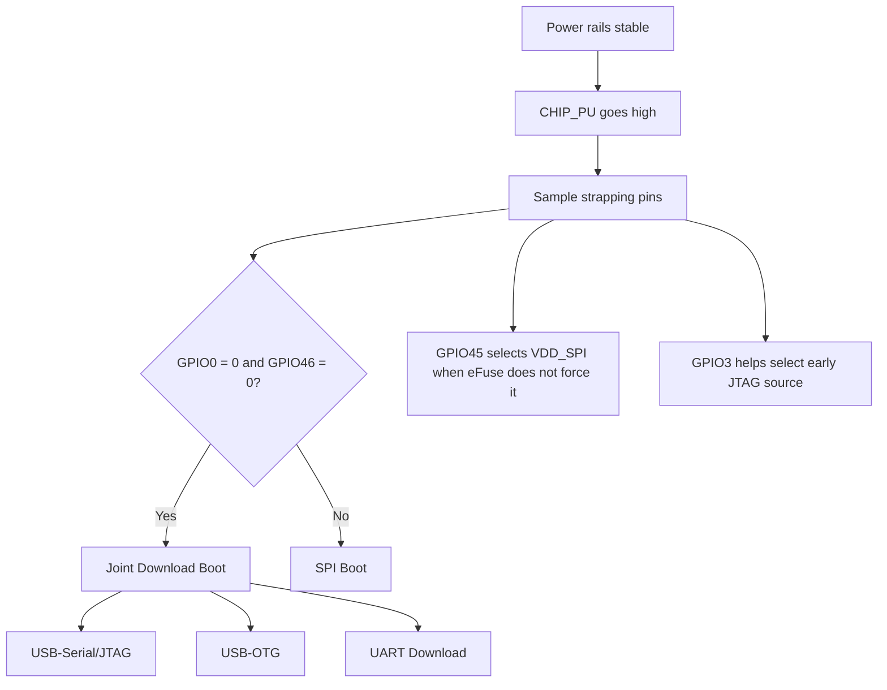
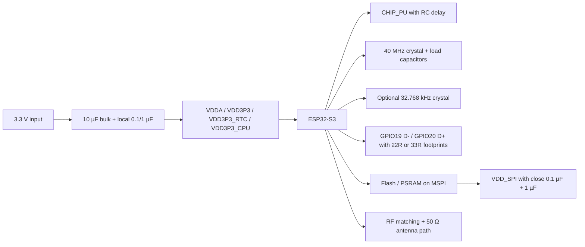

# ESP32-S3 Microcontroller Family Technical Report

## Executive summary

The ESP32-S3 family is Espressif’s Xtensa LX7-based Wi‑Fi 4 and Bluetooth LE SoC line aimed at AIoT, HMI, camera/LCD, USB and low-power edge applications. In practical terms, it combines a dual-core 240 MHz MCU, 45 physical GPIOs, a flexible GPIO matrix, native full-speed USB OTG plus fixed-function USB Serial/JTAG, up to 512 KB on-chip SRAM, 384 KB ROM, 16 KB RTC SRAM, optional in-package flash and/or PSRAM on some variants, and two ULP coprocessors (RISC‑V and FSM). The family is unusually capable, but it is also unusually easy to misuse: strapping pins are not “free” during reset, GPIO19/20 are not ordinary pins if you rely on native USB, memory-SPI pins should normally be treated as reserved, ADC2 has a documented digital-controller erratum, and high-speed flash/PSRAM settings can become temperature-sensitive. citeturn17search1turn24view6turn12view0turn39view0turn28view0

For hardware teams, the most important design rules are straightforward. Use a solid power rail capable of at least 500 mA if you run from a single 3.3 V source, keep the 40 MHz crystal implementation conservative and within Espressif’s layout guidance, reserve GPIO26–GPIO32 for flash/PSRAM and also reserve GPIO33–GPIO37 whenever octal memory is present, keep GPIO0/GPIO3/GPIO45/GPIO46 free of conflicting circuitry during reset, and treat GPIO19/20 as USB pins unless you explicitly choose otherwise. For software teams, prefer ADC1 over ADC2 for new designs, do not assume USB Serial/JTAG survives sleep or pin reconfiguration, verify PSRAM/flash mode combinations against the actual hardware, and assume that “works on a dev board” current measurements are not module-level current measurements. citeturn41view0turn13view6turn12view2turn12view0turn40view0turn26view2turn19search1

One subtle but important point is that the ESP32-S3 is not simply a faster ESP32 or a Bluetooth-enabled ESP32-S2. It changes the safe-pin map, the debug/upload workflow, the USB story, low-power behaviour, and the practical memory strategy. Porting is usually easy at application level, but board-level assumptions from ESP32 or ESP32-S2 should be re-validated rather than copied. Where Espressif’s primary sources leave something unstated, this report marks it as unspecified rather than guessing. citeturn10view2turn26view2turn18view0turn43search2turn43search4

## Family overview and variant matrix

The ESP32-S3 family includes bare chips with external flash, chips with embedded quad flash, chips with embedded quad PSRAM, and chips with embedded octal PSRAM. The key architectural constants across the family are the dual-core Xtensa LX7 CPU up to 240 MHz, Wi‑Fi 802.11 b/g/n, Bluetooth 5 LE, vector instructions for AI/signal-processing assistance, 45 GPIOs, 512 KB SRAM, 384 KB ROM, 16 KB RTC SRAM, and the ULP subsystem. The main differences between variants are embedded-memory combinations and the implications those combinations have for usable pins and VDD_SPI voltage. citeturn17search1turn24view6turn41view0turn13view5

The following summary condenses Espressif’s comparison table and hardware-design guidance. Package-specific availability and ordering suffixes vary; where the reviewed sources do not spell out a detail, it is marked unspecified. citeturn7view0turn13view5

| Variant family | Embedded flash | Embedded PSRAM | Memory bus notes | Practical implication |
|---|---:|---:|---|---|
| ESP32-S3 | None | None | External flash required; external PSRAM optional | Maximum layout flexibility, but full MSPI design burden |
| ESP32-S3R2 / RH2 | None | 2 MB quad | In-package quad PSRAM | External flash still required |
| ESP32-S3R8 | None | 8 MB octal | In-package octal PSRAM | GPIO33–GPIO37 become PSRAM-related and should be treated as reserved |
| ESP32-S3R8V / R16V | None | 8 MB / 16 MB octal | In-package octal PSRAM at 1.8 V VDD_SPI | GPIO33–GPIO37 and SPICLK_P/N are in the 1.8 V memory domain |
| ESP32-S3FN8 | 8 MB quad | None | In-package quad flash | No embedded PSRAM |
| ESP32-S3FH4R2 | 4 MB quad | 2 MB quad | In-package quad flash + quad PSRAM | Compact SiP-style option |

Sources for the table above and associated memory-domain notes: citeturn7view0turn13view5turn12view2

A core practical distinction inside the family is whether octal memory is present. Espressif’s GPIO guidance explicitly warns that GPIO26–GPIO32 are normally used for SPI flash/PSRAM, and that on boards using ESP32-S3R8 or ESP32-S3R8V, GPIO33–GPIO37 are also not recommended for other uses because they are connected to SPIIO4–SPIIO7 and SPIDQS. Hardware-design guidance adds that SPICLK_N, SPICLK_P and GPIO33–GPIO37 share the same power domain, so with octal 1.8 V flash/PSRAM those pins also sit in the 1.8 V domain. This is one of the most consequential family-level differences for board design. citeturn12view0turn12view2

## Pinout, pin-mux rules and boot configuration

Espressif’s package pin layout for the QFN56 device is shown in the datasheet. The dot marks pin 1 near the LNA input corner. The diagram below restates the complete physical pinout in package-pin order so it can be used without cross-reading the figure. citeturn10view0

### Physical package pinout

| Package edge | Pins | Names |
|---|---|---|
| Left | 1–14 | 1 LNA_IN, 2 VDD3P3, 3 VDD3P3, 4 CHIP_PU, 5 GPIO0, 6 GPIO1, 7 GPIO2, 8 GPIO3, 9 GPIO4, 10 GPIO5, 11 GPIO6, 12 GPIO7, 13 GPIO8, 14 GPIO9 |
| Bottom | 15–28 | 15 GPIO10, 16 GPIO11, 17 GPIO12, 18 GPIO13, 19 GPIO14, 20 VDD3P3_RTC, 21 XTAL_32K_P, 22 XTAL_32K_N, 23 GPIO17, 24 GPIO18, 25 GPIO19, 26 GPIO20, 27 GPIO21, 28 SPICS1 |
| Right | 29–42 | 29 VDD_SPI, 30 SPIHD, 31 SPIWP, 32 SPICS0, 33 SPICLK, 34 SPIQ, 35 SPID, 36 SPICLK_N, 37 SPICLK_P, 38 GPIO33, 39 GPIO34, 40 GPIO35, 41 GPIO36, 42 GPIO37 |
| Top | 43–56 | 43 GPIO38, 44 MTCK, 45 MTDO, 46 VDD3P3_CPU, 47 MTDI, 48 MTMS, 49 U0TXD, 50 U0RXD, 51 GPIO45, 52 GPIO46, 53 XTAL_N, 54 XTAL_P, 55 VDDA, 56 VDDA |
| Exposed pad | 57 | GND |

Source: datasheet pin-layout figure and power-pin table. citeturn10view0turn9view2

### Logical GPIO capabilities and the safe-pin map

The ESP32-S3 exposes 45 physical GPIOs: GPIO0–GPIO21 and GPIO26–GPIO48. Through IO MUX, RTC IO MUX and the GPIO matrix, peripheral inputs can be taken from any GPIO and peripheral outputs can be routed to any GPIO, but that freedom is constrained by four categories of exceptions: strapping pins, USB pins, JTAG/UART0 pins, and flash/PSRAM pins. citeturn12view0turn9view0turn9view1

The practical logical map is as follows. GPIO0 is an RTC GPIO and a strapping pin. GPIO1–GPIO10 are RTC GPIOs and ADC1_CH0…ADC1_CH9. GPIO11–GPIO20 are RTC GPIOs and ADC2_CH0…ADC2_CH9, with GPIO19/GPIO20 additionally used by USB Serial/JTAG by default. GPIO21 is RTC_GPIO21. GPIO26–GPIO32 are usually used for SPI0/1 flash and PSRAM. GPIO33–GPIO37 are ordinary pins only on non-octal-memory configurations in theory, but in practice are often best treated conservatively; they are definitely not general-purpose on ESP32-S3R8 / R8V devices. GPIO39–GPIO42 are the JTAG pins by default; GPIO43/GPIO44 are UART0 TX/RX by default; GPIO45 and GPIO46 are strapping pins. citeturn12view0turn9view0turn10view2

For pin assignment, Espressif defines a priority model. Priority 1 means fixed pins directly connected via IO MUX or RTC IO MUX. Priority 2 means GPIO-matrix-routed pins that are freely usable. Priority 3 means GPIOs usable with caution because they may conflict with strapping, USB Serial/JTAG, JTAG or UART0. Priority 4 means flash/PSRAM pins, either occupied by in-package memory or recommended for off-package memory; these should generally be avoided for application I/O. USB Serial/JTAG is fixed-only: if it has no priority-2/3/4 pins in the assignment table, it means it can only live on its priority-1 pins. citeturn9view0turn9view1

For SPI in particular, note the speed caveat: if any signal of an SPI host is routed through the GPIO matrix, all signals are routed through it; at 40 MHz or lower the behaviour is effectively the same as IO_MUX routing, but for higher frequencies the dedicated IO_MUX path is the safer choice. Espressif lists the direct SPI2 IO_MUX pins as CS0 on GPIO10, SCLK on GPIO12, MISO on GPIO13, MOSI on GPIO11, QUADWP on GPIO14, and QUADHD on GPIO9. citeturn12view1

### Strapping pins and boot modes

The ESP32-S3 uses GPIO0, GPIO3, GPIO45 and GPIO46 as strapping pins. Their default internal reset-time states are weak pull-up on GPIO0, floating on GPIO3, weak pull-down on GPIO45, and weak pull-down on GPIO46. Strap values are sampled after CHIP_PU goes high and held by latches until shutdown. Espressif specifies a strap hold time of 3 ms after CHIP_PU is already high. citeturn10view2turn30view0

The boot-mode decision is simple at high level: GPIO0 and GPIO46 determine whether the chip enters SPI boot or joint download boot. The default is SPI boot. Joint download boot is entered when GPIO0 = 0 and GPIO46 = 0, and supports USB-Serial/JTAG download boot, USB-OTG download boot and UART download boot. In addition to these modes, the Technical Reference Manual documents SPI download boot as well. GPIO45 controls VDD_SPI voltage selection when eFuse is not forcing the value, and GPIO3 participates in early JTAG signal-source selection. citeturn30view0turn30view2turn30view3

The hardware-design guidelines add two important bring-up details: place a pull-up resistor on GPIO0, and do not add a large capacitor on GPIO0 or the chip may enter download mode unexpectedly. Espressif also recommends that the CHIP_PU line not be left floating and that a typical RC delay of 10 kΩ and 1 µF be used on CHIP_PU so that the 3.3 V rails stabilise before enable is asserted. citeturn12view2turn13view3

### Full pin-function summary by logical GPIO

The table below condenses the logical-I/O view that is most useful during schematic capture and firmware pin planning. It intentionally focuses on the functions that affect design decisions rather than every alternate peripheral signal in the matrix. citeturn12view0turn9view0turn9view1

| GPIOs | Principal documented special functions | Design note |
|---|---|---|
| GPIO0 | RTC_GPIO0, strapping | Keep boot-safe; default weak pull-up |
| GPIO1–GPIO10 | RTC_GPIO1–10, ADC1_CH0–9 | Best analogue bank for new designs |
| GPIO11–GPIO20 | RTC_GPIO11–20, ADC2_CH0–9 | GPIO19/20 are USB Serial/JTAG by default; ADC2 has errata/limitations |
| GPIO21 | RTC_GPIO21 | General RTC-capable pin |
| GPIO26–GPIO32 | SPI0/1 memory-related | Normally reserve for flash/PSRAM |
| GPIO33–GPIO37 | May be memory-related on octal configs | Treat as reserved on R8/R8V; use cautiously elsewhere |
| GPIO38 | General GPIO | Usually safe |
| GPIO39–GPIO42 | JTAG defaults | Can be repurposed, but watch debug needs |
| GPIO43/GPIO44 | UART0 TX/RX defaults | Often used for boot logs / serial console |
| GPIO45 | Strapping for VDD_SPI selection | Keep boot-safe; community reports board-level surprises on some modules |
| GPIO46 | Strapping | Keep boot-safe |
| GPIO47/GPIO48 | General GPIO | Usually safe |

The ESP-IDF GPIO driver also provides `gpio_dump_io_configuration()`, which is a useful sanity check during bring-up because it will show whether a pin is reserved by flash/PSRAM and whether a peripheral signal is coming through the GPIO matrix. Espressif explicitly warns not to rely on hardware-reset defaults alone, because the bootloader or early startup code may already have changed the configuration before `app_main()`. citeturn22view1

## Electrical characteristics, clocks and power

### Voltage, current and I/O electrical limits

Espressif gives an absolute maximum of –0.3 V to 3.6 V on input power pins, and a cumulative I/O output-current absolute maximum of 1500 mA for the device. Recommended operating voltage is 3.0 V to 3.6 V for VDDA, VDD3P3, VDD3P3_RTC and VDD3P3_CPU; VDD_SPI as an input can be 1.8 V, 3.3 V or up to 3.6 V depending on the configuration. For single-supply designs Espressif recommends a source capable of 500 mA or more. If burning eFuses, VDD3P3_CPU should not exceed 3.3 V. citeturn41view0

At 3.3 V and 25 °C, the DC characteristics list 2 pF nominal input capacitance, VIH of at least 0.75 × VDD, VIL of at most 0.25 × VDD, input leakage up to 50 nA, nominal internal weak pull-up and pull-down resistors of 45 kΩ, and output-voltage/current test conditions corresponding to about 40 mA source current and 28 mA sink current at `PAD_DRIVER = 3`. These are characterised values under the stated test conditions, not a blanket recommendation to source or sink 40 mA from every pin continuously. Espressif’s public sources reviewed here do not give a separate “continuous per-pin recommended current” table, so that detail is unspecified. citeturn42view0

For memory power, the datasheet characterises the 3.3 V VDD_SPI feed path through an internal approximately 14 Ω path when VDD_SPI is derived from VDD3P3_RTC, and about 40 mA typical output current when VDD_SPI is provided by the internal 1.8 V flash regulator. This matters directly when selecting external 1.8 V flash/PSRAM parts. citeturn41view1turn13view0

One negative result is as important as the positive ones: the reviewed ESP32-S3 datasheet and the ESP-IDF API reference for the ESP32-S3 do not list a DAC peripheral or DAC driver. Accordingly, DAC electrical characteristics are unspecified for ESP32-S3 in the primary sources reviewed here; designs that need a true on-chip DAC should not assume parity with the original ESP32. citeturn22view0turn22view2

### ADC performance and analogue caveats

The ADC section is explicit about its test conditions: measurements are taken with an external 100 nF capacitor connected to the ADC input, with DC signals, 25 °C ambient, and Wi‑Fi disabled. Under those conditions the datasheet gives DNL of –4 to +4 LSB, INL of –8 to +8 LSB, and a sampling rate up to 100 kSPS. Calibrated total error is given as ±5 mV over 0–850 mV at ATTEN0, ±6 mV over 0–1100 mV at ATTEN1, ±10 mV over 0–1600 mV at ATTEN2, and ±50 mV over 0–2900 mV at ATTEN3. Espressif also notes that for better DNL results you should oversample and average or otherwise filter. citeturn42view0

Primary-source limitations matter here. The official errata states that the digital controller (DMA) of SAR ADC2 cannot work on ESP32-S3 revisions v0.0, v0.1 and v0.2, because the controller may receive a false sampling-enable signal and enter an inoperative state. Espressif’s workaround is to use the RTC controller to control SAR ADC2 instead. The ESP-IDF configuration reference correspondingly warns that ADC2 continuous mode is not suggested on ESP32-S3. In practice, that means ADC1 is the safer default for new continuous-sampling designs. citeturn40view0turn21search10

Community experience broadly reinforces the official picture. Developers consistently report that the ADC is adequate for general sensing if you calibrate, filter and respect the attenuation ranges, but disappointing for precision metrology compared with an external ADC. That is not an Espressif-only narrative; it is consistent with the datasheet’s fairly wide high-attenuation error bound and its insistence on local capacitance and calibration. Treat the S3 ADC as a calibrated utility ADC, not a precision instrumentation ADC. citeturn42view0turn34search3turn34search15

### Clocking and timing constraints

The ESP32-S3 clock tree offers a 40 MHz main crystal, an internal fast RC oscillator of about 17.5 MHz, an internal slow RC oscillator of about 136 kHz, an RC_FAST divided-by-256 clock, and an optional external 32.768 kHz source for RTC timing. Espressif’s hardware-design guidance states that firmware supports only a 40 MHz main crystal, and recommends ±10 ppm accuracy and crystal amplitude greater than 500 mV. For the optional 32.768 kHz crystal, the guidance calls for ESR ≤ 70 kΩ; if the RTC clock is not needed, those pins can be re-used as GPIOs. citeturn16view0turn13view6

The most important timing constants for board bring-up are the enable/reset and strap windows. The power rails should stabilise for at least 50 µs before CHIP_PU is taken high, and CHIP_PU should be held below reset threshold for at least 50 µs to guarantee reset. Strapping-pin values must remain valid for a further 3 ms hold interval after CHIP_PU goes high. These are small numbers electrically, but they are large enough that casual RC networks, slow power ramps, or externally loaded boot pins can produce intermittent boot failures. citeturn10view1turn30view0

Dynamic frequency scaling in ESP-IDF can lower APB and CPU frequency or enter automatic light-sleep, but it is not free. Espressif documents additional interrupt latency ranging from about 0.2 µs in the best case up to about 40 µs in the worst case when a switch from 40 MHz to 80 MHz is needed on interrupt entry. If you are porting timing-sensitive bit-banging or control loops, this can matter more than the nominal 240 MHz headline speed. citeturn20view3

Bluetooth LE low-power timing has a stricter clock-quality requirement than many designs expect: Espressif states that the BLE sleep clock must be within 500 ppm. Using the main XTAL as BLE low-power clock keeps that crystal on during light-sleep and raises current. Using the internal 136 kHz RC oscillator generally does not meet BLE connection accuracy requirements and is only suitable for less demanding roles such as legacy advertising or scanning. This is one of the main reasons battery BLE products often include the external 32.768 kHz source even though the SoC can run without it. citeturn20view2

### Current consumption and power modes

The datasheet’s active-mode RF current figures are peak values at 3.3 V and 25 °C. For Wi‑Fi transmit, Espressif gives 340 mA at 802.11b 1 Mbps and 21 dBm, 291 mA at 802.11g 54 Mbps and 19 dBm, 283 mA at 802.11n HT20 MCS7 and 18.5 dBm, and 286 mA at 802.11n HT40 MCS7 and 18 dBm. Wi‑Fi receive is 88 mA for 802.11b/g/n HT20 and 91 mA for HT40. Bluetooth LE receive is 93 mA, while BLE transmit peak current ranges from 335 mA at 21 dBm down to 116 mA at –15 dBm. These are the figures that matter most for regulator sizing and bulk-decoupling design. citeturn42view0

For low-power states, Espressif gives a typ light-sleep current of 240 µA with VDD_SPI and Wi‑Fi powered down and all GPIOs high-impedance. Deep-sleep is 170 µA with the ULP-FSM powered, 190 µA with the ULP-RISC‑V powered, 18 µA for the ULP sensor-monitored pattern, 8 µA with RTC memory and RTC peripherals powered, and 7 µA with RTC memory powered but RTC peripherals down. Pulling CHIP_PU low shuts the chip down to about 1 µA typ. The datasheet adds an important footnote: chips with embedded PSRAM consume more in light-sleep, with example adders of about 140 µA for 8 MB 8-line PSRAM at 3.3 V, 200 µA for 8 MB 8-line PSRAM at 1.8 V, and 40 µA for 2 MB 4-line PSRAM at 3.3 V. citeturn41view3

The current-budget table below is the most decision-useful subset of Espressif’s figures. citeturn42view0turn41view3

| Mode | Condition | Typical / peak current |
|---|---|---:|
| Wi‑Fi TX | 802.11b, 1 Mbps, 21 dBm | 340 mA peak |
| Wi‑Fi TX | 802.11g, 54 Mbps, 19 dBm | 291 mA peak |
| Wi‑Fi RX | 802.11b/g/n HT20 | 88 mA peak |
| BLE TX | 21 dBm | 335 mA peak |
| BLE RX | Receive | 93 mA peak |
| Light-sleep | No PSRAM adder included | 240 µA typ |
| Deep-sleep | RTC memory + RTC peripherals on | 8 µA typ |
| Deep-sleep | RTC memory on, RTC peripherals off | 7 µA typ |
| Deep-sleep | ULP-FSM on | 170 µA typ |
| Deep-sleep | ULP-RISC‑V on | 190 µA typ |
| Power-off | CHIP_PU low | 1 µA typ |

At system level, ESP-IDF distinguishes DFS, light-sleep and deep-sleep. One operational nuance often missed in application code is that Wi‑Fi and Bluetooth must be disabled before entering explicit light-sleep or deep-sleep, and their connections are not maintained through those modes. That is obvious in principle, but it shows up in practice as “my link vanished” bugs when teams assume sleep behaves like modem power-save. citeturn20view0turn20view4

## Peripherals, memory map and external memory rules

### Peripheral capabilities and the limits that matter

ESP32-S3 has three UART controllers. The datasheet states they support asynchronous communication up to 5 Mbps, IrDA, RS‑232/RS‑485 style operation, and share 1024 × 8-bit RAM across the TX and RX FIFOs of the three UARTs. A less obvious caveat from the UHCI/UART-DMA documentation is that UART DMA shares HCI hardware with Bluetooth, so BT HCI and UART DMA should not be used together even on different UART ports. citeturn24view2turn26view3

ESP32-S3 has two I²C controllers that can act as master or slave. The datasheet advertises standard mode, fast mode and “up to 800 kbit/s” depending on SDA/SCL pull-up strength, but the current ESP-IDF driver documentation warns that the master SCL frequency should not be larger than 400 kHz. In other words, higher rates may be possible in hardware or older flows, but 400 kHz is the conservative supported ceiling in the current primary software stack. citeturn24view3turn25view0

LEDC provides eight PWM channels and, on ESP32-S3, only the low-speed mode exists. The clock-source options relevant to practical design are 80 MHz APB, about 20 MHz RC_FAST and 40 MHz XTAL. As always with PWM, frequency and duty resolution trade off against each other; on ESP32-S3 there is no “high-speed LEDC” escape hatch like on the original ESP32. citeturn26view0

The RMT peripheral on ESP32-S3 supports transmit, receive, carrier modulation/demodulation and synchronous multi-channel transmission. Espressif’s older S3 RMT documentation states that eight channels share 384 × 32-bit internal RAM. The current errata adds one particularly important caveat: there is an RMT continuous-TX idle-state error affecting all currently listed chip revisions. If you depend on precise idle levels in continuous TX mode, check the errata and test on the exact revision you ship. citeturn23search8turn26view1turn40view1

USB is split into two different stories which many teams accidentally conflate. First, the chip has a full-speed USB OTG controller with integrated transceiver, compliant with USB 2.0 full-speed operation and supporting integrated or external PHY selection, DMA access modes, and time-division sharing with USB Serial/JTAG when the internal transceiver is used. Second, it has a separate fixed-function USB Serial/JTAG controller on GPIO19/20 which cannot be reprogrammed into arbitrary USB device classes. That fixed-function controller is exceptionally useful for bring-up, flashing and JTAG, but it is not the same as “native TinyUSB on any pins”. citeturn24view5turn26view2

The ULP subsystem has two coprocessors. The ULP-RISC‑V supports RV32IMC, 32 general-purpose registers, multiply/divide and interrupts, while the ULP-FSM is a small finite-state machine intended for low-power sensor activity. Both work with the RTC-domain resources, and the IDF ULP documentation explicitly says the ULP cores can access RTC slow memory and RTC-domain peripherals such as RTC_CNTL, RTC_IO and SARADC. For ultra-low-power polling/wake applications, this is one of the S3’s strongest differentiators. citeturn24view6turn29search7turn29search9

### Internal memory, mapping and DMA rules

The datasheet lists 384 KB ROM, 512 KB SRAM and 16 KB RTC SRAM. ESP-IDF further explains the memory model in terms of IRAM/IROM and DRAM/DROM buses rather than a single flat memory pool. Unused internal SRAM can be reassigned between IRAM and DRAM, so the maximum static DRAM available to an application is reduced by how much internal SRAM is consumed for instruction storage. This is why compile-time and runtime memory headroom move around more than newcomers expect. citeturn24view6turn18view0

External PSRAM is mapped into the memory space, but with important caveats. ESP-IDF states that ESP32-S3 can use up to 32 MB of virtual-address space for external PSRAM, and that this 32 MB address range is shared with flash instructions and read-only data. External RAM can be integrated into the memory map, added to the capability allocator, made the default `malloc()` backing store, or used for `.bss`, `.noinit` and even XiP from PSRAM in supported configurations. citeturn16view1turn17search2

DMA is the hard boundary. Espressif’s memory guide says most peripheral DMA engines require DRAM-resident, word-aligned buffers. It recommends static `DMA_ATTR` buffers, or heap allocation with `MALLOC_CAP_DMA`. It explicitly discourages DMA buffers on stacks that may live in PSRAM. This is one of the classic “it compiles, it runs, then it randomly corrupts” migration traps when C++ containers or large task stacks are moved into external RAM. citeturn18view0

### Flash and PSRAM interfacing rules

ESP32-S3 uses MSPI for main flash and PSRAM; on this target, MSPI means SPI0/1, and SPI0 and SPI1 share the same bus. The key configuration rule is that flash and PSRAM share the same internal clock. Quad flash supports STR mode only; octal flash may support STR or DTR depending on device model; quad PSRAM supports STR only; octal PSRAM supports DTR only. That shared-clock rule is why flash/PSRAM mode selection is a system decision, not two independent menu choices. citeturn28view0

Espressif’s supported-mode tables show that 120 MHz operation is possible in some combinations, but 120 MHz DDR is explicitly labelled experimental. The flash/PSRAM configuration guide warns that accesses can crash randomly if the temperature moves significantly after power-on, because PSRAM phase-point calibration depends on startup temperature. Espressif provides a temperature-based dynamic phase-adjustment option in ESP-IDF as mitigation. If you do not have a compelling bandwidth case, 80 MHz-class configurations are far less risky. citeturn28view0

External-memory voltage selection is safety-critical. Espressif’s external-RAM guide states that 1.8 V PSRAM and flash must match each other, and that for 1.8 V parts you must either strap GPIO45 high on boot or burn the eFuses so VDD_SPI is forced to 1.8 V. Failing to do so can damage the PSRAM and/or flash. This is one of the highest-stakes configuration points in the family. citeturn16view1turn30view0

The memory-bus design rules from the hardware guidelines are equally clear: validate flash/PSRAM models against Espressif support when possible, place optional 0 Ω resistor footprints in series with SPI lines, route SPI traces on inner layers where possible with surrounding ground copper and vias, and match lengths for octal-SPI traces. If flash/PSRAM are physically far from the chip, decouple both VDD_SPI and the memories locally. citeturn13view5turn14view0

## PCB design, layout and bring-up guidance

Espressif recommends a four-layer PCB as the default integration strategy: top for signals/components, layer 2 as an uninterrupted ground plane, layer 3 for power with careful isolation around RF and crystal, and bottom with minimal routing and ideally no components. A two-layer design is possible, but the guidance is visibly more defensive because you lose easy isolation and return-path control. citeturn14view0

Power routing is one of the better-documented parts of the S3 guidance. Espressif recommends wide 3.3 V traces, star-shaped power branching after the entry bulk capacitance, a 10 µF capacitor at the power entry, individual 10 µF decoupling for the RF-related VDD3P3 pins, close 0.1 µF decouplers on digital power pins, 0.1 µF + 1 µF near VDD_SPI, and at least nine ground vias from the exposed pad into the ground plane. They also caution against excessively large capacitance on VDD_SPI. citeturn14view0turn13view0

For the crystal, the guidance emphasises a clean ground environment, no vias in the crystal traces, no high-frequency routing underneath, ground stitching around the clock trace, series components near the chip side, matching capacitors placed beside the crystal rather than hard against the series parts, and a minimum 2.0 mm gap to avoid interference. If there is enough top-layer ground, a keep-out area around the crystal reduces parasitics and thermal coupling. citeturn14view0turn13view6

For RF, Espressif requires 50 Ω impedance control, a chip-side CLC matching network placed close to the chip, short outer-layer routing without vias, dense ground stitching, and physical separation between the antenna path and high-frequency/noisy subsystems such as USB, UART, crystals and switching activity. For PCB antenna and IPEX/U.FL designs alike, the ground reference quality matters as much as the nominal trace width. citeturn13view2turn14view0

For USB, Espressif recommends reserving series resistors on D+ and D−, with initial values around 22 Ω or 33 Ω, and optional footprints for shunt capacitors to ground, all placed close to the chip. This is a practical tuning recommendation, not just a schematic nicety. It is especially useful on custom boards where trace impedance and connector choice are not yet frozen. citeturn13view4

A concise “typical schematic” for first-pass custom designs is shown below. It does not replace the full Espressif checklist, but it captures the mandatory blocks and their intent. citeturn10view1turn13view3turn13view6turn13view4turn13view5

## Errata, migration notes and community-reported experience

### Official errata and their practical impact

As of Espressif’s current ESP32-S3 errata sheet, the published errata include cache write-back hit errors, RTC register read errors after light-sleep wake-up, an analogue-power damage condition, LCD unreliability for certain clock divisors, unavailable USB-OTG download on some early production lots, RMT continuous-TX idle-level errors, undefined touch raw interrupt values, and the non-working SAR ADC2 digital controller. All listed errata affect revisions v0.0, v0.1 and v0.2, with some USB-OTG impact depending on batch/date code. citeturn39view0turn40view2

The ones that most often alter design practice are these. `ADC-183`: do not depend on ADC2 DMA; prefer ADC1 or use ADC2 through the RTC controller only. `RTC-126`: powering down RTC peripherals in light-sleep can lead to bad RTC-domain reads on wake; ESP-IDF works around this, but user code should still avoid aggressive custom RTC power-down assumptions. `RMT-176`: verify continuous-TX idle levels in hardware if RMT drives protocols where the idle state matters. `USBOTG-4289`: very early chips/modules may have USB-OTG download permanently disabled by eFuse, so batch/revision awareness matters if you depend on that boot path. citeturn40view0turn40view3turn40view1turn40view2

### Migration notes from ESP32 and ESP32-S2

The safest migration advice is board-centric rather than marketing-centric. If you are moving from original ESP32 or ESP32-S2 hardware, do not carry over a “free pin” list blindly. On ESP32-S3, the effective safe-pin budget is heavily influenced by native USB, strap pins, default JTAG/UART0 use, and especially the flash/PSRAM topology. The I²S and peripheral-driver model also changed in modern ESP-IDF releases, with per-channel I²S APIs designed to expose capabilities present on ESP32-S3 and ESP32-C3 that are not the same on ESP32 and ESP32-S2. citeturn12view0turn9view0turn43search2turn43search4

From an application-architecture standpoint, S3 migrations often need these checks: first, if you relied on an external USB-UART bridge and “ordinary” UART0 behaviour, decide whether to switch to USB Serial/JTAG or keep a bridge. Second, re-budget memory with PSRAM-awareness and DMA-safe internal buffers. Third, re-measure any timing-sensitive code under DFS/light-sleep. Fourth, revisit analogue assumptions, particularly if earlier boards used ESP32-family DAC features or ADC2 patterns that are not equivalent on S3. Primary sources do not provide a single chip-to-chip migration note covering every ESP32/ESP32-S2 hardware difference, so any unmentioned difference here should be treated as unspecified rather than assumed absent. citeturn26view2turn18view0turn20view3turn40view0turn22view0turn22view2

### Community experience, recurring pitfalls and workarounds

Community reports align strongly with Espressif’s official cautions about USB Serial/JTAG and sleep. GitHub issues report that native USB CDC/USB Serial-JTAG output can stop after light-sleep and may not recover until a hard reset, and Espressif’s own USB Serial/JTAG guide explains why: light-sleep gates the APB/USB-PHY clocks and deep-sleep powers the block off entirely, so the host may see disconnects or failed re-enumeration. The official mitigation for automatic sleep is `CONFIG_USJ_NO_AUTO_LS_ON_CONNECTION`; manually entered sleep may require unplug/replug. citeturn36view0turn26view2

A related trap is false diagnosis of RTC-memory loss when debugging deep-sleep through USB Serial/JTAG. Espressif issue reports show that `idf.py monitor` can reset the chip when the USB-serial device reappears, making persistent RTC-slow-memory data look lost when the real culprit is a `USB_UART_CHIP_RESET` on reconnect. If you are validating deep-sleep retention, separate “monitor behaviour” from “silicon retention behaviour”. citeturn36view3

Strapping pins also generate more real-world trouble than the datasheet alone might suggest. Community issue reports describe board-level surprises involving GPIO45 pull behaviour, and the Espressif hardware guidelines already advise guarding GPIO0 carefully and avoiding large capacitors there. The sensible design pattern is to keep all strapping pins out of low-impedance external networks until after boot, or to ensure the external circuit enforces only the intended strap state. citeturn36view1turn12view2turn10view2

Another recurring issue is confusion about “available” flash/PSRAM-related pins. Espressif’s own docs say GPIO26–GPIO32 are usually used for SPI flash/PSRAM, and GPIO33–GPIO37 are also not recommended on octal-memory devices. Community forum threads show why this matters: engineers read “not recommended” as “probably okay” and then discover those pins either do not behave as expected or become fragile once the full runtime stack is involved. The conservative rule is simple: if a pin is memory-related in Espressif documentation, spend it only when you have exhausted safer alternatives and tested the exact hardware/IDF combination. citeturn12view0turn37view3

A further community observation concerns early serial output and host attachment timing. Stack Overflow threads show that users often need an initial delay or `while(!Serial)` behaviour in Arduino-style environments on ESP32-S3 to see the first logs over native USB. This is not a silicon erratum in itself; it is a workflow symptom of native USB enumeration timing, and it disappears if you design your boot logs with host attach time in mind instead of assuming UART-like immediacy. citeturn36view5

### What to avoid

Avoid the following design choices unless you have a specific, tested reason to do otherwise. citeturn12view0turn9view0turn40view0turn26view2turn16view1turn28view0

- Using GPIO26–GPIO32 for application I/O, and using GPIO33–GPIO37 on octal-memory variants, as if they were ordinary spare pins. citeturn12view0
- Loading GPIO0, GPIO3, GPIO45 or GPIO46 with circuits that can override their required reset-time strap levels. citeturn10view2turn12view2
- Treating GPIO19/GPIO20 as free GPIOs when your flashing/debug workflow depends on USB Serial/JTAG. citeturn12view0turn26view2
- Designing 1.8 V flash/PSRAM hardware without verifying VDD_SPI strap/eFuse configuration. Espressif explicitly warns this can damage the memory devices. citeturn16view1
- Building new continuous-sampling code around ADC2 DMA. The errata says not to. citeturn40view0
- Assuming 120 MHz flash/PSRAM modes are production-safe just because they benchmark well on the bench. Espressif marks 120 MHz DDR experimental and temperature-sensitive. citeturn28view0
- Measuring sleep current on a dev board and treating the result as module current without board-circuit isolation. citeturn19search1

### Recommended best practices

The most robust ESP32-S3 designs tend to converge on the same playbook. citeturn14view0turn13view6turn12view2turn42view0turn18view0turn26view2

- Reserve a genuinely safe GPIO subset early in the schematic, and keep USB, straps, JTAG, UART0 and memory pins documented in the project pin budget. citeturn12view0turn9view0
- Use a four-layer PCB with an uninterrupted ground plane, disciplined crystal placement, and RF/memory routing that follows Espressif’s stack-up guidance rather than generic MCU habits. citeturn14view0turn13view2
- Bias CHIP_PU properly, pull GPIO0 up, and keep reset/strap traces short and quiet. citeturn13view3turn12view2
- Prefer ADC1, add the recommended local analogue capacitor, calibrate, and average. Use an external ADC for precision work. citeturn42view0turn40view0
- Keep DMA buffers in internal DRAM with explicit DMA-capable allocation. citeturn18view0
- Decide very early whether the product’s primary console/debug path is UART, USB Serial/JTAG, or USB OTG class firmware, because this choice changes both pin use and sleep/debug behaviour. citeturn26view2turn24view5
- Treat flash/PSRAM configuration as a board-level contract between silicon variant, memory devices, VDD_SPI voltage, eFuses, and ESP-IDF configuration. citeturn16view1turn28view0turn13view5

### Key references

The most important primary sources for ESP32-S3 hardware work are these. citeturn2view0turn2view1turn12view2turn39view0turn12view0turn16view1turn16view2turn20view0

- **ESP32-S3 Series Datasheet**: primary electrical, pin, feature and current-consumption data. citeturn2view0
- **ESP32-S3 Technical Reference Manual**: detailed register-level peripheral and memory behaviour. citeturn2view1
- **ESP Hardware Design Guidelines for ESP32-S3**: schematic checklist and PCB-layout rules. citeturn12view2turn14view0
- **ESP32-S3 Series SoC Errata**: must-read before locking hardware/software assumptions. citeturn39view0
- **ESP-IDF ESP32-S3 target documentation** for GPIO, sleep modes, external RAM, flash/PSRAM configuration, USB Serial/JTAG, LEDC, I²C, RMT, ULP and memory types. citeturn12view0turn20view0turn16view1turn16view2turn26view2turn26view0turn25view0turn26view1turn18view0

Useful community references for real-world failure modes and workflow traps include the Espressif GitHub trackers, the Espressif forum, Stack Overflow and selected Arduino-core issues. These should inform testing and bring-up, but not override Espressif’s primary documentation. citeturn36view0turn36view1turn36view2turn36view3turn36view4turn36view5turn37view3