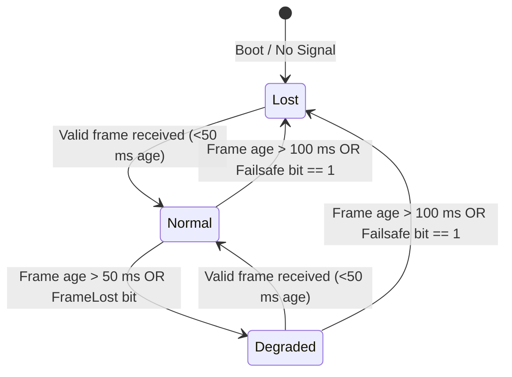
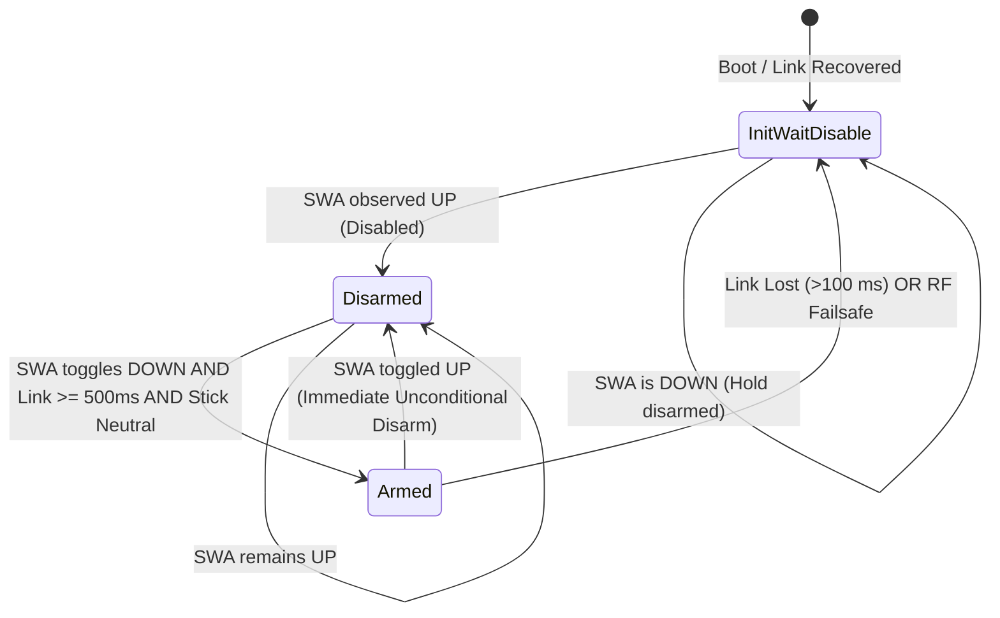
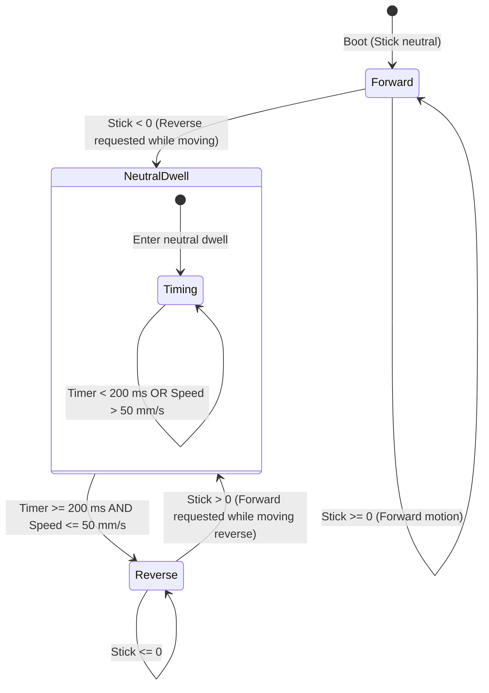

# RM-ESP32-T12D — Technical Architecture & Specification

Modern **C++17** FreeRTOS application for the E-Trike **Receiver Module Gateway** interfacing with the **RadioLink T12D** transmitter and **RadioLink R16F V1.0** receiver over single-wire **SBUS**.

Adheres to **NHTSA, SAE, FHWA, ISO 2575, UN Regulation 121, and ISO 13850** automotive HMI, ergonomics, and machinery safety standards.

---

## 1. System Role & Architectural Boundaries

In the E-Trike distributed network, `rm-esp32-t12d` acts strictly as an **Operator Input Gateway & Telemetry Publisher**:
- **Semantic Requests, Not Direct Actuator Commands**: The RM gateway publishes operator intent (e.g. `RC_STEER_REQ`, `RC_VELOCITY_REQ`, `RC_DRIVE_ENABLE_REQ`, `RC_PARK_REQ`, `RC_DRIVE_ENVELOPE_REQ`, `RC_AUTO_REQ`, `RC_LINK_STATE`).
- **Vehicle Safety Arbitration**: Full safety arbitrations (traction torque envelopes, dynamic steering slew limiting, hardwired interlocks, mechanical brake line hydraulic management) reside in `sys-esp32` (System Safety Arbiter) and `rt-esp32` (Real-Time Traction & Dynamics Controller).
- **ISO 13850 Separation**: Radio switches **cannot** reset physical emergency stops. Resetting an emergency stop device must not restart the machine without an explicit reset procedure. Radio link loss triggers a controlled safe stop, leaving hydraulic brake hold latched until a verified operator re-arm sequence is completed.

---

## 2. End-to-End System Topology

```
┌─────────────────────────────────────────────────────────────────────────────────────────────┐
│                             OPERATOR CONTROLS (RadioLink T12D)                             │
│  Right Gimbal (Steer/Vel)  │  SWA (Drive Enable)  │  SWB (Park/Hold)  │  SWC (Speed Env)    │
└─────────────────────────────────────────────┬───────────────────────────────────────────────┘
                                              │ 2.4 GHz FHSS V2.1 (12 Channels)
                                              ▼
┌─────────────────────────────────────────────────────────────────────────────────────────────┐
│                               RECEIVER (RadioLink R16F V1.0)                                │
│                   Physical CH16 configured for Inverted SBUS Serial Output                  │
└─────────────────────────────────────────────┬───────────────────────────────────────────────┘
                                              │ CH16 SBUS (100 kbps, 8E2, Inverted)
                                              ▼
┌─────────────────────────────────────────────────────────────────────────────────────────────┐
│                            GATEWAY FIRMWARE (rm-esp32-t12d)                                 │
│                                                                                             │
│  [task_rc_capture] (Core 1, 50 Hz)                                                          │
│    ├── Inverted UART1 Driver (GPIO 16 RX)                                                   │
│    ├── SbusParser: 16-channel bit extraction (11 bits/ch, 0x0F header, flags)               │
│    └── Cluster Plausibility Filter: Rejects single-frame glitch deviations                  │
│                                                                                             │
│  [LinkState Evaluator]                                                                      │
│    ├── 0..50 ms:  Normal (Normal driving allowed)                                          │
│    ├── 50..100 ms: Degraded (Hold safe commands, log warning)                               │
│    └── >100 ms:    Lost (Disarm drive, command 0 mm/s stop, hold park)                      │
│                                                                                             │
│  [ArmingTracker]                                                                            │
│    └── Edge-qualified FSM: Link >= 500 ms + SWA UP seen + Stick Neutral + UP -> DOWN       │
│                                                                                             │
│  [ReversalTracker]                                                                          │
│    └── Enforces speed_safe (<= 50 mm/s) AND neutral dwell (>= 200 ms) before reverse torque │
│                                                                                             │
│  [task_can_tx] (Core 0, 50 Hz)                                                              │
│    ├── Low CAN TWAI Driver (GPIO 5 TX, GPIO 4 RX @ 500 kbps)                              │
│    ├── 0x169 VCU_SES_REQ  (Deterministic Steer Rack Angle +/-45.0 deg)                     │
│    ├── 0x204 RT_DRIVE_CMD (Signed Speed mm/s + Drive State + Reversal Guard)                │
│    ├── 0x7B9 VCU_SEB_REQ  (Semantic Park/Hold Brake Stroke 15.0 mm)                         │
│    └── 0x110 SYS_MODE_CMD (Manual / Autonomous Request Transition)                          │
│                                                                                             │
│  [task_can_ctrl] (Core 0, 50 Hz)                                                            │
│    └── Listens to 0x001 (SAFETY_ESTOP) & 0x203 (Actual Vehicle Speed Feedback)              │
│                                                                                             │
│  [Dual-Rate Logger]                                                                         │
│    └── Change-driven immediate logs + 2 Hz decimated CAN telemetry monitor                  │
└─────────────────────────────────────────────┬───────────────────────────────────────────────┘
                                              │ Low CAN Bus (500 kbit/s, Classic CAN 2.0A)
                                              ▼
                ┌─────────────────────────────┴─────────────────────────────┐
                │                                                           │
                ▼                                                           ▼
┌───────────────────────────────┐                           ┌───────────────────────────────┐
│           SYS-ESP32           │                           │           RT-ESP32            │
│ (System & Safety Supervisor)  │                           │ (Real-Time Dynamics & Drive)  │
│  - Multi-source arbitration   │                           │  - Torque & speed closed-loop │
│  - Mode state machine         │                           │  - Steer rate limit & slew    │
│  - Contactors & hardwired trip│                           │  - Electro-hydraulic SEB cal  │
└───────────────────────────────┘                           └───────────────────────────────┘
```

---

## 3. Core Software Modules & State Machines

### 3.1 SBUS Protocol Parser (`sbus_parser.h`)
- **Format**: 25-byte frame received every $14\dots 20\text{ ms}$ at 100,000 baud, 8 data bits, even parity, 2 stop bits (`8E2`), active-low inverted logic.
- **Header & Footer**: Byte 0 is `0x0F`, Byte 24 is `0x00` (or `0x04` telemetry).
- **Bit Unpacking**: 16 channels packed into 22 bytes ($16 \times 11\text{ bits} = 176\text{ bits}$).
- **Microsecond Mapping**:
  $$\text{Pulse } (\mu\text{s}) = 988 + \frac{\text{raw} - 172}{1811 - 172} \times (2012 - 988)$$
  Center position: $992 \approx 1500\,\mu\text{s}$.
- **Hardware Failsafe Bits**: Byte 23 bits indicate Frame Lost (`0x04`) and Receiver Failsafe (`0x08`).

---

### 3.2 Graduated RF Link Loss State Machine

RC links degrade before total loss. The gateway implements a 3-tier graduated link supervisor:



- **Normal ($0\dots 50\text{ ms}$)**: Channel values decoded normally; driving setpoints updated.
- **Degraded ($50\dots 100\text{ ms}$)**: Intermediate warning. Holds previous valid commands; flags status over serial.
- **Lost ($>100\text{ ms}$)**: Hard failsafe. Instantly clamps velocity setpoint to $0\text{ mm/s}$, transitions `ArmState` to `Disarmed`, requests park brake engagement, and flags `RC_LINK_STATE = Lost`.

---

### 3.3 Edge-Qualified Arming State Machine (`ArmingTracker`)

Prevents accidental machine startup upon power-on or radio link reconnection (ISO 13850 compliance):



**Arming Prerequisites**:
1. RF link continuously healthy for $\ge 500\text{ ms}$.
2. SWA previously observed in the `UP` (Disabled) position.
3. Throttle stick verified in spring-centered neutral ($|y| \le 0.04$).
4. Operator deliberately executes the `UP -> DOWN` transition.

---

### 3.4 Strict Direction Reversal State Machine (`ReversalTracker`)

Reversing direction while rolling forward creates severe gearbox shock and traction loss. Reversal requires:
$$\text{measured\_vehicle\_speed} \le 50\text{ mm/s} \quad \mathbf{AND} \quad \text{neutral\_dwell\_timer} \ge 200\text{ ms}$$



If the operator snaps the stick from forward to reverse while moving:
1. Commanded speed is clamped to $0\text{ mm/s}$ (regenerative braking).
2. Reverse drive remains locked until vehicle speed drops below $50\text{ mm/s}$ **AND** neutral dwell is held for $\ge 200\text{ ms}$.

---

### 3.5 Asymmetric Authority Switch (`SWD`)

- **Manual Request (UP)**: Instantaneous, non-blocking preemption. Operator always retains immediate physical authority over automated navigation.
- **Autonomous Request (DOWN)**: Conditional transition. Requires vehicle stationary ($|\text{speed}| < 50\text{ mm/s}$), stick centered, and SYS consent.

---

## 4. Tasks & FreeRTOS Threading Model

| Task Name | Priority | Core | Period | Execution Time | Purpose |
| :--- | :---: | :---: | :---: | :---: | :--- |
| `task_rc_capture` | 8 | Core 1 | $20\text{ ms}$ (50 Hz) | $< 1.5\text{ ms}$ | Reads UART1 FIFO, feeds `SbusParser`, filters clusters, checks RF timeout |
| `task_can_tx` | 4 | Core 0 | $20\text{ ms}$ (50 Hz) | $< 1.0\text{ ms}$ | Evaluates arming & reversal FSMs, encodes & transmits CAN command cluster |
| `task_can_ctrl` | 2 | Core 0 | $20\text{ ms}$ (50 Hz) | $< 0.8\text{ ms}$ | Receives CAN speed feedback (`0x203`), external ESTOP (`0x001`), recovers TWAI |
| `task_heartbeat` | 1 | Core 1 | $100\text{ ms}$ (10 Hz) | $< 0.5\text{ ms}$ | Decimated serial logger (2 Hz) and health monitor |

---

## 5. CAN Frame Encoding Specification

| CAN ID | Name | Period | Signal Layout |
| :--- | :--- | :---: | :--- |
| `0x169` | `VCU_SES_REQ` | 20 ms | `d[0..1]`: Steer angle raw ($29550\dots 30450$ for $\pm 45.0^\circ$, neutral $= 30000$)<br>`d[2]`: Enable flag (`0x01` if Armed) |
| `0x204` | `RT_DRIVE_CMD` | 20 ms | `d[0..1]`: Velocity setpoint int16 ($-1000\dots +3000\text{ mm/s}$)<br>`d[2]`: Mode flags (`0x01`=Armed, `0x02`=Park, `0x04`=Reverse)<br>`d[3]`: Envelope tier (`0`=Precision, `1`=Normal, `2`=Fast) |
| `0x7B9` | `VCU_SEB_REQ` | 20 ms | `d[0..1]`: Brake stroke setpoint uint16 ($0\dots 1620$, Park $= 900 \implies 15.0\text{ mm}$)<br>`d[2]`: Park hold active flag |
| `0x110` | `SYS_MODE_CMD` | 20 ms | `d[0]`: Operator Mode Request (`0`=Manual, `1`=Auto Request) |

---

## 6. Verification & Automated Test Suite

A standalone native C++17 unit test suite (`test/test_rm_t12d_suite.cpp`) runs on the host system without hardware dependencies.

### Running the Suite:
```powershell
C:\TDM-GCC-64\bin\g++.exe -std=c++17 -Wall -Wextra -Irm-esp32-t12d/src rm-esp32-t12d/test/test_rm_t12d_suite.cpp -o rm-esp32-t12d/test/test_rm_t12d_suite.exe
rm-esp32-t12d/test/test_rm_t12d_suite.exe
```

### Coverage:
1. **Bit Unpacking**: Verifies 16-channel 11-bit decoding and flag extraction.
2. **Graduated Link Loss**: Tests transition through `Normal` $\to$ `Degraded` $\to$ `Lost`.
3. **Plausibility & Glitch Rejection**: Validates rejection of out-of-range cluster samples.
4. **Deterministic Steering**: Tests exact $\pm 45.0^\circ$ rack angle scaling and deadband.
5. **Speed Envelopes**: Confirms Precision ($750\text{ mm/s}$), Normal ($1800\text{ mm/s}$), and Fast ($3000\text{ mm/s}$) limits.
6. **Strict Direction Reversal**: Validates `speed_safe && dwell_complete` AND-logic.
7. **Edge-Qualified Arming**: Verifies boot disarm, link qualification, and UP $\to$ DOWN edge detection.
8. **Semantic Park/Hold**: Validates $15.0\text{ mm}$ SEB caliper command and zero-torque interlock.
9. **CAN Codecs**: Validates byte-level serialization for all transmitted frames.
