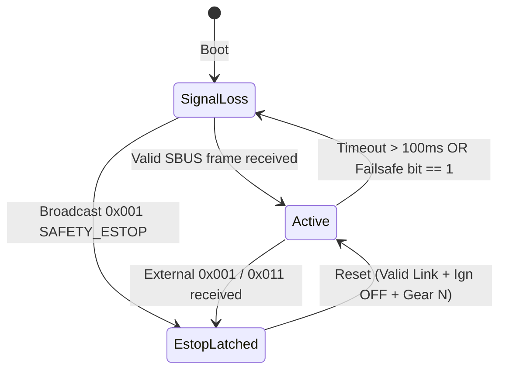

# RM-ESP32-T12D — Technical Architecture & Specification

Modern **C++17** FreeRTOS application for the E-Trike **Receiver Module Gateway** interfacing with the **RadioLink T12D** transmitter and **RadioLink R16F V1.0** receiver over **SBUS**.

---

## 1. System Topology & Data Flow

RM acts as the standalone test-bench master and primary operator bypass controller:

```
RadioLink T12D (FHSS V2.1)
           │
           │ 2.4 GHz RF
           ▼
RadioLink R16F Receiver
           │
           │ CH16 SBUS (100 kbps, 8E2, Inverted)
           ▼
ESP32 UART1 RX (GPIO 16)
           │
  [sbus_parser] ── Unpacks 16 channels, failsafe & frame-loss flags
           │
  [rc_decoder]  ── Maps to vehicle steering, brake, speed setpoints
           │
  [can_driver]  ── Transmits 50 Hz CAN 2.0A frames on Low-CAN
           │
           ├──► 0x169 VCU_SES_REQ  (Steering angle +/- 45 deg)
           ├──► 0x7B9 VCU_SEB_REQ  (Brake stroke 0..27 mm)
           ├──► 0x204 RT_DRIVE_CMD (Speed mm/s + Gear)
           ├──► 0x110 SYS_MODE_CMD (Emulated Mode)
           ├──► 0x113 SYS_PWR_CMD  (Emulated Power)
           └──► 0x001 SAFETY_ESTOP (Signal loss / Failsafe)
```

---

## 2. SBUS Protocol Implementation

### 2.1 Frame Structure (25 Bytes)
- **Byte 0**: Header `0x0F`
- **Bytes 1–22**: 16 channels, each 11 bits ($16 \times 11 = 176\text{ bits} = 22\text{ bytes}$)
  - Range per channel: $172\dots 1811$ ($1000\dots 2000\,\mu\text{s}$ pulse equivalent, center $992 \approx 1500\,\mu\text{s}$)
- **Byte 23**: Flags byte:
  - Bit 0: Channel 17 (Digital)
  - Bit 1: Channel 18 (Digital)
  - Bit 2: Frame lost flag (`0x04`)
  - Bit 3: Failsafe active flag (`0x08`)
- **Byte 24**: Footer `0x00` (or `0x04` telemetry indicator)

### 2.2 Microsecond Equivalent Conversion
Linear transfer mapping between 11-bit count and microsecond pulse width:
$$\text{Pulse } (\mu\text{s}) = 988 + \frac{\text{raw} - 172}{1811 - 172} \times (2012 - 988)$$

---

## 3. Tasks & Threading Model

| Task Name | Priority | Core | Period | Purpose |
| :--- | :---: | :---: | :---: | :--- |
| `rc_capture` | 8 | Core 1 | 20 ms (50 Hz) | Reads UART1 FIFO, feeds `SbusParser`, updates `RcSnapshot` |
| `can_tx` | 4 | Core 0 | 20 ms (50 Hz) | Encodes and sends CAN commands (SES, SEB, MTR, SYS) |
| `can_ctrl` | 2 | Core 0 | 20 ms (50 Hz) | Processes incoming CAN frames, tracks external ESTOP, TWAI bus-off recovery |
| `heartbeat` | 1 | Core 1 | 100 ms (10 Hz) | Diagnostic telemetry logging & CAN health monitoring |

---

## 4. Safety State Machine


