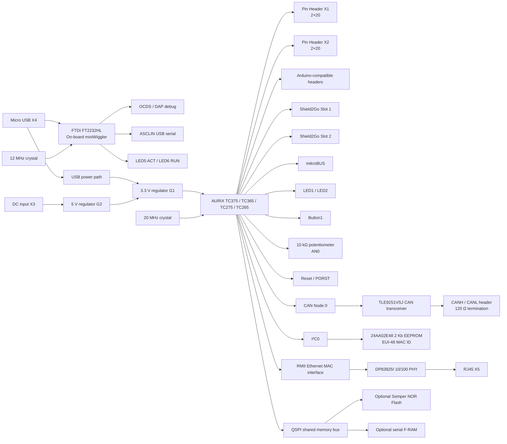
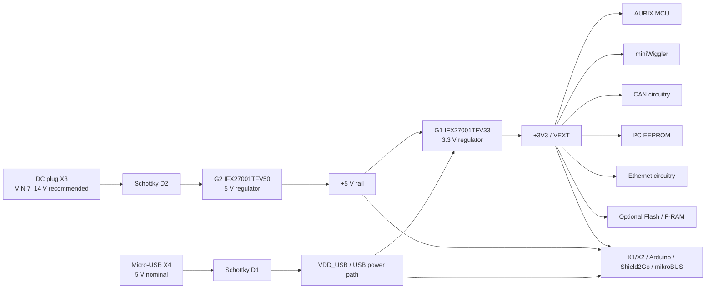
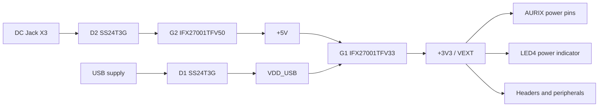
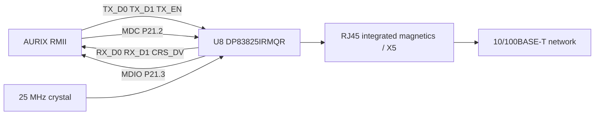

# AURIX™ lite Kit V2 — Board User’s Manual

**Microcontroller Evaluation Board for the AURIX™ Family**  
**Document revision:** 2.2  
**Manual revision date:** 14 April 2022  
**Published by:** Infineon Technologies AG, 81726 Munich, Germany  
**Source board family:** AURIX™ lite Kit V2  
**Supported MCU variants described by this manual:** TC375, TC365, TC275, TC265

> This Markdown document is a complete structured transcription/reconstruction of the supplied board manual. Text, tables, connector mappings, and schematic information have been converted into Markdown. Graphical figures are represented as structured Markdown descriptions, tables, and Mermaid diagrams rather than embedded raster images.

---

## Legal Disclaimer

The information given in this document shall in no event be regarded as a guarantee of conditions or characteristics. With respect to examples or hints, typical values, and information regarding the application of the device, Infineon Technologies disclaims warranties and liabilities, including without limitation warranties of non-infringement of intellectual-property rights of third parties.

For further information on technology, delivery terms and conditions, and prices, contact the nearest Infineon Technologies office.

### Warnings

Due to technical requirements, components may contain dangerous substances. Contact Infineon for information on the types concerned.

Infineon components may be used in life-support devices or systems only with express written approval when a component failure could reasonably cause failure of the life-support device/system or affect its safety or effectiveness. Life-support devices or systems are devices intended to be implanted in the human body or to support, maintain, sustain, or protect human life.

---

# Revision History

| Revision | Date | Major changes |
|---|---|---|
| V2.0 | October 2020 | Initial released version. |
| V2.1 | September 2021 | Corrected version; page 13 adds SO8-150 as the specific package; page 18 Figure 7 order on X301 corrected (mirrored); page 26 Figure 14 adds footnote about incorrect P11.6 printing. |
| V2.2 | April 2022 | Corrected version; page 12 adds description of `CAN_STB`. |

## Trademarks

Infineon trademarks referenced by the original manual include AURIX™, C166™, CanPAK™, CIPOS™, CIPURSE™, EconoPACK™, CoolMOS™, CoolSET™, CORECONTROL™, CROSSAVE™, DAVE™, EasyPIM™, EconoBRIDGE™, EconoDUAL™, EconoPIM™, EiceDRIVER™, eupec™, FCOS™, HITFET™, HybridPACK™, I²RF™, ISOFACE™, IsoPACK™, MIPAQ™, ModSTACK™, my-d™, NovalithIC™, OptiMOS™, ORIGA™, PRIMARION™, PrimePACK™, PrimeSTACK™, PRO-SIL™, PROFET™, RASIC™, ReverSave™, SatRIC™, SIEGET™, SINDRION™, SIPMOS™, SmartLEWIS™, SOLID FLASH™, TEMPFET™, thinQ!™, TRENCHSTOP™, and TriCore™.

Other trademarks mentioned by the original manual include ADS, AMBA, ARM, MULTI-ICE, KEIL, PRIMECELL, REALVIEW, THUMB, µVision, AUTOSAR, Bluetooth, CAT-iq, COLOSSUS, FirstGPS, EMV, EPCOS, FLEXGO, FlexRay, HYPERTERMINAL, IEC, IrDA, ISO, MATLAB, MAXIM, MICROTEC, NUCLEUS, Mifare, MIPI, MIPS, muRata, MICROWAVE OFFICE, OmniVision, Openwave, RED HAT, RFMD, SIRIUS, SOLARIS, SPANSION, Symbian, TAIYO YUDEN, TEAKLITE, TEKTRONIX, TOKO, UNIX, VERILOG, PALLADIUM, VLYNQ, VXWORKS, WIND RIVER, and ZETEX. EtherCAT® is a registered trademark and patented technology licensed by Beckhoff Automation GmbH, Germany.

---

# Table of Contents

1. [Introduction](#1-introduction)
   1. [Block Diagram](#11-block-diagram)
2. [Hardware Description](#2-hardware-description)
   1. [Power Supply](#21-power-supply)
   2. [User Push Buttons, User LEDs and Potentiometer](#22-user-push-buttons-user-leds-and-potentiometer)
   3. [Debugging and On-Board miniWiggler](#23-debugging-and-on-board-miniwiggler)
      1. [USB Connector](#231-usb-connector)
      2. [Serial Connection to PC](#232-serial-connection-to-pc)
      3. [miniWiggler JDS](#233-miniwiggler-jds)
   4. [Reset](#24-reset)
   5. [CAN Transceiver](#25-can-transceiver)
   6. [I²C EEPROM](#26-ic-eeprom)
   7. [Ethernet](#27-ethernet)
   8. [Optional Cypress Semper Secure Flash](#28-optional-cypress-semper-secure-flash)
   9. [Optional F-RAM](#29-optional-f-ram)
3. [Configuration](#3-configuration)
   1. [Boot Mode](#31-boot-mode)
   2. [Configuration Signals](#32-configuration-signals)
   3. [Optional Resistors](#33-optional-resistors)
4. [Connector Pin Assignment](#4-connector-pin-assignment)
   1. [X1 and X2](#41-pinout-of-x1-and-x2)
   2. [Shield2Go and mikroBUS](#42-shield2go-and-mikrobus-pinout)
   3. [Arduino-Compatible Connector](#43-arduino-compatible-connector)
   4. [Infineon DAP Debug Connector](#44-infineon-dap-debug-connector-10-pin)
5. [Schematics and Placement](#5-schematics-and-placement)

---

# List of Figures

| Figure | Description |
|---:|---|
| 1 | Block Diagram of the AURIX™ lite Kit V2 |
| 2 | AURIX™ lite Kit Board V2 — Top View |
| 3 | AURIX™ lite Kit Board V2 — Bottom View |
| 4 | Power Supply Concept |
| 5 | Signal mapping of pin headers X1 and X2 |
| 6 | Signal mapping of Shield2Go 1, Shield2Go 2, and mikroBUS |
| 7 | Mapping of Arduino functions to AURIX™ pin functions |
| 8 | Schematic — Project Overview |
| 9 | Schematic — On-Board miniWiggler |
| 10 | Schematic — Power and Connectors |
| 11 | Schematic — CPU and Configuration |
| 12 | Schematic — Ethernet and Memory Expansion |
| 13 | Placement — Top View |
| 14 | Placement — Bottom View |

# List of Tables

| Table | Description |
|---:|---|
| 1 | Overview of Board Specification |
| 2 | AURIX™ Pin Mapping for User LEDs |
| 3 | miniWiggler Pin Mapping for User LEDs |
| 4 | AURIX™ Push Buttons and Potentiometer |
| 5 | CAN Signals and AURIX™ Pin Mapping |
| 6 | User Startup Modes |
| 7 | Configuration Signals |
| 8 | Signal Mapping of Optional Resistors |
| 9 | Pin Assignment of the DAP Debug Connector |

---

# 1. Introduction

The AURIX™ lite Kit V2 is an evaluation board for Infineon 32-bit single-chip AURIX™ TriCore™ microcontrollers. The board family supports the TC375, TC365, TC275, and TC265 variants.

The board can be used with development tools such as:

- **AURIX™ Development Studio** — Infineon’s Eclipse-based IDE, including a C compiler, multicore debugger, and Infineon low-level driver (iLLD), with no time or code-size limitation for application development.
- **FreeEntryToolchain** from HighTec/PLS/Infineon — an Eclipse-based C/C++ development environment including a source-level UDE debugger from PLS and based on Infineon iLLD.

## Table 1 — Overview of the Board Specification

| Category | Specification |
|---|---|
| CPU / supported order numbers | `SAK-TC375TP-96F300W AA`; `SAK-TC365DP-64F300W AA`; `SAK-TC275TP-64F200W DC`; `SAK-TC265D-40F200W BC` |
| Board dimensions | 66.0 × 131.0 mm |
| Power | On-board miniWiggler Micro-AB USB interface; external power 5 V…40 V, with 7 V…14 V recommended for the DC input path |
| Expansion | Most AURIX™ pins available on X1 and X2 |
| Shield ecosystem | Two Infineon Shield2Go connectors |
| Arduino compatibility | Arduino-compatible connector set, **3.3 V logic** |
| mikroBUS™ | One mikroBUS™ connector |
| PC interface | Micro-USB |
| Debug | On-board miniWiggler and 10-pin DAP connector |
| CAN | Dedicated CAN connector; TLE9251VSJ transceiver |
| Ethernet | RJ45; TI DP83825I 10/100 Mb/s Ethernet PHY |
| User I/O | One user push-button, three user LEDs, reset push-button, 10 kΩ potentiometer |

> The board is not cost- or size-optimized and is not intended to serve as a reference design.

---

## 1.1 Block Diagram

The original Figure 1 shows the main board components and their interconnections. The following Mermaid diagram reconstructs the functional blocks in Markdown.



### Functional-block details

- **Core MCU:** AURIX™ TC3X5 / TC2X5 device.
- **Debug/USB:** FTDI FT2232HL, MPSSE channel A for OCDS/DAP, MPSSE channel B / serial support, 12 MHz FTDI crystal, dedicated configuration EEPROM.
- **Main MCU clock:** external 20 MHz crystal.
- **CAN:** CAN0 Node 0 routed to TLE9251VSJ high-speed transceiver and a two-pin CAN header.
- **Ethernet:** AURIX Ethernet MAC uses RMII to the DP83825I PHY and RJ45 connector.
- **EEPROM:** Microchip 24AA02E48 over I²C0, with EUI-48 node address.
- **Expansion:** X1/X2, Arduino, two Shield2Go sockets, mikroBUS.
- **Optional nonvolatile memory:** Semper secure/non-secure NOR flash and serial F-RAM on a shared QSPI bus.

---

# 2. Hardware Description

The AURIX™ lite Kit V2 exposes the MCU, power architecture, communication interfaces, user controls, and expansion headers directly on the board.

## Figure 2 — Board Top View, reconstructed as a component map

| Board area | Components / labels visible in the original figure |
|---|---|
| Left side, top | Infineon Shield2Go Slot 1 |
| Left side, center | mikroBUS™ connector |
| Left side, bottom | Infineon Shield2Go Slot 2 |
| Upper-middle left | I²C EEPROM |
| Upper-middle | 20 MHz crystal for AURIX™ |
| Center | Infineon AURIX™ TC3X5/TC2X5 32-bit TriCore/DualCore MCU |
| Upper edge | Pin connector X2 |
| Upper-right | Arduino digital connector |
| Right upper | LED2 green `P00.6`, LED1 green `P00.5`, both low-active |
| Right edge | Button 1 `P00.7`, Reset button, 10-pin DAP connector |
| Right center | miniWiggler activity/run LEDs |
| Right-lower | Potentiometer 10 kΩ, optional/series resistor around AN0 path |
| Lower-right | Micro-USB connector X4; on-board miniWiggler; 5 V regulator; 3.3 V regulator; power LED; DC input X3 |
| Lower-center | Arduino power and analog headers; pin connector X1 |
| Lower-left | Ethernet RJ45 X5; TLE9251VSJ CAN transceiver and CAN connector |
| Lower-right vicinity | LED3 for ESR0, low-active |

## Figure 3 — Board Bottom View, reconstructed as a component map

The bottom side exposes the silkscreen pin tables and the footprints for optional memories.

- X2 is along one long edge.
- X1 is along the opposite long edge.
- The board silkscreen prints the X1/X2 signal matrix directly on the PCB.
- The optional **Semper secure/non-secure flash** footprint is on the bottom side.
- The optional **F-RAM** footprint is also on the bottom side.
- Shield2Go and mikroBUS pin names are printed on the board.

---

## 2.1 Power Supply

The board must be powered from an external source. Normal choices are:

- **DC plug X3:** recommended input **+7 V to +14 V**.
- **Micro-USB X4:** nominal **+5 V**.

The green **Power LED4** indicates that the generated **3.3 V** rail is present.

### DC plug mechanical/polarity information

- Female DC supply plug outer diameter: **5.5 mm**.
- Inner diameter: **2.1 mm or 2.5 mm**.
- Inner contact: **positive**.
- Outer contact: **ground**.

### USB and DC source selection behavior

USB power passes through Schottky diode D1, so the board sees roughly **4.5 V** rather than the full nominal 5 V.

- If X3 is **above +7 V**, the board is powered from X3.
- If X3 is **below +5.5 V**, the board is powered from X4.
- If X3 is between **+5.5 V and +7 V**, X3 and X4 can both contribute.

### Critical power warnings

If the board is already powered by USB and/or the DC plug, do **not** apply another supply directly to `VEXT`, `+5V`, `+3V3`, or `VDD_USB` on X1, X2, X302, Shield2Go, or mikroBUS. These rails do not have reverse-current protection suitable for arbitrary multiple-source operation.

The power pins may be used as outputs to power external circuitry, but the external load must remain within source capability.

- Typical USB 2.0 host current: up to **500 mA**.
- Typical USB 3.0 host current: up to **900 mA**.
- USB 3.0 is recommended for best available USB power capability.
- For higher current, use a suitably rated external USB power supply rather than overloading a PC host.

The board uses:

- **G1 — IFX27001TFV33:** 5 V → 3.3 V LDO.
- **G2 — IFX27001TFV50:** VIN → 5 V LDO.

Both LDOs have a maximum output current rating of **1 A**, so the board’s relevant supply path is limited accordingly.

> Do not back-drive the regulator outputs. Do not connect multiple independent sources to the same power pins. Incorrect power-source combinations can damage the board, LDOs, host PC, or external source.

### Alternate supply methods

With X4 disconnected from any PC or source, the manual allows:

1. Apply **+5 V** to the `+5V` pin of Arduino power connector X302.
2. Apply **+5 V** to a `VDD_USB` pin on X1 or X2.
3. Apply **+7 V…+14 V** to `VIN` on Arduino power connector X302.

## Figure 4 — Power Supply Concept



---

## 2.2 User Push Buttons, User LEDs and Potentiometer

The board provides:

- One user push-button.
- One reset push-button.
- Two MCU user LEDs.
- One 10 kΩ potentiometer.
- LED3 for visualizing ESR0/emergency service request.
- LED5 and LED6 for miniWiggler activity/status.

### Table 2 — AURIX™ Pin Mapping for User LEDs

| Name | AURIX™ pin | Color | Active state |
|---|---|---|---|
| LED1 | `P00.5` | Green | Low-active, pulled toward GND |
| LED2 | `P00.6` | Green | Low-active, pulled toward GND |
| LED3 | `ESR0` | Red | Low-active, pulled toward GND |

### Table 3 — miniWiggler Pin Mapping for User LEDs

| Name | miniWiggler pin | Color | Active state |
|---|---|---|---|
| LED5 | `ADBUS4 (ACTIV)` | Green | Low-active, pulled toward GND |
| LED6 | `ADBUS7 (RUN)` | Green | Low-active, pulled toward GND |

### Table 4 — Push Buttons and Potentiometer

| Item | AURIX™ pin | Active / function |
|---|---|---|
| Button1 | `P00.7` | Low-active, pulled toward GND |
| Reset | `/PORST` | Low-active, pulled toward GND |
| R32, 10 kΩ potentiometer | `AN0` | Variable analog input |

**R33 note:** desoldering R33 disconnects the potentiometer and frees `AN0` for other functions.

---

## 2.3 Debugging and On-Board miniWiggler

Two debug paths are available:

1. On-board miniWiggler through Micro-USB X4.
2. External debugger through the 10-pin DAP connector.

### 2.3.1 USB Connector

The USB connector can simultaneously provide:

- Board power.
- ASCLIN0 serial connection via USB.
- Debugging through DAS.

Before connecting the board to a PC for debugging, install a current version of Infineon DAS.

### 2.3.2 Serial Connection to PC

On first USB connection, the required driver is installed and a COM port is created.

Default serial path:

- `ASCLIN0`
- `P14.0`
- `P14.1`

For TC3X5 devices, `ASCLIN4` may instead be routed to USB by assembling **R44** and **R45**:

- R44: `P14.1 ↔ P00.12` selection path.
- R45: `P14.0 ↔ P00.9` selection path.

When ASCLIN4 is selected for USB, P14.0/P14.1 must not simultaneously be configured for the conflicting role.

### 2.3.3 miniWiggler JDS

The on-board miniWiggler is a low-cost debug interface providing DAP access.

- Debug is provided through the DAS server `UDAS`.
- **LED5 / ADBUS4** indicates a working miniWiggler/DAS connection.
- **LED6 / ADBUS7** is controlled by the DAS server according to debugger/client state.

> **Important:** if LED5 indicates the miniWiggler is in use, any external connection on the DAP connector must be absent or tri-stated.

---

## 2.4 Reset

`/PORST` is the AURIX power-on-reset pin. It is a bidirectional input/output.

- An internal **2.2 kΩ pull-up** holds `/PORST` high in normal operation.
- A low level forces a hardware reset.
- If the MCU itself generates a reset, `/PORST` can be driven low by the MCU.
- Holding `/PORST` active after a power event extends the reset until the signal is released.
- `/PORST` does not replace ESR functional reset mechanisms.

Reset can be asserted by:

- On-board **RESET** button.
- On-board miniWiggler via FT2232HL `IC1.27 / ACBUS1`.
- 10-pin DAP connector, pin 10.
- Arduino power header X302 pin 3 (`/PORST`).
- X1 pin 30 (`/PORST`).

The AURIX internal circuitry provides power-on-reset behavior; no additional external reset-generation components are required for normal power-up.

---

## 2.5 CAN Transceiver

The board provides a high-speed CAN interface using the Infineon **TLE9251V / TLE9251VSJ** transceiver.

The transceiver is intended for automotive and industrial high-speed CAN networks and is designed for the ISO 11898-2:2016 physical layer and relevant SAE J1939/J2284 applications.

The CAN bus is terminated on the board with **120 Ω** between CANH and CANL.

The transceiver is connected to **AURIX CAN node 0**.

### Standby behavior

The transceiver starts in **standby**. To enable normal CAN operation, the MCU must drive:

```text
CAN_STB = LOW
```

### Table 5 — CAN Signals and AURIX™ Pin Mapping

| Signal | CAN header pin | AURIX™ pin / function | Register / I/O line |
|---|---:|---|---|
| CANH | 1 | — | — |
| CANL | 2 | — | — |
| CAN_TX | — | `P20.8`, CAN node 0 output | `TXDCAN0` |
| CAN_RX | — | `P20.7`, CAN node 0 input | `RXDCAN0B` |
| CAN_STB | — | `P20.6`, GPIO | `P20.6 OUT` |

---

## 2.6 I²C EEPROM

The board includes a **Microchip 24AA02E48** 2 Kbit serial EEPROM with a pre-programmed **EUI-48™ node/MAC address**.

- I²C slave address: **0x50**.
- Address range `0x80–0xFF`: permanently write-protected.
- Reads from the protected range remain allowed.
- The protected upper half contains the pre-programmed EUI-48 identifier.
- The remaining 128 bytes are writable and available to the user.

The EUI-48 value can be used as the board’s Ethernet MAC address.

---

## 2.7 Ethernet

The board provides twisted-pair Ethernet through **RJ45 connector X5**.

Physical interface:

- PHY: **Texas Instruments DP83825I / DP83825IRMQR**.
- Speed: **10/100 Mb/s**.
- MCU ↔ PHY data interface: **RMII**.
- Management/configuration signals use `P21.2` and `P21.3` for MDC/MDIO.

The PHY circuitry includes a 25 MHz crystal and the analog/magnetics interface to the RJ45 connector.

---

## 2.8 Optional Cypress Semper™ Secure Flash

The board provides an unpopulated footprint for optional external NOR flash.

Supported families described by the manual:

- Cypress Semper™ NOR Flash `S25HL` family.
- Cypress Semper™ Secure NOR Flash `S35HL` family.
- Package: **SOIC-16**.

When fitting the flash, also fit:

- `C64 = 100 nF`, 0603.
- `R67 = 0 Ω`, 0603, where required by the chosen configuration.

For secure-flash interrupt support, the interrupt output may be connected to AURIX pin `P20.9`:

- `SCU_REQ7` on TC3X5.
- `SCU_REQ11` on TC2X5.

### QSPI connection

Data/clock pins:

- `P22.0`
- `P22.1`
- `P22.3`

Peripheral mapping:

- `QSPI4` on TC3X5.
- `QSPI3` on TC2X5.

Flash slave select:

- `P22.2`
- `SLSO3` of QSPI4 on TC3X5.
- `SLSO12` of QSPI3 on TC2X5.

The AURIX interface on this board supports **single SPI** for this external flash; Dual/Quad SPI is not available through the implemented board connection.

The QSPI bus is shared with the optional F-RAM.

---

## 2.9 Optional F-RAM

The board also provides a footprint for optional serial F-RAM.

Supported devices/families include:

- Cypress `FM25VN10-G`.
- Cypress `CY15B` series.
- Package: **SOIC-8 / SO8-150**.

When fitting the F-RAM, fit:

- `C65 = 100 nF`, 0603.

### QSPI connection

Shared data/clock pins:

- `P22.0`
- `P22.1`
- `P22.3`

Peripheral mapping:

- `QSPI4` on TC3X5.
- `QSPI3` on TC2X5.

F-RAM slave select:

- `P23.1`
- `SLSO6` of QSPI4 on TC3X5.
- `SLSO13` of QSPI3 on TC2X5.

The F-RAM footprint does not directly connect pin 3 `#WP` or pin 7 `#HOLD`. Check the selected device datasheet to determine whether internal weak pull-ups are sufficient. If the device requires external pull-up wiring, the manual recommends adding it by wire-wrap connection to VDD.

The QSPI bus is shared with the optional Semper flash.

---

# 3. Configuration

## 3.1 Boot Mode

### Table 6 — User Startup Modes

| `HWCFG[5:3]` | Boot type | R58 | R57 | R59 |
|---|---|---|---|---|
| `XX1` | Start-up mode selected by Boot Mode Index | X | X | NA |
| `110` | Internal start from Flash | NA | NA | A |
| `100` | Alternate Boot Mode; Generic Bootstrap Loader on fail (`P14.0/P14.1`) | A | NA | A |
| `000` | Generic Bootstrap Loader (`P14.0/P14.1`) | A | A | A |

Legend:

- `A` = resistor assembled.
- `NA` = resistor not assembled.
- `X` = don’t-care state.

The original manual indicates the default configuration by shading one row in the printed table.

---

## 3.2 Configuration Signals

### Table 7 — Configuration Signals

| MCU pin | Configuration signal | Description / board implementation |
|---|---|---|
| `P14.6` | `HWCFG0` | LDO / DCDC selection. On TC2X5, R30 (4.7 kΩ, 0603) pulls toward GND for DCDC and is populated when appropriate for the TC2X5 board variant. |
| `P14.5` | `HWCFG1` | `EVR33ON / EVR33OFF`. R31 (4.7 kΩ, 0603) pulls toward GND (`EVR33OFF`) and is initially assembled. |
| `P14.2` | `HWCFG2` | `EVRCON / EVRCOFF`. R52 (4.7 kΩ, 0603) is required if R59 is assembled and TC2X5 is used. TC3X5 provides an internal pull-up. |
| `P14.3` | `HWCFG3` | Boot configuration; see Table 6. |
| `P10.5` | `HWCFG4` | Boot configuration; see Table 6. |
| `P10.6` | `HWCFG5` | Boot configuration; see Table 6. |
| `P14.4` | `HWCFG6` | GPIO pull-up / tri-state control. R59 (4.7 kΩ, 0603) pulls to GND, putting GPIOs in tri-state after reset; R59 is not initially assembled. |

---

## 3.3 Optional Resistors

The board uses configuration/bridge resistors to enable, disable, or reroute particular signals. Removing an assembled resistor breaks the associated connection; fitting an unpopulated resistor closes it.

### Table 8 — Signal Mapping of Optional Resistors

| Resistor | Value | Factory assembled | Signal | Size | Function / comment |
|---|---:|---:|---|---|---|
| R33 | 0 Ω | Yes | AN0 | 0603 | Remove to disconnect the potentiometer and free AN0. |
| R37 | 0 Ω | Yes | XTAL2 | 0603 | Series resistor; can be used to reduce oscillator amplitude if required. |
| R39 | 0 Ω | No | +5V | 0603 | Fit to connect 5 V to mikroBUS and Shield2Go connector power. |
| R59 | 4.7 kΩ | No | HWCFG6 / P14.4 | 0603 | Fit to disable internal pull-ups at power-on. |
| R52 | 4.7 kΩ | No | HWCFG2 / P14.2 | 0603 | Used for EVR configuration; needed with TC2X5 if R59 is assembled. |
| R53 | 4.7 kΩ | No | HWCFG3 / P14.3 | 0603 | Fit to boot from BMI; only required for TC2X5 with R59 assembled. |
| R56 | 4.7 kΩ | No | HWCFG3 / P14.3 | 0603 | Selects boot according to HWCFG4/HWCFG5; valid P10.5/P10.6 strap settings are required. |
| R54 | 4.7 kΩ | No | HWCFG4 / P10.5 | 0603 | Sets HWCFG4 high; used with R56, not with R57. |
| R55 | 4.7 kΩ | No | HWCFG5 / P10.6 | 0603 | Sets HWCFG5 high; used with R56, not with R58. |
| R57 | 4.7 kΩ | No | HWCFG4 / P10.5 | 0603 | Sets HWCFG4 low; used with R56, not with R54. |
| R58 | 4.7 kΩ | No | HWCFG5 / P10.6 | 0603 | Sets HWCFG5 low; used with R56, not with R55. |
| R44 | 0 Ω | No | P14.1 / P00.12 | 0603 | On TC3X5, routes ASCLIN4 (`P00.12`) instead of ASCLIN0 (`P14.1`) through USB. P14.1 is unavailable for the original path when this is selected. |
| R45 | 0 Ω | No | P14.0 / P00.9 | 0603 | On TC3X5, routes ASCLIN4 (`P00.9`) instead of ASCLIN0 (`P14.0`) through USB. P14.0 is unavailable for the original path when this is selected. |

---

# 4. Connector Pin Assignment

## 4.1 Pinout of X1 and X2

X1 and X2 are 2×20 headers. They can be used to extend the board and to probe MCU pins/signals. The signal table is also printed on the PCB bottom side.

### X1 — 40-pin expansion header

| Pin | Signal | Notes / alternate function |
|---:|---|---|
| 1 | GND | Ground |
| 2 | +3V3 | 3.3 V rail |
| 3 | P33.11 | GPIO / alternate MCU functions |
| 4 | P33.12 | GPIO / alternate MCU functions |
| 5 | P33.13 | GPIO / alternate MCU functions |
| 6 | P32.4 | GPIO / alternate MCU functions |
| 7 | P23.1 | Also used as optional F-RAM slave select |
| 8 | P23.0 | GPIO |
| 9 | P23.3 | GPIO |
| 10 | P23.2 | GPIO |
| 11 | P23.5 | `RST_S2G2` |
| 12 | P23.4 | `RST_S2G1` |
| 13 | P22.1 | Shared QSPI memory data |
| 14 | P22.0 | Shared QSPI memory data |
| 15 | P21.0 | GPIO / peripheral signal |
| 16 | P22.2 | Optional flash chip-select path |
| 17 | P21.2 | Ethernet `MDC` |
| 18 | P22.3 | Shared QSPI clock/data function |
| 19 | P21.4 | GPIO / peripheral signal |
| 20 | P21.3 | Ethernet `MDIO` |
| 21 | P20.10 | `SPICLK_S2G` |
| 22 | P21.5 | GPIO / peripheral signal |
| 23 | P20.0 | `TXD_S2G2` |
| 24 | P20.1 | GPIO / peripheral signal |
| 25 | P20.3 | `RXD_S2G2` |
| 26 | /ESR1 | Emergency Service Request 1 |
| 27 | /ESR0 | Emergency Service Request 0 |
| 28 | P20.14 | `MOSI_S2G` |
| 29 | P15.5 | GPIO / peripheral signal |
| 30 | /PORST | Reset |
| 31 | P15.4 | GPIO / peripheral signal |
| 32 | P11.12 | Ethernet `CLK50` |
| 33 | P11.11 | Ethernet `CRS_DV` |
| 34 | P11.10 | Ethernet `RX_D0` |
| 35 | P11.9 | Ethernet `RX_D1` |
| 36 | P11.6 | Ethernet `TX_EN` |
| 37 | P11.3 | Ethernet `TX_D0` |
| 38 | P11.2 | Ethernet `TX_D1` |
| 39 | VDD_USB | USB-derived supply rail |
| 40 | GND | Ground |

### X2 — 40-pin expansion header

| Pin | Signal | Notes / alternate function |
|---:|---|---|
| 1 | GND | Ground |
| 2 | VDD_USB | USB-derived supply rail |
| 3 | P00.0 | GPIO |
| 4 | P00.1 | GPIO |
| 5 | P00.2 | GPIO |
| 6 | P00.3 | GPIO |
| 7 | P00.6 | LED2, low-active |
| 8 | P00.5 | LED1, low-active |
| 9 | P00.8 | GPIO |
| 10 | P00.7 | Button1, low-active |
| 11 | P00.10 | GPIO |
| 12 | P00.9 | GPIO / optional ASCLIN4 USB route |
| 13 | P00.12 | GPIO / optional ASCLIN4 USB route |
| 14 | P00.11 | GPIO |
| 15 | VAREF1 | ADC reference |
| 16 | AN47 | Analog input |
| 17 | AN46 | Analog input |
| 18 | AN45 | Analog input |
| 19 | AN44 | Analog input |
| 20 | AN7 | Analog input |
| 21 | AN6 | Analog input |
| 22 | AN5 | Analog input |
| 23 | AN4 | Analog input |
| 24 | AN3 | Analog input |
| 25 | AN2 | Analog input |
| 26 | AN1 | Analog input |
| 27 | AN0 | Potentiometer-connected by default |
| 28 | P33.0 | GPIO / peripheral signal |
| 29 | P33.1 | GPIO / peripheral signal |
| 30 | P33.2 | GPIO / peripheral signal |
| 31 | P33.3 | GPIO / peripheral signal |
| 32 | P33.4 | GPIO / peripheral signal |
| 33 | P33.5 | GPIO / peripheral signal |
| 34 | P33.6 | GPIO / peripheral signal |
| 35 | P33.7 | GPIO / peripheral signal |
| 36 | P33.8 | `RXD_S2G1` |
| 37 | P33.9 | `TXD_S2G1` |
| 38 | P33.10 | GPIO / peripheral signal |
| 39 | +3V3 | 3.3 V rail |
| 40 | GND | Ground |

---

## 4.2 Shield2Go and mikroBUS™ Pinout

The Shield2Go sockets and mikroBUS connector can be used for expansion or measurement.

### Shield2Go Connector 1

| Pin | AURIX™ signal | Shield2Go function | Opposite-side pin | AURIX™ signal | Shield2Go function |
|---:|---|---|---:|---|---|
| 1 | +5V | 5V | 10 | P33.8 | RX |
| 2 | AN16 | AN1 | 11 | P33.9 | TX |
| 3 | AN17 | AN2 | 12 | P23.4 | RST/GPIO2 |
| 4 | P13.2 | SDA | 13 | P32.2 | GPIO1 |
| 5 | P13.1 | SCL | 14 | P20.13 | CS |
| 6 | GND | GND | 15 | P20.11 | SCLK |
| 7 | +3V3 | 3V3 | 16 | P20.14 | MOSI |
| 8 | P00.4 | INT/GPIO3 | 17 | P20.12 | MISO |
| 9 | P14.9 | PWM/GPIO4 | — | — | — |

### Shield2Go Connector 2

| Pin | AURIX™ signal | Shield2Go function | Opposite-side pin | AURIX™ signal | Shield2Go function |
|---:|---|---|---:|---|---|
| 1 | +5V | 5V | 10 | P20.3 | RX |
| 2 | AN18 | AN1 | 11 | P20.0 | TX |
| 3 | AN19 | AN2 | 12 | P23.5 | RST/GPIO2 |
| 4 | P13.2 | SDA | 13 | P32.3 | GPIO1 |
| 5 | P13.1 | SCL | 14 | P20.10 | CS |
| 6 | GND | GND | 15 | P20.11 | SCLK |
| 7 | +3V3 | 3V3 | 16 | P20.14 | MOSI |
| 8 | P10.8 | INT/GPIO3 | 17 | P20.12 | MISO |
| 9 | P14.10 | PWM/GPIO4 | — | — | — |

### mikroBUS™ Connector

| Pin | AURIX™ signal | mikroBUS function | Opposite-side pin | AURIX™ signal | mikroBUS function |
|---:|---|---|---:|---|---|
| 1 | AN26 | AN | 16 | P2.8 | PWM |
| 2 | P10.6 | RST | 15 | P10.7 | INT |
| 3 | P14.7 | CS | 14 | P15.1 | RX |
| 4 | P15.8 | SCK | 13 | P15.0 | TX |
| 5 | P15.7 | MISO | 12 | P13.1 | SCL |
| 6 | P15.6 | MOSI | 11 | P13.2 | SDA |
| 7 | +3V3 | 3.3V | 10 | +5V | 5V |
| 8 | GND | GND | 9 | GND | GND |

> I²C `SCL` and `SDA` are shared across the Shield2Go connectors, mikroBUS, Arduino connector, and on-board I²C EEPROM.

---

## 4.3 Arduino-Compatible Connector

The Arduino-compatible headers expose SPI, I²C, UART, PWM, ADC, interrupt, power, and GPIO signals.

### Supported Arduino-style functions

- SPI
- I²C
- UART
- PWM outputs `PWM0–PWM13`
- ADC inputs `ADC0–ADC5`
- Interrupt inputs `INT0–INT1`

> The board uses **3.3 V logic**. A shield/module that drives 5 V logic directly into the board’s I/O is not compatible.

Analog inputs `ADC0–ADC5` must remain at or below `VAREF = VDDM = 3.3 V`.

### X302 — Power header

| X302 pin | Board signal | Arduino label |
|---:|---|---|
| 1 | N.C. | N.C. |
| 2 | VEXT / 3.3 V | IOREF |
| 3 | /PORST | RESET |
| 4 | +3V3 | 3.3V |
| 5 | +5V | +5V |
| 6 | GND | GND |
| 7 | GND | GND |
| 8 | VIN | VIN |

### X301 — Analog input header

| X301 pin | AURIX™ pin | ADC mapping |
|---:|---|---|
| 1 | P40.9 | ADC0 = AN39 / VADCG4.7 |
| 2 | P40.8 | ADC1 = AN38 / VADCG4.6 |
| 3 | P40.7 | ADC2 = AN37 / VADCG4.5 |
| 4 | P40.6 | ADC3 = AN36 / VADCG4.4 |
| 5 | P40.0 | ADC4 = AN24 / VADCG3.0 |
| 6 | P40.1 | ADC5 = AN25 / VADCG3.1 |

### X303 — Digital / SPI / I²C header

| X303 pin | AURIX™ pin / board signal | Primary Arduino-compatible function | Additional mapping shown in manual |
|---:|---|---|---|
| 1 | P02.6 | Digital I/O | `IO2: P02_IN.P6 / P02_OUT.P6`; `PWM8: GTM.TOUT6 / CCU60.CC60` |
| 2 | P02.7 | Digital I/O | `PWM9: GTM.TOUT7 / CCU60.CC61` |
| 3 | P10.5 | SPI CS | `QSPI1.SLSO19`; `PWM10: GTM.TOUT107` |
| 4 | P10.3 | SPI MOSI | `QSPI1.MTSR1`; `PWM11: GTM.TOUT105` |
| 5 | P10.1 | SPI MISO | `QSPI1.MRST1A`; `PWM12: GTM.TOUT103` |
| 6 | P10.2 | SPI CLK | `QSPI1.SCLK1`; `PWM13: GTM.TOUT104` |
| 7 | GND | Ground | — |
| 8 | VAREF | AREF | `VAREF2 / VAREF1` |
| 9 | P13.2 | I²C SDA | `I2C0_SDA0` |
| 10 | P13.1 | I²C SCL | `I2C0_SCL0` |

### X304 — Digital / UART / interrupt header

| X304 pin | AURIX™ pin | Function shown in manual |
|---:|---|---|
| 1 | P15.3 | UART RX = `ASCLIN0.ARX0B`; PWM0 = `GTM.TOUT74` |
| 2 | P15.2 | UART TX = `ASCLIN0.ATX0`; PWM1 = `GTM.TOUT73` |
| 3 | P02.0 | INT0 = `ERS3.REQ6 (ERU)`; PWM2 = `GTM.TOUT0 / CCU60.CC60` |
| 4 | P02.1 | INT1 = `ERS2.REQ14 (ERU)`; PWM3 = `GTM.TOUT1 / CCU60.COUT60` |
| 5 | P10.4 | IO0: `P10_IN.P4 / P10_OUT.P4`; PWM4 = `GTM.TOUT106` |
| 6 | P02.3 | Digital I/O; PWM5 = `GTM.TOUT3 / CCU60.COUT61` |
| 7 | P02.5 | Digital I/O; PWM6 = `GTM.TOUT5 / CCU60.COUT62` |
| 8 | P02.4 | IO1: `P02_IN.P4 / P02_OUT.P4`; PWM7 = `GTM.TOUT4 / CCU60.CC62` |

ADC4/ADC5 and I²C can operate in parallel on this V2 board because they no longer share the same Arduino connector pins as on the previous AURIX™ lite Kit V1.

---

## 4.4 Infineon DAP Debug Connector (10-pin)

Infineon’s 10-pin Device Access Port connector is a two-wire high-speed tool access port intended for robust debug connections in automotive environments.

When using an external DAP debugger, ensure the on-board miniWiggler is not active; **LED5 must be off**.

### Table 9 — DAP Pin Assignment

| Pin | Name | AURIX™ pin | Direction | Description |
|---:|---|---|---|---|
| 1 | VREF | VEXT | O | Target reference/supply voltage. Supplies target-side level shifters up to about 20 MHz DAP operation; typical tool-side current is about 5 mA. Above ~20 MHz the tool should power its level shifter separately and use VREF only as a reference. |
| 2 | DAP1 / SPD / UART | TMS | I/O | DAP data; SPD data; also supports single-wire UART such as bootstrap-loader communication. |
| 3 | GND | GND | — | Recommended return for DAP1, useful for high-frequency impedance matching. |
| 4 | DAP0 / SUP | TCK | I | DAP clock; SUP is an optional SPD feedback/user signal. |
| 5 | GND | GND | — | Recommended return for DAP0. |
| 6 | DAP2 / USER0 | P21.7 | I/O | Optional second DAP data line; generic user signal. |
| 7 | KEY | GND in cable | — | Polarization/keying position. If a keyed shroud is not used, this location can be removed/blocked to enforce orientation. |
| 8 | DAP3 / USER1 / DAPEN | /TRST | I/O / I | Optional third DAP data line; generic user signal; optional debugger-connected indication. |
| 9 | GND | GND | — | Supply ground. |
| 10 | RESET | /PORST | I/O | Target reset, open-drain active-low. May be driven or sensed bidirectionally. Target must provide a pull-up to VREF; the pull-up must not be less than 1 kΩ. |

---

# 5. Schematics and Placement

The original pages 20–26 are graphical schematic/placement drawings. This section converts their contents into structured Markdown rather than reproducing the images.

## Figure 8 — Schematic Project Overview

The schematic set is organized as a five-sheet design:

| Sheet | Schematic page / function |
|---:|---|
| 1 | Cover sheet / revision history / project overview |
| 2 | OCDS / on-board miniWiggler |
| 3 | Power and connectors |
| 4 | CPU and configuration |
| 5 | Ethernet and memory expansion |

Project metadata visible in the schematic:

- Project: **AURIX™ Lite Kit V2**.
- Schematic revision: **V2.0**.
- Initial project date: **07/2020**.
- Manufacturer: Infineon Technologies AG.
- Schematic source documents include `01_Revision_History.SchDoc`, `02_OCDS.SchDoc`, `03_Power_a_Connector.SchDoc`, `04_CPU.SchDoc`, and `05_Ethernet_Memory_Expansion.SchDoc`.

---

## Figure 9 — On-Board miniWiggler Schematic

### Main functional chain

```mermaid
flowchart LR
    X4[Micro-USB X4] --> USBF[USB filtering / protection]
    USBF --> FTDI[IC1 FT2232HL]
    FTDI --> CFGEEP[U5 93LC46B EEPROM]
    FTDI --> BUFFERS[U1/U2 logic buffers]
    FTDI --> LEVEL[U3/U4 level translators]
    LEVEL --> DAP0[DAP0 / clock]
    LEVEL --> DAP1[DAP1 / data]
    LEVEL --> DAP2[P21.7 optional DAP2]
    FTDI --> RESET[/PORST reset control]
    FTDI --> LED5[LED5 ACT]
    FTDI --> LED6[LED6 RUN]
    FTDI --> UART0[P14.0 / P14.1 USB serial]
    UART0 -. optional R44/R45 .-> UART4[P00.9 / P00.12 ASCLIN4 route]
```

### Principal components

| Ref. | Device / value | Role |
|---|---|---|
| IC1 | FT2232HL | Dual high-speed USB interface / on-board debug controller |
| U5 | 93LC46B-I/SN | FTDI configuration EEPROM |
| U1 | SN74AHC244PWR | Octal buffer/driver used in debug signal conditioning |
| U2 | SN74LVC1G125DBVR | Single buffer gate |
| U3, U4 | SN74LVC1T45DBVR | Single-bit dual-supply bus transceivers / level translation |
| Y1 | 12 MHz crystal | FT2232HL clock |
| LED5 | Green | ACT / ADBUS4 activity indication |
| LED6 | Green | RUN / ADBUS7 indication |
| R44 | 0 Ω optional | USB serial reroute involving P14.1 / P00.12 |
| R45 | 0 Ω optional | USB serial reroute involving P14.0 / P00.9 |

### FT2232HL signal groups shown

- Channel A: `ADBUS0…ADBUS7`, `ACBUS0…ACBUS7`.
- Channel B: `BDBUS0…BDBUS7`, `BCBUS0…BCBUS7`.
- USB: `DP`, `DM`, `USB_D_P`, `USB_D_N`.
- EEPROM: `EECS`, `EECLK`, `EEDATA`.
- Reset/control: `RESET_N`, `PWREN_N`, `SUSPEND_N`, `REF`.

### Debug-related nets

- `DAP0`
- `DAP1`
- `P21.7` for optional DAP2
- `/TRST`
- `/PORST`
- `USR0`, `USR8`
- test points `TP1`, `TP2`

---

## Figure 10 — Power and Connectors Schematic

This sheet contains the power tree, MCU power pins, user LEDs/buttons, reset, Arduino headers, X1/X2, DAP connector, Shield2Go, mikroBUS, and board power switching.

### Power path



### Main power components shown

| Ref. | Value/device | Purpose |
|---|---|---|
| G1 | IFX27001TFV33 | 3.3 V LDO |
| G2 | IFX27001TFV50 | 5 V LDO |
| D1, D2 | SS24T3G | Schottky diodes in USB/DC power paths |
| Q1 | BSZ15DC02KD | MOSFET in power/control path |
| L3 | Inductor, approximately 3.3 µH shown elsewhere in power concept | Power filtering / conversion path |
| C39 | 22 µF | Supply decoupling/bulk capacitance |
| LED4 | Green | 3.3 V power indication |

### MCU power-related nets

- `VEXT`
- `VDD`
- `VDDP3`
- `VDDM`
- `VAREF1`
- `VAREF2`
- `VAGND1`
- `VAGND2`
- `VFLEX`
- `VSS`
- `VSSM`
- external gate control pins `P32.0/VGATE1N`, `P32.1/VGATE1P`

### Main oscillator

- `Y2 = 20 MHz` between `XTAL1` and `XTAL2`.

### User I/O circuit

- `BUTTON1` connected to `P00.7`.
- Reset push-button connected to `/PORST`.
- LED1 connected to `P00.5`.
- LED2 connected to `P00.6`.
- LED3 red connected to `/ESR0`.
- Potentiometer R32 = 10 kΩ connected to `AN0`, with filtering capacitor C43.

### Connector groups on the sheet

- Arduino X301, X302, X303, X304.
- Expansion headers X1 and X2, 40 pins each.
- 10-pin DAP connector.
- Shield2Go S2G1 and S2G2.
- mikroBUS connector.

The schematic also shows board-to-header signal names such as `AN0…AN47`, `P00.x`, `P33.x`, `P23.x`, `P22.x`, `P21.x`, Ethernet RMII nets, Shield2Go SPI/UART nets, `VDD_USB`, `+5V`, `+3V3`, `VIN`, `/ESR0`, `/ESR1`, and `/PORST`.

---

## Figure 11 — CPU and Configuration Schematic

The CPU sheet maps the AURIX device pins into logical port groups and board functions.

### OCDS / JTAG / DAP control pins

| MCU pad/function | Package pin shown |
|---|---:|
| TRST_N | 114 |
| TCK | 115 |
| P21.6 / TDI | 111 |
| P21.7 / TDO | 113 |
| TMS | 112 |

### Analog inputs

| Signal | Package pin |
|---|---:|
| AN0 | 67 |
| AN1 | 66 |
| AN2 | 65 |
| AN3 | 64 |
| AN4 | 63 |
| AN5 | 62 |
| AN6 | 61 |
| AN7 | 60 |
| AN8 | 59 |
| AN10 | 58 |
| AN11 | 57 |
| AN12 | 56 |
| AN13 | 55 |
| AN16 | 50 |
| AN17 | 49 |
| AN18 | 48 |
| AN19 | 47 |
| AN20 | 46 |
| AN21 | 45 |
| AN24 / P40.0 | 44 |
| AN25 / P40.1 | 43 |
| AN26 / P40.2 | 42 |
| AN27 / P40.3 | 41 |
| AN28 / P40.13 | 40 |
| AN29 / P40.14 | 39 |
| AN32 / P40.4 | 38 |
| AN33 / P40.5 | 37 |
| AN35 | 36 |
| AN36 / P40.6 | 35 |
| AN37 / P40.7 | 34 |
| AN38 / P40.8 | 33 |
| AN39 / P40.9 | 32 |
| AN44 | 31 |
| AN45 | 30 |
| AN46 | 29 |
| AN47 | 28 |

### Port 0

`P00.0` through `P00.12` are shown on the CPU sheet, with board uses including LED1, LED2, Button1, Shield2Go interrupts, and optional ASCLIN4 USB routing.

| Signal | Package pin |
|---|---:|
| P00.0 | 11 |
| P00.1 | 12 |
| P00.2 | 13 |
| P00.3 | 14 |
| P00.4 | 15 |
| P00.5 | 16 |
| P00.6 | 17 |
| P00.7 | 18 |
| P00.8 | 19 |
| P00.9 | 20 |
| P00.10 | 21 |
| P00.11 | 22 |
| P00.12 | 23 |

### Port 2

| Signal | Package pin |
|---|---:|
| P02.0 | 1 |
| P02.1 | 2 |
| P02.2 | 3 |
| P02.3 | 4 |
| P02.4 | 5 |
| P02.5 | 6 |
| P02.6 | 7 |
| P02.7 | 8 |
| P02.8 | 9 |

Typical functions include GPIO, GTM, QSPI, and CCU6.

### Port 10

| Signal | Package pin |
|---|---:|
| P10.0 | 168 |
| P10.1 | 169 |
| P10.2 | 170 |
| P10.3 | 171 |
| P10.4 | 172 |
| P10.5 | 173 |
| P10.6 | 174 |
| P10.7 | 175 |
| P10.8 | 176 |

Typical functions include GPT, GTM, and QSPI1.

### Port 11

| Signal | Package pin |
|---|---:|
| P11.2 | 160 |
| P11.3 | 161 |
| P11.6 | 162 |
| P11.9 | 163 |
| P11.10 | 165 |
| P11.11 | 166 |
| P11.12 | 167 |

These pins carry several RMII Ethernet signals as well as GTM/QSPI/CCU6 functions.

### Ports 13 and 14

| Signal | Package pin |
|---|---:|
| P13.0 | 156 |
| P13.1 | 157 |
| P13.2 | 158 |
| P13.3 | 159 |
| P14.0 | 142 |
| P14.1 | 143 |
| P14.2 | 144 |
| P14.3 | 145 |
| P14.4 | 146 |
| P14.5 | 147 |
| P14.6 | 148 |
| P14.7 | 149 |
| P14.8 | 150 |
| P14.9 | 151 |
| P14.10 | 152 |

These ports host GTM, I²C0, QSPI2, CAN, CCU6, GPT120, boot configuration, and USB-serial related pins.

### Port 15

| Signal | Package pin |
|---|---:|
| P15.0 | 133 |
| P15.1 | 134 |
| P15.2 | 135 |
| P15.3 | 136 |
| P15.4 | 137 |
| P15.5 | 138 |
| P15.6 | 139 |
| P15.7 | 140 |
| P15.8 | 141 |

Typical functions include GTM, ASCLIN/ASC1, QSPI0/2, CAN2, CCU6, and I²C0.

### Ports 20 and 21

| Signal | Package pin |
|---|---:|
| P20.0 | 116 |
| P20.1 | 117 |
| P20.3 | 119 |
| P20.6 | 124 |
| P20.7 | 125 |
| P20.8 | 126 |
| P20.9 | 127 |
| P20.10 | 128 |
| P20.11 | 129 |
| P20.12 | 130 |
| P20.13 | 131 |
| P20.14 | 132 |
| P21.0 | 105 |
| P21.1 | 106 |
| P21.2 | 107 |
| P21.3 | 108 |
| P21.4 | 109 |
| P21.5 | 110 |

Typical functions include GTM, ASC3, HSCT, QSPI, CAN transceiver control, Shield2Go, and Ethernet management.

### Ports 22 and 23

| Signal | Package pin |
|---|---:|
| P22.0 | 95 |
| P22.1 | 96 |
| P22.2 | 97 |
| P22.3 | 98 |
| P23.0 | 89 |
| P23.1 | 90 |
| P23.2 | 91 |
| P23.3 | 92 |
| P23.4 | 93 |
| P23.5 | 94 |

These pins are heavily used for QSPI memory expansion and Shield2Go reset/control signals.

### Ports 32 and 33

| Signal | Package pin |
|---|---:|
| P32.2 | 86 |
| P32.3 | 87 |
| P32.4 | 88 |
| P33.0 | 70 |
| P33.1 | 71 |
| P33.2 | 72 |
| P33.3 | 73 |
| P33.4 | 74 |
| P33.5 | 75 |
| P33.6 | 76 |
| P33.7 | 77 |
| P33.8 | 78 |
| P33.9 | 79 |
| P33.10 | 80 |
| P33.11 | 81 |
| P33.12 | 82 |
| P33.13 | 83 |

Typical functions include ASC, GTM, SENT, QSPI, DSADC, and CCU6.

### CAN transceiver section on CPU sheet

| Item | Mapping |
|---|---|
| Transceiver | U7 TLE9251VSJ |
| CANH/CANL | Routed to the two-pin CAN connector |
| Termination | R15 = 120 Ω |
| TXD | CAN_TXD from P20.8 |
| RXD | CAN_RXD to P20.7 |
| STB | CAN_STB from P20.6 |
| VCC | +5 V |
| VIO | VEXT |

### Hardware configuration network

The schematic shows the boot/configuration resistor network R30–R59 around `HWCFG0…HWCFG6`, including:

- R31 = 4.7 kΩ populated for HWCFG1.
- Optional R52, R53, R54, R55, R56, R57, R58, R59 = 4.7 kΩ.
- Variant-dependent R30.

---

## Figure 12 — Ethernet and Memory Expansion Schematic

### Ethernet PHY section



#### PHY nets shown

- `TX_D0`
- `TX_D1`
- `TX_EN`
- `RX_D0`
- `RX_D1`
- `CRS_DV`
- `MDC`
- `MDIO`
- `CLK50`
- `INT_ETH`
- differential Ethernet pairs `TD_P`, `TD_N`, `RD_P`, `RD_N`

#### PHY support components

- U8: `DP83825IRMQR`.
- Y3: 25 MHz crystal.
- R63: 6.49 kΩ, 1% PHY bias resistor.
- R65/R66: 2.2 kΩ support/pull resistors shown near control/LED lines.
- C59/C60: 20 pF crystal load capacitors.
- C53/C57 and other decoupling capacitors around PHY supplies.
- X5: RJ45 assembly `7499010211A`.
- L4: `BLM18PG600SN1D` ferrite bead.

### I²C EEPROM section

- U9: `24AA02E48-E/OT`.
- Signals: `SDA0`, `SCL0`.
- Supply: +3.3 V.
- Contains the unique EUI-48/MAC ID described earlier.

### Optional Semper Flash section

The schematic exposes:

- `CS#`
- `CK`
- `DQ0/SI`
- `DQ1/SO`
- `DQ2/WP#`
- `DQ3/RESET#`
- `RESET#`
- `INT#/DNU`

U10 is the optional Semper flash footprint.

### Optional F-RAM section

U11 is the optional F-RAM footprint and exposes:

- `CS`
- `SCK`
- `SO`
- `SI`
- `WP`
- `HOLD`
- `VDD`
- `VSS`

The board schematic shows C64/C65 as optional 100 nF local decoupling and R67/R68 as optional 0 Ω routing components around the memory expansion area.

---

## Figure 13 — Placement, Top View

The top-placement drawing identifies the physical locations of connectors, major ICs, passives, LEDs, and configuration resistors.

### Major physical landmarks

- **U6:** AURIX MCU in the central region.
- **X3:** DC power jack.
- **X4:** Micro-USB connector.
- **X5:** Ethernet RJ45 connector.
- **U7:** CAN transceiver.
- **U8:** Ethernet PHY.
- **U9:** I²C EEPROM with EUI-48.
- **IC1:** FT2232HL on-board miniWiggler.
- **DAP:** 10-pin debug connector.
- **X301–X304:** Arduino-compatible headers.
- **Shield2Go 1 and Shield2Go 2:** on one side of the board.
- **mikroBUS:** between the Shield2Go interfaces.
- **LED1, LED2:** MCU user LEDs.
- **LED3:** ESR0 LED.
- **LED4:** power LED.
- **LED5/LED6:** miniWiggler activity/run indicators.
- **Reset button** and **Button1**.
- **R32:** potentiometer.

### Configuration/component references visible on top placement

The drawing labels, among others:

- R30–R45 region.
- R52–R59 configuration-resistor region.
- R60–R66 Ethernet-support region.
- R1–R29 debug/power/LED areas.
- C1–C65 decoupling/filtering components.
- Y1, Y2, Y3 clocks/crystals.
- L1–L4 inductive/ferrite components.
- Q1 power transistor/MOSFET.
- TP1/TP2 test points.

---

## Figure 14 — Placement, Bottom View

The bottom drawing is especially useful because it reproduces the board’s silkscreen pin tables.

### Bottom-side functional markings

- X1 and X2 40-pin headers.
- Arduino `DIGITAL`, `ANALOG IN`, and `POWER` labels.
- Shield2Go 1 and 2 pin names.
- mikroBUS pin names.
- Optional U10 flash and U11 F-RAM footprints.
- `USB3.0 (900mA)` recommendation marking.
- `VIN`, `+5V`, `+3V3`, `VDD_USB`, `GND`, `VAREF` power/reference labels.
- MCU port and analog pin labels printed beside X1/X2.

### Important silkscreen correction

The manual explicitly warns:

> A location may be printed incorrectly as **P11.6**; the correct signal is **P11.2**.

When wiring to the board, use the corrected signal mapping from this manual rather than relying solely on the affected PCB silkscreen.

---

# Practical Quick Reference

## Safe first power-up

1. Use Micro-USB X4 or a regulated DC source on X3.
2. For X3, prefer **7–14 V**.
3. Verify green LED4 is on.
4. Do not inject another supply into `VEXT`, `+5V`, `+3V3`, or `VDD_USB` while USB/DC input is already present.
5. Treat all logic I/O as **3.3 V**.

## First debug connection

1. Install current Infineon DAS software.
2. Connect X4 to the PC.
3. Confirm the miniWiggler is detected.
4. LED5 indicates active debug connectivity.
5. Do not simultaneously drive the DAP connector from another debugger while the miniWiggler is active.

## First CAN test

1. Use the board’s CAN connector: pin 1 = CANH, pin 2 = CANL.
2. Configure CAN node 0 with TX on `P20.8` and RX on `P20.7`.
3. Configure `P20.6` as output.
4. Drive `P20.6 / CAN_STB` **LOW** to leave standby and enable normal operation.
5. Remember the board already contains **120 Ω termination**.

## First analog input test

- Potentiometer R32 is connected to `AN0` by default.
- Remove R33 if AN0 must be disconnected from the potentiometer.
- Arduino-compatible ADC inputs must not exceed **3.3 V**.

## Ethernet essentials

- PHY: DP83825I.
- Interface to MCU: RMII.
- Management: P21.2/P21.3 for MDC/MDIO.
- EUI-48/MAC storage: 24AA02E48 EEPROM at I²C address 0x50.

---

# End of Manual

**Published by Infineon Technologies AG**  
**Original document:** AURIX™ lite Kit V2 Board User’s Manual, Revision 2.2, April 2022.
