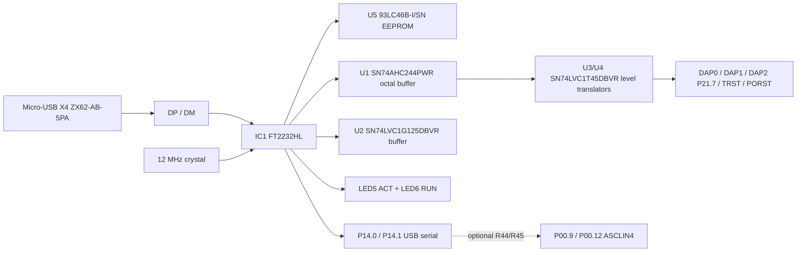

# Evaluation Board for AURIX™ Family — AURIX™ lite Kit V2

**Board User's Manual**  
**Document Revision:** 2.2  
**Revision date:** 14 April 2022 (2022-04-14)  
**Microcontroller:** Infineon AURIX™ TriCore™  
**Published by:** Infineon Technologies AG, 81726 Munich, Germany  
**Supported MCU variants:** TC375, TC365, TC275, TC265

---

## Legal Disclaimer

The information given in this document shall in no event be regarded as a guarantee of conditions or characteristics. With respect to any examples or hints given herein, any typical values stated herein and/or any information regarding the application of the device, Infineon Technologies hereby disclaims any and all warranties and liabilities of any kind, including without limitation, warranties of non-infringement of intellectual property rights of any third party.

### Information

For further information on technology, delivery terms and conditions and prices, please contact the nearest Infineon Technologies Office ([www.infineon.com](https://www.infineon.com)).

### Warnings

Due to technical requirements, components may contain dangerous substances. For information on the types in question, please contact the nearest Infineon Technologies Office.

Infineon Technologies components may be used in life-support devices or systems only with the express written approval of Infineon Technologies, if a failure of such components can reasonably be expected to cause the failure of that life-support device or system or to affect the safety or effectiveness of that device or system. Life support devices or systems are intended to be implanted in the human body or to support and/or maintain and sustain and/or protect human life. If they fail, it is reasonable to assume that the health of the user or other persons may be endangered.

---

## Revision History

| Page or Item | Subjects (major changes since previous revision) |
| --- | --- |
| Revision 2020, October | Initial released version is V2.0 |
| Revision 2021, September | Corrected version V2.1 |
| Page 13 | Add SO8-150 as specific package |
| Page 18, Figure 7 | Order on X301 corrected (mirrored) |
| Page 26, Figure 14 | Add footnote about wrong printing of P11.6 |
| Revision 2022, April | Corrected version V2.2 |
| Page 12 | Add description of CAN_STB |

## Trademarks

Trademarks of Infineon Technologies AG: AURIX™, C166™, CanPAK™, CIPOS™, CIPURSE™, EconoPACK™, CoolMOS™, CoolSET™, CORECONTROL™, CROSSAVE™, DAVE™, EasyPIM™, EconoBRIDGE™, EconoDUAL™, EconoPIM™, EiceDRIVER™, eupec™, FCOS™, HITFET™, HybridPACK™, I²RF™, ISOFACE™, IsoPACK™, MIPAQ™, ModSTACK™, my-d™, NovalithIC™, OptiMOS™, ORIGA™, PRIMARION™, PrimePACK™, PrimeSTACK™, PRO-SIL™, PROFET™, RASIC™, ReverSave™, SatRIC™, SIEGET™, SINDRION™, SIPMOS™, SmartLEWIS™, SOLID FLASH™, TEMPFET™, thinQ!™, TRENCHSTOP™, TriCore™.

Other trademarks: ADS (Agilent), AMBA™, ARM™, MULTI-ICE™, KEIL™, PRIMECELL™, REALVIEW™, THUMB™, µVision™ of ARM Limited, UK. AUTOSAR™ licensed by AUTOSAR development partnership. Bluetooth™ of Bluetooth SIG Inc. CAT-iq™ of DECT Forum. COLOSSUS™, FirstGPS™ of Trimble Navigation Ltd. EMV™ of EMVCo, LLC. EPCOS™ of Epcos AG. FLEXGO™ of Microsoft Corporation. FlexRay™ licensed by FlexRay Consortium. HYPERTERMINAL™ of Hilgraeve Incorporated. IEC™ of Commission Electrotechnique Internationale. IrDA™ of Infrared Data Association. ISO™ of INTERNATIONAL ORGANIZATION FOR STANDARDIZATION. MATLAB™ of MathWorks, Inc. MAXIM™ of Maxim Integrated Products, Inc. MICROTEC™, NUCLEUS™ of Mentor Graphics Corporation. Mifare™ of NXP. MIPI™ of MIPI Alliance, Inc. MIPS™ of MIPS Technologies, Inc., USA. muRata™ of MURATA MANUFACTURING CO. MICROWAVE OFFICE™ of Applied Wave Research Inc. OmniVision™ of OmniVision Technologies, Inc. Openwave™ of Openwave Systems Inc. RED HAT™ of Red Hat, Inc. RFMD™ of RF Micro Devices, Inc. SIRIUS™ of Sirius Satellite Radio Inc. SOLARIS™ of Sun Microsystems, Inc. SPANSION™ of Spansion LLC Ltd. Symbian™ of Symbian Software Limited. TAIYO YUDEN™ of Taiyo Yuden Co. TEAKLITE™ of CEVA, Inc. TEKTRONIX™ of Tektronix Inc. TOKO™ of TOKO KABUSHIKI KAISHA TA. UNIX™ of X/Open Company Limited. VERILOG™, PALLADIUM™ of Cadence Design Systems, Inc. VLYNQ™ of Texas Instruments Incorporated. VXWORKS™, WIND RIVER™ of WIND RIVER SYSTEMS, INC. ZETEX™ of Diodes Zetex Limited.

EtherCAT® is a registered trademark and patented technology, licensed by Beckhoff Automation GmbH, Germany.

Last Trademarks Update: 2011-02-24

---

## Table of Contents

*(Page numbers refer to the original PDF.)*

1. [Introduction](#1-introduction) — p. 6
   - 1.1 [Block Diagram](#11-block-diagram) — p. 7
2. [Hardware Description](#2-hardware-description) — p. 8
   - 2.1 [Power Supply](#21-power-supply) — p. 9
   - 2.2 [User Push Buttons, User LEDs and Potentiometer](#22-user-push-buttons-user-leds-and-potentiometer) — p. 10
   - 2.3 [Debugging and On-Board miniWiggler](#23-debugging-and-on-board-miniwiggler) — p. 11
     - 2.3.1 [USB Connector](#231-usb-connector) — p. 11
     - 2.3.2 [Serial Connection to PC](#232-serial-connection-to-pc) — p. 11
     - 2.3.3 [miniWiggler JDS](#233-miniwiggler-jds) — p. 12
   - 2.4 [Reset](#24-reset) — p. 12
   - 2.5 [CAN Transceiver](#25-can-transceiver) — p. 12
   - 2.6 [I²C EEPROM](#26-ic-eeprom) — p. 12
   - 2.7 [Ethernet](#27-ethernet) — p. 13
   - 2.8 [Optional Cypress Semper™ (Secure) Flash](#28-optional-cypress-semper-secure-flash) — p. 13
   - 2.9 [Optional F-RAM](#29-optional-f-ram) — p. 13
3. [Configuration](#3-configuration) — p. 14
   - 3.1 [Bootmode](#31-bootmode) — p. 14
   - 3.2 [Config Signals](#32-config-signals) — p. 14
   - 3.3 [Optional Resistors](#33-optional-resistors) — p. 15
4. [Connector Pin Assignment](#4-connector-pin-assignment) — p. 16
   - 4.1 [Pinout of X1 and X2 Connectors](#41-pinout-of-x1-and-x2-connectors) — p. 16
   - 4.2 [Shield2Go and mikroBus™ Pinout](#42-shield2go-and-mikrobus-pinout) — p. 17
   - 4.3 [Arduino Compatible Connector](#43-arduino-compatible-connector) — p. 18
   - 4.4 [Infineon DAP Debug Connector (10-pin)](#44-infineon-dap-debug-connector-10-pin) — p. 19
5. [Schematics and Placement](#5-schematics-and-placement) — p. 20

### List of Figures

*(Page numbers refer to the original PDF.)*

| Figure | Description | Page |
| --- | --- | --- |
| 1 | Block Diagram of the AURIX™ lite Kit V2 | 7 |
| 2 | AURIX™ lite Kit Board V2 View from the Top | 8 |
| 3 | AURIX™ lite Kit Board V2 View from the Bottom | 8 |
| 4 | Power Supply Concept | 10 |
| 5 | Signal mapping of the pin headers X1 and X2 | 16 |
| 6 | Signal mapping of the pin headers for mikroBUS and Shield2Go Connector 1 and 2 | 17 |
| 7 | Mapping of Arduino Functions to AURIX™ Pin Functions | 18 |
| 8 | Schematic: Project Overview | 20 |
| 9 | Schematic: On Board miniWiggler | 21 |
| 10 | Schematic: Power and Connectors | 22 |
| 11 | Schematic: CPU and config | 23 |
| 12 | Schematic: Ethernet and memory expansion | 24 |
| 13 | Placement: Top View | 25 |
| 14 | Placement: Bottom View | 26 |

### List of Tables

*(Page numbers refer to the original PDF.)*

| Table | Description | Page |
| --- | --- | --- |
| 1 | Overview of the Board Specification | 6 |
| 2 | AURIX™ Pin Mapping for User LEDs | 10 |
| 3 | miniWiggler Pin Mapping for User LEDs | 11 |
| 4 | AURIX™ Push Buttons and Potentiometer | 11 |
| 5 | CAN Signals and AURIX™ Pin Mapping | 12 |
| 6 | User Startup Modes | 14 |
| 7 | Config Signals | 14 |
| 8 | Signal mapping of the optional resistors | 15 |
| 9 | Pin Assignment of the DAP Debug Connector |

---

## 1. Introduction

This document describes the features and hardware details of the AURIX™ lite Kit V2 equipped with a 32-bit single-chip AURIX™ TriCore™-based Microcontroller TC375, TC365, TC275 or TC265 from Infineon Technologies AG.

It can be used with a range of development tools including Infineon's free of charge Eclipse-based IDE [**AURIX™ Development Studio**](https://www.infineon.com/cms/en/product/promopages/aurix-development-studio/) or the Eclipse-based **FreeEntryToolchain** from HighTec/PLS/Infineon. AURIX™ Development Studio is a comprehensive environment, including C-Compiler and Multi-core Debugger, Infineon's low-level driver (iLLD), with no time and code-size limitations that enables editing, compiling and debugging application code. The FreeEntryToolchain is a full C/C++ development environment which has a source-level UDE debugger from PLS included and is also based on Infineon low-level driver (iLLD).

> These boards are neither cost nor size optimized and do not serve as a reference design.

### Table 1 — Overview of the Board Specification

| Feature | Specification |
| --- | --- |
| CPU Core AURIX™ | Manufacturer Order No. `SAK-TC375TP-96F300W AA`; `SAK-TC365DP-64F300W AA`; `SAK-TC275TP-64F200W DC`; `SAK-TC265D-40F200W BC` |
| Board Dimensions | 66.0 × 131.0 mm |
| Power | On-board miniWiggler Micro-AB USB interface; external powering 5 V…40 V (recommended 7 V…14 V) |
| Connectors | Most AURIX™ pins available on expansion connectors (X1, X2); two Infineon Shield2Go connectors; Arduino-compatible connectors for 3.3 V; mikroBUS™ connector; Micro-USB connector; DAP Debug connector; CAN connector; RJ45 connector |
| Others | CAN transceiver TLE9251VSJ from Infineon; Low Power 10/100 Mbps Ethernet Physical Layer Transceiver DP83825I from TI; 1 user push-button, 3 user LEDs; Reset push-button; Potentiometer (10 kΩ) for variable analog input |

### 1.1 Block Diagram

The block diagram in Figure 1 shows the main components of the AURIX™ lite Kit V2 and their interconnections.

| Block | Components shown in the original figure |
| --- | --- |
| Power | DC IN → 5 V LDO → 3.3 V LDO → VDD; external power interface; `R35/0R`, `C39/22µF`, `L3/3.3µH`; Ext. Oscillator Input; 12 MHz crystal for FTDI; 20 MHz external crystal for AURIX |
| Debug | Micro USB2.0 (DP/DM) → UTMI PHY → FTDI FT2232HL; EEPROM 1 kB `93LC46B-I/SN`; MPSSE Channel A (OCDS); MPSSE Channel B; 2× single-bit bus transceivers; octal buffer gate; single bus buffer gate; 2× LEDs for OCDS (LED5 ACT / LED6 RUN); DAP Connector (DAP1, P21.7) |
| MCU | AURIX TC375, TC365, TC275 or TC265; Ports 0, 2, 10, 11, 13, 14, 15, 20, 21, 22, 23, 32, 33; Ext. Gate Ctrl; Dig. Core Supply; CAN0 Node 0; OCDS Input; CAN Transceiver `TLE9251VSJ` → CAN Header (1×2, 0.1″) |
| I²C / Ethernet support | EEPROM 2 kB `24AA02E48-E/OT` (EUI-48 Node Address) feeding the Ethernet MAC/address path; Ethernet PHY `DP83825IRMQR` → RJ45 connector |
| Interfaces | Pin Header X2 (2×20, 0.1″); Arduino Pin Header (DIGITAL) — UART (ASCLIN3/ASCLIN0), QSPI1, I2C0; Arduino Pin Header (ANALOG IN) — ADC/AN24-25, AN36-39; Pin Header X1 (2×20, 0.1″); Shield2GO Slot1 S2G1 (ASCLIN2, I2C0, QSPI0, ADC/AN16, AN17, GPIO); Shield2GO Slot1 S2G2 (ASCLIN3, I2C0, QSPI1, ADC/AN18, AN19, GPIO); mikroBUS Connector (UART/ASCLIN1, I2C0, QSPI2, ADC/AN26, GPIO) |
| Memory (optional) | Optional Semper (secure) Flash; Optional F-RAM |

---

## 2. Hardware Description

The following chapters give a detailed description of the board hardware and how it can be used. The different parts of the kit series are shown in Figure 2 and Figure 3.

### Figure 2 — AURIX™ lite Kit Board V2, View from the Top

Component map reconstructed from the original board photo:

| Board area | Components visible |
| --- | --- |
| Left side | Shield2Go slots (S2G1 / S2G2) with mikroBUS™ between them |
| Upper-middle left | I²C EEPROM (U9) |
| Upper-middle | 20 MHz main crystal (Y2) |
| Center | AURIX™ TC3X5/TC2X5 MCU (U6) |
| Upper edge | Pin connector X2 (2×20) |
| Upper-right | Arduino digital connector (X303/X304) |
| Right side | LED1/LED2 (green, low-active), Button1, Reset button, 10-pin DAP connector |
| Right-center | miniWiggler activity/run LEDs (LED5/LED6) |
| Lower-right | Micro-USB X4, on-board miniWiggler (IC1), G1/G2 regulators, power LED4, DC input X3 |
| Lower-center | Arduino power (X302) and analog (X301) headers; pin connector X1 |
| Lower-left | Ethernet RJ45 X5, TLE9251VSJ CAN transceiver U7 and CAN connector |
| Lower-right vicinity | LED3 (ESR0, red, low-active) |

### Figure 3 — AURIX™ lite Kit Board V2, View from the Bottom

- X2 along one long edge, X1 along the opposite long edge; the signal matrix is printed on the PCB silkscreen.
- Arduino `DIGITAL`, `ANALOG IN`, and `POWER` labels.
- Shield2Go and mikroBUS pin names printed.
- Optional Semper flash (U10) and F-RAM (U11) footprints.
- `USB3.0 (900 mA)` recommendation marking and power/reference labels (`VIN`, `+5V`, `+3V3`, `VDD_USB`, `GND`, `VAREF`).

---

### 2.1 Power Supply

The AURIX™ lite Kit V2 must be supplied by an external DC power supply. This can be done via the **DC plug X3** (recommended voltage range **+7 V…+14 V**) or via the **micro USB plug X4** (**+5 V**). The green **Power LED4** indicates the presence of the generated **3.3 V** supply voltage.

For X3 use a female DC supply plug with an outside diameter of **5.5 mm** and an inside diameter of **2.1 mm or 2.5 mm**. The inner contact is positive, the outer contact is ground.

#### USB and DC source selection behavior

When the board is powered via the micro USB plug X4, the available voltage is always less than 5 V (**~4.5 V**) because the USB voltage is protected by a Schottky diode (D1). Therefore X3 and X4 can be used at the same time:

- As long as the voltage on X3 is **higher than +7 V**, the board is powered via X3.
- If the voltage on X3 is **less than +5.5 V**, the board is powered via X4.
- Between +5.5 V and +7 V on X3, the board is powered from X3 and X4 together.

#### Critical power warnings

If the board is powered via a USB plug and/or the DC plug, it is **not recommended** to apply an additional power supply to one of the power pins (`VEXT`, `+5V`, `+3V3`, `VDD_USB`) on the pin headers X1, X2, the Arduino Power header X302, the Shield2Go slots, or the mikroBUS™ connectors, because there is **no protection against reverse current** into the external power supply.

These power pins can be used as an output to power an external circuit, but care must be taken not to draw more current than the USB can deliver:

- A PC as USB2.0 host typically can deliver up to **500 mA**.
- USB3.0 up to **900 mA**; USB3.0 is recommended for best performance.
- If higher currents are required and to avoid damage to the USB host, use an external USB power supply unit able to deliver higher currents.

> **Note:** The LDO G1 (5 V → 3.3 V) and LDO G2 (VIN → 5 V) have a maximum output current rating of **1 A**. Therefore the maximum current consumption is limited to 1 A. Do not apply any additional voltage on the supply pins, because they are directly connected to the output of the LDO G1/G2 and further backwards voltage can damage or destroy the LDO. Do not apply multiple sources on the power pins, otherwise you risk to damage and destroy the board.

#### Alternate supply methods

More supply options are possible, but caution is necessary to avoid any damage to the board and your supplies. Ensure that **X4 is not supplied by any power source or PC** for all configurations below. With a +5 V power source, the following options are possible:

- **Option 1:** Supply **+5 V** on the `+5V` pin at the X302 Arduino power connector.
- **Option 2:** Supply **+5 V** on either one of the `VDD_USB` pins at the X1 or X2 connector.
- **Option 3:** Supply **+7 V…+14 V** on the `VIN` pin at the X302 Arduino power connector.

> **Note:** Do not apply any voltage on the mentioned power pins if the USB is plugged in or any voltage is applied via the DC plug. Do not apply multiple sources on the power pins, otherwise you risk to damage and destroy the board.

### Figure 4 — Power Supply Concept

Power tree components visible in the original figure:

| Reference | Value / device | Purpose |
| --- | --- | --- |
| X3 | DC plug | VIN input (7–14 V recommended) |
| D2 | SS24T3G | Schottky diode in DC path |
| G2 | IFX27001TFV50 | VIN → +5 V LDO |
| X4 | Micro USB | USB supply |
| D1 | SS24T3G | Schottky diode in USB path (VDD_USB) |
| G1 | IFX27001TFV33 | 5 V / VDD_USB → +3.3 V LDO |
| D5 | Schottky/power diode | Additional rectifier/protection diode in the power path (visible in the original Figure 4 area near the USB +5 V and regulator rails) |
| R39 | 0 Ω optional | Connects +5V to mikroBUS and Shield2Go (`+5V_S2G_MB`) |
| R27 | 0 Ω | VEXT routing |
| C39 | 22 µF | Bulk decoupling |
| L3 | 3.3 µH (LTF5022T-3R3N2R5-LC) | Power filtering / conversion path |

Power nets: `VDD_USB`, `+3V3`, `+5V`, `VEXT`, `VIN`, `VDD`, `VDDP3`, `VDDM`, `VAREF`, `VAGND1`, `VAGND2`, `VFLEX`, `VSS`, `VSSM`. Loads supplied by the 3.3 V rail include the AURIX MCU, miniWiggler, CAN circuitry, I²C EEPROM, Ethernet circuitry, optional flash/F-RAM, and the headers (X1/X2, Arduino, Shield2Go, mikroBUS).

---

### 2.2 User Push Buttons, User LEDs and Potentiometer

The AURIX™ lite Kit V2 provides one user push button, a reset button, two LEDs and one potentiometer. Additionally, LED3 can be used for visualizing an emergency stop function at **ESR0** (emergency service request). The LEDs LED5 and LED6 are used for visualizing activities via the on-board miniWiggler.

### Table 2 — AURIX™ Pin Mapping for User LEDs

| Name | AURIX™ Pin | Color | Active |
| --- | --- | --- | --- |
| LED1 | P00.5 | Green | Low-active (pull against GND) |
| LED2 | P00.6 | Green | Low-active (pull against GND) |
| LED3 | ESR0 | Red | Low-active (pull against GND) |

### Table 3 — miniWiggler Pin Mapping for User LEDs

| Name | miniWiggler Pin | Color | Active |
| --- | --- | --- | --- |
| LED5 | ADBUS4 (ACTIV) | Green | Low-active (pull against GND) |
| LED6 | ADBUS7 (RUN) | Green | Low-active (pull against GND) |

### Table 4 — AURIX™ Push Buttons and Potentiometer

| Name | AURIX™ Pin | Active |
| --- | --- | --- |
| Button1 | P00.7 | Low-active (pull against GND) |
| Reset | /PORST | Low-active (pull against GND) |
| R32 (10 kΩ)* | AN0 | Variable analog input |

> *Desoldering resistor **R33** disables the potentiometer functionality and frees **AN0** for other functions.

---

### 2.3 Debugging and On-Board miniWiggler

The AURIX™ lite Kit V2 supports debugging via 2 different channels:

1. On-board miniWiggler via the micro-USB X4.
2. 10-pin DAP Connector.

#### 2.3.1 USB Connector

The USB connector is used for connection to a PC. Via the USB it is possible to power the board, to use **ASCLIN0** as a serial connection via USB, and to debug via **DAS**.

> **NOTE:** Before connecting the board to the PC, make sure that the actual DAS software is installed on the PC. For actual DAS software please contact your local FAE. The software can also be found on the [DAS website](https://www.infineon.com/cms/en/product/promopages/aurix-development-studio/).

#### 2.3.2 Serial Connection to PC

After the first connection of USB to a PC the needed driver will be installed automatically. During this, a new COM port is created on the PC. This COM port can be used to communicate with the board via:

- **ASCLIN0** of the device (default on `P14.0` / `P14.1`, e.g. Generic Bootstrap Loader), and
- **ASCLIN4** (TC3X5 only) if **R44** and **R45** are assembled.

Because ASCLIN0 is also used for the Arduino pins, you can use ASCLIN4 in parallel. In that case, make sure that P14.0/P14.1 are not configured (their roles are rerouted to P00.9/P00.12 via R44/R45).

- R44: routes ASCLIN4 `P00.12` instead of ASCLIN0 `P14.1` via USB (TC3X5 only; P14.1 not usable in this case).
- R45: routes ASCLIN4 `P00.9` instead of ASCLIN0 `P14.0` via USB (TC3X5 only; P14.0 not usable in this case).

#### 2.3.3 miniWiggler JDS

The miniWiggler JDS is a low-cost debug interface which allows access to the device via **DAP**. Make sure you have the latest DAS release. Debugging is possible via the DAS Server **'UDAS'**. Please contact your preferred debug vendor for support of DAS.

- A working connection is visible via the green **LED5 (ADBUS4)**.
- The status **LED6 (ADBUS7)** is switched on/off through the DAS Server, depending on the used debugger (client).

> **IMPORTANT:** Make sure that there is **no or a tristated connection** on the DAP connector if the LED5 (miniWiggler in use) is on.

---

### 2.4 Reset

The power-on-reset input pin (**/PORST**) of the AURIX™ family is a **bi-directional input/output** intended for external triggering of power-related resets.

- An internal pull-up resistor (**2.2 kΩ**) keeps the `/PORST` pin high during normal operation.
- A low level at this pin forces a hardware reset.
- If the PORST pin remains asserted after a power event, the reset is extended until it is deasserted. This does not replace the ESR pins functional reset.
- In case of an MCU-internal reset, the `/PORST` pin will drive a low signal.

A reset signal can be issued by:

- the on-board **Reset Button** ("RESET"),
- the on-board **miniWiggler** via IC FT2232HL (`IC1.27 – ACBUS1`),
- the on-board **DAP connector** (`DAP.10`),
- the **Arduino Power Header** (`X302.3`, "/PORST"),
- the **pin header X1** (`X1.30`, "/PORST").

An AURIX™ internal circuit always ensures a safe Power-on-Reset. The AURIX™ lite Kit V2 does not require any additional external components to generate a reset signal during power-up. For more information, refer to the datasheet or user manual of the assembled AURIX™ device.

---

### 2.5 CAN Transceiver

The AURIX™ lite Kit V2 provides a CAN interface via the CAN connector. The **TLE9251V** is the latest Infineon high-speed CAN transceiver generation, used inside HS CAN networks for automotive and also for industrial applications. It is designed to fulfill the requirements of ISO 11898-2 (2016) physical layer specification and respectively also the SAE standards J1939 and J2284.

- The CAN buses (signals CANH, CANL) are terminated with a **120 Ω** resistor.
- The transceiver is connected to the TriCore™ device **CAN node 0**.
- The transceiver is in **stand-by mode per default**. To switch the transceiver to normal operating mode the pin **CAN_STB** must be driven **low** from the CPU.

### Table 5 — CAN Signals and AURIX™ Pin Mapping

| Signal Name | Pin No. at CAN Pin Header | AURIX™ Pin, Function | Ass. Reg./I/O Line |
| --- | --- | --- | --- |
| CANH | 1 | — | — |
| CANL | 2 | — | — |
| CAN_TX | — | P20.8, CAN node 0 output | TXDCAN0 |
| CAN_RX | — | P20.7, CAN node 0 input | RXDCAN0B |
| CAN_STB | — | P20.6, GPIO | P20.6 OUT |

---

### 2.6 I²C EEPROM

The AURIX™ lite Kit V2 provides a **2 Kb I²C Serial EEPROM with Pre-Programmed EUI-48™ MAC ID** (Microchip **24AA02E48**, part `MT_24AA02E48-E/OT`).

- The slave address is fixed at **0x50**.
- The upper half of the array (**80h–FFh**) is permanently write-protected. Write operations to this address range are inhibited; read operations are not affected.
- This upper half contains the preprogrammed EUI-48™ node address, which can be used as the **MAC ID for Ethernet**.
- The other 128 bytes are writable and usable by the user.

---

### 2.7 Ethernet

The AURIX™ lite Kit V2 provides an **RJ45 connector (X5)** for twisted-pair Ethernet connections. The board uses a **DP83825I Low Power 10/100 Mbps Ethernet Physical Layer Transceiver** from Texas Instruments (board part `DP83825IRMQR`) as the physical interface device.

- For more information about the Ethernet module see the AURIX™ User's Manual; about the PHY see the [DP83825I datasheet from the TI website](https://www.ti.com/product/DP83825I).
- The [TLE9251V CAN transceiver datasheet](https://www.infineon.com/cms/en/product/transceivers/automotive-transceiver/tle9251v/) describes the transceiver used for the CAN interface.
- For the connection between AURIX™ and PHY, **RMII** is used.
- For the MD connection (e.g. for PHY configuration) **P21.2** and **P21.3** are used (MDC/MDIO).
- The PHY interrupt **INT_ETH** is routed to **P33.7**.
- The PHY reset **RST_N** is derived from **/ESR0**.

---

### 2.8 Optional Cypress Semper™ (Secure) Flash

The AURIX™ lite Kit V2 provides the possibility to assemble an external flash. Usable devices are:

- Cypress **Semper™ NOR Flash** Device Family **S25HL**,
- Cypress **Semper™ Secure NOR Flash** Device Family **S35HL**,
- Package: **SOIC-16**.

For more information see [Cypress Semper NOR Flash](https://www.cypress.com/products/semper-nor-flash-memory) and [Semper Secure NOR Flash](https://www.cypress.com/event/semper-secure-nor-flash-memories).

If you assemble a flash, also assemble the ceramic capacitor **C64** with **100 nF** (size 0603) and the resistor **R67** with **0 Ω** (size 0603). In case of a Semper™ Secure NOR Flash you can additionally assemble resistor **R68** with **0 Ω** (size 0603) to connect the interrupt output of the flash to the AURIX™ pin **P20.9** (`SCU_REQ7` on TC3X5; `SCU_REQ11` on TC2X5).

> **[Source typo corrected]** The original Rev. 2.2 prose names `R67` twice in this sentence; the schematic (Figure 12) clearly shows two separate option resistors: **R67** (0 Ω) ties the flash **RESET#** to `/ESR0`, and **R68** (0 Ω, optional) ties the flash **INT#/DNU** to **P20.9**. The text below uses the schematic-correct mapping.

The AURIX™ supports only the **single SPI** protocol for this external flash; Dual and Quad SPI protocol is not possible.

The flash is connected to **P22.0, P22.1, P22.3** (`QSPI4` on TC3X5; `QSPI3` on TC2X5). Pin **P22.2** is used as the slave select — **SLSO3** of QSPI4 on TC3X5; **SLSO12** of QSPI3 on TC2X5.

> Please note that the used QSPI is **shared with the optional F-RAM** (see §2.9).

---

### 2.9 Optional F-RAM

The AURIX™ lite Kit V2 provides the possibility to assemble an external serial F-RAM. Usable devices are:

- Cypress F-RAM **FM25VN10-G**,
- Cypress F-RAM Series **CY15B**,
- Package: **SOIC-8 (SO8-150)**.

For more information see [Cypress F-RAM](https://www.cypress.com/products/f-ram-nonvolatile-ferroelectric-ram).

If you assemble F-RAM, also assemble the ceramic capacitor **C65** with **100 nF** (size 0603).

The F-RAM is connected to **P22.0, P22.1, P22.3** (`QSPI4` on TC3X5; `QSPI3` on TC2X5). Pin **P23.1** is used as the slave select — **SLSO6** of QSPI4 on TC3X5; **SLSO13** of QSPI3 on TC2X5.

Unfortunately there is **no connection on pin 3 (#WP) and pin 7 (#HOLD)** of the F-RAM. Check the datasheet whether the used F-RAM has an internal weak pull-up or needs an external connection to VDD. If an external connection is needed, make such a connection via a wire-wrap line.

> Please note that the used QSPI is **shared with the optional flash** (see §2.8).

---

## 3. Configuration

### 3.1 Bootmode

### Table 6 — User Startup Modes

| HWCFG[5…3] | Type of Boot | R58 | R57 | R59 |
| --- | --- | --- | --- | --- |
| **XX1** | **Start-up mode is selected by Boot Mode Index** | X | X | NA |
| 110 | Internal Start from Flash | NA | NA | A |
| 100 | Alternate Boot Mode, Generic Bootstrap Loader on fail (P14.0/P14.1) | A | NA | A |
| 000 | Generic Bootstrap Loader (P14.0/P14.1) | A | A | A |

1) The shaded row indicates the **default setting** — in the rendered manual the shaded row is `XX1` (Start-up mode is selected by Boot Mode Index).
2) 'A' means assembled, 'NA' means not assembled, 'X' represents the don't-care state.

Please see also Table 8.

---

### 3.2 Config Signals

### Table 7 — Config Signals

| Short Name | Description | Comment |
| --- | --- | --- |
| P14.6 | HWCFG0 (LDO / DCDC) | Only with TC2X5; resistor **R30** (4.7 kΩ/0603 imp) pulls the signal against GND (DCDC) and is assembled initially if the board uses TC2X5. |
| P14.5 | HWCFG1 (EVR33ON / EVR33OFF) | Resistor **R31** (4.7 kΩ/0603 imp) pulls the signal against GND (EVR33OFF) and is assembled initially. |
| P14.2 | HWCFG2 (EVRCON / EVRCOFF) | Resistor **R52** (4.7 kΩ/0603 imp) must be assembled if R59 is assembled (GPIOs are set to tri-state) and TC2X5 is used (TC3X5 has internal pull-up). |
| P14.3 | HWCFG3 (see boot configuration Table 6) | — |
| P10.5 | HWCFG4 (see boot configuration Table 6) | — |
| P10.6 | HWCFG5 (see boot configuration Table 6) | — |
| P14.4 | HWCFG6 (GPIOs pull-up / tri-state) | Resistor **R59** (4.7 kΩ/0603 imp) pulls the signal against GND (GPIOs in tri-state after reset) and is not assembled initially. |

---

### 3.3 Optional Resistors

Some resistors/bridges enable/disable or change the functions of specific signals (Table 8). To disable the signals, the resistors have to be removed; to enable, the resistor has to be assembled. For example: desoldering the initially assembled resistor **R33** disables the potentiometer and the analog signal **AN0** of the AURIX™, making it usable for other purposes.

### Table 8 — Signal Mapping of the Optional Resistors

| Resistor | Res. | Assembled | Signal | Size (imperial) | Comment |
| --- | --- | --- | --- | --- | --- |
| R33 | 0 Ω | yes | AN0 | 0603 | Disassemble to disable the potentiometer. |
| R37 | 0 Ω | yes | XTAL2 | 0603 | Serial resistor to reduce oscillator amplitude if needed. |
| R39 | 0 Ω | no | +5V | 0603 | Assemble to connect 5V to mikroBUS and Shield2Go connector (`+5V_S2G_MB`). |
| R59 | 4.7 kΩ | no | HWCFG6 / P14.4 | 0603 | Assemble to disable the internal pull-ups with power on. |
| R52 | 4.7 kΩ | no | HWCFG2 / P14.2 | 0603 | Assemble to enable the EVR13; only needed with TC2X5 and R59 assembled. |
| R53 | 4.7 kΩ | no | HWCFG3 / P14.3 | 0603 | Assemble to boot from BMI; only needed with TC2X5 and R59 assembled. |
| R56 | 4.7 kΩ | no | HWCFG3 / P14.3 | 0603 | Assemble to select boot from HWCFG4/5; valid setting on P10.5/P10.6 needed. |
| R54 | 4.7 kΩ | no | HWCFG4 / P10.5 | 0603 | Set HWCFG4 to high; only needed with R56 assembled, not with R57. |
| R55 | 4.7 kΩ | no | HWCFG5 / P10.6 | 0603 | Set HWCFG5 to high; only needed with R56 assembled, not with R58. |
| R57 | 4.7 kΩ | no | HWCFG4 / P10.5 | 0603 | Set HWCFG4 to low; only needed with R56 assembled, not with R54. |
| R58 | 4.7 kΩ | no | HWCFG5 / P10.6 | 0603 | Set HWCFG5 to low; only needed with R56 assembled, not with R55. |
| R44 | 0 Ω | no | P14.1, P00.12 | 0603 | Assemble to use ASCLIN4 (P00.12) instead of ASCLIN0 (P14.1) via USB; only with TC3X5, P14.1 not usable in this case. |
| R45 | 0 Ω | no | P14.0, P00.9 | 0603 | Assemble to use ASCLIN4 (P00.9) instead of ASCLIN0 (P14.0) via USB; only with TC3X5, P14.0 not usable in this case. |

---

## 4. Connector Pin Assignment

### 4.1 Pinout of X1 and X2 Connectors

The pin headers X1 and X2 can be used to extend the evaluation board or to perform measurements on the AURIX™ TC3X5/TC2X5. The signal table is also printed onto the bottom side of the PCB.

> Note 1: Signals marked 1) are different compared with the AURIX™ TC275 lite Kit V1.x.

#### Pin Header X1 — 2×20, 0.1″ (board part `68691-440HLF`)

| Pin | Signal | Pin | Signal |
| --- | --- | --- | --- |
| 1 | GND | 2 | +3V3 |
| 3 | P33.11 | 4 | P33.12 |
| 5 | P33.13 | 6 | P32.4 1) |
| 7 | P23.1 | 8 | P23.0 |
| 9 | P23.3 | 10 | P23.2 |
| 11 | P23.5 (RST_S2G2) | 12 | P23.4 (RST_S2G1) |
| 13 | P22.1 | 14 | P22.0 |
| 15 | P21.0 | 16 | P22.2 |
| 17 | P21.2 (MDC) | 18 | P22.3 |
| 19 | P21.4 | 20 | P21.3 (MDIO) |
| 21 | P20.10 (SPICLK_S2G) | 22 | P21.5 |
| 23 | P20.0 (TXD_S2G2) | 24 | P20.1 |
| 25 | P20.3 (RXD_S2G2) | 26 | /ESR1 (ESR1) |
| 27 | /ESR0 (ESR0) | 28 | P20.14 (MOSI_S2G) |
| 29 | P15.5 | 30 | /PORST (Reset) |
| 31 | P15.4 | 32 | P11.12 (CLK50) |
| 33 | P11.11 (CRS_DV) | 34 | P11.10 (RX_D0) |
| 35 | P11.9 (RX_D1) | 36 | P11.6 (TX_EN) |
| 37 | P11.3 (TX_D0) | 38 | P11.2 (TX_D1) |
| 39 | VDD_USB | 40 | GND |

#### Pin Header X2 — 2×20, 0.1″ (board part `68691-440HLF`)

| Pin | Signal | Pin | Signal |
| --- | --- | --- | --- |
| 1 | GND | 2 | VDD_USB |
| 3 | P00.0 | 4 | P00.1 |
| 5 | P00.2 | 6 | P00.3 |
| 7 | P00.6 (LED2) | 8 | P00.5 (LED1) |
| 9 | P00.8 | 10 | P00.7 (Button1) |
| 11 | P00.10 | 12 | P00.9 |
| 13 | P00.12 | 14 | P00.11 |
| 15 | VAREF1 | 16 | AN47 |
| 17 | AN46 | 18 | AN45 |
| 19 | AN44 | 20 | AN7 |
| 21 | AN6 | 22 | AN5 |
| 23 | AN4 | 24 | AN3 |
| 25 | AN2 | 26 | AN1 |
| 27 | AN0 (Potentiometer) | 28 | P33.0 |
| 29 | P33.1 | 30 | P33.2 |
| 31 | P33.3 | 32 | P33.4 |
| 33 | P33.5 | 34 | P33.6 |
| 35 | P33.7 | 36 | P33.8 (RXD_S2G1) |
| 37 | P33.9 (TXD_S2G1) | 38 | P33.10 |
| 39 | +3V3 | 40 | GND |

---

### 4.2 Shield2Go and mikroBus™ Pinout

The pin connectors for the Shield2Go Connectors 1 and 2 and the mikroBUS™ can be used to extend the evaluation board or to perform measurements on the AURIX™ TC3X5/TC2X5. The pin table is also printed onto the top and bottom side of the AURIX™ lite Kit V2.

> Note 1) Signals marked 1) are different compared with the AURIX™ TC275 lite Kit V1.x.  
> Note 2) The I²C buses SCL and SDA are shared on the Shield2GOs, mikroBUS™, Arduino connectors and the I²C EEPROM.

#### Shield2Go Connector 1

| Pin | AURIX™ Pins | Function | Pin | AURIX™ Pins | Function |
| --- | --- | --- | --- | --- | --- |
| 1 | +5V | 5V | 10 | P33.8 | RX |
| 2 | AN16 | AN1 | 11 | P33.9 | TX |
| 3 | AN17 | AN2 | 12 | P23.4 1) | RST/GPIO2 |
| 4 | P13.2 2) | SDA | 13 | P32.2 | GPIO1 |
| 5 | P13.1 2) | SCL | 14 | P20.13 1) | CS |
| 6 | GND | GND | 15 | P20.11 1) | SCLK |
| 7 | +3V3 | 3V3 | 16 | P20.14 1) | MOSI |
| 8 | P00.4 | INT/GPIO3 | 17 | P20.12 1) | MISO |
| 9 | P14.9 1) | PWM/GPIO4 | — | — | — |

#### Shield2Go Connector 2

| Pin | AURIX™ Pins | Function | Pin | AURIX™ Pins | Function |
| --- | --- | --- | --- | --- | --- |
| 1 | +5V | 5V | 10 | P20.3 | RX |
| 2 | AN18 | AN1 | 11 | P20.0 | TX |
| 3 | AN19 | AN2 | 12 | P23.5 1) | RST/GPIO2 |
| 4 | P13.2 2) | SDA | 13 | P32.3 | GPIO1 |
| 5 | P13.1 2) | SCL | 14 | P20.10 1) | CS |
| 6 | GND | GND | 15 | P20.11 1) | SCLK |
| 7 | +3V3 | 3V3 | 16 | P20.14 1) | MOSI |
| 8 | P10.8 | INT/GPIO3 | 17 | P20.12 1) | MISO |
| 9 | P14.10 1) | PWM/GPIO4 | — | — | — |

#### mikroBUS™ Connector

| Pin | AURIX™ Pins | Function | Pin | AURIX™ Pins | Function |
| --- | --- | --- | --- | --- | --- |
| 1 | AN26 | AN | 16 | P2.8 | PWM |
| 2 | P10.6 | RST | 15 | P10.7 | INT |
| 3 | P14.7 1) | CS | 14 | P15.1 | RX |
| 4 | P15.8 1) | SCK | 13 | P15.0 | TX |
| 5 | P15.7 1) | MISO | 12 | P13.1 2) | SCL |
| 6 | P15.6 1) | MOSI | 11 | P13.2 2) | SDA |
| 7 | +3V3 | 3.3V | 10 | +5V | 5V |
| 8 | GND | GND | 9 | GND | GND |

---

### 4.3 Arduino Compatible Connector

The mapping of GPIOs and AURIX™ pin functions to Arduino-compatible functions can be found in Figure 7. The Arduino-compatible connector supports:
- SPI interface (SPI_xxx)
- I²C interface (I2C_xxx)
- UART interface (UART_xxx)
- PWM signal outputs (PWM0–13)
- ADC input (ADC0–5)
- Interrupt input (INT0–1)

> Note that all pins are capable of offering more functions than mentioned. For more information about all pin functions, refer to the corresponding datasheet.
>
> **[Source typos corrected]** The original Rev. 2.2 Arduino figure spells a few peripheral names loosely: `QSPI1.SLK1` (→ `SCLK1`), `ASLIN0.ARX0B` (→ `ASCLIN0.ARX0B`), and `QSPI1.SLSO18` (→ `SLSO19`). The tables below use the corrected spellings.

The AURIX™ lite Kit V2 works with **3.3 V logic levels**. Therefore, any board that works with 5 V logic levels cannot be used. Analog input signals **ADC0–5** are limited to a voltage smaller than or equal to **VAREF** with **VAREF = VDDM = 3.3 V**. Primarily, ADC0 to ADC5 should be used as analog input, because there is no additional circuit connected to these pins. **Parallel operation of I²C and ADC4/ADC5** is possible, because they don't share the same pins at the Arduino connector X301 and X303 anymore, as on the previous AURIX™ lite Kit V1.

#### X302 — POWER header

| X302 pin | Board signal | Arduino label |
| --- | --- | --- |
| 1 | N.C. | N.C. |
| 2 | VEXT / 3.3 V | IOREF |
| 3 | /PORST | RESET |
| 4 | +3V3 | 3.3V |
| 5 | +5V | +5V |
| 6 | GND | GND |
| 7 | GND | GND |
| 8 | VIN | VIN |

#### X301 — ANALOG IN header

| X301 pin | AURIX™ pin | ADC mapping |
| --- | --- | --- |
| 1 | P40.9 | ADC0: AN39 / VADCG4.7 |
| 2 | P40.8 | ADC1: AN38 / VADCG4.6 |
| 3 | P40.7 | ADC2: AN37 / VADCG4.5 |
| 4 | P40.6 | ADC3: AN36 / VADCG4.4 |
| 5 | P40.0 | ADC4: AN24 / VADCG3.0 |
| 6 | P40.1 | ADC5: AN25 / VADCG3.1 |

#### X303 — DIGITAL / SPI / I²C header

| X303 pin | AURIX™ pin | Arduino function |
| --- | --- | --- |
| 1 | P02.6 | IO2: P02_IN.P6 / P02_OUT.P6 (PWM8: GTM.TOUT6 / CCU60.CC60) |
| 2 | P02.7 | PWM9: GTM.TOUT7 / CCU60.CC61 |
| 3 | P10.5 | SPI_CS: QSPI1.SLSO19 (PWM10: GTM.TOUT107) |
| 4 | P10.3 | SPI_MOSI: QSPI1.MTSR1 (PWM11: GTM.TOUT105) |
| 5 | P10.1 | SPI_MISO: QSPI1.MRST1A (PWM12: GTM.TOUT103) |
| 6 | P10.2 | SPI_CLK: QSPI1.SCLK1 (PWM13: GTM.TOUT104) |
| 7 | GND | Ground (SPI — Master Mode) |
| 8 | VAREF | AREF: VAREF2 / VAREF1 |
| 9 | P13.2 | I2C_SDA: I2C0_SDA0 |
| 10 | P13.1 | I2C_SCL: I2C0_SCL0 |

#### X304 — DIGITAL / UART / interrupt header

| X304 pin | AURIX™ pin | Arduino function |
| --- | --- | --- |
| 1 | P15.3 | UART_RXD: ASCLIN0.ARX0B (PWM0: GTM.TOUT74) |
| 2 | P15.2 | UART_TXD: ASCLIN0.ATX0 (PWM1: GTM.TOUT73) |
| 3 | P02.0 | INT0: ERS3.REQ6 (ERU) (PWM2: GTM.TOUT0 / CCU60.CC60) |
| 4 | P02.1 | INT1: ERS2.REQ14 (ERU) (PWM3: GTM.TOUT1 / CCU60.COUT60) |
| 5 | P10.4 | IO0: P10_IN.P4 / P10_OUT.P4 (PWM4: GTM.TOUT106) |
| 6 | P02.3 | PWM5: GTM.TOUT3 / CCU60.COUT61 |
| 7 | P02.5 | PWM6: GTM.TOUT5 / CCU60.COUT62 |
| 8 | P02.4 | IO1: P02_IN.P4 / P02_OUT.P4 (PWM7: GTM.TOUT4 / CCU60.CC62) |

---

### 4.4 Infineon DAP Debug Connector (10-pin)

Infineon's 10-pin Device Access Port Debug Connector (DAP) is a two-wire tool access port for microcontrollers and similar devices. It allows robust high-speed connections over a long cable for automotive applications. The board comes with a DAP connector (board part `GPEC214-0502B009C1BC`); you can connect DAP hardware here. If you use this connector, make sure that the miniWiggler JDS is **not active (LED5 is off)**. For more information, refer to the [DAP Connector Manual](https://www.infineon.com/cms/en/product/microcontrollers/32-bit-tricore-microcontroller/).

### Table 9 — Pin Assignment of the DAP Debug Connector

| Pin | Name | AURIX™ Pin | Direction | Description |
| --- | --- | --- | --- | --- |
| 1 | VREF | VEXT | O | Supply voltage from the target system. The voltage has to be strong enough to supply the target side of the level shifters within the tool hardware up to about 20 MHz DAP operating frequency. The required supply current is in the range of 5 mA, mainly caused by signal switching; it can be reduced by lowering frequency and capacitance. Beyond 20 MHz the tool hardware has to supply the level shifter from another source and use this pin just as a voltage reference. |
| 2 | DAP1 / SPD / UART | TMS | I/O | DAP: Data pin. SPD: Data pin. Single-wire UART — serial communication interface (e.g. used for Bootstrap Loader BSL). |
| 3 | GND | GND | — | Recommended pin for signal return of DAP1 for high-frequency impedance matching. |
| 4 | DAP0 / SUP | TCK | I | DAP: Clock. SPD: Optional user pin value for feedback into the target system. Otherwise reserved. |
| 5 | GND | GND | — | Recommended pin for signal return of DAP0 for high-frequency impedance matching. |
| 6 | DAP2 | P21.7 | I/O | DAP: Optional second data pin. |
| | USER0 | P21.7 | I/O/O | Generic signal that can be used for non-specified functions. |
| 7 | KEY (GND in cable) | GND | — | Enforces polarization. If the recommended connector with keying shroud is not used, this pin provides another option to enforce polarization. In that instance this pin is removed from the target connector and the associated jack in the cable connector is closed with a plastic pin, for example. |
| 8 | DAP3 | /TRST | I/O | DAP: Optional third data pin. |
| | USER1 | /TRST | I/O/I | Generic signal for non-specified functions. |
| | DAPEN | /TRST | I | Optional indicator that the tool is connected; can be used to enable the DAP interface of the device. |
| 9 | GND | GND | — | Supply ground. |
| 10 | RESET | /PORST | I/O | Target reset signal. Open-drain active-low signal. May be used bi-directionally to drive or sense the target reset signal; usually driven by the tool to reset the target system. The target system is responsible for providing a pull-up to VREF on this signal to establish a logic one. The resistor shall not have a value less than 1 kΩ. |

---

## 5. Schematics and Placement

The original pages 20–26 are the five schematic sheets (Figures 8–12) and the two placement drawings (Figures 13–14). This section reconstructs their electrical content as structured tables and net lists rather than reproducing the images. All reference designators, values, pin numbers and net names are taken from the schematic set (project **AURIX™ Lite Kit V2**, rev **V2.0**).

| Figure | Schematic sheet | Document name | Page |
| --- | --- | --- | --- |
| 8 | Cover Sheet / Revision History | `01_Revision_History.SchDoc` | 20 |
| 9 | OCDS / On-board miniWiggler | `02_OCDS.SchDoc` | 21 |
| 10 | Power and Connectors | `03_Power_a_Connector.SchDoc` | 22 |
| 11 | CPU and config | `04_CPU.SchDoc` | 23 |
| 12 | Ethernet and memory expansion | `05_Ethernet_Memory_Expansion.SchDoc` | 24 |
| 13 | Placement: Top View | — | 25 |
| 14 | Placement: Bottom View | — | 26 |

### Figure 8 — Schematic Project Overview (Sheet 1)

#### Project metadata (title block)

| Field | Value |
| --- | --- |
| Project / title | AURIX™ Lite Kit V2 |
| Variant | [No Variations] |
| Schematic revision | V2.0 |
| Initial design date | 07/2020 (rel. 06/2020, drawn 16.10.2020) |
| Author | H.D. |
| Manufacturer | Infineon Technologies AG, Am Campeon 1–15, 85579 Neubiberg, Germany |
| Document name | `01_Revision_History.SchDoc` |
| Sheet size | A3 |
| SVN revision | Not in version control |
| Copyright | © Infineon Technologies AG 2020. All Rights Reserved. |
| Sheet | Sheet 1 of 5 |

#### Revision table (sheet 1)

| Rev. | Release date | Author | Description | Page(s) |
| --- | --- | --- | --- | --- |
| V2.0 | 06/2020 | H.D. | First new design for TC3xx | — |

#### Schematic page index

| Sheet | Schematics page name |
| ---: | --- |
| 01 | Cover Sheet / Revision History |
| 02 | OCDS |
| 03 | Power_a_Connector |
| 04 | CPU |
| 05 | Ethernet_Memory_Expansion |
| 06–10 | (empty) |

#### Schematic-set legal disclaimer (different from the front-of-manual disclaimer)

> **LEGAL DISCLAIMER:** THE INFORMATION GIVEN IN THIS DOCUMENT IS GIVEN FOR ILLUSTRATING PURPOSES ONLY. THE RECIPIENT OF THIS DOCUMENT MUST VERIFY ANY FUNCTION DESCRIBED HEREIN IN THE REAL APPLICATION. INFINEON TECHNOLOGIES HEREBY DISCLAIMS ANY AND ALL WARRANTIES AND LIABILITIES OF ANY KIND (INCLUDING WITHOUT LIMITATION WARRANTIES OF NON-INFRINGEMENT OF INTELLECTUAL PROPERTY RIGHTS OF ANY THIRD PARTY) WITH RESPECT TO ANY AND ALL INFORMATION GIVEN IN THIS DOCUMENT.

---

### Figure 9 — On-Board miniWiggler / OCDS (Sheet 2, `02_OCDS.SchDoc`)

#### Main functional chain

#### Principal components

| Ref. | Device / value | Role |
| --- | --- | --- |
| X4 | `ZX62-AB-5PA(31)` | Micro-USB connector (MP1–MP6 mounting posts) |
| IC1 | FT2232HL | Dual high-speed USB UART/FIFO IC, on-board debug controller |
| U1 | SN74AHC244PWR | Octal buffer/driver — OCDS signal conditioning |
| U2 | SN74LVC1G125DBVR | Single bus buffer gate (signal network switch) |
| U3 | SN74LVC1T45DBVR | Single-bit dual-supply bus transceiver (DAP1 level translation) |
| U4 | SN74LVC1T45DBVR | Single-bit dual-supply bus transceiver (P21.7 level translation) |
| U5 | 93LC46B-I/SN | 1 kB FTDI configuration EEPROM |
| Y1 | 12 MHz crystal | FT2232HL clock (OSCI/OSCO, C14/C15 = 8 pF load caps) |
| L1, L2 | MMZ1608R300ATA00 | Ferrite beads on +3V3 |
| LED5 | Green, 680 Ω (R1) | OCDS LED — ACT activity |
| LED6 | Green, 680 Ω (R2) | OCDS LED — RUN status |
| TP1, TP2 | Test points | Debug probing points |

#### FT2232HL (IC1) pin-out and net assignments

**Channel A (MPSSE A — OCDS/DAP):**

| FT2232HL pin | Signal | Board net |
| ---: | --- | --- |
| 16 | ADBUS0 | → U1 1A1 → DAP0 |
| 17 | ADBUS1 | → U2 buffer |
| 18 | ADBUS2 | → U3 A (level-shifted to DAP1) |
| 19 | ADBUS3 | → U1 (2A side) |
| 21 | ADBUS4 | OCDS LED5 ACT (R1) |
| 22 | ADBUS5 | spare |
| 23 | ADBUS6 | → U1 1A3 → USR0 |
| 24 | ADBUS7 | OCDS LED6 RUN (R2) |
| 26 | ACBUS0 | spare |
| 27 | ACBUS1 | `/PORST` reset control (IC1.27) |
| 28 | ACBUS2 | → U1 1A2 → /TRST |
| 29 | ACBUS3 | → U4 A (level-shifted to P21.7) |
| 30 | ACBUS4 | U2 OE (signal network switch control) |
| 32 | ACBUS5 | U3 DIR control (also U1 1A4 → USR8) |
| 33 | ACBUS6 | spare |
| 34 | ACBUS7 | U4 DIR control |

**Channel B (MPSSE B — USB serial / ASCLIN):**

| FT2232HL pin | Signal | Board net |
| ---: | --- | --- |
| 38 | BDBUS0 | P14.1 (ASCLIN0 TX) → R44 opt → P00.12 |
| 39 | BDBUS1 | P14.0 (ASCLIN0 RX) → R45 opt → P00.9 |
| 40 | BDBUS2 | spare |
| 41 | BDBUS3 | spare |
| 43–46 | BDBUS4–7 | spare |
| 48 | BCBUS0 | spare |
| 52 | BCBUS1 | spare |
| 53–55, 57–59 | BCBUS2–7 | spare |

**USB, EEPROM, control and power pins:**

| FT2232HL pin(s) | Signal | Net / note |
| ---: | --- | --- |
| — (USB D±) | USB_D_P / USB_D_N | via R4/R5 = 22 Ω to X4 DP/DM |
| 63 / 62 / 61 | EECS / EECLK / EEDATA | to U5 (with R11/R12/R14 10 kΩ pull-ups) |
| 14 | RESET_N | R6 1 kΩ to +3V3 |
| 6 | REF | R7 12 kΩ |
| 60 | PWREN_N | spare |
| 36 | SUSPEND_N | spare |
| 13 | TEST | tied |
| 2 / 3 | OSCI / OSCO | Y1 12 MHz, C14/C15 8 pF |
| 12, 37, 64 | VPLL / VPHY / VCCIO | +3V3 / +1V8 power |
| 20, 31, 42, 56 | VCORE | +1.8 V digital core |
| 9, 4, 50, 49 | VCCIO / VREGIN / VREGOUT | power |
| 1, 5, 11, 15, 25, 35, 47, 51, 10 | GND / AGND | ground |

#### Support passives on sheet 2

| Ref. | Value | Net / function |
| --- | --- | --- |
| R1 | 680 Ω | LED5 (ACT) series resistor |
| R2 | 680 Ω | LED6 (RUN) series resistor |
| R3, R13 | 10 kΩ | Pull-ups |
| R4, R5 | 22 Ω | USB DP / DM series resistors |
| R6 | 1 kΩ | RESET_N pull-up |
| R7 | 12 kΩ | REF network |
| R8 | 10 kΩ | ADBUS0 pull-up |
| R9 | 10 kΩ | pull-up |
| R11, R12, R14 | 10 kΩ | U5 EEPROM interface pull-ups (EECS/EECLK/EEDATA) |
| R17 | 2.2 kΩ | U5 EEPROM DO pull-up |
| R18 | 4.7 kΩ | U3 DAP1-side pull-up |
| R19 | 4.7 kΩ | U4 P21.7-side pull-up |
| R106 | 1 MΩ | USB / shield circuitry bias |
| R44 | 0 Ω optional | P14.1 ↔ P00.12 (ASCLIN4 route) |
| R45 | 0 Ω optional | P14.0 ↔ P00.9 (ASCLIN4 route) |
| C1, C3, C4, C6–C10, C12, C13 | 100 nF | +3V3 / +1V8 bypass |
| C2, C5 | 4.7 µF | +3V3 / +1V8 bulk |
| C11 | 3.3 µF | power bulk |
| C14, C15 | 8 pF | Y1 crystal load caps |
| C16–C21 | 100 nF | U2/U3/U4 supply bypass |
| C100 | 100 nF | USB / shield circuitry |

FT2232HL signal groups (for reference): Channel A `ADBUS0–7`, `ACBUS0–7`; Channel B `BDBUS0–7`, `BCBUS0–7`; USB `DP`, `DM`, `USB_D_P`, `USB_D_N`; EEPROM `EECS`, `EECLK`, `EEDATA`; control `RESET_N`, `PWREN_N`, `SUSPEND_N`, `REF`, `TEST`. Debug nets: `DAP0`, `DAP1`, `P21.7` (DAP2), `/TRST`, `/PORST`, `USR0`, `USR8`, test points `TP1`/`TP2`. Power rails: `+1V8`/`+1.8V`, `+3V3`, `VCCIO`, `VREGIN`, `VREGOUT`, `VPLL`, `VPHY`, `VCORE`.

---

### Figure 10 — Power and Connectors (Sheet 3, `03_Power_a_Connector.SchDoc`)

This sheet contains the power tree, MCU power pins, user LEDs/buttons, reset circuit, Arduino headers, X1/X2, DAP connector, Shield2Go, mikroBUS, and board power switching.

#### Power regulators and input protection

| Ref. | Value / device | Purpose |
| --- | --- | --- |
| X3 | DC plug | VIN input |
| D2 | SS24T3G | Schottky diode, DC input path |
| G2 | IFX27001TFV50 | VIN → +5 V LDO (GND/ADJ; C23 10 µF, C49 100 nF/50 V) |
| X4 | Micro-USB | USB supply |
| D1 | SS24T3G | Schottky diode, USB path (VDD_USB) |
| G1 | IFX27001TFV33 | 5 V / VDD_USB → +3.3 V LDO (GND/ADJ; C24 10 µF, C50 10 µF) |
| R27 | 0 Ω | VEXT routing |
| Q1 | BSZ15DC02KD | Power MOSFET (digital-core 1.25 V path) |
| L3 | LTF5022T-3R3N2R5-LC | 3.3 µH inductor (core supply) |
| R35 | 0 Ω | VDD digital-core routing |
| R16 | 0 Ω | +1.25 V core supply (VDD) routing |
| C39 | 22 µF | Core-supply bulk decoupling |

MCU-dependent assembly table on this sheet:

| Component | TC375 | TC365 | TC275 | TC265 |
| --- | --- | --- | --- | --- |
| R29 | 6.8 Ω | — | NA | NA |
| R40 | NA | — | 0 Ω | NA |
| R41 | 0 Ω | — | NA | 0 Ω |
| R42 | 0 Ω | — | NA | NA |
| R43 | NA | — | 0 Ω | NA |
| C27 | 2.2 µF | — | NA | NA |

*(TC375 column shown; the schematic repeats the population columns per MCU variant.)*

#### Analog reference / VAREF supply

| Ref. | Value | Net / function |
| --- | --- | --- |
| R25 | 1.2 Ω | VAREF1 analog supply resistor |
| R28 | 6.8 Ω | VAREF2 analog supply resistor |
| R29 | 6.8 Ω (variant) | VAREF1/2 filter (variant-dependent) |
| R40 / R41 | 0 Ω (variant) | VAREF / rail routing (variant-dependent) |
| C33 | 330 nF | VAREF1 decoupling |
| C43 | 330 nF | VAREF2 decoupling |
| C37 | 100 nF | analog supply decoupling |

#### Reset circuit

| Ref. | Value | Function |
| --- | --- | --- |
| Reset switch | `FSM2JSMA` | Reset push-button on `/PORST` |
| R26 | 2.2 kΩ | `/PORST` pull-up (keeps PORST high in normal operation) |
| C45 | 100 nF | reset-line filtering |

> **Note:** Button1 (P00.7) uses the same `FSM2JSMA` switch; its pull-up is **R20 = 2.2 kΩ** (see Buttons & LEDs below).

#### Buttons & LEDs

| Ref. | Value | Function |
| --- | --- | --- |
| Button1 | `FSM2JSMA` | User push-button on P00.7 (low-active) |
| R20 | 2.2 kΩ | Button1 (P00.7) pull-up |
| R21 | 680 Ω | LED1 (P00.5) series resistor — green, low-active |
| R23 | 680 Ω | LED2 (P00.6) series resistor — green, low-active |
| R24 | 680 Ω | LED3 (/ESR0) series resistor — red |
| R36 | 680 Ω | LED4 (power) series resistor — green |
| LED1 | Green | P00.5 user LED |
| LED2 | Green | P00.6 user LED |
| LED3 | Red | /ESR0 emergency-service-request LED |
| LED4 | Green | 3.3 V power indication |

#### Main oscillator

| Ref. | Value | Function |
| --- | --- | --- |
| Y2 | 20 MHz | AURIX main oscillator (XTAL1/XTAL2) |
| R37 | 0 Ω | XTAL2 series resistor (amplitude control) |
| C40, C44 | 10 pF | Y2 crystal load capacitors |

#### Potentiometer / AN0

| Ref. | Value | Function |
| --- | --- | --- |
| R32 | 10 kΩ | Potentiometer, wiper → AN0 (via R33) |
| R33 | 0 Ω | AN0 disconnect (remove to free AN0) |
| C26 | 47 nF | AN0 filter |
| C28 | 2.2 µF | AN0/analog filter |

#### Connector groups on the sheet

- Arduino X301 (ANALOG IN), X302 (POWER), X303 (DIGITAL/SPI/I²C), X304 (DIGITAL/UART/INT).
- Expansion headers X1 and X2 — 2×20, 0.1″ (`68691-440HLF`).
- 10-pin DAP connector (`GPEC214-0502B009C1BC`).
- Shield2Go S2G1 and S2G2.
- mikroBUS connector.

#### MCU power-related nets

`VEXT`, `VDD`, `VDDP3`, `VDDM`, `VAREF1`, `VAREF2`, `VAGND1` (pin 27), `VAGND2`, `VFLEX`, `VSS`, `VSSM`, plus external gate-control pins `P32.0/VGATE1N` and `P32.1/VGATE1P` (with **R34** in the flash-supply / external-gate-control area). Power rails: `VDD_USB`, `+5V`, `+5V_S2G_MB` (via R39), `+3V3`, `VEXT`, `VIN`. R38 (0 Ω) routes `VEXT (VDDP3)`. Buttons & LEDs: `BUTTON1` on P00.7, reset switch on `/PORST`.

Board-to-header signal names on the sheet: `AN0…AN47`, `P00.x`, `P02.x`, `P10.x`, `P11.x`, `P13.x`, `P14.x`, `P15.x`, `P20.x`, `P21.x`, `P22.x`, `P23.x`, `P32.x`, `P33.x`, Ethernet RMII nets, Shield2Go SPI/UART nets, `VDD_USB`, `+5V`, `+3V3`, `VIN`, `/ESR0`, `/ESR1`, `/PORST`.

---

### Figure 11 — CPU and Config (Sheet 4, `04_CPU.SchDoc`)

The CPU sheet maps the AURIX device pins into logical port groups and board functions, organized in multiple U6 sheet units (U6A–U6O).

#### OCDS / JTAG / DAP control pins

| MCU pad/function | Package pin | Board net |
| --- | ---: | --- |
| TRST_N | 114 | /TRST (DAP3) |
| TCK | 115 | DAP0 (DAP clock) |
| P21.6 / TDI | 111 | (JTAG TDI) |
| P21.7 / TDO | 113 | DAP2 / USER0 (P21.7) |
| TMS | 112 | DAP1 (DAP data) |

#### Analog inputs (VADC groups)

| Group | Signal (package pin) | Board net |
| --- | --- | --- |
| Group 0 | AN0 (67), AN1 (66), AN2 (65), AN3 (64), AN4 (63), AN5 (62), AN6 (61), AN7 (60) | AN0 = potentiometer; AN1–AN7 → X2 |
| Group 1 | AN8 (59), AN10 (58), AN11 (57), AN12 (56), AN13 (55) | spare |
| Group 2 | AN16 (50), AN17 (49), AN18 (48), AN19 (47), AN20 (46), AN21 (45) | AN16/17 → S2G1 AN1/AN2; AN18/19 → S2G2 AN1/AN2 |
| Group 8 | AN24/P40.0 (44), AN25/P40.1 (43), AN26/P40.2 (42), AN27/P40.3 (41), AN28/P40.13 (40), AN29/P40.14 (39) | AN24/25 → ADC4/5 (X301); AN26 → mikroBUS AN |
| Group 8 | AN32/P40.4 (38), AN33/P40.5 (37) | spare |
| Group 8 | AN35 (36) | spare |
| Group 8 | AN36/P40.6 (35), AN37/P40.7 (34), AN38/P40.8 (33), AN39/P40.9 (32) | ADC3/2/1/0 (X301) |
| Group 8 | AN44 (31), AN45 (30), AN46 (29), AN47 (28) | → X2 |

#### Port 0 (pins 11–23)

| Pin | Signal | Board net |
| ---: | --- | --- |
| 11–14 | P00.0–P00.3 | spare (Arduino digital, X304 INT/IO) |
| 15 | P00.4 | INT_S2G1 |
| 16 | P00.5 | LED1 |
| 17 | P00.6 | LED2 |
| 18 | P00.7 | BUTTON1 |
| 19 | P00.8 | spare |
| 20 | P00.9 | → R45 opt → P14.0 (ASCLIN4) |
| 21 | P00.10 | spare |
| 22 | P00.11 | spare |
| 23 | P00.12 | → R44 opt → P14.1 (ASCLIN4) |

#### Port 2 (pins 1–9)

| Pin | Signal | Board net |
| ---: | --- | --- |
| 1 | P02.0 | PWM_2 / INT0 (ERS3.REQ6) |
| 2 | P02.1 | PWM_3 / INT1 (ERS2.REQ14) |
| 3 | P02.2 | (spare) |
| 4 | P02.3 | PWM_5 |
| 5 | P02.4 | PWM_7 / IO1 |
| 6 | P02.5 | PWM_6 |
| 7 | P02.6 | PWM_8 / IO2 |
| 8 | P02.7 | PWM_9 |
| 9 | P02.8 | PWM_MB (mikroBUS PWM) |

#### Port 10 (pins 168–176)

| Pin | Signal | Board net |
| ---: | --- | --- |
| 168 | P10.0 | (spare) |
| 169 | P10.1 | MISO (X303 SPI_MISO) |
| 170 | P10.2 | SPICLK (X303 SPI_CLK) |
| 171 | P10.3 | MOSI (X303 SPI_MOSI) |
| 172 | P10.4 | PWM_4 / IO0 |
| 173 | P10.5 | SS0 / PWM_10 (SPI_CS, HWCFG4) |
| 174 | P10.6 | RST_MB (mikroBUS RST, HWCFG5) |
| 175 | P10.7 | INT_MB (mikroBUS INT) |
| 176 | P10.8 | INT_S2G2 |

#### Port 11 (Ethernet RMII)

| Pin | Signal | Board net |
| ---: | --- | --- |
| 160 | P11.2 | TX_D1 |
| 161 | P11.3 | TX_D0 |
| 162 | P11.6 | TX_EN |
| 163 | P11.9 | RX_D1 |
| 165 | P11.10 | RX_D0 |
| 166 | P11.11 | CRS_DV |
| 167 | P11.12 | CLK50 (50 MHz out) |

#### Ports 13 and 14

| Pin | Signal | Board net |
| ---: | --- | --- |
| 156–159 | P13.0–P13.3 | P13.1 = SCL0, P13.2 = SDA0 (I²C0) |
| 142 | P14.0 | BDBUS1 → R45 opt → P00.9 (ASCLIN0 RX) |
| 143 | P14.1 | BDBUS0 → R44 opt → P00.12 (ASCLIN0 TX) |
| 144 | P14.2 | HWCFG2 |
| 145 | P14.3 | HWCFG3 |
| 146 | P14.4 | HWCFG6 |
| 147 | P14.5 | HWCFG1 |
| 148 | P14.6 | HWCFG0 |
| 149 | P14.7 | SS_MB (mikroBUS CS) |
| 150 | P14.8 | spare |
| 151 | P14.9 | PWM_S2G1 |
| 152 | P14.10 | PWM_S2G2 |

#### Port 15

| Pin | Signal | Board net |
| ---: | --- | --- |
| 133 | P15.0 | TXD0_MB (mikroBUS TX) |
| 134 | P15.1 | RXD0_MB (mikroBUS RX) |
| 135 | P15.2 | TX (UART_TXD ASCLIN0.ATX0) |
| 136 | P15.3 | RX (UART_RXD ASCLIN0.ARX0B) |
| 137 | P15.4 | spare |
| 138 | P15.5 | spare |
| 139 | P15.6 | MOSI_MB (mikroBUS MOSI) |
| 140 | P15.7 | MISO_MB (mikroBUS MISO) |
| 141 | P15.8 | SPICLK_MB (mikroBUS SCK) |

#### Ports 20 and 21

| Pin | Signal | Board net |
| ---: | --- | --- |
| 116 | P20.0 | TXD_S2G2 |
| 117 | P20.1 | spare |
| 119 | P20.3 | RXD_S2G2 |
| 124 | P20.6 | CAN_STB |
| 125 | P20.7 | CAN_RXD |
| 126 | P20.8 | CAN_TXD |
| 127 | P20.9 | → R68 opt → flash INT#/DNU |
| 128 | P20.10 | CS_S2G2 |
| 129 | P20.11 | SPICLK_S2G |
| 130 | P20.12 | MISO_S2G |
| 131 | P20.13 | CS_S2G1 |
| 132 | P20.14 | MOSI_S2G |
| 105 | P21.0 | spare |
| 106 | P21.1 | spare |
| 107 | P21.2 | MDC |
| 108 | P21.3 | MDIO |
| 109 | P21.4 | spare |
| 110 | P21.5 | spare |

#### Ports 22 and 23

| Pin | Signal | Board net |
| ---: | --- | --- |
| 95 | P22.0 | optional flash DQ0/SI + F-RAM SI |
| 96 | P22.1 | optional flash DQ1/SO + F-RAM SO |
| 97 | P22.2 | optional flash CS# (SLSO3 QSPI4 / SLSO12 QSPI3) |
| 98 | P22.3 | optional flash CK + F-RAM SCK |
| 89 | P23.0 | spare |
| 90 | P23.1 | optional F-RAM CS (SLSO6 QSPI4 / SLSO13 QSPI3) |
| 91 | P23.2 | spare |
| 92 | P23.3 | spare |
| 93 | P23.4 | RST_S2G1 |
| 94 | P23.5 | RST_S2G2 |

#### Ports 32 and 33

| Pin | Signal | Board net |
| ---: | --- | --- |
| 86 | P32.2 | GPIO1_S2G1 |
| 87 | P32.3 | GPIO1_S2G2 |
| 88 | P32.4 | spare (→ X1 pin 6) |
| 70–77 | P33.0–P33.7 | P33.7 (77) = INT_ETH |
| 78 | P33.8 | RXD_S2G1 |
| 79 | P33.9 | TXD_S2G1 |
| 80–83 | P33.10–P33.13 | spare (→ X1 pins 38/4/2/... ) |

#### CAN transceiver section (on CPU sheet)

| Item | Mapping |
| --- | --- |
| Transceiver | U7 = TLE9251VSJ (TXD pin 1, RXD pin 4, STB pin 8, VIO pin 5 = VEXT, VCC pin 3 = +5 V, GND pin 2) |
| CANH / CANL | pins 7/6 → 1×2 CAN header (`HTSW-102-07-L-S`) |
| Termination | R15 = 120 Ω between CANH and CANL |
| TXD | CAN_TXD from P20.8 |
| RXD | CAN_RXD to P20.7 |
| STB | CAN_STB from P20.6 |
| Decoupling | C46, C47 = 100 nF |

#### Hardware configuration network (HWCFG)

The boot/configuration resistor network R30–R59 around `HWCFG0…HWCFG6`:

| Resistor | Value | Net | Notes |
| --- | --- | --- | --- |
| R30 | 4.7 kΩ | HWCFG0 (P14.6) | populated for TC2X5 only (TC275/TC265); NA for TC375/TC365 |
| R31 | 4.7 kΩ | HWCFG1 (P14.5) | assembled initially (EVR33OFF) |
| R52 | 4.7 kΩ opt | HWCFG2 (P14.2) | needed with TC2X5 if R59 assembled |
| R53 | 4.7 kΩ opt | HWCFG3 (P14.3) | boot from BMI, TC2X5 + R59 only |
| R54 | 4.7 kΩ opt | P10.5 (HWCFG4) | set high; with R56, not R57 |
| R55 | 4.7 kΩ opt | P10.6 (HWCFG5) | set high; with R56, not R58 |
| R56 | 4.7 kΩ opt | HWCFG3 (P14.3) | select boot from HWCFG4/5 |
| R57 | 4.7 kΩ opt | P10.5 (HWCFG4) | set low; with R56, not R54 |
| R58 | 4.7 kΩ opt | P10.6 (HWCFG5) | set low; with R56, not R55 |
| R59 | 4.7 kΩ opt | HWCFG6 (P14.4) | GPIOs tri-state after reset |

---

### Figure 12 — Ethernet and Memory Expansion (Sheet 5, `05_Ethernet_Memory_Expansion.SchDoc`)

#### I²C EEPROM with unique MAC ID

| Ref. | Device / value | Notes |
| --- | --- | --- |
| U9 | `MT_24AA02E48-E/OT` | VCC pin 4 = +3V3, VSS pin 2 = GND, SDA pin 3 = SDA0, SCL pin 1 = SCL0, NC pin 5 |
| R65 | 2.2 kΩ | SDA0 pull-up |
| R66 | 2.2 kΩ | SCL0 pull-up |
| C61 | 100 nF | VCC bypass |

#### Ethernet PHY — DP83825IRMQR (U8)

PHY pin mapping:

| U8 pin | Signal | MCU net |
| ---: | --- | --- |
| 1 | TX_EN | P11.6 |
| 23 | TX_D0 | P11.3 |
| 24 | TX_D1 | P11.2 |
| 22 | CRS_DV | P11.11 |
| 20 | RX_D0 | P11.10 |
| 18 | RX_D1 | P11.9 |
| 9 | RX_ER | (not routed) |
| 2 | 50 MHz out / LED2 (CLK50) | P11.12 |
| 4 | LED0 | R64 470 Ω |
| 16 | MDC | P21.2 |
| 15 | MDIO | P21.3 |
| 3 | INTR / PWRDN | P33.7 (INT_ETH) |
| 5 | RST_N | /ESR0 |
| 11 / 10 | TD_P / TD_N | differential pair → RJ45 magnetics |
| 8 / 7 | RD_P / RD_N | differential pair ← RJ45 magnetics |
| 12 | XO | R62 0 Ω → Y3 |
| 13 | XI / 50 MHz In | Y3 (25 MHz crystal, C59/C60 = 20 pF load caps) |
| 14 | RBIAS | R63 6.49 kΩ/1% |
| 6 | VDDA3V3 | R60 0 Ω from +3V3 |
| 19 | VDDIO | R61 0 Ω from +3V3 |
| 21, 25 | GND | ground |

PHY supply decoupling networks:

| Rail | C (from VCC) | C (from VDDIO) |
| --- | --- | --- |
| 10 µF (opt) | C51 | C55 |
| 1 µF | C52 | C56 |
| 100 nF | C53 | C57 |
| 10 nF (opt) | C54 | C58 |

#### Ethernet magnetics / RJ45

| Ref. | Device | Notes |
| --- | --- | --- |
| X5 | `7499010211A` | RJ45 with integrated magnetics (TD_P/TD_N, RD_P/RD_N, SHLD1/SHLD2, center taps) |
| Y3 | 25 MHz crystal | PHY clock (XI/XO), C59/C60 = 20 pF load caps |
| L4 | BLM18PG600SN1D | Ferrite bead on supply to magnetics |
| C62, C63 | 10 nF | magnetics / center-tap decoupling |

#### Optional external serial flash (U10)

Semper S25HL / S35HL, SOIC-16:

| U10 pin | Signal | Net |
| ---: | --- | --- |
| 1 | RESET# | /ESR0 via R67 (0 Ω opt) |
| 2 | VCC | +3V3 (C64 100 nF opt) |
| 7 | CS# | P22.2 |
| 8 | DQ1/SO | P22.1 |
| 9 | DQ2/WP# | (WP — not used) |
| 10 | VSS | GND |
| 13 | INT#/DNU | P20.9 via R68 (0 Ω opt) |
| 15 | DQ0/SI | P22.0 |
| 16 | CK | P22.3 |
| — | DQ3/RESET# | (not used) |

#### Optional external serial F-RAM (U11)

FM25VN10-G / CY15B, SOIC-8 (SO8-150):

| U11 pin | Signal | Net |
| ---: | --- | --- |
| 1 | CS | P23.1 |
| 2 | SO | P22.1 |
| 3 | WP | not connected (check datasheet for internal pull-up) |
| 4 | VSS | GND |
| 5 | SI | P22.0 |
| 6 | SCK | P22.3 |
| 7 | HOLD | not connected (check datasheet for internal pull-up) |
| 8 | VDD | +3V3 (C65 100 nF opt) |

> **[Source typo corrected]** The original Rev. 2.2 prose names `R67` twice; Figure 12 shows R67 → RESET#/ESR0 and R68 → INT#/P20.9 as separate 0 Ω option resistors.

---

### Figure 13 — Placement, Top View

The top-placement drawing identifies the physical locations of essentially every populated component.

#### Major physical landmarks

- **U6** (AURIX MCU) central; **IC1** (FT2232HL) in the miniWiggler area; **U1–U5** (buffers, level shifters, FTDI EEPROM) around IC1.
- **U7** CAN transceiver, **U8** Ethernet PHY, **U9** I²C EEPROM.
- **X1 / X2** headers along the long edges; **X301–X304** Arduino headers; **X3** DC jack; **X4** Micro-USB; **X5** RJ45 (with CANL/CANH header beside it); **DAP** 10-pin connector.
- **Shield2Go S2G1 / S2G2** with **mikroBUS** between them.
- **LED1, LED2** (P00.5/P00.6), **LED3** (ESR0, with R24), **LED4** (power), **LED5/LED6** (miniWiggler ACT/RUN, with R1/R2).
- **Reset button** (R26, C45) and **Button1** (P00.7, R20, C22).
- **R32** potentiometer (AN0, with R33, C26, C28).

#### Component reference regions

- **R1–R29** — debug/power/LED areas (e.g. R10, R14, R16, R18, R19, R20, R21, R23, R24, R25, R26, R28, R29).
- **R30–R45** — configuration region (R30–R31 populated; R33, R37; R44/R45 optional) plus R32, R34, R35, R36, R38, R39.
- **R52–R59** — configuration-resistor region (HWCFG network).
- **R60–R66** — Ethernet-support region (R60/R61 0 Ω, R62 0 Ω, R63 6.49 kΩ, R64 470 Ω, R65/R66 2.2 kΩ).
- **R67/R68** — memory-expansion option resistors (flash RESET#/INT#).
- **C1–C65** — decoupling/filtering components (C1–C21, C100 miniWiggler; C22–C50 power/reset/analog/oscillator; C51–C65 Ethernet/memory).
- **Y1** (12 MHz), **Y2** (20 MHz), **Y3** (25 MHz).
- **L1–L4** — L1/L2 ferrite beads (miniWiggler), L3 core inductor, L4 Ethernet ferrite.
- **Q1** power MOSFET, **D1/D2** Schottky diodes, **D5** power diode.
- **G1/G2** LDOs, **TP1/TP2** test points.
- **R106, C100** — USB/shield circuitry (near X4).

Board silkscreen marks: `www.infineon.com/AURIX-Lite-Kit`, `AURIX Lite Kit V2`, `TC375 / TC365 / TC275 / TC265`, `ESR0`, `POWER`, `USB3.0 (900mA)`.

---

### Figure 14 — Placement, Bottom View

The bottom drawing reproduces the board's silkscreen pin tables and the optional-memory footprints.

#### X1 silkscreen matrix (as printed on PCB bottom)

| Pin | Signal | | Pin | Signal |
| ---: | --- | --- | ---: | --- |
| 1 | +3V3 | | 2 | GND |
| 3 | P33.12 | | 4 | P33.11 |
| 5 | P32.4 | | 6 | P33.13 |
| 7 | P23.0 | | 8 | P23.1 |
| 9 | P23.2 | | 10 | P23.3 |
| 11 | RST_S2G1 | | 12 | RST_S2G2 |
| 13 | P22.0 | | 14 | P22.1 |
| 15 | P22.2 | | 16 | P21.0 |
| 17 | P22.3 | | 18 | P21.2 |
| 19 | P21.3 | | 20 | P21.4 |
| 21 | P21.5 | | 22 | SPICLK_S2G |
| 23 | P20.1 | | 24 | TXD2_S2G2 |
| 25 | /ESR1 | | 26 | RXD2_S2G2 |
| 27 | MOSI_S2G | | 28 | /ESR0 |
| 29 | /PORST | | 30 | P15.5 |
| 31 | P11.12 | | 32 | P15.4 |
| 33 | P11.10 | | 34 | P11.11 |
| 35 | P11.6 | | 36 | P11.9 |
| 37 | P11.6* | | 38 | P11.3 |
| 39 | GND | | 40 | VDD_USB |

> *May be printed wrongly as **P11.6**; the correct signal is **P11.2** (TX_D1).

#### X2 silkscreen matrix (as printed on PCB bottom)

| Pin | Signal | | Pin | Signal |
| ---: | --- | --- | ---: | --- |
| 1 | +3V3 | | 2 | GND |
| 3 | TXD1_S2G1 | | 4 | P33.10 |
| 5 | SCL0 | | 6 | P33.7 |
| 7 | SDA0 | | 8 | P33.5 |
| 9 | VAREF | | 10 | P33.3 |
| 11 | GND | | 12 | P33.1 |
| 13 | SPICLK | | 14 | AN0 |
| 15 | MISO | | 16 | AN2 |
| 17 | MOSI | | 18 | AN4 |
| 19 | P10.5 | | 20 | AN6 |
| 21 | P02.7 | | 22 | AN44 |
| 23 | P02.6 | | 24 | AN46 |
| 25 | P02.4 | | 26 | VAREF1 |
| 27 | P02.5 | | 28 | P00.12 |
| 29 | P02.3 | | 30 | P00.10 |
| 31 | P10.4 | | 32 | P00.8 |
| 33 | P02.1 | | 34 | P00.6 |
| 35 | P02.0 | | 36 | P00.2 |
| 37 | TX | | 38 | P00.0 |
| 39 | RX | | 40 | GND |

#### Arduino labels (bottom silkscreen)

- **POWER** (X302): `VEXT`, `/PORST`, `+3V3`, `+5V`, `GND`, `GND`, `VIN`.
- **ANALOG IN** (X301): `AN24`, `AN25`, `AN36`, `AN37`, `AN38`, `AN39`.
- **DIGITAL** (X303/X304): `P02.4–P02.0`, `P10.4`, `P02.1`, `P02.0`, `TX`, `RX`.

#### Other bottom-side markings

- Shield2Go 1/2 and mikroBUS pin names (S2G1, S2G2, mikroBUS silkscreen tables).
- Optional **U10** flash and **U11** F-RAM footprints with C64/R67/R68 and C65 respectively.
- `USB3.0 (900mA)` recommendation marking.
- `www.infineon.com/AURIX-Lite-Kit`.

> **Important silkscreen correction:** A location on the X1 silkscreen may be printed wrongly as **P11.6**; the correct signal is **P11.2**. Use the signal mapping in §4.1 rather than relying solely on the affected PCB silkscreen.

---

## Added Practical Summary — not part of the original document

The following quick-reference bullet list is a condensed aid added by the transcriber; it is **not** part of the Infineon manual.

- **First power-up:** use X4 (USB) or a regulated DC source on X3 (7–14 V recommended); verify green LED4 (3.3 V present); do not inject another supply into `VEXT`, `+5V`, `+3V3`, or `VDD_USB` while USB/DC is present; treat all logic I/O as 3.3 V.
- **First debug:** install current Infineon DAS; connect X4; LED5 indicates active miniWiggler/DAS connection; do not simultaneously drive the DAP connector while the miniWiggler is active.
- **First CAN test:** CAN connector pin 1 = CANH, pin 2 = CANL; CAN node 0 TX on P20.8, RX on P20.7; drive `P20.6/CAN_STB` **LOW** to leave standby; 120 Ω termination is already on board.
- **First analog test:** R32 potentiometer on AN0 by default; remove R33 to disconnect it; Arduino-compatible ADC inputs must not exceed VAREF = 3.3 V.
- **Ethernet essentials:** DP83825I PHY, RMII to MCU, MDC/MDIO on P21.2/P21.3, MAC ID from 24AA02E48 at I²C address 0x50.
- **Serial via USB:** ASCLIN0 on P14.0/P14.1 by default; assemble R44/R45 (TC3X5 only) to route ASCLIN4 on P00.9/P00.12 instead.

---

© 2022 Infineon Technologies AG. All Rights Reserved.

**Published by Infineon Technologies AG**  
**Original document:** AURIX™ lite Kit V2 Board User's Manual, Document Revision 2.2, April 2022.
