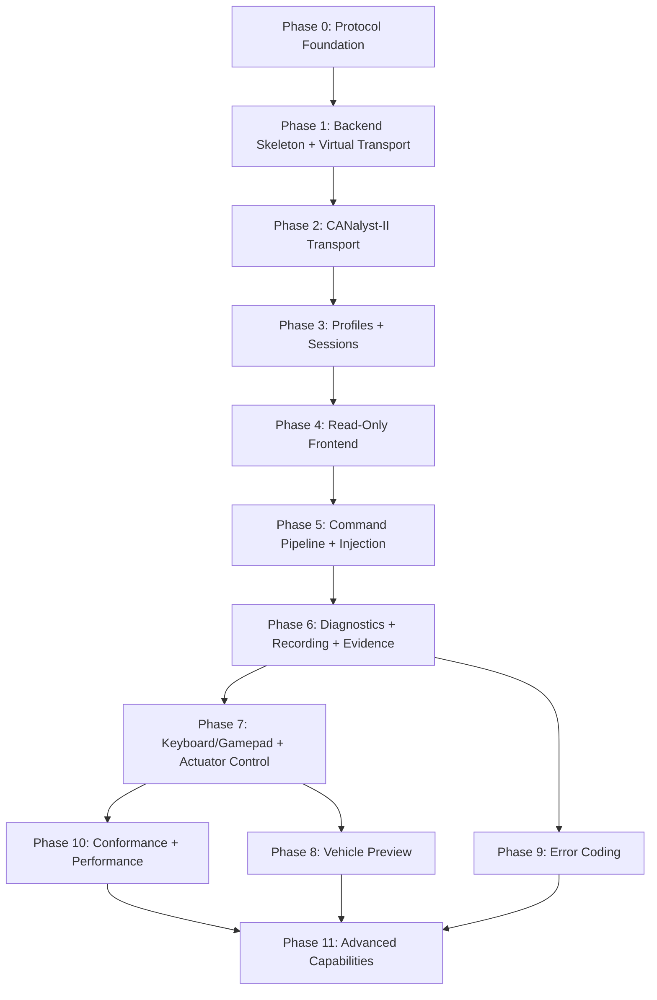

# Vehicle Test Console (VTC) — Work Plan

**Source of truth:** `protocol/contracts/*.yaml` (message IDs, names, buses, DLC, cycles, byte order, codec strategy). RT/SYS firmware compiles against `can::gen::*` generated from these YAML files, so the YAML — not any prose doc — is authoritative.
**Design reference:** [`architecture-vtc.md`](file:///c:/projects/etrike/vt-console/architecture-vtc.md) — authoritative for tool behavior/UX only. **Where its §12.2/§22 bench tables disagree with the YAML (e.g. synthetic-peer periods), the YAML wins.**
**Status:** Design-only — no implementation code exists yet
**Last updated:** 2026-07-15

---

## Non-negotiable phase rule

Phases are sequential. Do not start phase N+1 until all code, tests, and the exit gate for phase N pass. If a later phase exposes a regression, return to the phase that owns the broken contract, fix it, and rerun every gate from there forward.

Each phase delivers working, tested code. Hardware tests remain opt-in and run only on a controlled bench with Bench TX explicitly disabled by default.

---

## Current state assessment

| Area | Status |
|---|---|
| Architecture / design docs | ✅ Complete (scope, architecture, logic, API, HMI, error-codes — 2696 lines consolidated in `architecture-vtc.md`) |
| Protocol YAML contracts | ✅ Exist (`protocol/contracts/` — per-ECU YAML files) |
| Protocol compiler (`protocol.py`) | ✅ Exists — generates C++, DBC, docs, CSV, tables |
| Protocol Python runtime codecs | ✅ Exist — `protocol/generated/python/etrike_protocol.py` (23.7KB) + `protocol/codecs/` (codec.py, generated.py, ses.py, seb.py, pwt.py) + XOR profiles |
| Protocol TypeScript catalog | ✅ Exist — `protocol/generated/typescript/etrike-protocol.ts` (32.3KB) + `protocol/codecs/` TS equivalents |
| Protocol golden vectors | ⚠️ `protocol/vectors/` exists but coverage unknown |
| Python backend (FastAPI) | ❌ Does not exist |
| React frontend | ❌ Does not exist |
| Backend tests | ❌ Do not exist |
| Frontend tests | ❌ Do not exist |
| Debug-tool (predecessor) | ✅ Exists — Node/Svelte/SQLite, 201+129 tests, reusable characterization |

### Key gaps identified from `issues.md`

1. **Scope/architecture tension** — "stateless backend" language contradicts stateful requirements (resolved in architecture: thin transport, stateful services)
2. **Protocol compiler gaps** — missing SYS `rx_overflow` packed field, MTR flag bit consistency, counter semantics metadata, `origin_bus` declarations
3. **No Python runtime codecs for VTC** — architecture requires YAML-generated Python encoder/decoder/validator, not DBC/cantools at runtime
4. **No TypeScript runtime catalog for VTC** — generated React metadata needed
5. **Debug-tool channel mapping** — Channel 0/1 defaults are reversed from the project scope
6. **No test infrastructure** — no pytest, no Playwright, no virtual-bus fixtures

### Experience-driven improvements over debug-tool

| Debug-tool weakness | Work plan improvement |
|---|---|
| Per-frame JSON+stdout parsing | Phase 2: native `python-can` integration, no child process |
| 20ms poll delay with 10ms messages | Phase 2: configurable 1–2ms poll, measured soak test |
| `time.time()` batch timestamps | Phase 2: device timestamp preservation + monotonic mapping |
| Channel 0/1 reversed | Phase 2: correct mapping, tested in adapter conformance |
| Silent physical→virtual fallback | Phase 3: explicit profile transitions, no silent fallback |
| Static periodic payloads (no counter/checksum regen) | Phase 5: per-frame regeneration in scheduler |
| No source ownership / duplicate producers | Phase 5: source-ownership table + conflict detection |
| Placeholder bus load/TEC/REC = 0 | Phase 2: `Unknown` for unsupported, never fake-zero |
| Mutable frame types + decoded payload embedded | Phase 2: immutable `RawFrameEnvelope` + separate decode |
| No evidence quality tracking | Phase 6: evidence-quality gate on every test/capture |

---

## RT/SYS Bench Compatibility Contract

The VTC is only useful if a physically-present RT or SYS controller behaves on the bench exactly as it would in the full vehicle. That requires the VTC's synthetic peers to keep every DUT RX watchdog fed. These constants are read directly from firmware (`rt-esp32/src/`, `sys-esp32/src/`, `shared/shared_config.h`) — treat them as the acceptance criteria for Phase 5.4 and the Phase 2/10 hardware tests.

### RT device-under-test — watchdogs the VTC must satisfy

| RT watchdog | Constant | Timeout | Synthetic frame required | Failure if unfed |
|---|---|---|---|---|
| Host drive-cmd staleness | `kHostCmdStaleTimeoutMs` | 500 ms | `0x300 HOST_DRIVE_CMD` @ 10 ms | drive command treated stale |
| Host heartbeat | `kHeartbeatTimeoutMsHost` | 1500 ms | `0x7FC HOST_HEARTBEAT` @ 500 ms | assisted stop (brake 2000 kPa) |
| SYS heartbeat | `kHeartbeatTimeoutMsSys` (2× `SysHeartbeat.cycle`) | 200 ms | `0x7FE SYS_HEARTBEAT` @ 100 ms | zero setpoints + RT brake takeover via `0x7B9` |
| Steering following-error | `kSteerFollowingErrMs` vs `0x201` angle | — | `0x201 SES_STATUS` @ 10 ms, **angle 0 + aligned** | ESTOP (`kEstopReasonFollowingError`) |
| Mode source | `0x110 SYS_MODE_CMD` consumed by RX router | — | `0x110 SYS_MODE_CMD` | RT cannot leave ESTOP / enter AUTO |

### SYS device-under-test — watchdogs the VTC must satisfy

| SYS watchdog | Constant | Timeout | Synthetic frame required | Notes |
|---|---|---|---|---|
| RT heartbeat | `kHeartbeatTimeoutMsRt` (2× `RtHeartbeat.cycle`) | 1000 ms | `0x7FD RT_HEARTBEAT` @ 500 ms, both buses | SYS validates advancing alive counter |
| RT setpoint staleness | `kSetpointStaleMs` (20× `RtDriveCmd.cycle`) | 200 ms | `0x204 RT_DRIVE_CMD` @ 10 ms | speed 0, gear N |
| SEB status staleness | `kSebStatusTimeoutMs` | 100 ms | `0x721 SEB_STATUS` @ 10 ms | — |
| SEB rolling counter | `kSebRollingTimeoutMs` | 100 ms | `0x721` rolling counter | must **advance** within 100 ms (per-frame regen) |
| MTR feedback staleness | `kMtrFbkStaleMs` | 200 ms | `0x206 MTR_MOTOR_FBK` @ 20 ms | — |
| MTR ESTOP-ack | `kMtrEstopAckTimeoutMs` | 100 ms | `0x206` ESTOP-active bit | on ESTOP tests |

### Compatibility invariants (enforced across phases)

1. **Custom vendor codecs** — SES (`0x169/0x201/0x202/0x203/0x6FA`) and SEB (`0x7B9/0x721/0x731/0x741/0x6FB`) are little-endian, XOR8-complement, overlapping-bit vendor layouts. The VTC must use the versioned `protocol/codecs/` custom implementations (`ses-*-v1`, `seb-*-v1`), **never** a generated codec or `cantools`, or RT/SYS will reject the checksum.
2. **RT `0x7FD` is never bridged** — High and Low heartbeats carry independent counters (`semantics: independent`). Synthetic RT heartbeat, freshness, counter validation, and diagnostics must key on `(bus, id)` and never deduplicate the two.
3. **Forwarded frames are logically one ECU event** — RT transparently forwards `0x206`, `0x600`, `0x011`, `0x120`, `0x001` Low→High (`same_frame`). Diagnostics dedupe on canonical `origin_bus`; transport counters stay per physical bus.
4. **Neutral start values** — every synthetic peer boots to the safe/neutral value in the tables above (speed 0, angle 0 aligned, no ESTOP, no fault) so activating a bench profile never induces a DUT fault.

---

## Phase 0 — Protocol Foundation

**Goal:** Ensure the YAML contracts, Python compiler, generated runtime codecs, golden vectors, and semantic hashes are complete and deterministic enough for the VTC backend.

**Depends on:** Protocol YAML contracts, `protocol/tools/protocol.py`

### 0.1 Audit and complete YAML contracts

- [ ] Verify every message the RT and SYS controllers produce or consume exists in `protocol/contracts/` YAML. **The YAML contracts are the canonical source of truth** — RT/SYS firmware compiles against `can::gen::*` generated from them, so message name, ID, bus, DLC, and cycle must match the contracts exactly (not the older debug-tool names):
  - **safety** (`network.yaml`): `0x001 SAFETY_ESTOP` (DLC=0, High+Low, `same_frame`)
  - **hmi** (`hmi.yaml`): `0x111 HMI_MODE_REQ`, `0x112 HMI_PWR_REQ` (High+Low, 1000 ms, `rolling_counter` byte 1)
  - **host** (`host.yaml`): `0x300 HOST_DRIVE_CMD` (High, **10 ms**), `0x301 HOST_BRAKE_REQ`, `0x302 HOST_LIGHT_CMD`, `0x400 HOST_OBSTACLE_DIST`, `0x7FC HOST_HEARTBEAT` (High, 500 ms)
  - **rt** (`rt.yaml`): `0x204 RT_DRIVE_CMD` (Low, 10 ms), `0x205 RT_BRAKE_CMD` (Low, 20 ms), `0x210 RT_STATE_RPT` (High+Low, 100 ms), `0x220 RT_PID_RPT` (reserved), `0x310 STEER_DIAG`, `0x311 BRAKE_DIAG` (High, 100 ms — **canonical names are `STEER_DIAG`/`BRAKE_DIAG`, not `RT_DIAG`**), `0x7FD RT_HEARTBEAT` (High+Low, 500 ms, **independent** per-bus counters)
  - **sys** (`sys.yaml`): `0x011 SYS_SAFETY_STS` (Low+High, 200 ms), `0x110 SYS_MODE_CMD` (Low, event/`cycle_ms:0`), `0x600 SYS_DIAG_RPT` (Low+High, 1000 ms; `rx_overflow` byte 2 bits 1–6 already present), `0x7FE SYS_HEARTBEAT` (**Low only**, 100 ms)
  - **mtr** (`mtr.yaml`): `0x120 SYS_THROTTLE_STS` (Low+High, 10 ms), `0x206 MTR_MOTOR_FBK` (Low+High, **20 ms**)
  - **ses** (`ses.yaml`, custom vendor codec, little-endian, XOR8-complement): `0x169 VCU_SES_REQ` (RT→EPS_C, 20 ms), `0x201 SES_STATUS` (EPS_C→RT, **10 ms**), `0x202 SES_ERR_INFO`, `0x203 SES_VERSION` (raw-only), `0x6FA SES_TEST`
  - **seb** (`seb.yaml`, custom vendor codec, little-endian, XOR8-complement): `0x7B9 VCU_SEB_REQ` (SYS→SEB, 20 ms), `0x721 SEB_STATUS` (SEB→SYS/RT, **10 ms**), `0x731 SEB_ERR_INFO`, `0x741 SEB_VERSION`, `0x6FB SEB_TEST`
- [ ] Add missing fields per `architecture-vtc.md` §14.1.1:
  - SYS `rx_overflow` in `SYS_DIAG_RPT` byte 2 bits 1–6, saturating semantics
  - MTR `STARTUP_READY` vs fault-bit separation
  - `origin_bus` and forwarding route metadata
  - `counter_kind` (`modulo`/`saturating`/`monotonic`) per counter signal
  - Health-bit precise semantics (SYS `can_ok` = TEC < 255 vs error-passive)
- [ ] Add `transmission_policy` metadata per message (monitor-only, HMI-periodic, synthetic-peer, manual-bench, kinematics-control, direct-actuator, safety-event)

### 0.2 Audit and extend Python runtime codecs

- [ ] Audit existing `protocol/generated/python/etrike_protocol.py` and `protocol/codecs/` against VTC requirements:
  - Message catalog completeness: bus, ID, name, DLC, sender, receivers, period, byte order, signals
  - Encode/decode coverage for all messages (Intel + Motorola, mixed endianness)
  - Validator functions: DLC, range, enum, checksum, counter (use existing XOR profiles)
  - Constants and safety bounds from YAML `constants` blocks
- [ ] Add missing VTC-specific metadata if needed:
  - Transmission policy per message
  - Freshness/liveness configuration
  - Counter semantics (modulo/saturating/monotonic)
  - Origin bus and forwarding route metadata
- [ ] Implement semantic hash computation (content-based, whitespace-insensitive) if not present

### 0.3 Audit and extend TypeScript runtime catalog

- [ ] Audit existing `protocol/generated/typescript/etrike-protocol.ts` against VTC frontend requirements:
  - Message/signal catalog with all UI-relevant metadata
  - Semantic hash matching the Python version
  - Enum value maps, unit strings, signal labels
  - Byte/bit layout metadata for the CAN Dictionary bit grid
- [ ] Add missing VTC-specific presentation metadata if needed:
  - Message categories for navigation/filtering
  - Signal-to-bit-cell mapping for canonical bit visualization
  - Freshness configuration for frontend display

### 0.4 Golden encode/decode vectors

- [ ] Create cross-language golden vectors in `protocol/vectors/`:
  - Every message: known engineering values → raw bytes → decoded values round-trip
  - Motorola and Intel byte-order cases
  - Checksum and counter generation cases
  - DLC=0 event frame (`SAFETY_ESTOP`)
  - Overlapping bit/nibble layouts (SES/SEB Intel sub-protocols)
  - Edge cases: min/max values, enum boundaries, signed negatives
- [ ] Python test runner: `pytest protocol/tests/test_golden_vectors.py`
- [ ] C++ test runner cross-validates against same vectors (firmware compatibility)

### 0.5 Semantic hash and drift checking

- [ ] Implement deterministic semantic hash in compiler
- [ ] CI check mode: `protocol.py generate --check` fails if generated output differs from committed
- [ ] Hash printed at generation time for visual verification

**Tests:**
```bash
# All golden vectors pass
pytest protocol/tests/test_golden_vectors.py -v

# Check mode succeeds (no drift)
python protocol/tools/protocol.py generate python --check
python protocol/tools/protocol.py generate typescript --check

# Semantic hash is deterministic (run twice, same output)
python -c "from protocol.generated.python.etrike_protocol import SEMANTIC_HASH; print(SEMANTIC_HASH)"
```

**Exit gate:**
- [ ] All YAML messages from architecture §22 exist and parse
- [ ] Python codec round-trips all golden vectors
- [ ] TypeScript metadata generates without errors
- [ ] CI drift check passes
- [ ] Semantic hashes match between Python and TypeScript

---

## Phase 1 — Backend Skeleton and Virtual Transport

**Goal:** Create the FastAPI backend skeleton with virtual CAN transport, immutable frame types, the receive pipeline, and latest-value state — all testable without hardware.

**Depends on:** Phase 0

### 1.1 Project scaffolding

- [ ] Create `vt-console/backend/` with:
  - `pyproject.toml` (FastAPI, uvicorn, python-can, pydantic, httpx, pytest, pytest-asyncio)
  - `vtc/` package structure:
    ```
    vtc/
    ├── __init__.py
    ├── main.py              # FastAPI app factory
    ├── config.py             # typed configuration with defaults
    ├── models/               # Pydantic request/response models
    │   ├── frames.py         # RawFrameEnvelope, DecodedFrame
    │   ├── state.py          # LatestState, FreshnessState
    │   ├── adapter.py        # AdapterStatus, ChannelState
    │   └── session.py        # SessionState, ProfileState
    ├── transport/            # CAN adapter abstraction
    │   ├── interface.py      # Transport protocol/ABC
    │   ├── virtual.py        # python-can virtual bus adapter
    │   └── canalyst.py       # CANalyst-II adapter (Phase 2)
    ├── pipeline/             # RX/TX processing
    │   ├── router.py         # Observation router
    │   ├── decoder.py        # Generated codec integration
    │   ├── validator.py      # Integrity/corruption checks
    │   └── freshness.py      # Per-message freshness tracker
    ├── state/                # State management
    │   ├── latest.py         # Latest-value store
    │   ├── topology.py       # ECU liveness tracker
    │   └── history.py        # Bounded frame history
    ├── api/                  # FastAPI routes
    │   ├── status.py
    │   ├── state.py
    │   ├── protocol_api.py
    │   └── stream.py         # WebSocket endpoint
    └── services/             # Backend services
        ├── lifecycle.py      # Startup/shutdown orchestration
        └── event_bus.py      # Internal event distribution
    ```
- [ ] Single-process, single-worker Uvicorn configuration (architecture §4.5)
- [ ] Health endpoint: `GET /api/v1/status`

### 1.2 Immutable frame types

- [ ] Define `RawFrameEnvelope` (Pydantic/dataclass):
  - adapter_epoch, channel (High/Low), device_timestamp, backend_arrival_time
  - can_id, is_extended, is_remote, dlc, data (exactly DLC bytes, not padded)
  - channel_sequence, global_sequence
  - direction (RX/TX), source (physical/virtual/synthetic/injection)
- [ ] Define `TransportEvent` with severity, channel, evidence, monotonic timestamp
- [ ] Define `AdapterStatus` with identity, capabilities, per-channel state, queue metrics

### 1.3 Virtual transport adapter

- [ ] Implement `VirtualTransportAdapter` using `python-can` virtual interface:
  - Create named High and Low virtual buses
  - Blocking receive in dedicated thread via `can.Notifier`
  - Constant-time callback → bounded queue (no decode in callback)
  - Overflow detection with lost-count evidence
  - Clean shutdown with `can.Notifier` stop
- [ ] Capability record: no HW timestamps, no TX echo, no bus-off, no TEC/REC (all `Unknown`)

### 1.4 Receive pipeline

- [ ] Router task drains RX queue:
  1. Validate raw envelope (CAN ID membership, DLC)
  2. Assign global frame sequence
  3. Decode via generated Python codec
  4. Run integrity/validation checks
  5. Update latest-value store
  6. Update freshness state
  7. Enqueue for recording (if active)
  8. Publish to subscription hub
- [ ] Unknown frames remain visible (no guessed decoding)
- [ ] Decode failure preserves raw frame, produces no fabricated values

### 1.5 Latest-value state

- [ ] Keyed by `(bus, can_id)` → latest raw + latest valid observation
- [ ] Per-message: last_seen, observed_rate, expected_rate, freshness_state, validation_result
- [ ] Per-signal: raw_value, engineering_value, unit, enum_label, validity
- [ ] Freshness states: Unseen → Live → Late → Missing → Invalid → Frozen → Recovering

### 1.6 Basic API endpoints

- [ ] `GET /api/v1/status` — backend readiness, adapter state, protocol hash
- [ ] `GET /api/v1/state` — atomic latest-state snapshot with sequence
- [ ] `GET /api/v1/protocol/messages` — generated catalog browse
- [ ] `GET /api/v1/protocol/messages/{bus}/{id}` — single message detail
- [ ] WebSocket `/api/v1/stream` — critical events + coalesced latest-state subscription

**Tests:**
```bash
# Unit tests — frame types, codec integration, freshness logic
pytest vt-console/backend/tests/test_frame_types.py -v
pytest vt-console/backend/tests/test_decoder.py -v
pytest vt-console/backend/tests/test_freshness.py -v
pytest vt-console/backend/tests/test_validator.py -v

# Integration — virtual bus end-to-end
pytest vt-console/backend/tests/test_virtual_pipeline.py -v
# → inject frames on virtual High/Low → verify decoded state via API

# API tests
pytest vt-console/backend/tests/test_api_status.py -v
pytest vt-console/backend/tests/test_api_state.py -v
pytest vt-console/backend/tests/test_api_protocol.py -v

# WebSocket smoke test
pytest vt-console/backend/tests/test_websocket_stream.py -v
```

**Exit gate:**
- [ ] Backend starts in Pure Software mode without hardware
- [ ] Injected virtual frames appear decoded in `GET /api/v1/state`
- [ ] WebSocket delivers coalesced latest-state updates
- [ ] Freshness transitions work (Live → Late → Missing on timeout)
- [ ] Unknown frames preserved with raw data
- [ ] All generated codec golden vectors pass through the pipeline
- [ ] Zero decode in receive callback (measured)

---

## Phase 2 — CANalyst-II Transport and Timestamp Architecture

**Goal:** Add physical CAN transport via `python-can` CANalyst-II, with correct channel mapping, device timestamps, adapter health, and connection lifecycle.

**Depends on:** Phase 1

### 2.1 CANalyst-II adapter wrapper

- [ ] Implement `CanalystTransportAdapter`:
  - `python-can` `CANalystIIBus` for both channels
  - Channel 0 → High Bus, Channel 1 → Low Bus (**corrected** from debug-tool defaults)
  - Configurable poll delay: start at 1–2ms (not 20ms default)
  - Dedicated blocking receive worker or `can.Notifier`
  - Bounded typed RX queue with overflow counter
- [ ] Device discovery: USB VID/PID, device index, driver/backend info
- [ ] Lock validated dependency version in `pyproject.toml`

### 2.2 Timestamp architecture

- [ ] Preserve device timestamps at 100μs resolution
- [ ] Unwrap/reset-detect device timestamps
- [ ] Map to session monotonic timebase while retaining raw device value
- [ ] Per-channel sequence (not cross-channel order)
- [ ] Backend arrival time from `time.monotonic_ns()`

### 2.3 Adapter health and capabilities

- [ ] Capability record: HW timestamps (yes), TX echo (unknown), listen-only (check), bus-off (unknown), TEC/REC (unknown → never fake zero)
- [ ] Health states: Absent → Opening → Open → Active → Quiet → Degraded → Recovering → Closed
- [ ] Adapter-worker heartbeat monitoring (Degraded after 500ms, Failed after 1.5s)
- [ ] Notifier.exception and listener.on_error() monitoring

### 2.4 Disconnect and reconnect

- [ ] On failure: disable Bench TX → cancel jobs → end leases → mark stale → close → begin reconnect
- [ ] Bounded exponential backoff with jitter, visible retry count
- [ ] Reconnect: new adapter epoch → clear stale buffers → receive-only → stability window → Recovered
- [ ] Never restore Bench TX or resume prior jobs on reconnect
- [ ] Fast retries → indefinite slow discovery

### 2.5 Dual-channel integration

- [ ] Simultaneous High + Low bus operation
- [ ] Independent per-channel statistics
- [ ] Cross-channel analysis uses hardware timestamps (not ingestion order)

**Tests:**
```bash
# Unit tests — adapter wrapper, timestamp mapping, health FSM
pytest vt-console/backend/tests/test_canalyst_adapter.py -v
pytest vt-console/backend/tests/test_timestamp_mapping.py -v
pytest vt-console/backend/tests/test_adapter_health.py -v

# Disconnect/reconnect state machine
pytest vt-console/backend/tests/test_adapter_reconnect.py -v

# Virtual integration (same pipeline, virtual adapter)
pytest vt-console/backend/tests/test_dual_channel_virtual.py -v

# Hardware characterization (opt-in, requires physical adapter)
pytest vt-console/backend/tests/test_hw_characterization.py -v -m hardware
# → channel mapping, timestamp resolution, DLC=0, poll delay measurement
```

**Exit gate:**
- [ ] Virtual dual-channel pipeline passes all Phase 1 tests
- [ ] Channel mapping: Ch0=High, Ch1=Low (opposite of debug-tool — tested)
- [ ] Device timestamps preserved and mapped correctly
- [ ] Overflow counter exposed (never silent eviction)
- [ ] Adapter health FSM transitions verified in simulation
- [ ] Reconnect creates new epoch, never restores TX state
- [ ] Hardware characterization tests pass on physical adapter (when available)

---

## Phase 3 — Operating Profiles and Session Management

**Goal:** Implement the three operating profiles (Full Vehicle, Bench Test, Pure Software) with explicit transitions, session state machine, and Bench TX controls.

**Depends on:** Phase 2

### 3.1 Profile state machine

- [ ] Three profiles with explicit transition rules:
  - Full Vehicle: both physical buses, passive by default
  - Bench Test: selected physical ECUs, missing peers may be synthesized
  - Pure Software: two virtual buses, no physical TX
- [ ] Controlled transition: stop periodic TX → neutral controls → confirm → activate
- [ ] Adapter loss never silently switches to Pure Software (explicit operator action required)
- [ ] Profile visible in API status and WebSocket events

### 3.2 Test-session state machine

- [ ] States: Stopped → Preparing → Listening → Running → Stopping → Completed/Failed/Inconclusive
- [ ] Session identity: backend session ID, adapter epoch, test session ID, protocol hash
- [ ] Session revision for concurrent mutation control

### 3.3 Bench TX state

- [ ] Disabled/Enabled binary state
- [ ] Connecting adapter leaves Disabled
- [ ] Explicit enable required for physical TX
- [ ] Auto-disable on: profile change, disconnect, shutdown, session stop, reconnect
- [ ] Passive monitoring and recording work while Disabled

### 3.4 Stimulus leases and source ownership

- [ ] Exclusive, expiring ownership of resources (steering, motor, brake, HMI, periodic CAN ID)
- [ ] One permitted producer per `bus + CAN ID` during a session
- [ ] Lease renewal mechanism for interactive controls
- [ ] Backend-owned cleanup on expiry, disconnect, or Stop All

### 3.5 Session API

- [ ] `GET /api/v1/sessions` — current session state
- [ ] `POST /api/v1/sessions` — create session with profile and capabilities
- [ ] `POST /api/v1/sessions/{id}/bench-tx` — enable/disable Bench TX
- [ ] `POST /api/v1/sessions/{id}/stop-all` — Stop All
- [ ] `DELETE /api/v1/sessions/{id}` — close session

**Tests:**
```bash
# Profile transitions
pytest vt-console/backend/tests/test_profiles.py -v
# → Full Vehicle ↔ Bench Test ↔ Pure Software transitions
# → adapter loss during physical profile
# → no silent virtual fallback

# Session state machine
pytest vt-console/backend/tests/test_session_state.py -v

# Bench TX guards
pytest vt-console/backend/tests/test_bench_tx.py -v
# → enable requires session + adapter
# → auto-disable on disconnect/profile change/shutdown

# Source ownership
pytest vt-console/backend/tests/test_source_ownership.py -v
# → exclusive ownership, conflict detection, lease expiry

# Session API endpoints
pytest vt-console/backend/tests/test_api_sessions.py -v
```

**Exit gate:**
- [ ] Profile transitions are explicit and tested
- [ ] Bench TX cannot be enabled without proper session
- [ ] Source ownership prevents duplicate producers
- [ ] Adapter loss disables Bench TX and marks stale (never silent fallback)
- [ ] Stop All cancels all jobs and disables TX
- [ ] Session revision prevents concurrent conflicts

---

## Phase 4 — Read-Only Frontend Foundation

**Goal:** Create the React + TypeScript frontend with Overview, Network, and Live CAN workspaces in read-only (monitoring) mode. Connect to the backend WebSocket for live state updates.

**Depends on:** Phase 3

### 4.1 Frontend scaffolding

- [ ] Create `vt-console/frontend/` with Vite + React + TypeScript
- [ ] Tailwind CSS + shadcn/ui component primitives
- [ ] Zustand for live state management
- [ ] Generated TypeScript API client from OpenAPI
- [ ] Dark, high-contrast automotive theme (architecture §17)

### 4.2 Application shell

- [ ] Persistent status header:
  - Active profile badge
  - USB adapter state indicator
  - High Bus / Low Bus activity (independent)
  - Vehicle power state (requested vs confirmed)
  - Vehicle mode (requested vs confirmed)
  - ESTOP state
  - Recording state
  - Stream quality badge (LIVE / DELAYED / DROPPING)
- [ ] Left navigation rail with workspace icons
- [ ] Protocol hash match/mismatch indicator

### 4.3 WebSocket client

- [ ] Connection sequence: authenticate → exchange protocol hash → clock offset → subscribe → receive snapshot → apply deltas
- [ ] Gap detection from batch sequence numbers → request fresh snapshot
- [ ] Independent freshness clock (ages continue increasing without new messages)
- [ ] Reconnect with exponential backoff and visible attempt count
- [ ] Clock-offset estimation for transport delay measurement

### 4.4 Overview workspace

- [ ] Safety and mode strip: ESTOP, power, mode, control path, CAN health
- [ ] Vehicle status cards: speed, steering, brake, gear, faults (with freshness)
- [ ] Command/feedback pairs table: Drive, Steering, Brake (requested vs measured + error + health)
- [ ] Click card → open contributing CAN messages

### 4.5 Network workspace

- [ ] Topology map: High and Low bus lines, RT bridging, attached nodes
- [ ] Node states: Live, Late, Offline, Simulated, Unknown traffic, Fault
- [ ] Heartbeat rules from generated metadata
- [ ] Bus health cards: adapter, bitrate, RX/TX rate, errors, unknown IDs
- [ ] Five-layer connection-loss display (USB, channel, stream, ECU, signal)

### 4.6 Live CAN workspace

- [ ] Latest-by-message view (default): one row per bus/ID, updates in place
  - Activity indicator, bus, CAN ID, name, sender, direction, source, rate, raw bytes, decoded values, age
  - Changed-value highlight without full-row flash
- [ ] Chronological stream view (opt-in): individual frames, virtualized rows, pause/resume/clear
- [ ] Filters: bus, ID/name, sender, signal, direction, source, category, known/unknown/warning/fault
- [ ] Message detail drawer: identity, contract, live health, decoded signals, raw frame, byte/bit map, warnings
- [ ] TanStack Table for latest-message view

**Tests:**
```bash
# Frontend unit tests (Vitest)
npx vitest run --reporter=verbose

# Component tests
# → Header renders all status indicators
# → Overview cards display freshness states
# → Network topology renders nodes correctly
# → Live CAN table updates in place
# → WebSocket client handles snapshot + deltas + gaps

# Playwright E2E (against virtual backend)
npx playwright test tests/e2e/overview.spec.ts
npx playwright test tests/e2e/network.spec.ts
npx playwright test tests/e2e/live-can.spec.ts
# → start backend in Pure Software mode
# → inject known frames via virtual bus
# → verify UI shows correct decoded values, freshness, topology
```

**Exit gate:**
- [ ] Frontend connects to backend via WebSocket
- [ ] Protocol hash match/mismatch shown
- [ ] Overview shows live vehicle state with freshness indicators
- [ ] Network topology correctly shows node liveness
- [ ] Live CAN table displays decoded values with proper units
- [ ] Freshness visually transitions: Live → Late → Missing
- [ ] Stream quality badge reflects actual state
- [ ] All Playwright tests pass against virtual backend

---

## Phase 5 — Command Pipeline, Injection, and Synthetic Peers

**Goal:** Implement the TX pipeline: command policy, encoder, TX gate, periodic scheduler, source ownership, and synthetic-peer engine. Add injection and HMI VTC.

**Depends on:** Phase 4

### 5.1 Encode pipeline

- [ ] Encoder receives message definition + engineering values:
  1. Validate profile/test permits message
  2. Resolve defaults, enum selections
  3. Validate ranges against YAML bounds
  4. Inverse scale to raw values
  5. Pack via generated Intel/Motorola mapping
  6. Force mandatory enable fields (positive tests)
  7. Insert rolling counter
  8. Calculate checksum (after all protected bytes final)
  9. Verify DLC + self-decode round-trip
- [ ] Negative tests explicitly name violated rule, all others enforced

### 5.2 TX gate and command policy

- [ ] Central TX gate validates before submission:
  - Profile permits transmission
  - Adapter/channel healthy
  - Bench TX enabled
  - Source owns lease + CAN ID
  - Stimulus is current (not expired)
  - Protocol validation passes
- [ ] TX disposition tracking: Accepted → Queued → Submitted → Rejected/Expired/Canceled/Failed
- [ ] `Submitted` ≠ `Delivered` (no delivery proof from CANalyst-II)

### 5.3 Periodic scheduler

- [ ] Backend-owned worker for all periodic transmission:
  - Absolute monotonic deadlines
  - Per-frame re-encode (counters/checksums regenerate each period)
  - Jitter measurement (requested vs actual submission)
  - Missed-period detection → skip stale, never burst catch-up
  - Per-job binding: test session, adapter epoch, source owner, bus, ID
- [ ] Independent counters per bus/ID (critical for RT `0x7FD` High vs Low)

### 5.4 Synthetic-peer engine

- [ ] Build required synthetic message set from bench configuration
- [ ] Listen-before-speak: detection window per claimed ID
- [ ] Refuse/flag if physical traffic already present
- [ ] Source-conflict detection: stop synthetic TX immediately on conflict
- [ ] Synthetic-peer periods **must equal the contract `cycle_ms`** and each period **must be shorter than the DUT watchdog timeout it satisfies** (see the RT/SYS Bench Compatibility Contract below). Every synthetic frame regenerates its rolling counter / checksum per period (no static payloads).

> **Implementation order:** build the shared synthetic-peer engine first, then bring up the **SYS device-under-test set first** (RT/HMI/SEB/MTR fakes) as the first bench-compatibility proof point. The RT-DUT set follows and reuses the overlapping peers (SEB, MTR, heartbeats).

**Synthetic set — RT is the Device-Under-Test** (VTC fakes Host, SYS, EPS-C, SEB, MTR so RT's RX watchdogs stay satisfied):
  - `0x300 HOST_DRIVE_CMD` @ **10 ms** → High (neutral: speed 0, gear N) — RT stale watchdog `kHostCmdStaleTimeoutMs` = 500 ms
  - `0x7FC HOST_HEARTBEAT` @ 500 ms → High (advancing counter) — RT `kHeartbeatTimeoutMsHost` = 1500 ms
  - `0x7FE SYS_HEARTBEAT` @ 100 ms → Low (advancing counter, healthy bits) — RT `kHeartbeatTimeoutMsSys` = 200 ms
  - `0x110 SYS_MODE_CMD` → Low (mode per test; RT latches mode from SYS, incl. ESTOP clear)
  - `0x011 SYS_SAFETY_STS` @ 200 ms → Low (no ESTOP)
  - `0x201 SES_STATUS` @ **10 ms** → Low (**angle 0, `angle_status` = aligned** — else RT following-error ESTOP)
  - `0x721 SEB_STATUS` @ **10 ms** → Low (safe/default, advancing rolling counter)
  - `0x206 MTR_MOTOR_FBK` @ **20 ms** → Low (speed 0, no fault); `0x120 SYS_THROTTLE_STS` @ 10 ms → Low (speed 0)

**Synthetic set — SYS is the Device-Under-Test** (VTC fakes RT, HMI, SEB, MTR so SYS's RX watchdogs stay satisfied):
  - `0x7FD RT_HEARTBEAT` @ 500 ms → Both, **independent per-bus counters** — SYS `kHeartbeatTimeoutMsRt` = 1000 ms; alive counter must advance (SYS validates it)
  - `0x204 RT_DRIVE_CMD` @ **10 ms** → Low (speed 0, gear N) — SYS `kSetpointStaleMs` = 200 ms
  - `0x205 RT_BRAKE_CMD` @ 20 ms → Low (0 kPa)
  - `0x210 RT_STATE_RPT` @ 100 ms → High+Low (MANUAL, safe)
  - `0x111 HMI_MODE_REQ` @ 1000 ms → High+Low (advancing `rolling_counter`); `0x112 HMI_PWR_REQ` @ 1000 ms → High+Low
  - `0x721 SEB_STATUS` @ **10 ms** → Low — SYS `kSebStatusTimeoutMs` = 100 ms **and** `kSebRollingTimeoutMs` = 100 ms (rolling counter must advance within 100 ms)
  - `0x206 MTR_MOTOR_FBK` @ **20 ms** → Low — SYS `kMtrFbkStaleMs` = 200 ms; ESTOP-ack bit within `kMtrEstopAckTimeoutMs` = 100 ms

> **Full Vehicle profile** synthesizes neither set — both RT and SYS are physically present. Synthetic peers are a Bench-Test-profile capability, activated per missing node after listen-before-speak confirms the ID is absent.

### 5.5 Generic injection API

- [ ] `POST /api/v1/injections/preview` — preview encoded frame without sending
- [ ] `POST /api/v1/injections` — inject one-shot or periodic
- [ ] `DELETE /api/v1/injections/{id}` — stop periodic injection
- [ ] `POST /api/v1/synthetic-peers` — start synthetic peer set
- [ ] `DELETE /api/v1/synthetic-peers` — stop all synthetic peers

### 5.6 HMI control

- [ ] Mode panel: `0x111 HMI_MODE_REQ` at 1 Hz (MANUAL/AUTO/PURE SIM + alive counter)
- [ ] Power panel: `0x112 HMI_PWR_REQ` at 1 Hz (OFF/ON + alive counter)
- [ ] ESTOP injection: DLC=0 `0x001 SAFETY_ESTOP` event
- [ ] Show requested vs observed state (never confirm from send alone)

### 5.7 Control workspace (frontend)

- [ ] HMI panel with mode/power controls
- [ ] Injection workflow: select message → edit values → preview → send
- [ ] Bench workspace: synthetic peer matrix with TX health
- [ ] Source ownership visibility

**Tests:**
```bash
# Encoder round-trip tests
pytest vt-console/backend/tests/test_encoder.py -v
# → all golden vectors encode correctly
# → mandatory enable fields locked
# → counter/checksum generation
# → range validation rejects out-of-bounds

# TX gate policy tests
pytest vt-console/backend/tests/test_tx_gate.py -v
# → rejects when Bench TX disabled
# → rejects wrong profile
# → rejects expired lease
# → rejects source conflict

# Scheduler tests
pytest vt-console/backend/tests/test_scheduler.py -v
# → periodic timing accuracy (virtual clock)
# → counter increment per frame
# → missed deadline handling (skip, don't burst)
# → job cancellation and cleanup

# Synthetic peer tests
pytest vt-console/backend/tests/test_synthetic_peers.py -v
# → all required peers start with correct values
# → listen-before-speak detection
# → source conflict stops synthetic TX
# → independent per-bus counters for RT heartbeat

# HMI tests
pytest vt-console/backend/tests/test_hmi.py -v
# → mode request at 1 Hz with advancing counter
# → power request at 1 Hz with advancing counter
# → ESTOP injection (DLC=0)

# Integration — virtual end-to-end injection
pytest vt-console/backend/tests/test_injection_integration.py -v
# → inject frame → observe in state → verify decoded

# Playwright — Control workspace
npx playwright test tests/e2e/control.spec.ts
npx playwright test tests/e2e/injection.spec.ts
npx playwright test tests/e2e/bench.spec.ts
```

**Exit gate:**
- [ ] Encoder passes all golden vector round-trips
- [ ] TX gate enforces all policy guards
- [ ] Scheduler maintains timing within measured jitter budget
- [ ] Synthetic peers start with correct initial values (SES aligned, MTR speed 0)
- [ ] Source conflict detection stops synthetic TX immediately
- [ ] HMI mode/power requests transmit at 1 Hz with correct counters
- [ ] ESTOP injection works (DLC=0 frame)
- [ ] No per-frame JSON serialization in TX path
- [ ] Injection preview shows encoded bytes before sending

---

## Phase 6 — Diagnostics, Recording, and Evidence

**Goal:** Implement the diagnostic timeline, recording pipeline, evidence quality tracking, sequential message verification, and CAN Dictionary workspace.

**Depends on:** Phase 5

### 6.1 Diagnostic service

- [ ] Classify diagnostic messages from generated metadata
- [ ] Episode aggregation: first occurrence → bounded updates → recovery (not one entry per failed frame)
- [ ] Separate episodes per code/scope (noisy message can't suppress unrelated errors)
- [ ] Recovery hysteresis
- [ ] Link to active test step and nearby stimuli
- [ ] Distinguish backend observations from ECU-reported flags

### 6.2 Recording pipeline

- [ ] Opt-in recording with visible active state
- [ ] Store: raw RX/TX frames, device + mapped timestamps, bus, direction, source, adapter epoch, transport events, queue loss, protocol hashes, test boundaries, configuration
- [ ] Dedicated recording worker with own bounded queue (not on router or ASGI loop)
- [ ] If storage can't keep up → mark Incomplete immediately, never silent drops
- [ ] Recording integrity finalization on stop

### 6.3 Evidence quality gate

- [ ] Per-test/capture evidence quality state:
  - Complete: no relevant gaps
  - Degraded: presentation-only loss
  - Incomplete: relevant raw loss or capture gap
  - Not comparable: baseline semantics incompatible
- [ ] Formal Pass requires Complete evidence only
- [ ] Track: adapter epoch changes, RX/router/recording loss, unknown timestamp intervals

### 6.4 Sequential message verification

- [ ] Test definition: stimulus → expected response → timeout → evidence
- [ ] Step execution: pre-step state → stimulus → assertion timing → evaluate → Pass/Fail/Inconclusive
- [ ] One active step at a time
- [ ] Result with evidence links

### 6.5 CAN Dictionary workspace (frontend)

- [ ] Searchable message cards grouped by bus
- [ ] Card: CAN ID, name, bus, sender→receiver, DLC, period, byte order, signal count
- [ ] Byte/bit layout grid (color-linked to signal table)
  - Intel + Motorola canonical bit mapping
  - Distinguished: unused, reserved, checksum, counter, overlapping bits
  - DLC=0 explained as event frames
- [ ] Signal table: name, start bit, length, type, byte order, scale/offset, min/max, unit, enum, multiplexing, automation, description
- [ ] Optional live value overlay

### 6.6 Diagnostics workspace (frontend)

- [ ] Diagnostic timeline: ECU reports, ESTOP transitions, heartbeat events, bus errors, rejected commands, recording events
- [ ] Each entry links to raw frame
- [ ] Episode view (not per-frame flood)
- [ ] Recording controls: start/stop, duration, frame count, dropped status, storage health

### 6.7 Diagnostics and recording API

- [ ] `GET /api/v1/events` — query events by time/code/severity/correlation
- [ ] `GET /api/v1/events/{id}` — single event with cause chain + evidence
- [ ] `POST /api/v1/recordings` — start recording
- [ ] `DELETE /api/v1/recordings/{id}` — stop recording
- [ ] `GET /api/v1/recordings` — list recordings
- [ ] `POST /api/v1/tests` — run test case
- [ ] `GET /api/v1/tests/{id}` — test result with evidence
- [ ] `GET /api/v1/evidence/{id}` — fetch evidence window

**Tests:**
```bash
# Diagnostic episode aggregation
pytest vt-console/backend/tests/test_diagnostics.py -v
# → first failure immediate, repeated updates, recovery
# → per-code isolation (noisy msg doesn't suppress)

# Recording integrity
pytest vt-console/backend/tests/test_recording.py -v
# → start/stop, frame count, no silent drops
# → mark Incomplete on overload

# Evidence quality
pytest vt-console/backend/tests/test_evidence_quality.py -v
# → Complete, Degraded, Incomplete states
# → Pass only with Complete evidence

# Sequential verification
pytest vt-console/backend/tests/test_verification.py -v
# → stimulus → response → Pass/Fail/Inconclusive

# Playwright — Dictionary, Diagnostics
npx playwright test tests/e2e/dictionary.spec.ts
npx playwright test tests/e2e/diagnostics.spec.ts
```

**Exit gate:**
- [ ] Diagnostic episodes aggregate correctly (not per-frame flood)
- [ ] Recording captures all frames losslessly or marks Incomplete
- [ ] Evidence quality gate prevents false Pass
- [ ] CAN Dictionary displays all messages with correct bit layouts
- [ ] Sequential verification produces correct Pass/Fail/Inconclusive
- [ ] Event API returns structured data (not console text)

---

## Phase 7 — Interactive Control: Keyboard/Gamepad and Actuator Commands

**Goal:** Add keyboard/gamepad teleoperation, kinematics mode, and direct actuator control. These are the highest-risk features requiring careful stimulus lease and watchdog behavior.

**Depends on:** Phase 6

### 7.1 Keyboard/gamepad input

- [ ] Browser captures key/axis state → target intent + monotonic sequence
- [ ] Backend rejects stale/out-of-order intent
- [ ] Stimulus lease renewal while intent is current
- [ ] Backend shaping: deadband, acceleration, deceleration, steering-rate, direction-change (measured `dt`)
- [ ] Loss behavior: key release, blur, tab hidden, controller disconnect, WebSocket degradation → end lease → declared end sequence
- [ ] ESTOP and Hard Brake bindings independent of control ownership

### 7.2 Kinematics mode

- [ ] Target RT via High-bus `0x300 HOST_DRIVE_CMD`
- [ ] Acquire source ownership for `0x300`
- [ ] Generate speed/yaw/gear from input
- [ ] Observe RT state and Low-bus actuator requests
- [ ] Show: speed, yaw, gear, input source, command age, transmit rate, actuator feedback

### 7.3 Direct actuator mode

- [ ] Target selected Low-bus actuator messages
- [ ] Separate cards: steering (`VCU_SES_REQ`), brake (`VCU_SEB_REQ`), motor
- [ ] Enable prerequisites shown
- [ ] Engineering-value input with YAML bounds
- [ ] Checksum/counter status visible
- [ ] Start/stop command stream
- [ ] Matching feedback and error display

### 7.4 Mutual exclusion

- [ ] Kinematics and direct actuator cannot own same control path simultaneously
- [ ] Clear visual indicator of active control mode

### 7.5 Control workspace updates (frontend)

- [ ] Input legend with live key/axis positions
- [ ] Shaped command visualization (raw input → target → shaped → encoded → feedback)
- [ ] Hard Brake and ESTOP bindings always available
- [ ] Focus/blur/tab-hide detection

**Tests:**
```bash
# Keyboard/gamepad intent processing
pytest vt-console/backend/tests/test_keyboard_input.py -v
# → stale intent rejected
# → lease renewal
# → loss detection (no input → end sequence)
# → shaping parameters applied

# Kinematics mode
pytest vt-console/backend/tests/test_kinematics.py -v
# → HOST_DRIVE_CMD generation
# → RT feedback correlation
# → source ownership

# Direct actuator mode
pytest vt-console/backend/tests/test_direct_actuator.py -v
# → steering/brake/motor command generation
# → checksum/counter per frame
# → mandatory enable bits locked

# Mutual exclusion
pytest vt-console/backend/tests/test_control_exclusion.py -v

# WebSocket loss during active control
pytest vt-console/backend/tests/test_control_loss.py -v
# → WebSocket disconnects during active keyboard stimulus
# → backend applies end sequence
# → lease expires, TX stops

# Playwright — interactive controls
npx playwright test tests/e2e/keyboard-control.spec.ts
npx playwright test tests/e2e/actuator-control.spec.ts
```

**Exit gate:**
- [ ] Keyboard intent → shaped command → CAN frame pipeline works end-to-end
- [ ] Loss of focus/WebSocket/controller stops stimulus within measured deadline
- [ ] Kinematics and direct-actuator modes are mutually exclusive
- [ ] ESTOP bypasses normal ownership
- [ ] Checksum/counter regenerated every frame
- [ ] YAML safety bounds enforced on all inputs
- [ ] Backend owns all timing (browser input ≠ CAN timing)

---

## Phase 8 — Vehicle Visual Preview

**Goal:** Implement the top-down vehicle preview with dual actuation/sensor layers, center-locked ego view, and proper provenance separation.

**Depends on:** Phase 7

### 8.1 Backend projection service

- [ ] `VehicleProjection` with parallel `actuation` and `sensors` state trees
- [ ] Per-field: value, unit, source, bus/ID/signal, provenance, sample_time, age, validity, epoch
- [ ] Source selection: primary actuation + primary sensor resolved independently per property
- [ ] Fallback rules: declared fallback only, explicitly reported
- [ ] Actuation-sensor deltas from time-aligned valid samples
- [ ] Curvature/turn radius from physical wheelbase + steering convention
- [ ] Path only when speed + steering + dimensions + direction all valid
- [ ] Published as one versioned atomic snapshot/delta

### 8.2 Frontend preview

- [ ] Responsive SVG/Canvas top-down tricycle
- [ ] Dual layers: outlined actuation (ghost) + solid sensor
- [ ] Overlay / Actuation-only / Sensors-only modes
- [ ] Center-locked ego view: vehicle at center, background translates
- [ ] Speed/gear direction arrow, brake, lights, ESTOP state
- [ ] Compact HUD: value, unit, source, age, validity
- [ ] Stale → freeze + fade + age shown
- [ ] Missing → remove geometry + "No data" (never zero)
- [ ] Corrupt → last valid + "Corrupt input" badge
- [ ] `requestAnimationFrame` only while visible

### 8.3 Projection REST endpoint

- [ ] `GET /api/v1/projection` — current vehicle projection snapshot
- [ ] WebSocket projection subscription (in stream)

**Tests:**
```bash
# Projection service
pytest vt-console/backend/tests/test_projection.py -v
# → actuation vs sensor independence
# → stale/missing/corrupt handling
# → epoch boundary
# → curvature/ICR calculation (golden kinematics vectors)

# Visual preview (Playwright snapshot tests)
npx playwright test tests/e2e/preview.spec.ts
# → straight, left, right, reverse, neutral, braking, indicators, ESTOP
# → command/feedback disagreement
# → stale/missing/corrupt inputs
# → center-lock invariant
# → reduced-motion mode
```

**Exit gate:**
- [ ] Vehicle preview shows actuation and sensor layers independently
- [ ] Stale/missing/corrupt inputs handled correctly (never fabricated zero)
- [ ] Center-lock invariant holds under all conditions
- [ ] Kinematics calculations match golden vectors
- [ ] Preview works identically in monitoring mode (no control required)

---

## Phase 9 — Error Coding and Structured Logging

**Goal:** Implement the full error catalog, structured event system, and shared event API from `error-codes.md`.

**Depends on:** Phase 6 (but can be started earlier incrementally)

### 9.1 Error catalog registry

- [ ] Machine-readable catalog from `error-codes.md`
- [ ] Every condition: catalog_id + symbolic code + severity + retryable + event_state
- [ ] Domain boundaries: system, api, adapter, can, pipeline, protocol, tx, ecu, test, recording, replay, stream, ui, projection

### 9.2 Event factory

- [ ] Central event creation with: event_id, timestamps, versions, correlation IDs, adapter epoch, provenance
- [ ] Cause/root event linking
- [ ] Deduplication: first → bounded updates → recovery
- [ ] Secret redaction
- [ ] Persistence before client publication

### 9.3 Event API

- [ ] `GET /api/v1/error-codes` — machine-readable catalog
- [ ] `GET /api/v1/events` — query by time/code/severity/correlation
- [ ] `GET /api/v1/events/{id}` — single event with cause chain
- [ ] `POST /api/v1/wait` — wait for typed event predicate with deadline
- [ ] WebSocket event subscription

### 9.4 RFC 9457 Problem Details

- [ ] HTTP failures return `application/problem+json`
- [ ] Contains: type URI, title, status, detail, code, catalog_id, severity, event_id

**Tests:**
```bash
pytest vt-console/backend/tests/test_error_catalog.py -v
pytest vt-console/backend/tests/test_event_factory.py -v
pytest vt-console/backend/tests/test_event_api.py -v
pytest vt-console/backend/tests/test_problem_details.py -v
```

**Exit gate:**
- [ ] Every error condition uses the catalog (no ad-hoc strings)
- [ ] Events are structured and queryable
- [ ] RFC 9457 format for HTTP errors
- [ ] Same event structure in logs, API, WebSocket, and recordings

---

## Phase 10 — Adapter Conformance and Performance Validation

**Goal:** Build the adapter conformance suite, workload budget system, and measurable real-time service levels.

**Depends on:** Phase 7

### 10.1 Adapter conformance suite

- [ ] Guided characterization: channel mapping, bitrate, IDs, DLC 0–8, timestamps, RX ordering, echo, overflow, unplug/replug, sustained load, TX jitter
- [ ] Results bound to adapter/driver/OS fingerprint
- [ ] Fingerprint change → `Characterization outdated`
- [ ] Store measured capability record

### 10.2 Workload budget system

- [ ] Define tested envelope: frames/sec per channel, decoded signals, active plots, raw subscribers, recording throughput, scheduled TX jobs
- [ ] Report current utilization vs envelope
- [ ] Graceful degradation order: hidden visuals → plot density → display intermediates → raw monitor delivery
- [ ] Never shed: adapter supervision, RX integrity, active assertions, scheduler, critical events, lossless recording

### 10.3 Service-level validation

- [ ] Measure against architecture §18.1 targets:
  - Backend stream heartbeat: 250ms
  - Browser degraded after 750ms, lost after 1500ms
  - Dashboard repaint: 20–30 Hz under load
  - Maximum visual age while LIVE: max(150ms, 2× message period)
  - Control-intent lease: shorter than ECU watchdog
- [ ] Soak test under dual-bus worst-case load

**Tests:**
```bash
# Adapter conformance (hardware, opt-in)
pytest vt-console/backend/tests/test_adapter_conformance.py -v -m hardware

# Workload budget (virtual)
pytest vt-console/backend/tests/test_workload_budget.py -v
# → measure degradation under increasing load
# → verify shedding order

# Service-level benchmarks (virtual)
pytest vt-console/backend/tests/test_service_levels.py -v
# → latency measurements
# → freshness timing accuracy
```

**Exit gate:**
- [ ] Adapter conformance suite passes on target hardware
- [ ] Workload budget accurately reports utilization
- [ ] Degradation follows defined shedding order
- [ ] Service-level targets met under virtual worst-case

---

## Phase 11 — Advanced Capabilities (Later)

**Goal:** Implement deferred capabilities after the core platform is stable and validated.

**Depends on:** Phase 10

### 11.1 Triggered pre/post capture

- [ ] Bounded backend pre-trigger ring
- [ ] Predicate-based triggers (message/signal, checksum failure, freshness transition, etc.)
- [ ] Configurable pre/post trigger windows
- [ ] Evidence quality on every capture

### 11.2 Deterministic offline replay

- [ ] Replay epoch (distinct from adapter epochs)
- [ ] Virtual clock drives router/decoder/validator/freshness
- [ ] Pause/step/speed/seek from indexed checkpoints
- [ ] Observation-only (no physical TX path)

### 11.3 Baseline/session comparison

- [ ] Semantic identity alignment (`bus + message + signal`)
- [ ] Compare: presence, period, jitter, values, diagnostics, latency, integrity
- [ ] Incompatible → `Not comparable`; gaps → `Inconclusive`

### 11.4 Server-side predicate language

- [ ] Shared typed predicate model for filters, triggers, assertions
- [ ] Address YAML semantic names + engineering values
- [ ] Protocol hash binding (renamed signals fail visibly)

### 11.5 Tauri desktop packaging

- [ ] Python sidecar lifecycle
- [ ] USB driver access
- [ ] Per-session capability token

---

## Verification strategy summary

| Level | What | Where | When |
|---|---|---|---|
| **Unit** | Generated vectors, fake clock/queue, no hardware | `pytest backend/tests/test_*.py` | Every phase |
| **Virtual integration** | Two virtual buses, full pipeline, software ECU peers | `pytest backend/tests/test_*_integration.py` | Every phase |
| **API integration** | FastAPI TestClient against virtual backend | `pytest backend/tests/test_api_*.py` | Phase 1+ |
| **WebSocket integration** | Full stream lifecycle with virtual fixtures | `pytest backend/tests/test_websocket_*.py` | Phase 1+ |
| **Playwright E2E** | React against virtual backend, deterministic fixtures | `npx playwright test` | Phase 4+ |
| **Hardware characterization** | CANalyst-II + loopback or bench ECU | `pytest -m hardware` | Phase 2+, opt-in |
| **Soak/benchmark** | Sustained dual-channel load measurement | `pytest -m benchmark` | Phase 10 |

### Critical scenario coverage

| Scenario | Phase | Test type |
|---|---|---|
| Dual-channel ordering + timestamp wrap | 2 | Unit + Virtual |
| Silent bus vs disconnected USB | 2 | Unit |
| WebSocket loss during keyboard stimulus | 7 | Integration |
| Source conflict after synthetic start | 5 | Integration |
| Checksum/counter positive + negative | 0+5 | Unit (golden vectors) |
| Queue/storage overload → Inconclusive | 6+10 | Integration |
| Reconnect new epoch without resuming TX | 2+3 | Integration |
| DLC=0 ESTOP event | 0+5 | Unit + Integration |
| HMI mode/power transition | 5 | Integration |
| Host command to RT output correlation | 7 | Integration |
| Stop All during every active workflow | 3+5+7 | Integration |

---

## Dependency graph



---

## Architecture document cross-reference

| Work plan phase | Architecture sections |
|---|---|
| Phase 0 | §18.2 Protocol compiler, §3 Data processing, §22 Scope matrix |
| Phase 1 | §4 System architecture, §4.5 Concurrency, §5 Canonical data, §5.1 RT contract |
| Phase 2 | §4.4 CANalyst-II, §4.4.1–4.4.7 Transport, §8.4 Connection loss |
| Phase 3 | §3 Profiles, §4.1 Test session, §4.2 Scheduler, §4.3 Security |
| Phase 4 | §6 Shell, §7 Overview, §8 Network, §9 Live CAN, §10 Dictionary, §17 Visual, §5.2–5.4 Updates |
| Phase 5 | §11 Control, §12 Bench, §13 Injection, §4.2 Scheduler, §16 Boundaries |
| Phase 6 | §14 Diagnostics/verification/logging, §15 Data rules, §22.1 Test model |
| Phase 7 | §11.2 Kinematics, §11.3 Direct actuator, §11.4 Keyboard/gamepad |
| Phase 8 | §24 Vehicle preview, §24.1–24.6 Rendering |
| Phase 9 | §26 Error coding, `error-codes.md` |
| Phase 10 | §18.1 Service levels, §23.6 Conformance, §23.7 Workload |
| Phase 11 | §23 Analyzer improvements, §23.1–23.5 |
